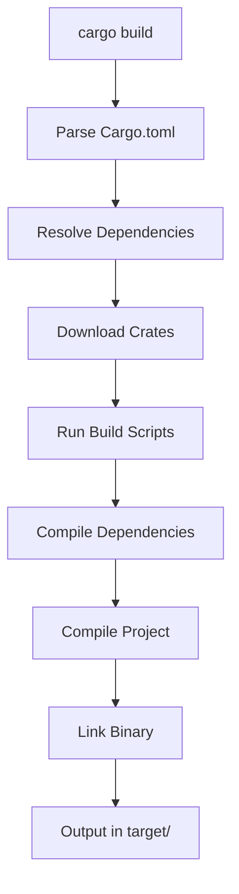
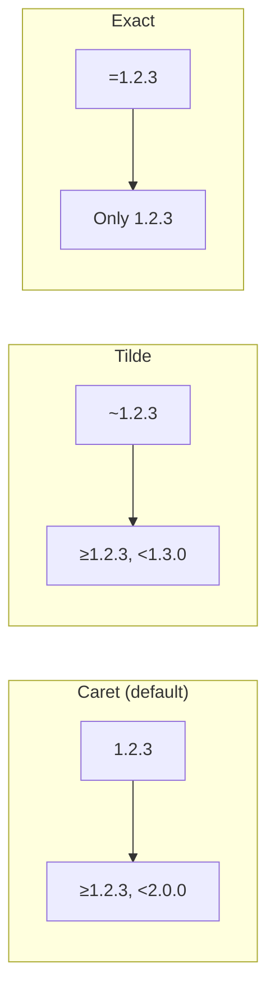
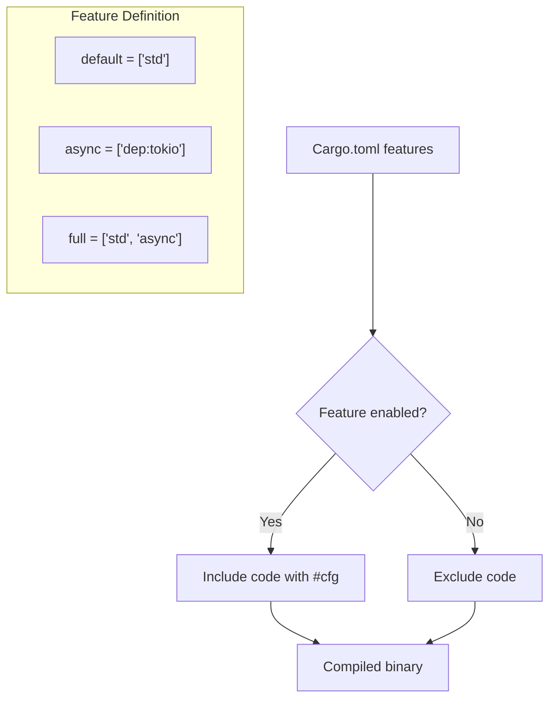
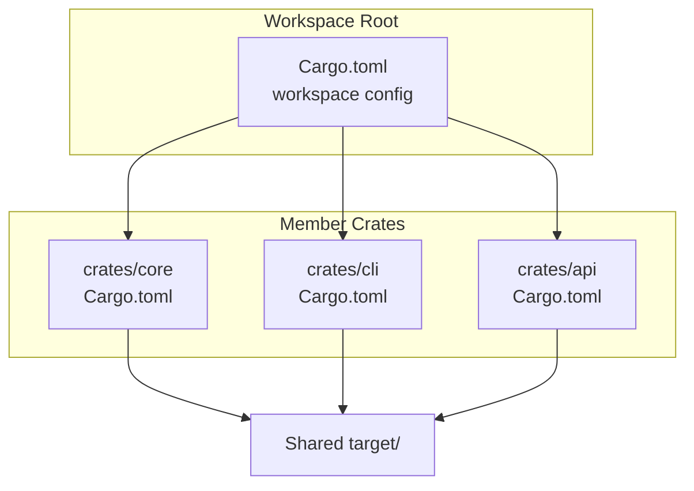
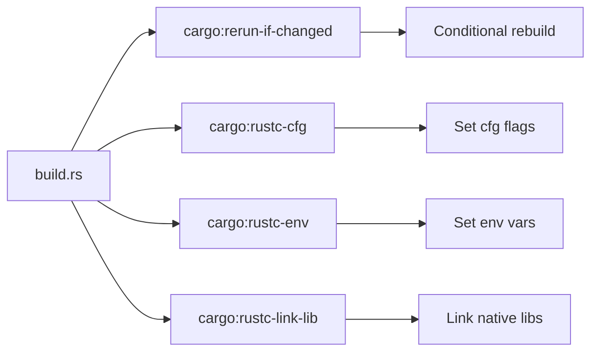
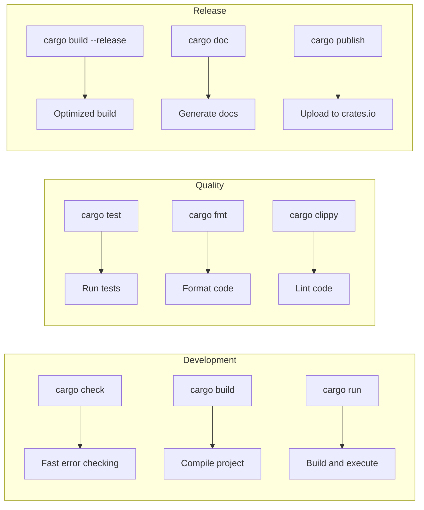

# Cargo Deep Dive

Comprehensive guide to Rust's build system and package manager.

## Build Process Overview



## Cargo.toml Structure

The manifest file defines your project's metadata, dependencies, and build configuration.

```toml
[package]
name = "myproject"
version = "0.1.0"
edition = "2021"
authors = ["Your Name <you@example.com>"]
description = "A brief description"
license = "MIT OR Apache-2.0"
repository = "https://github.com/user/repo"
documentation = "https://docs.rs/myproject"
readme = "README.md"
keywords = ["keyword1", "keyword2"]
categories = ["development-tools"]

[dependencies]
serde = "1.0"

[dev-dependencies]
criterion = "0.5"

[build-dependencies]
cc = "1.0"

[features]
default = ["std"]
std = []
extra = ["dep:optional-crate"]

[lib]
name = "mylib"
path = "src/lib.rs"

[[bin]]
name = "mybin"
path = "src/bin/main.rs"
```

**Section explanations:**
- `[package]` - Project metadata (name, version, license)
- `[dependencies]` - Runtime dependencies
- `[dev-dependencies]` - Test/benchmark only dependencies
- `[build-dependencies]` - Dependencies for build.rs
- `[features]` - Optional compilation features
- `[lib]` / `[[bin]]` - Library and binary targets

## Dependency Specification

### Version Requirements



```toml
[dependencies]
# Caret (default) - allows compatible updates
caret = "1.2.3"      # >=1.2.3, <2.0.0

# Tilde - more restrictive minor updates
tilde = "~1.2.3"     # >=1.2.3, <1.3.0

# Exact - no updates allowed
exact = "=1.2.3"     # Only version 1.2.3

# Wildcard - any matching version
wildcard = "1.*"     # >=1.0.0, <2.0.0

# Range - explicit bounds
range = ">=1.2.0, <1.5.0"
```

### Source Types

Dependencies can come from multiple sources:

```toml
[dependencies]
# crates.io (default registry)
serde = "1.0"

# Git repository - specific branch, tag, or commit
git-main = { git = "https://github.com/user/repo", branch = "main" }
git-tag = { git = "https://github.com/user/repo", tag = "v1.0.0" }
git-rev = { git = "https://github.com/user/repo", rev = "abc123" }

# Local path - useful for workspaces
local = { path = "../my-local-crate" }
```

### Platform-Specific Dependencies

Target specific platforms using cfg expressions:

```toml
# Windows-only dependency
[target.'cfg(windows)'.dependencies]
winapi = "0.3"

# Unix-only dependency
[target.'cfg(unix)'.dependencies]
libc = "0.2"

# WebAssembly target
[target.'cfg(target_arch = "wasm32")'.dependencies]
wasm-bindgen = "0.2"
```

## Features System

Features provide conditional compilation for optional functionality.



### Defining Features

```toml
[features]
# Default features - enabled unless opted out
default = ["std", "logging"]

# Basic feature flags
std = []
logging = ["dep:log"]

# Feature enabling optional dependency
async = ["dep:tokio"]

# Feature combining other features
full = ["std", "logging", "async"]
```

### Using Features in Code

```rust
// Conditional module inclusion
#[cfg(feature = "logging")]
mod logging_module;

// Conditional function
#[cfg(feature = "async")]
pub async fn async_operation() {
    // Only compiled when "async" feature is enabled
}

// Conditional imports
#[cfg(feature = "serde")]
use serde::{Serialize, Deserialize};
```

### Command Line Usage

```bash
cargo build                           # Default features
cargo build --no-default-features     # No features
cargo build --features "async"        # Specific feature
cargo build --all-features            # All features
```

## Workspaces

Workspaces manage multiple related packages in a single repository.



### Workspace Configuration

```toml
# Root Cargo.toml
[workspace]
members = [
    "crates/core",
    "crates/cli",
    "crates/api",
]
resolver = "2"

# Shared dependencies - define once, use everywhere
[workspace.dependencies]
serde = { version = "1.0", features = ["derive"] }
tokio = { version = "1", features = ["full"] }

# Shared package metadata
[workspace.package]
version = "0.1.0"
edition = "2021"
license = "MIT"
```

### Member Crate

```toml
# crates/core/Cargo.toml
[package]
name = "myproject-core"
version.workspace = true      # Inherits from workspace
edition.workspace = true

[dependencies]
serde.workspace = true        # Uses workspace version
```

## Build Scripts

Build scripts (`build.rs`) run before compilation for code generation, native library compilation, or environment setup.



### Basic build.rs

```rust
// build.rs - runs at compile time
fn main() {
    // Rerun if this file changes
    println!("cargo:rerun-if-changed=src/important.rs");

    // Set a cfg flag for conditional compilation
    println!("cargo:rustc-cfg=has_feature_x");

    // Set environment variable accessible via env!()
    println!("cargo:rustc-env=BUILD_TIME=2024-01-15");

    // Link a native C library
    println!("cargo:rustc-link-lib=mylib");
}
```

### Generating Code

Build scripts can generate Rust code at compile time:

```rust
// build.rs
use std::env;
use std::fs;
use std::path::Path;

fn main() {
    let out_dir = env::var("OUT_DIR").unwrap();
    let dest_path = Path::new(&out_dir).join("generated.rs");

    // Generate code at compile time
    fs::write(&dest_path, r#"
        pub const VERSION: &str = "1.0.0";
        pub const BUILD_DATE: &str = "2024-01-15";
    "#).unwrap();

    println!("cargo:rerun-if-changed=build.rs");
}
```

```rust
// src/lib.rs - include the generated code
include!(concat!(env!("OUT_DIR"), "/generated.rs"));
// Now VERSION and BUILD_DATE constants are available
```

## Custom Profiles

Profiles control optimization levels and debug settings.

```toml
[profile.dev]
opt-level = 0           # No optimization
debug = true            # Full debug info
overflow-checks = true  # Check integer overflow

[profile.release]
opt-level = 3           # Maximum optimization
debug = false           # No debug info
lto = true              # Link-time optimization
codegen-units = 1       # Better optimization, slower compile
panic = "abort"         # Smaller binary
strip = true            # Strip symbols

[profile.release-with-debug]
inherits = "release"    # Start from release profile
debug = true            # But keep debug info
strip = false
```

## Cargo Configuration

Project-wide settings in `.cargo/config.toml`:

```toml
[build]
target = "x86_64-unknown-linux-gnu"  # Default target
jobs = 4                              # Parallel jobs

[target.x86_64-unknown-linux-gnu]
linker = "clang"                      # Custom linker
rustflags = ["-C", "link-arg=-fuse-ld=lld"]

[alias]
b = "build"
t = "test"
r = "run"
rr = "run --release"
```

## Common Commands



| Command | Purpose |
|---------|---------|
| `cargo check` | Fast compilation check without producing binary |
| `cargo build` | Compile the project |
| `cargo build --release` | Compile with optimizations |
| `cargo run` | Build and execute |
| `cargo test` | Run tests |
| `cargo fmt` | Format code |
| `cargo clippy` | Run linter |
| `cargo doc --open` | Generate and view documentation |
| `cargo update` | Update dependencies |
| `cargo tree` | Show dependency tree |

## Useful Cargo Plugins

```bash
# Install useful plugins
cargo install cargo-watch    # Auto-rebuild on file changes
cargo install cargo-edit     # Add/remove/upgrade dependencies
cargo install cargo-expand   # Expand macros
cargo install cargo-udeps    # Find unused dependencies
cargo install cargo-bloat    # Analyze binary size
cargo install cargo-deny     # Check dependency licenses/security
```

## Summary

| Section | Purpose |
|---------|---------|
| `[package]` | Project metadata |
| `[dependencies]` | Runtime dependencies |
| `[features]` | Optional functionality |
| `[workspace]` | Multi-crate projects |
| `[profile.*]` | Build optimization |
