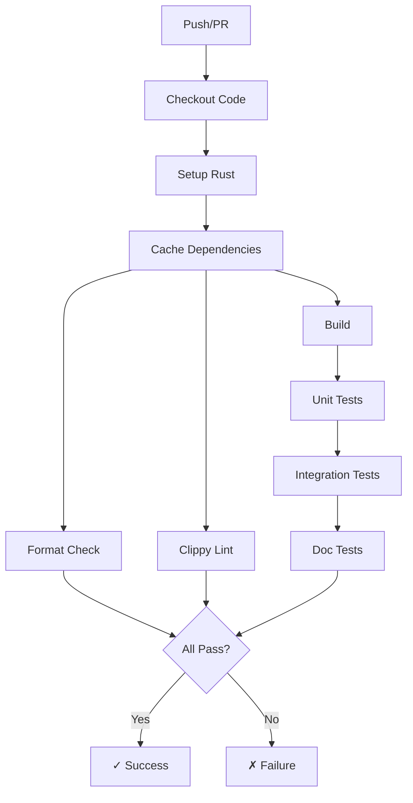
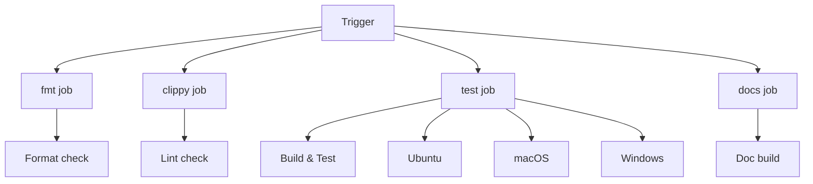
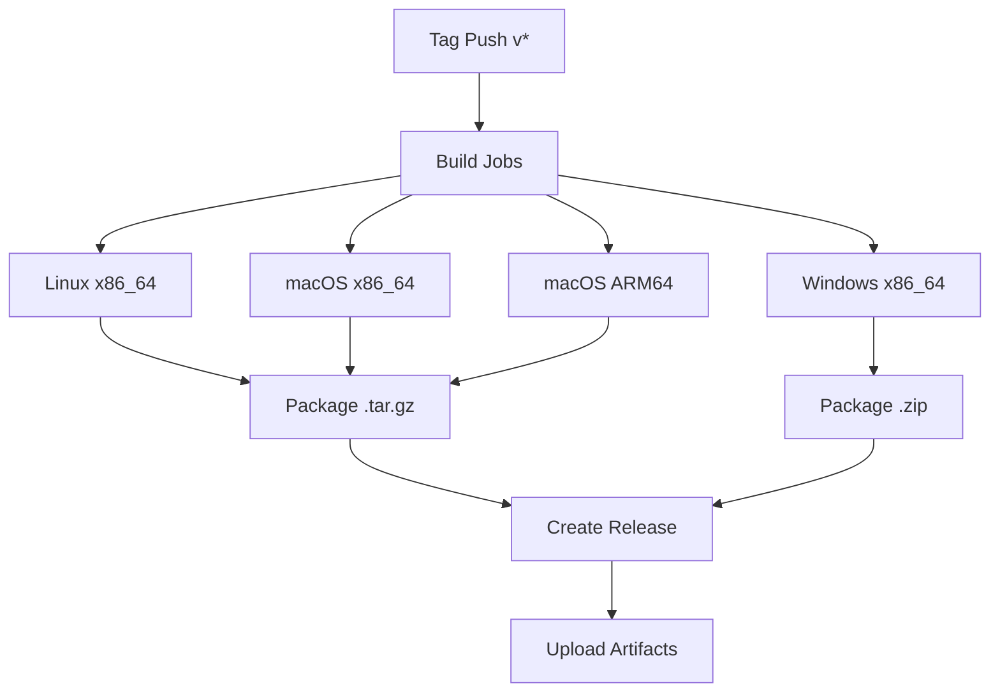
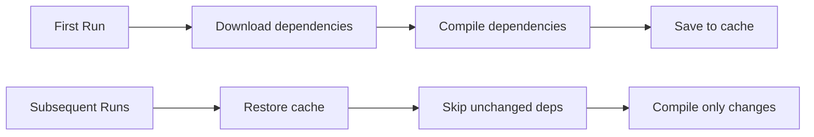

# CI/CD for Rust Projects

Setting up continuous integration and deployment with GitHub Actions.

## CI Pipeline Overview



## Basic CI Workflow

This minimal workflow checks formatting, lints, builds, and tests:

```yaml
# .github/workflows/ci.yml
name: CI

on:
  push:
    branches: [main]
  pull_request:
    branches: [main]

env:
  CARGO_TERM_COLOR: always

jobs:
  check:
    runs-on: ubuntu-latest
    steps:
      - uses: actions/checkout@v4

      - name: Setup Rust
        uses: dtolnay/rust-toolchain@stable
        with:
          components: rustfmt, clippy

      - name: Cache
        uses: Swatinem/rust-cache@v2

      - name: Format
        run: cargo fmt --check

      - name: Clippy
        run: cargo clippy -- -D warnings

      - name: Build
        run: cargo build

      - name: Test
        run: cargo test
```

**Step explanations:**
1. **Checkout** - Get repository code
2. **Setup Rust** - Install Rust toolchain with components
3. **Cache** - Cache cargo registry and build artifacts
4. **Format** - Check code formatting
5. **Clippy** - Run linter
6. **Build/Test** - Compile and run tests

## Comprehensive CI Workflow

Full CI with multiple jobs running in parallel:




```yaml
name: CI

on:
  push:
    branches: [main, develop]
  pull_request:
    branches: [main]

env:
  CARGO_TERM_COLOR: always
  RUST_BACKTRACE: 1

jobs:
  # Format check - fast, run first
  fmt:
    name: Format
    runs-on: ubuntu-latest
    steps:
      - uses: actions/checkout@v4
      - uses: dtolnay/rust-toolchain@stable
        with:
          components: rustfmt
      - run: cargo fmt --all -- --check

  # Clippy lints
  clippy:
    name: Clippy
    runs-on: ubuntu-latest
    steps:
      - uses: actions/checkout@v4
      - uses: dtolnay/rust-toolchain@stable
        with:
          components: clippy
      - uses: Swatinem/rust-cache@v2
      - run: cargo clippy --all-targets --all-features -- -D warnings

  # Build and test on multiple platforms
  test:
    name: Test (${{ matrix.os }})
    runs-on: ${{ matrix.os }}
    strategy:
      fail-fast: false
      matrix:
        os: [ubuntu-latest, macos-latest, windows-latest]
    steps:
      - uses: actions/checkout@v4
      - uses: dtolnay/rust-toolchain@stable
      - uses: Swatinem/rust-cache@v2
      - run: cargo build --all-features
      - run: cargo test --all-features

  # Documentation build
  docs:
    name: Documentation
    runs-on: ubuntu-latest
    steps:
      - uses: actions/checkout@v4
      - uses: dtolnay/rust-toolchain@stable
      - uses: Swatinem/rust-cache@v2
      - run: cargo doc --no-deps --all-features
        env:
          RUSTDOCFLAGS: -D warnings
```


## Matrix Testing

Test across multiple Rust versions and platforms:


```yaml
jobs:
  test:
    name: Test Rust ${{ matrix.rust }} on ${{ matrix.os }}
    runs-on: ${{ matrix.os }}
    strategy:
      matrix:
        rust: [stable, beta, nightly, 1.70.0]  # Include MSRV
        os: [ubuntu-latest, macos-latest, windows-latest]
        exclude:
          # Skip some combinations to save CI time
          - os: macos-latest
            rust: beta
          - os: windows-latest
            rust: beta
    steps:
      - uses: actions/checkout@v4
      - uses: dtolnay/rust-toolchain@master
        with:
          toolchain: ${{ matrix.rust }}
      - uses: Swatinem/rust-cache@v2
        with:
          key: ${{ matrix.rust }}
      - run: cargo test
```


## Feature Matrix Testing

Test different feature combinations:


```yaml
jobs:
  features:
    name: Features
    runs-on: ubuntu-latest
    strategy:
      matrix:
        features:
          - ""                    # Default features
          - "--no-default-features"
          - "--all-features"
          - "--features async"
          - "--features serde"
    steps:
      - uses: actions/checkout@v4
      - uses: dtolnay/rust-toolchain@stable
      - uses: Swatinem/rust-cache@v2
      - run: cargo test ${{ matrix.features }}
```


## Code Coverage

Generate and upload code coverage reports:

```yaml
jobs:
  coverage:
    name: Coverage
    runs-on: ubuntu-latest
    steps:
      - uses: actions/checkout@v4
      - uses: dtolnay/rust-toolchain@stable
        with:
          components: llvm-tools-preview

      - name: Install cargo-llvm-cov
        uses: taiki-e/install-action@cargo-llvm-cov

      - name: Generate coverage
        run: cargo llvm-cov --all-features --lcov --output-path lcov.info

      - name: Upload to Codecov
        uses: codecov/codecov-action@v3
        with:
          files: lcov.info
          fail_ci_if_error: true
```

## Security Audit

Automatically check for vulnerable dependencies:


```yaml
jobs:
  audit:
    name: Security Audit
    runs-on: ubuntu-latest
    steps:
      - uses: actions/checkout@v4
      - uses: rustsec/audit-check@v1
        with:
          token: ${{ secrets.GITHUB_TOKEN }}
```


## Release Workflow

Build release binaries for multiple platforms:




```yaml
name: Release

on:
  push:
    tags:
      - 'v*'

permissions:
  contents: write

jobs:
  build:
    name: Build ${{ matrix.target }}
    runs-on: ${{ matrix.os }}
    strategy:
      matrix:
        include:
          - target: x86_64-unknown-linux-gnu
            os: ubuntu-latest
            ext: tar.gz
          - target: x86_64-apple-darwin
            os: macos-latest
            ext: tar.gz
          - target: aarch64-apple-darwin
            os: macos-latest
            ext: tar.gz
          - target: x86_64-pc-windows-msvc
            os: windows-latest
            ext: zip

    steps:
      - uses: actions/checkout@v4
      - uses: dtolnay/rust-toolchain@stable
        with:
          targets: ${{ matrix.target }}

      - name: Build
        run: cargo build --release --target ${{ matrix.target }}

      - name: Package (Unix)
        if: matrix.ext == 'tar.gz'
        run: |
          cd target/${{ matrix.target }}/release
          tar czvf ../../../myapp-${{ matrix.target }}.tar.gz myapp

      - name: Package (Windows)
        if: matrix.ext == 'zip'
        run: |
          cd target/${{ matrix.target }}/release
          7z a ../../../myapp-${{ matrix.target }}.zip myapp.exe

      - name: Upload artifact
        uses: actions/upload-artifact@v4
        with:
          name: myapp-${{ matrix.target }}
          path: myapp-${{ matrix.target }}.*

  release:
    name: Create Release
    needs: build
    runs-on: ubuntu-latest
    steps:
      - uses: actions/checkout@v4
      - uses: actions/download-artifact@v4
      - name: Create release
        uses: softprops/action-gh-release@v1
        with:
          files: myapp-*/myapp-*
          generate_release_notes: true
```


## Publish to crates.io

Automatically publish when a release is created:


```yaml
name: Publish

on:
  release:
    types: [published]

jobs:
  publish:
    runs-on: ubuntu-latest
    steps:
      - uses: actions/checkout@v4
      - uses: dtolnay/rust-toolchain@stable
      - run: cargo publish
        env:
          CARGO_REGISTRY_TOKEN: ${{ secrets.CARGO_REGISTRY_TOKEN }}
```


**Setup:**
1. Go to [crates.io](https://crates.io) → Account Settings → API Tokens
2. Create a new token
3. Add as `CARGO_REGISTRY_TOKEN` in repository secrets

## Deploy Documentation

Deploy rustdoc to GitHub Pages:


```yaml
name: Deploy Docs

on:
  push:
    branches: [main]

permissions:
  contents: read
  pages: write
  id-token: write

jobs:
  build:
    runs-on: ubuntu-latest
    steps:
      - uses: actions/checkout@v4
      - uses: dtolnay/rust-toolchain@stable
      - run: cargo doc --no-deps --all-features

      # Create redirect to main crate docs
      - run: echo '<meta http-equiv="refresh" content="0; url=mylib">' > target/doc/index.html

      - uses: actions/upload-pages-artifact@v2
        with:
          path: target/doc

  deploy:
    needs: build
    runs-on: ubuntu-latest
    environment:
      name: github-pages
      url: ${{ steps.deployment.outputs.page_url }}
    steps:
      - uses: actions/deploy-pages@v3
        id: deployment
```


## Caching Strategy

Efficient caching speeds up CI significantly:




```yaml
# Recommended: Use the dedicated Rust cache action
- uses: Swatinem/rust-cache@v2
  with:
    workspaces: "src/rust -> target"
    key: "optional-extra-key"

# Or manual caching
- uses: actions/cache@v3
  with:
    path: |
      ~/.cargo/registry
      ~/.cargo/git
      target
    key: ${{ runner.os }}-cargo-${{ hashFiles('**/Cargo.lock') }}
```


## Environment Variables

Common environment variables for CI:

```yaml
env:
  CARGO_TERM_COLOR: always      # Colored output
  RUST_BACKTRACE: 1             # Show backtraces
  RUSTFLAGS: "-D warnings"      # Treat warnings as errors
  CARGO_INCREMENTAL: 0          # Disable incremental (more reproducible)
```

## Summary

| Workflow | Trigger | Purpose |
|----------|---------|---------|
| CI | Push/PR | Build, test, lint |
| Release | Tag push | Build binaries |
| Publish | Release created | Publish to crates.io |
| Docs | Push to main | Deploy documentation |
| Audit | Schedule | Security checks |

## Best Practices

| Practice | Description |
|----------|-------------|
| Use caching | `Swatinem/rust-cache@v2` for fast builds |
| Matrix builds | Test multiple OS and Rust versions |
| Parallel jobs | Run fmt, clippy, test in parallel |
| Fail fast | Stop on first failure in matrix |
| MSRV testing | Test minimum supported Rust version |
| Security audit | Check for vulnerable dependencies |
| Coverage | Track test coverage over time |
