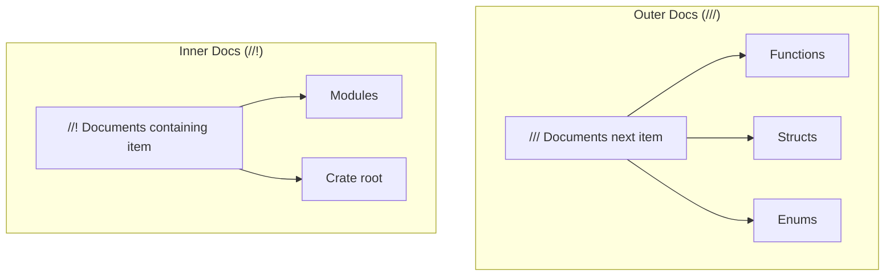
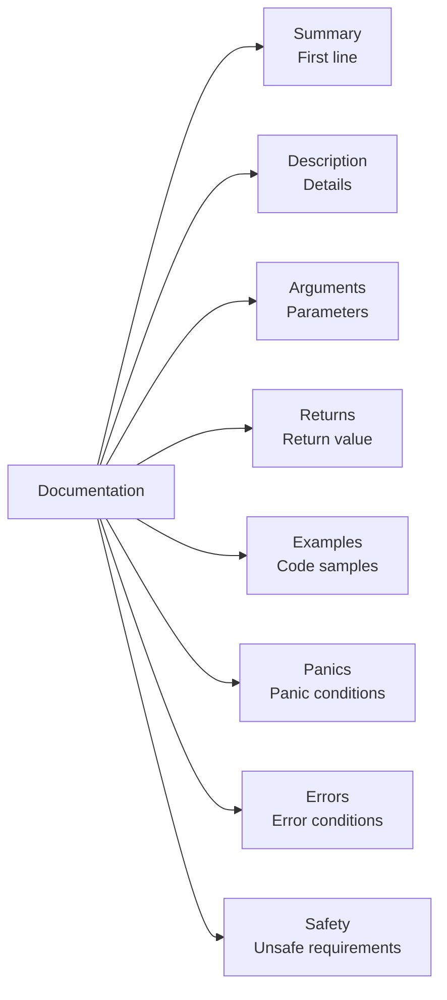
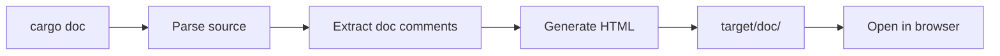

# Rust Documentation

Guide to documenting Rust code with rustdoc.

## Documentation Comment Types



## Outer Documentation (`///`)

Documents the item that follows:

```rust
/// Adds two numbers together.
///
/// This function performs integer addition and returns
/// the sum of the two arguments.
///
/// # Arguments
///
/// * `a` - The first number to add
/// * `b` - The second number to add
///
/// # Returns
///
/// The sum of `a` and `b`
///
/// # Examples
///
/// ```
/// let result = add(2, 3);
/// assert_eq!(result, 5);
/// ```
pub fn add(a: i32, b: i32) -> i32 {
    a + b
}
```

## Inner Documentation (`//!`)

Documents the containing item (module or crate):

```rust
// src/lib.rs

//! # My Crate
//!
//! `my_crate` provides utilities for data processing.
//!
//! ## Features
//!
//! - Fast parsing
//! - Type-safe API
//! - Async support
//!
//! ## Quick Start
//!
//! ```
//! use my_crate::process;
//! let result = process("input");
//! ```
```

## Standard Documentation Sections



### Complete Function Documentation

```rust
/// Divides two numbers, returning `None` if the divisor is zero.
///
/// This function performs checked integer division. Unlike the `/`
/// operator, it won't panic on division by zero.
///
/// # Arguments
///
/// * `dividend` - The number to be divided
/// * `divisor` - The number to divide by
///
/// # Returns
///
/// * `Some(quotient)` - The result of the division
/// * `None` - If `divisor` is zero
///
/// # Examples
///
/// Basic usage:
///
/// ```
/// use mylib::divide;
///
/// assert_eq!(divide(10, 2), Some(5));
/// assert_eq!(divide(10, 0), None);
/// ```
///
/// # Panics
///
/// This function never panics.
///
/// # Errors
///
/// Returns `None` when dividing by zero.
///
/// # See Also
///
/// * [`add`] - For addition
/// * [`multiply`] - For multiplication
pub fn divide(dividend: i32, divisor: i32) -> Option<i32> {
    if divisor == 0 { None } else { Some(dividend / divisor) }
}
```

## Documenting Types

### Structs

```rust
/// Configuration options for the application.
///
/// This struct holds all settings needed to configure
/// the application's behavior.
///
/// # Examples
///
/// ```
/// use mylib::Config;
///
/// let config = Config {
///     port: 8080,
///     debug: true,
///     database_url: Some("postgres://localhost/db".into()),
/// };
/// ```
pub struct Config {
    /// The port number to listen on (1-65535).
    pub port: u16,

    /// Enable debug mode for verbose logging.
    pub debug: bool,

    /// Optional database connection URL.
    ///
    /// If `None`, the application runs without database support.
    pub database_url: Option<String>,
}
```

### Enums

```rust
/// Represents the current state of a network connection.
///
/// # Examples
///
/// ```
/// use mylib::ConnectionState;
///
/// let state = ConnectionState::Connected { since: 12345 };
/// ```
pub enum ConnectionState {
    /// Connection is active.
    ///
    /// Contains the Unix timestamp when connection was established.
    Connected {
        /// Unix timestamp of connection establishment.
        since: u64,
    },

    /// Connection is not active.
    Disconnected,

    /// Connection is being established.
    Connecting,
}
```

### Traits

```rust
/// A trait for types that can be converted to a string.
///
/// # Implementing
///
/// Implementations should return a human-readable representation.
///
/// # Examples
///
/// ```
/// use mylib::Stringify;
///
/// struct Point { x: i32, y: i32 }
///
/// impl Stringify for Point {
///     fn stringify(&self) -> String {
///         format!("({}, {})", self.x, self.y)
///     }
/// }
/// ```
pub trait Stringify {
    /// Converts this value to a string representation.
    fn stringify(&self) -> String;
}
```

## Code Examples in Documentation

### Basic Example

```rust
/// ```
/// let x = 5;
/// assert_eq!(x * 2, 10);
/// ```
```

### Example Attributes

```mermaid
flowchart TD
    A["```rust"] --> B[Normal - compile and run]
    C["```no_run"] --> D[Compile but don't run]
    E["```ignore"] --> F[Don't compile or run]
    G["```compile_fail"] --> H[Should fail to compile]
    I["```should_panic"] --> J[Should panic when run]
```

```rust
/// Normal example - compiled and executed:
/// ```
/// assert_eq!(2 + 2, 4);
/// ```
///
/// Compiles but doesn't run (e.g., infinite loop):
/// ```no_run
/// loop { /* runs forever */ }
/// ```
///
/// Ignored completely:
/// ```ignore
/// unimplemented_feature();
/// ```
///
/// Should fail to compile:
/// ```compile_fail
/// let x: i32 = "not a number";
/// ```
///
/// Should panic:
/// ```should_panic
/// panic!("expected panic");
/// ```
```

### Hidden Setup Lines

Lines starting with `#` are compiled but hidden in docs:

```rust
/// ```
/// # use std::collections::HashMap;
/// # fn main() -> Result<(), Box<dyn std::error::Error>> {
/// let mut map = HashMap::new();
/// map.insert("key", "value");
/// assert_eq!(map.get("key"), Some(&"value"));
/// # Ok(())
/// # }
/// ```
```

The rendered documentation shows only:
```rust
let mut map = HashMap::new();
map.insert("key", "value");
assert_eq!(map.get("key"), Some(&"value"));
```

## Links in Documentation

### Intra-Doc Links

Link to other items in your crate or dependencies:

```rust
/// See [`Option::unwrap`] for extracting values.
///
/// Related functions:
/// - [`Self::new`] - Constructor
/// - [`crate::utils::helper`] - Utility function
/// - [`super::parent_fn`] - Parent module function
///
/// Standard library:
/// - [`Vec`] - Dynamic array
/// - [`std::collections::HashMap`] - Hash map
pub fn documented() {}
```

### External Links

```rust
/// For more information, see the [Rust Book](https://doc.rust-lang.org/book/).
///
/// Reference-style links work too:
///
/// See the [API Guidelines][guidelines] for best practices.
///
/// [guidelines]: https://rust-lang.github.io/api-guidelines/
```

## Module-Level Documentation

```rust
// src/parser/mod.rs

//! # Parser Module
//!
//! This module provides parsing functionality for various formats.
//!
//! ## Overview
//!
//! The parser supports:
//! - JSON parsing via [`parse_json`]
//! - TOML parsing via [`parse_toml`]
//!
//! ## Examples
//!
//! ```
//! use mylib::parser::parse_json;
//!
//! let data = parse_json(r#"{"key": "value"}"#)?;
//! # Ok::<(), mylib::Error>(())
//! ```

pub mod json;
pub mod toml;

pub use json::parse_json;
pub use toml::parse_toml;
```

## Documentation Configuration

### Cargo.toml for docs.rs

```toml
[package.metadata.docs.rs]
# Build with all features enabled
all-features = true

# Or specific features
features = ["full", "async"]

# Target platforms to document
targets = ["x86_64-unknown-linux-gnu"]

# Extra rustdoc arguments
rustdoc-args = ["--cfg", "docsrs"]
```

### Conditional Documentation

Show feature requirements in docs:

```rust
#![cfg_attr(docsrs, feature(doc_cfg))]

/// Async version (requires `async` feature).
#[cfg(feature = "async")]
#[cfg_attr(docsrs, doc(cfg(feature = "async")))]
pub async fn async_function() {}
```

## Building Documentation



```bash
# Build documentation
cargo doc

# Build and open in browser
cargo doc --open

# Include private items
cargo doc --document-private-items

# Only your crate, not dependencies
cargo doc --no-deps
```

## Documentation Lints

Enable warnings for documentation issues:

```rust
// At crate root
#![warn(missing_docs)]
#![warn(rustdoc::broken_intra_doc_links)]
#![warn(rustdoc::missing_crate_level_docs)]
```

```bash
# Check docs with Clippy
cargo clippy -- -W clippy::missing_docs_in_private_items
```

## Including README

Use your README.md as crate documentation:

```rust
// src/lib.rs
#![doc = include_str!("../README.md")]
```

## Summary

| Element | Syntax | Purpose |
|---------|--------|---------|
| Item docs | `///` | Document functions, types |
| Module docs | `//!` | Document modules, crates |
| Links | `[`Item`]` | Link to other items |
| Code blocks | ` ``` ` | Testable examples |
| Hidden lines | `# code` | Setup code in examples |

## Best Practices

| Practice | Description |
|----------|-------------|
| Document all public items | Every `pub` should have docs |
| First line is summary | Keep it concise and clear |
| Include examples | Show how to use the API |
| Use standard sections | Arguments, Returns, Examples, Panics |
| Test your examples | Run `cargo test --doc` |
| Link related items | Use intra-doc links |
| Keep docs updated | Sync with code changes |
