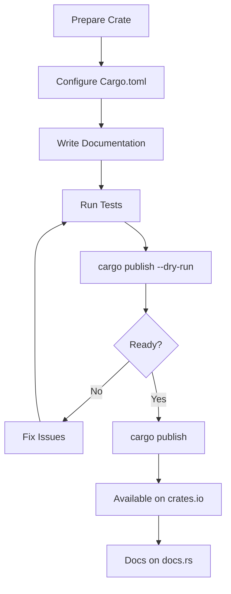
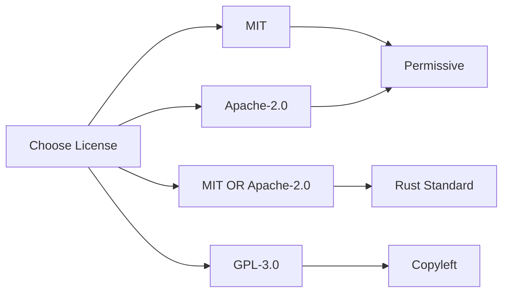
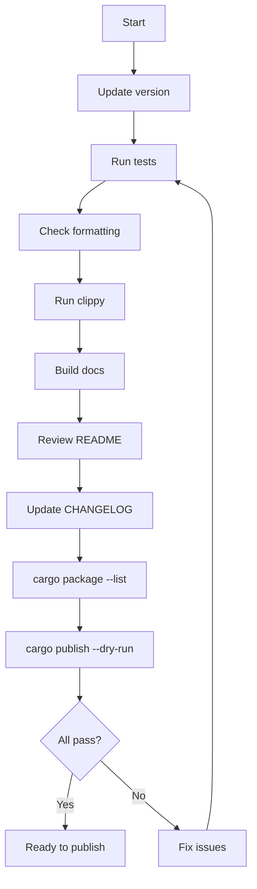
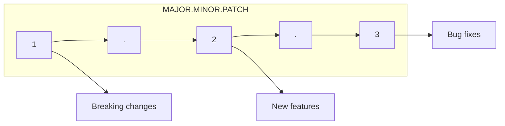
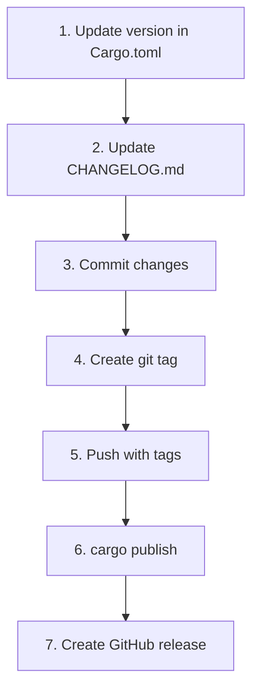

# Publishing to crates.io

Guide to publishing Rust crates to the official registry.

## Publishing Workflow Overview



## Prerequisites

### Create Account

1. Visit [crates.io](https://crates.io)
2. Log in with GitHub
3. Go to Account Settings → API Tokens
4. Create a new token

### Configure Cargo

```bash
# Login with your API token
cargo login <your-api-token>

# Token is stored in ~/.cargo/credentials.toml
```

## Cargo.toml Configuration

### Required and Recommended Fields

```toml
[package]
name = "my-awesome-crate"
version = "0.1.0"
edition = "2021"

# Required for publishing
license = "MIT OR Apache-2.0"
description = "A brief, one-line description of your crate"

# Highly recommended
repository = "https://github.com/username/my-awesome-crate"
documentation = "https://docs.rs/my-awesome-crate"
readme = "README.md"
keywords = ["keyword1", "keyword2", "keyword3"]  # Max 5
categories = ["development-tools"]

# Optional
homepage = "https://example.com"
authors = ["Your Name <you@example.com>"]
```

**Field purposes:**
- `license` - Required. Use SPDX identifier
- `description` - Required. Shown in search results
- `repository` - Links to source code
- `documentation` - Links to docs (auto-set to docs.rs)
- `keywords` - Improve discoverability (max 5)
- `categories` - From [crates.io/category_slugs](https://crates.io/category_slugs)

### License Options



```toml
# Single license
license = "MIT"

# Dual license (Rust ecosystem standard)
license = "MIT OR Apache-2.0"

# Custom license file
license-file = "LICENSE"
```

### Include/Exclude Files

Control what gets packaged:

```toml
[package]
# Only include these files
include = [
    "src/**/*",
    "Cargo.toml",
    "README.md",
    "LICENSE*",
]

# Or exclude specific files
exclude = [
    "tests/*",
    "benches/*",
    ".github/*",
    "*.log",
]
```

## Pre-Publish Checklist



### Verification Commands

```bash
# Run all tests
cargo test --all-features

# Check formatting
cargo fmt --check

# Run linter
cargo clippy -- -D warnings

# Build documentation
cargo doc --no-deps

# List files that will be published
cargo package --list

# Test packaging without publishing
cargo publish --dry-run
```

## Publishing

### First Publication

```bash
# Verify everything is ready
cargo publish --dry-run

# Publish to crates.io
cargo publish
```

### Publishing Workspace Members

Publish dependencies first, in order:

```bash
# Core library first
cargo publish -p myproject-core

# Wait for it to be available
sleep 30

# Then dependent crates
cargo publish -p myproject-utils
cargo publish -p myproject-cli
```

## Versioning

### Semantic Versioning



| Version Change | When to Use |
|----------------|-------------|
| `0.1.0` → `0.1.1` | Bug fixes |
| `0.1.1` → `0.2.0` | New features (pre-1.0 can break) |
| `1.0.0` → `1.0.1` | Bug fixes |
| `1.0.1` → `1.1.0` | New backward-compatible features |
| `1.1.0` → `2.0.0` | Breaking changes |

### Version Bumping Tools

```bash
# Install cargo-edit
cargo install cargo-edit

# Bump version
cargo set-version 0.2.0

# Or bump by type
cargo set-version --bump patch  # 0.1.0 → 0.1.1
cargo set-version --bump minor  # 0.1.0 → 0.2.0
cargo set-version --bump major  # 0.1.0 → 1.0.0
```

## Managing Published Versions

### Yanking

Yank prevents new projects from depending on a version:

```bash
# Yank a broken version
cargo yank --version 0.1.5

# Undo yank
cargo yank --version 0.1.5 --undo
```

**Yank behavior:**
- Existing `Cargo.lock` files continue to work
- New projects cannot add this version
- Use for broken releases, not deprecation

### Ownership

```bash
# Add another owner
cargo owner --add username

# Remove owner
cargo owner --remove username

# List owners
cargo owner --list
```

## Documentation on docs.rs

### Configure docs.rs Build

```toml
[package.metadata.docs.rs]
# Enable all features for docs
all-features = true

# Or specific features
features = ["full", "async"]

# Document for specific targets
targets = ["x86_64-unknown-linux-gnu"]

# Extra rustdoc flags
rustdoc-args = ["--cfg", "docsrs"]
```

### Feature Badges in Docs

Show which features are required:

```rust
#![cfg_attr(docsrs, feature(doc_cfg))]

/// This function requires the `async` feature.
#[cfg(feature = "async")]
#[cfg_attr(docsrs, doc(cfg(feature = "async")))]
pub async fn async_function() {}
```

## Automated Releases

### Release Workflow with cargo-release

```bash
# Install
cargo install cargo-release

# Configure in Cargo.toml
```

```toml
[package.metadata.release]
sign-commit = true
sign-tag = true
pre-release-commit-message = "Release {{version}}"
tag-message = "Release {{version}}"
```

```bash
# Release (bumps version, commits, tags, publishes)
cargo release patch --execute

# Dry run first
cargo release patch
```

### Manual Release Process



```bash
# 1. Update version
cargo set-version 0.2.0

# 2. Update CHANGELOG
# (manual edit)

# 3. Commit
git add Cargo.toml CHANGELOG.md
git commit -m "Release v0.2.0"

# 4. Tag
git tag v0.2.0

# 5. Push
git push origin main --tags

# 6. Publish
cargo publish

# 7. Create GitHub release (optional)
gh release create v0.2.0 --generate-notes
```

## Preventing Accidental Publish

```toml
[package]
# Never publish this crate
publish = false

# Or restrict to specific registries
publish = ["my-private-registry"]
```

## CHANGELOG Best Practices

Maintain a `CHANGELOG.md`:

```markdown
# Changelog

All notable changes to this project will be documented in this file.

## [Unreleased]

### Added
- New feature X

### Changed
- Modified behavior of Y

### Fixed
- Bug in Z

## [0.2.0] - 2024-01-15

### Added
- Feature A
- Feature B

### Changed
- Breaking: Renamed `old_fn` to `new_fn`

## [0.1.0] - 2024-01-01

### Added
- Initial release
```

## API Stability

### Before 1.0

- Use `0.x` versions during development
- Breaking changes can be minor version bumps
- `1.0` signals API stability commitment

### Non-Exhaustive Types

Allow future additions without breaking changes:

```rust
// Users can't exhaustively match this enum
#[non_exhaustive]
pub enum Error {
    NotFound,
    InvalidInput,
    // Future variants won't break existing code
}

// Users can't construct this directly
#[non_exhaustive]
pub struct Config {
    pub name: String,
    pub value: i32,
    // Future fields won't break existing code
}
```

## Summary

| Step | Command |
|------|---------|
| Login | `cargo login` |
| Verify | `cargo publish --dry-run` |
| Publish | `cargo publish` |
| Yank | `cargo yank --version x.y.z` |
| Owners | `cargo owner --add/--remove` |

## Pre-Publish Checklist

- [ ] Version is correct and follows semver
- [ ] License is specified
- [ ] Description is meaningful
- [ ] README.md exists and is helpful
- [ ] All tests pass
- [ ] Documentation builds without warnings
- [ ] No sensitive data in package
- [ ] Dependencies are published
- [ ] CHANGELOG is updated
- [ ] `cargo publish --dry-run` succeeds
