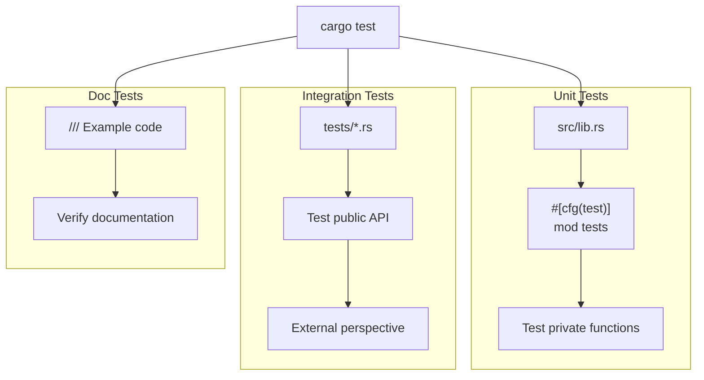
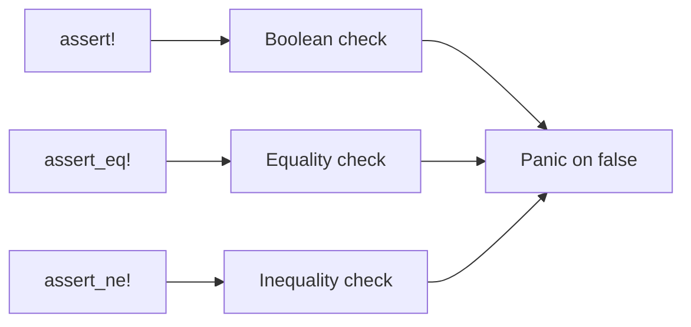
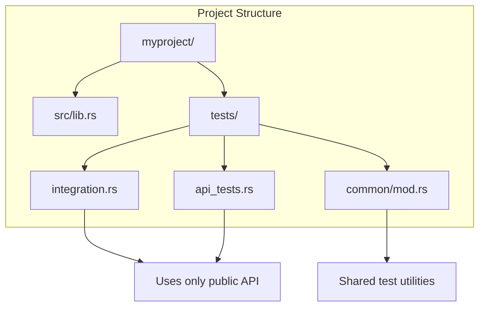
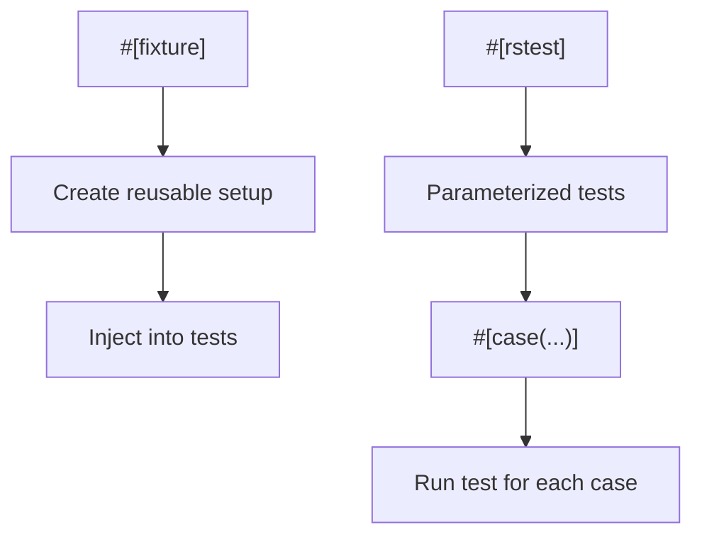
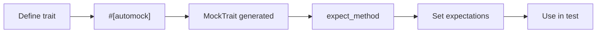
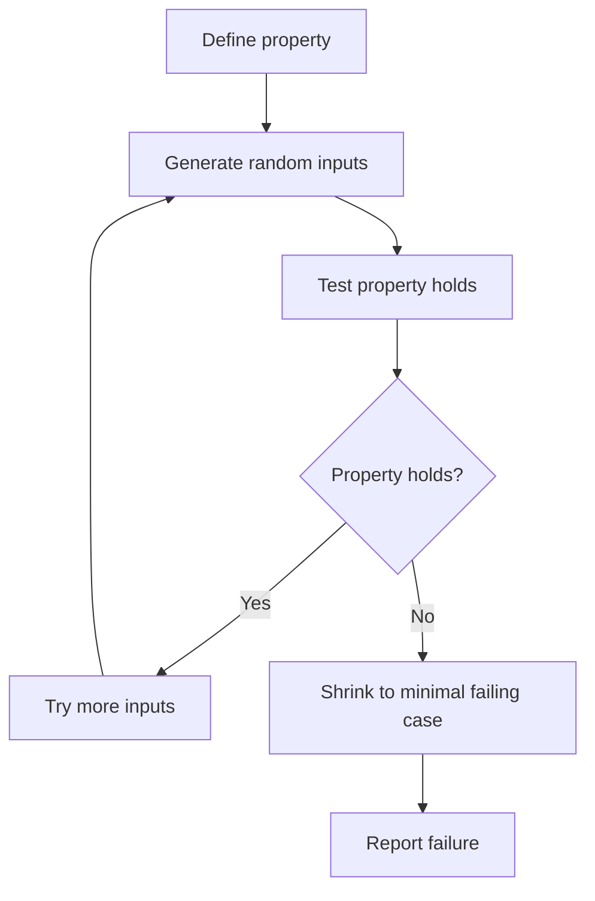
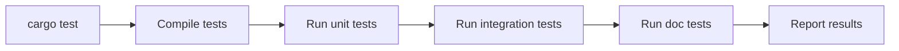

# Testing in Rust

Comprehensive guide to testing Rust code.

## Test Organization Overview



## Unit Tests

Unit tests live alongside your code in `#[cfg(test)]` modules. They can test private functions.

### Basic Test Structure

```rust
// src/lib.rs
pub fn add(a: i32, b: i32) -> i32 {
    a + b
}

fn internal_helper(x: i32) -> i32 {
    x * 2
}

#[cfg(test)]
mod tests {
    use super::*;  // Import items from parent module

    #[test]
    fn test_add() {
        assert_eq!(add(2, 3), 5);
    }

    #[test]
    fn test_internal_helper() {
        // Can test private functions!
        assert_eq!(internal_helper(5), 10);
    }
}
```

**Key points:**
- `#[cfg(test)]` - Module only compiled during testing
- `#[test]` - Marks function as a test
- `use super::*` - Imports parent module items
- Can access private functions from same module

### Test Assertions



```rust
#[test]
fn assertion_examples() {
    // Boolean assertions
    assert!(true);
    assert!(!false);

    // Equality assertions - shows both values on failure
    assert_eq!(1 + 1, 2);
    assert_ne!(1 + 1, 3);

    // Custom error messages
    assert_eq!(
        1 + 1, 2,
        "Math failed: {} + {} should equal {}",
        1, 1, 2
    );
}
```

### Expected Panics

Test that code panics when it should:

```rust
#[test]
#[should_panic]
fn test_panic() {
    panic!("This should panic");
}

#[test]
#[should_panic(expected = "index out of bounds")]
fn test_panic_message() {
    let v = vec![1, 2, 3];
    let _ = v[10];  // Panics with specific message
}
```

### Result-Returning Tests

Tests can return `Result` for cleaner error handling:

```rust
#[test]
fn test_with_result() -> Result<(), String> {
    let value = "42".parse::<i32>()
        .map_err(|e| e.to_string())?;
    assert_eq!(value, 42);
    Ok(())
}
```

### Ignored Tests

```rust
#[test]
#[ignore]  // Skip by default
fn expensive_test() {
    // Long-running test
}

#[test]
#[ignore = "requires database"]  // With reason
fn database_test() {
    // Needs external resources
}
```

```bash
cargo test                    # Skips ignored tests
cargo test -- --ignored       # Run only ignored tests
cargo test -- --include-ignored  # Run all tests
```

## Integration Tests

Integration tests live in `tests/` directory and test your public API from an external perspective.



### Integration Test File

```rust
// tests/integration.rs
use myproject::{add, Config};  // Only public items

mod common;  // Shared utilities

#[test]
fn test_public_api() {
    let result = add(2, 3);
    assert_eq!(result, 5);
}

#[test]
fn test_with_setup() {
    let fixture = common::setup();
    // Use fixture...
    common::teardown(fixture);
}
```

### Shared Test Utilities

```rust
// tests/common/mod.rs
pub struct TestFixture {
    pub temp_dir: tempfile::TempDir,
    pub data: Vec<i32>,
}

pub fn setup() -> TestFixture {
    TestFixture {
        temp_dir: tempfile::tempdir().unwrap(),
        data: vec![1, 2, 3],
    }
}

pub fn teardown(_fixture: TestFixture) {
    // Cleanup happens automatically via Drop
}
```

## Doc Tests

Documentation examples are automatically tested to ensure they stay accurate.

```rust
/// Adds two numbers.
///
/// # Examples
///
/// ```
/// use mylib::add;
/// let result = add(2, 3);
/// assert_eq!(result, 5);
/// ```
pub fn add(a: i32, b: i32) -> i32 {
    a + b
}
```

### Doc Test Attributes

```rust
/// ```no_run
/// // Compiles but doesn't execute
/// std::process::exit(0);
/// ```
///
/// ```ignore
/// // Not compiled or run
/// this_wont_compile();
/// ```
///
/// ```compile_fail
/// // Should fail to compile
/// let x: i32 = "not a number";
/// ```
///
/// ```should_panic
/// // Should panic when run
/// panic!("expected");
/// ```
pub fn documented() {}
```

### Hidden Setup Lines

Hide boilerplate with `#`:

```rust
/// ```
/// # // Hidden lines still compile
/// # use mylib::Config;
/// # fn main() -> Result<(), Box<dyn std::error::Error>> {
/// let config = Config::new();
/// assert!(config.is_valid());
/// # Ok(())
/// # }
/// ```
pub fn example() {}
```

## Test Fixtures with rstest

The `rstest` crate provides powerful fixture and parameterized testing:

```toml
[dev-dependencies]
rstest = "0.18"
```



```rust
use rstest::{rstest, fixture};

#[fixture]
fn database() -> Database {
    Database::new(":memory:")
}

#[rstest]
fn test_insert(database: Database) {
    // database fixture injected automatically
    database.insert("key", "value");
    assert_eq!(database.get("key"), Some("value"));
}

// Parameterized tests - run once per case
#[rstest]
#[case(0, 1)]
#[case(1, 1)]
#[case(5, 120)]
#[case(10, 3628800)]
fn test_factorial(#[case] input: u64, #[case] expected: u64) {
    assert_eq!(factorial(input), expected);
}
```

## Async Tests

### With tokio

```toml
[dev-dependencies]
tokio = { version = "1", features = ["rt", "macros"] }
```

```rust
#[tokio::test]
async fn test_async_function() {
    let result = fetch_data().await;
    assert!(result.is_ok());
}

#[tokio::test(flavor = "multi_thread", worker_threads = 2)]
async fn test_concurrent() {
    // Multi-threaded runtime for this test
}
```

## Mocking with mockall

```toml
[dev-dependencies]
mockall = "0.12"
```



```rust
use mockall::{automock, predicate::*};

#[automock]
trait Database {
    fn get(&self, key: &str) -> Option<String>;
    fn set(&mut self, key: &str, value: &str);
}

#[test]
fn test_with_mock() {
    let mut mock = MockDatabase::new();

    // Set expectations
    mock.expect_get()
        .with(eq("user"))           // Expect this argument
        .times(1)                   // Called exactly once
        .returning(|_| Some("Alice".to_string()));

    // Use the mock
    let result = mock.get("user");
    assert_eq!(result, Some("Alice".to_string()));
}
```

## Property-Based Testing

Test properties over many random inputs with `proptest`:

```toml
[dev-dependencies]
proptest = "1"
```



```rust
use proptest::prelude::*;

fn reverse<T: Clone>(v: &[T]) -> Vec<T> {
    v.iter().cloned().rev().collect()
}

proptest! {
    // Property: reversing twice gives original
    #[test]
    fn test_reverse_twice(v: Vec<i32>) {
        let reversed_twice = reverse(&reverse(&v));
        assert_eq!(v, reversed_twice);
    }

    // Property: length is preserved
    #[test]
    fn test_reverse_length(v: Vec<i32>) {
        assert_eq!(v.len(), reverse(&v).len());
    }
}
```

## Benchmarking with Criterion

```toml
[dev-dependencies]
criterion = "0.5"

[[bench]]
name = "my_benchmark"
harness = false  # Use Criterion instead of built-in
```

```rust
// benches/my_benchmark.rs
use criterion::{black_box, criterion_group, criterion_main, Criterion};

fn fibonacci(n: u64) -> u64 {
    match n {
        0 | 1 => n,
        _ => fibonacci(n - 1) + fibonacci(n - 2),
    }
}

fn benchmark_fib(c: &mut Criterion) {
    c.bench_function("fib 20", |b| {
        // black_box prevents compiler from optimizing away
        b.iter(|| fibonacci(black_box(20)))
    });
}

criterion_group!(benches, benchmark_fib);
criterion_main!(benches);
```

```bash
cargo bench
```

## Running Tests



```bash
# All tests
cargo test

# Specific test by name
cargo test test_add

# Tests matching pattern
cargo test add_

# Tests in specific module
cargo test math::tests::

# Show output (normally captured)
cargo test -- --nocapture

# Run single-threaded
cargo test -- --test-threads=1

# Only doc tests
cargo test --doc

# Specific integration test file
cargo test --test integration
```

## Test Coverage

```bash
# Install coverage tool
cargo install cargo-llvm-cov

# Generate coverage report
cargo llvm-cov

# HTML report
cargo llvm-cov --html --open
```

## Summary

| Test Type | Location | Purpose |
|-----------|----------|---------|
| Unit | `src/*.rs` in `#[cfg(test)]` | Test internal functions |
| Integration | `tests/*.rs` | Test public API |
| Doc | `///` comments | Verify documentation |
| Benchmark | `benches/*.rs` | Measure performance |

## Best Practices

| Practice | Description |
|----------|-------------|
| Descriptive names | `test_add_negative_numbers_returns_correct_sum` |
| One concept per test | Focus each test on a single behavior |
| Arrange-Act-Assert | Structure tests clearly |
| Test edge cases | Empty, zero, max values, boundaries |
| Use fixtures | Share setup code via fixtures |
| Mock external systems | Use traits for testability |
