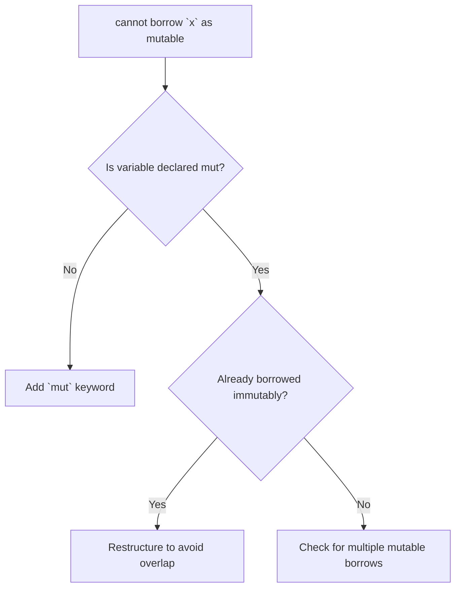
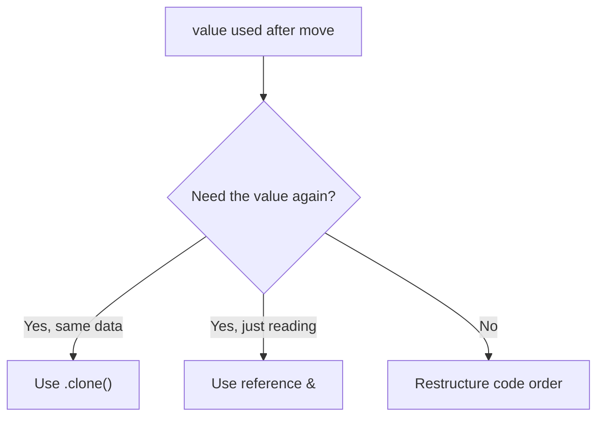
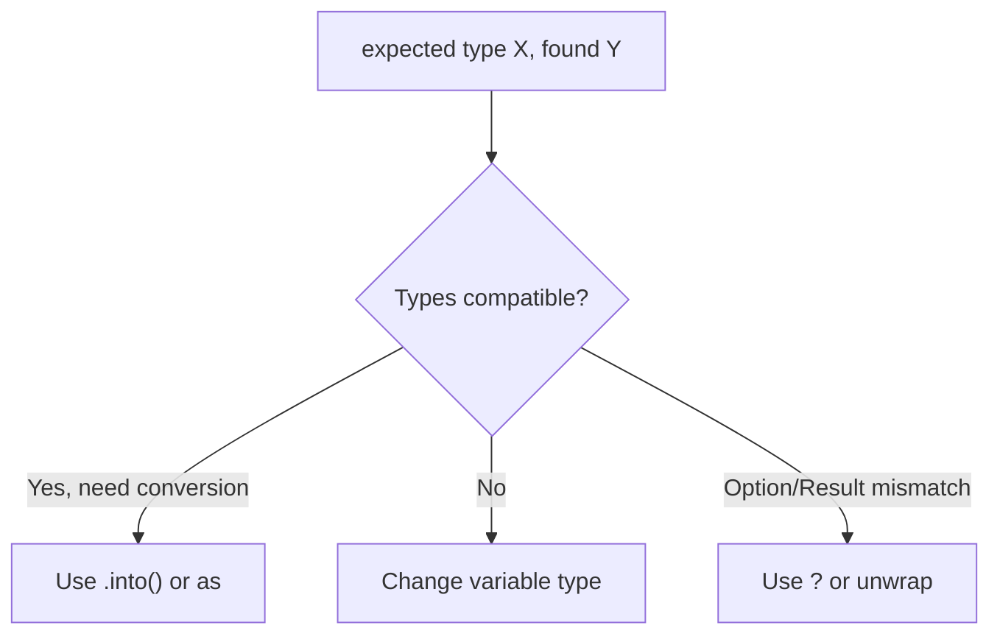
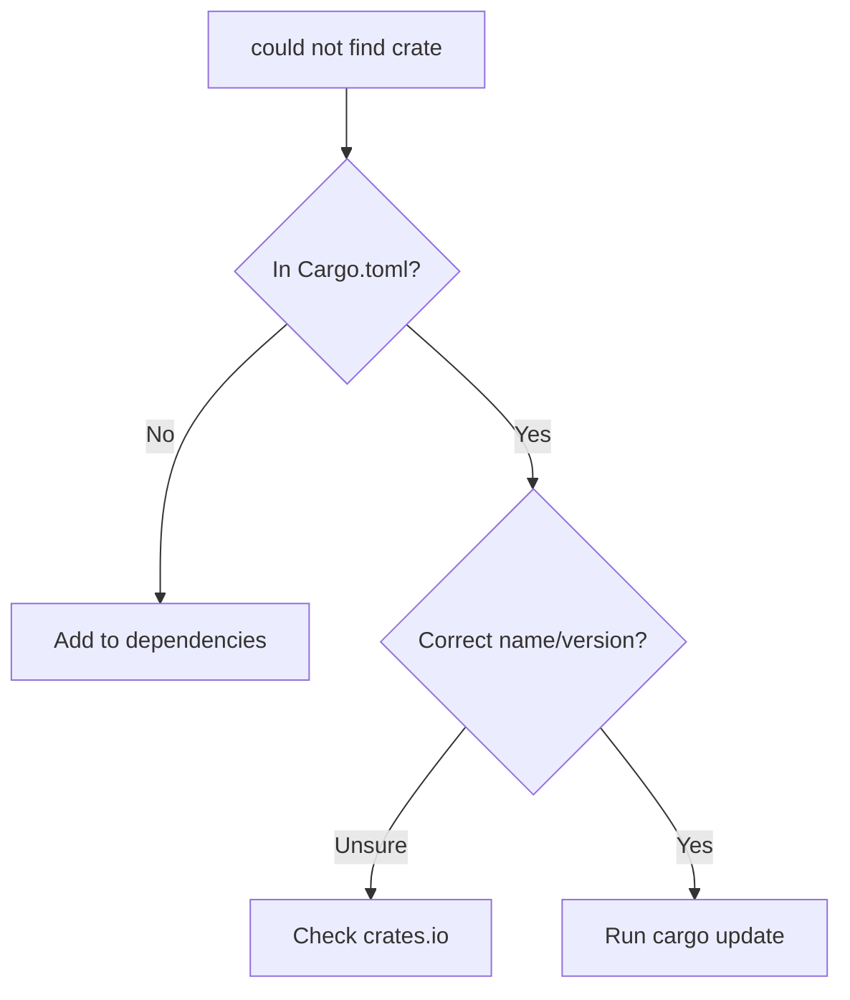
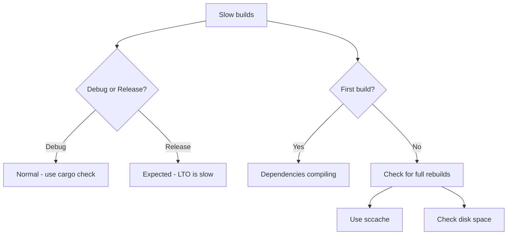
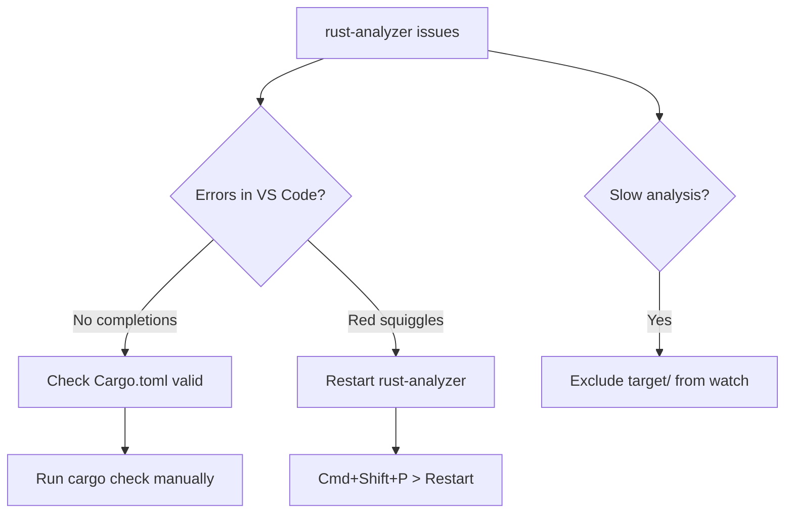
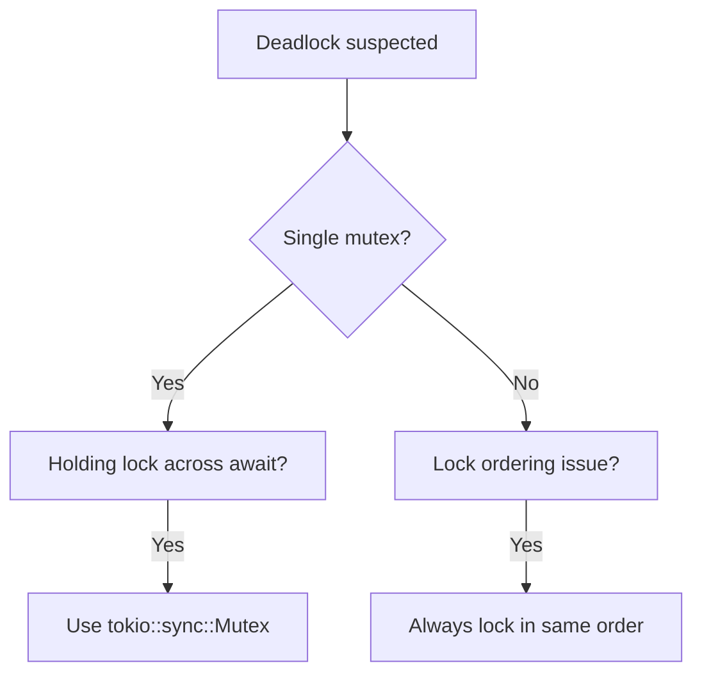

# Troubleshooting

Common issues and solutions for Rust development.

## Ownership and Borrowing Errors

### "cannot borrow as mutable"



**Error:**
```
error[E0596]: cannot borrow `x` as mutable, as it is not declared as mutable
```

**Solutions:**

```rust
// Problem: missing mut
let x = vec![1, 2, 3];
x.push(4);  // Error!

// Solution: add mut
let mut x = vec![1, 2, 3];
x.push(4);  // Works!
```

```rust
// Problem: borrowing through immutable reference
fn add_item(v: &Vec<i32>) {
    v.push(4);  // Error! &Vec is immutable
}

// Solution: use mutable reference
fn add_item(v: &mut Vec<i32>) {
    v.push(4);  // Works!
}
```

### "value moved here"



**Error:**
```
error[E0382]: borrow of moved value: `s`
```

**Solutions:**

```rust
// Problem: value moved
let s = String::from("hello");
let s2 = s;           // s moved to s2
println!("{}", s);    // Error! s no longer valid

// Solution 1: Clone
let s = String::from("hello");
let s2 = s.clone();   // s2 gets a copy
println!("{}", s);    // Works!

// Solution 2: Borrow instead
let s = String::from("hello");
let s2 = &s;          // s2 borrows s
println!("{}", s);    // Works!
```

### "cannot move out of borrowed content"

**Error:**
```
error[E0507]: cannot move out of `*self.data`
```

**Solutions:**

```rust
// Problem: trying to move out of reference
struct Container {
    data: String,
}

impl Container {
    fn get_data(&self) -> String {
        self.data  // Error! Can't move from &self
    }
}

// Solution 1: Return reference
fn get_data(&self) -> &String {
    &self.data
}

// Solution 2: Clone
fn get_data(&self) -> String {
    self.data.clone()
}

// Solution 3: Take ownership of self
fn into_data(self) -> String {
    self.data
}
```

### "lifetime may not live long enough"

**Error:**
```
error[E0621]: explicit lifetime required
```

**Solutions:**

```rust
// Problem: unclear lifetimes
fn longest(x: &str, y: &str) -> &str {
    if x.len() > y.len() { x } else { y }
}  // Error!

// Solution: add lifetime annotations
fn longest<'a>(x: &'a str, y: &'a str) -> &'a str {
    if x.len() > y.len() { x } else { y }
}
```

## Type Errors

### "expected X, found Y"



**Common conversions:**

```rust
// String <-> &str
let s: String = "hello".to_string();
let r: &str = &s;

// Integer types
let x: i32 = 42;
let y: i64 = x as i64;
let z: i64 = x.into();

// Option -> value
let opt: Option<i32> = Some(42);
let val: i32 = opt.unwrap();       // Panics if None
let val: i32 = opt.unwrap_or(0);   // Default if None
let val: i32 = opt?;               // Early return if None (in fn returning Option)

// Result -> value
let res: Result<i32, Error> = Ok(42);
let val: i32 = res?;               // Early return if Err
```

### "mismatched types: expected `()`, found `X`"

**Problem:** Missing semicolon causes expression to return a value.

```rust
// Problem
fn do_something() {
    let x = 5
    // Missing semicolon - returns 5, but fn expects ()
}

// Solution
fn do_something() {
    let x = 5;  // Semicolon makes it a statement
}
```

### "the trait X is not implemented for Y"

```rust
// Problem
fn print_it<T: std::fmt::Display>(val: T) {
    println!("{}", val);
}

struct MyStruct { x: i32 }
print_it(MyStruct { x: 5 });  // Error!

// Solution: implement the trait
impl std::fmt::Display for MyStruct {
    fn fmt(&self, f: &mut std::fmt::Formatter) -> std::fmt::Result {
        write!(f, "MyStruct({})", self.x)
    }
}

// Or use Debug for quick debugging
#[derive(Debug)]
struct MyStruct { x: i32 }
println!("{:?}", MyStruct { x: 5 });
```

## Cargo and Dependencies

### "could not find crate"



**Solutions:**

```bash
# Refresh crates.io index
cargo update

# Clear cargo cache (last resort)
rm -rf ~/.cargo/registry/cache
cargo build
```

### "failed to select a version"

**Error:**
```
error: failed to select a version for `X`
```

**Cause:** Version conflicts between dependencies.

**Solutions:**

```bash
# See dependency tree
cargo tree

# Find conflicting versions
cargo tree -d

# Update all dependencies
cargo update
```

```toml
# In Cargo.toml, try looser version constraints
[dependencies]
problematic-crate = ">=1.0, <3.0"
```

### Slow Compilation



**Speed up builds:**

```bash
# Fast syntax checking (no binary)
cargo check

# Use mold linker (Linux)
RUSTFLAGS="-C link-arg=-fuse-ld=mold" cargo build

# Use lld linker (cross-platform)
RUSTFLAGS="-C link-arg=-fuse-ld=lld" cargo build
```

```toml
# .cargo/config.toml
[target.x86_64-unknown-linux-gnu]
linker = "clang"
rustflags = ["-C", "link-arg=-fuse-ld=lld"]

[profile.dev]
# Optimize dependencies but not your code
[profile.dev.package."*"]
opt-level = 2
```

```bash
# Use sccache for caching
cargo install sccache
export RUSTC_WRAPPER=sccache
```

## Environment Setup

### "rustup: command not found"

```bash
# Check if installed
which rustup

# If not found, install
curl --proto '=https' --tlsv1.2 -sSf https://sh.rustup.rs | sh

# Add to PATH
source ~/.cargo/env
# Or add to shell profile:
# export PATH="$HOME/.cargo/bin:$PATH"
```

### "rust-analyzer not working"



**Solutions:**

```bash
# Verify project compiles
cargo check

# Clear rust-analyzer cache
rm -rf target/
# Restart VS Code
```

In VS Code settings:
```json
{
    "rust-analyzer.checkOnSave.command": "clippy",
    "files.watcherExclude": {
        "**/target/**": true
    }
}
```

### "linker 'cc' not found"

**Linux:**
```bash
# Ubuntu/Debian
sudo apt install build-essential

# Fedora
sudo dnf install gcc

# Arch
sudo pacman -S base-devel
```

**macOS:**
```bash
xcode-select --install
```

**Windows:**
Install Visual Studio Build Tools or MinGW.

## Async and Concurrency

### "future cannot be sent between threads safely"

**Error:**
```
error: future cannot be sent between threads safely
the trait `Send` is not implemented
```

**Cause:** Using non-Send type across await point.

```rust
// Problem: Rc is not Send
use std::rc::Rc;

async fn my_async_fn() {
    let data = Rc::new(42);
    some_async_operation().await;  // Error!
    println!("{}", data);
}

// Solution: use Arc instead
use std::sync::Arc;

async fn my_async_fn() {
    let data = Arc::new(42);
    some_async_operation().await;  // Works!
    println!("{}", data);
}
```

### "there is no reactor running"

**Error:**
```
thread 'main' panicked at 'there is no reactor running'
```

**Cause:** Calling async code without runtime.

```rust
// Problem: no runtime
async fn my_async_fn() {}

fn main() {
    my_async_fn();  // Error!
}

// Solution: use runtime
#[tokio::main]
async fn main() {
    my_async_fn().await;  // Works!
}

// Or manually
fn main() {
    let rt = tokio::runtime::Runtime::new().unwrap();
    rt.block_on(my_async_fn());
}
```

### Deadlock with Mutex



```rust
// Problem: std::sync::Mutex across await
use std::sync::Mutex;

async fn bad() {
    let lock = MUTEX.lock().unwrap();
    async_operation().await;  // Deadlock risk!
    drop(lock);
}

// Solution: use tokio's async Mutex
use tokio::sync::Mutex;

async fn good() {
    let lock = MUTEX.lock().await;
    async_operation().await;  // Safe
    drop(lock);
}

// Or drop before await
async fn also_good() {
    {
        let lock = MUTEX.lock().unwrap();
        // Use lock
    }  // Lock dropped here
    async_operation().await;
}
```

## Common Runtime Errors

### Stack Overflow

**Cause:** Usually infinite recursion or very deep recursion.

```rust
// Problem: infinite recursion
fn factorial(n: u64) -> u64 {
    n * factorial(n - 1)  // No base case!
}

// Solution: add base case
fn factorial(n: u64) -> u64 {
    if n <= 1 { 1 } else { n * factorial(n - 1) }
}

// For deep recursion, use iteration
fn factorial_iter(n: u64) -> u64 {
    (1..=n).product()
}
```

### Integer Overflow

```rust
// Debug builds panic, release wraps silently
let x: u8 = 255;
let y = x + 1;  // Panic in debug, 0 in release

// Explicit handling
let y = x.checked_add(1);      // Returns Option<u8>
let y = x.saturating_add(1);   // Returns 255 (max)
let y = x.wrapping_add(1);     // Returns 0 (wrap)
let y = x.overflowing_add(1);  // Returns (0, true)
```

## Diagnostic Commands

Quick commands to diagnose issues:

```bash
# Check code compiles
cargo check

# Check with all features
cargo check --all-features

# Run linter
cargo clippy

# Show expanded macros
cargo expand

# Show dependency tree
cargo tree

# Find duplicate dependencies
cargo tree -d

# Check for outdated dependencies
cargo outdated

# Security audit
cargo audit

# Show what would be in package
cargo package --list
```

## Getting Help

| Resource | URL |
|----------|-----|
| Rust Users Forum | [users.rust-lang.org](https://users.rust-lang.org) |
| Rust Discord | [discord.gg/rust-lang](https://discord.gg/rust-lang) |
| Stack Overflow | [stackoverflow.com/questions/tagged/rust](https://stackoverflow.com/questions/tagged/rust) |
| Rust Subreddit | [reddit.com/r/rust](https://reddit.com/r/rust) |

**When asking for help:**
1. Include the full error message
2. Provide minimal reproducible code
3. Mention Rust version (`rustc --version`)
4. Describe what you expected vs what happened
