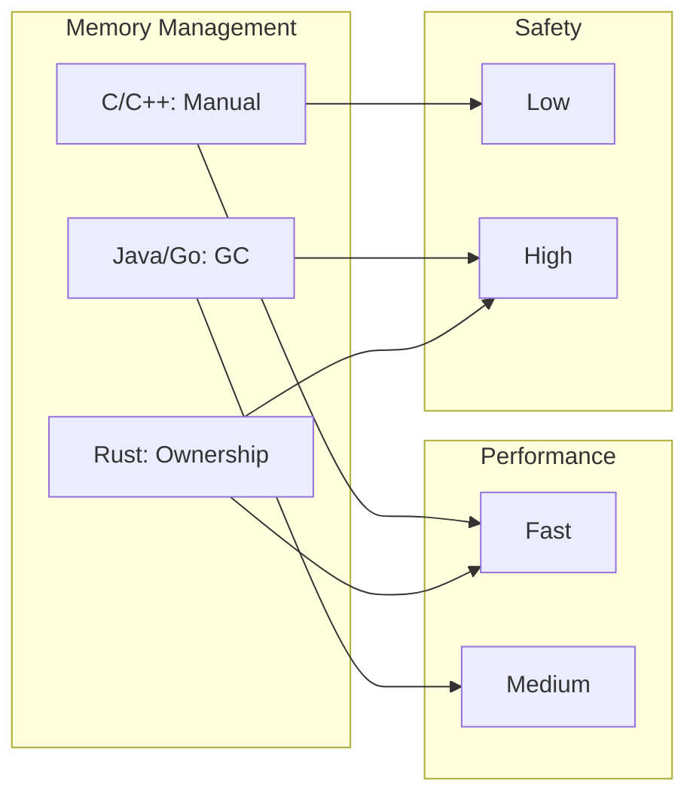

# Introduction to Rust

## What is Rust?

Rust is a systems programming language focused on three goals: **safety**, **speed**, and **concurrency**. It accomplishes these goals without a garbage collector, making it useful for performance-critical services, embedded systems, and integration with other languages.

## Why Learn Rust?

### Memory Safety Without Garbage Collection

Rust's ownership system guarantees memory safety at compile time. No null pointer dereferences, no dangling pointers, no data races—all verified before your program runs.

```rust
fn main() {
    let s1 = String::from("hello");
    let s2 = s1; // s1 is moved to s2

    // println!("{}", s1); // This would be a compile error!
    println!("{}", s2); // This works fine
}
```

### Zero-Cost Abstractions

Rust's high-level features compile down to efficient machine code. Iterators, closures, and generics have no runtime overhead compared to hand-written low-level code.

### Fearless Concurrency

The type system prevents data races at compile time. You can write concurrent code with confidence that it won't have subtle threading bugs.

### Growing Ecosystem

Rust has been voted the "most loved programming language" in Stack Overflow's developer survey for multiple years. The ecosystem includes:

- **Cargo**: Best-in-class package manager and build tool
- **crates.io**: Central package registry with 100,000+ libraries
- **rustdoc**: Built-in documentation generation
- **rustfmt**: Automatic code formatting
- **Clippy**: Helpful lints for common mistakes

## What Can You Build with Rust?

| Domain | Examples |
|--------|----------|
| **CLI Tools** | ripgrep, bat, exa, fd |
| **Web Services** | APIs with Actix, Axum, Rocket |
| **WebAssembly** | High-performance web apps |
| **Embedded** | Microcontrollers, IoT devices |
| **Systems** | Operating systems, drivers |
| **Blockchain** | Solana, Polkadot |
| **Game Engines** | Bevy, Amethyst |

## Rust vs Other Languages



| Feature | C/C++ | Java/Go | Rust |
|---------|-------|---------|------|
| Memory Safety | Manual | GC | Ownership |
| Performance | Excellent | Good | Excellent |
| Null Safety | No | Partial | Yes |
| Data Race Prevention | No | Partial | Yes |
| Learning Curve | High | Medium | High |

## Who Uses Rust?

- **Mozilla**: Firefox browser components
- **Microsoft**: Windows kernel components
- **Google**: Android, Fuchsia OS
- **Amazon**: AWS services
- **Meta**: Source control backend
- **Discord**: Real-time services
- **Cloudflare**: Edge computing

## Is Rust Right for You?

Rust is a great choice if you:

- Want performance without sacrificing safety
- Need to write reliable concurrent code
- Are building systems software or embedded applications
- Want to contribute to a growing, welcoming community
- Enjoy learning and intellectual challenges

{: .note }
Rust has a steeper learning curve than some languages. The compiler is strict but helpful. Once you "get" ownership, everything clicks into place.

## Next Steps

Ready to start? Let's [install Rust]() on your system.
