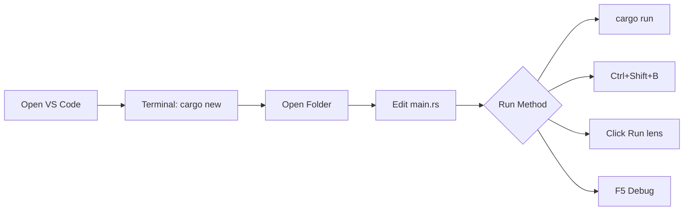

# Hello World

Let's write your first Rust program!

## Creating a Project

### Option 1: Using Terminal

Use Cargo to create a new project:

```bash
cargo new hello-world
cd hello-world
```

This creates:

```
hello-world/
├── Cargo.toml
└── src/
    └── main.rs
```

### Option 2: Using VS Code

You can also create and run Rust projects entirely within VS Code:

1. **Open VS Code** and open the integrated terminal (`` Ctrl+` `` or View → Terminal)

2. **Create the project**:
   ```bash
   cargo new hello-world
   ```

3. **Open the project folder**:
   - File → Open Folder → select `hello-world`
   - Or from terminal: `code hello-world`

4. **Explore the project** in the Explorer sidebar:
   - `Cargo.toml` - Project configuration
   - `src/main.rs` - Your code

5. **Edit `src/main.rs`** - rust-analyzer will provide:
   - Syntax highlighting
   - Code completion
   - Inline error checking
   - Type hints on hover

6. **Run the project** using any of these methods:
   - **Terminal**: Type `cargo run` in the integrated terminal
   - **Task**: Press `Ctrl+Shift+B` and select "cargo run"
   - **CodeLens**: Click "▶ Run" above the `fn main()` line (if rust-analyzer is installed)
   - **Debug**: Press `F5` to run with debugger



{: .tip }
VS Code with rust-analyzer shows a "▶ Run | Debug" CodeLens above your `main` function. Just click "Run" to execute instantly!

## Understanding the Files

### Cargo.toml

The project manifest:

```toml
[package]
name = "hello-world"
version = "0.1.0"
edition = "2021"

[dependencies]
```

| Field | Description |
|-------|-------------|
| `name` | Package name |
| `version` | Semantic version |
| `edition` | Rust edition (2021 recommended) |
| `[dependencies]` | External crates |

### src/main.rs

The default main file:

```rust
fn main() {
    println!("Hello, world!");
}
```

## Running the Program

```bash
cargo run
```

Output:
```
   Compiling hello-world v0.1.0 (/path/to/hello-world)
    Finished dev [unoptimized + debuginfo] target(s) in 0.50s
     Running `target/debug/hello-world`
Hello, world!
```

## Understanding the Code

```rust
fn main() {
    println!("Hello, world!");
}
```

| Element | Description |
|---------|-------------|
| `fn` | Function keyword |
| `main` | Entry point function |
| `()` | No parameters |
| `{}` | Function body |
| `println!` | Macro for printing with newline |
| `"Hello, world!"` | String literal |
| `;` | Statement terminator |

{: .note }
The `!` in `println!` indicates it's a macro, not a function. Macros are expanded at compile time.

## Modifying the Program

Let's make it more interesting:

```rust
fn main() {
    let name = "Rustacean";
    println!("Hello, {}!", name);
}
```

Run again:
```bash
cargo run
```

Output:
```
Hello, Rustacean!
```

## Build Commands

| Command | Description |
|---------|-------------|
| `cargo run` | Build and run |
| `cargo build` | Build only |
| `cargo build --release` | Build optimized |
| `cargo check` | Check without building |

### Debug vs Release

```bash
# Debug build (fast compile, slow run)
cargo build
# Output: target/debug/hello-world

# Release build (slow compile, fast run)
cargo build --release
# Output: target/release/hello-world
```

## Project Structure

After building:

```
hello-world/
├── Cargo.lock        # Dependency lock file
├── Cargo.toml        # Project manifest
├── src/
│   └── main.rs       # Source code
└── target/           # Build artifacts
    ├── debug/        # Debug builds
    └── release/      # Release builds
```

## A Slightly Bigger Example

Let's add user input:

```rust
use std::io;

fn main() {
    println!("What is your name?");

    let mut name = String::new();

    io::stdin()
        .read_line(&mut name)
        .expect("Failed to read line");

    let name = name.trim();
    println!("Hello, {}!", name);
}
```

Run:
```bash
cargo run
```

```
What is your name?
Alice
Hello, Alice!
```

### Breaking It Down

```rust
use std::io;                    // Import the io module
```

```rust
let mut name = String::new();   // Create mutable empty string
```

```rust
io::stdin()                     // Get standard input
    .read_line(&mut name)       // Read into name (mutable borrow)
    .expect("Failed to read");  // Handle potential error
```

```rust
let name = name.trim();         // Remove whitespace, shadow variable
```

## Common Beginner Mistakes

### Forgetting Semicolons

```rust
// Wrong
fn main() {
    println!("Hello")  // Missing semicolon
}

// Correct
fn main() {
    println!("Hello");
}
```

### Wrong String Type

```rust
// &str (string slice) - immutable, fixed size
let greeting: &str = "Hello";

// String - owned, growable
let mut name: String = String::new();
```

### Missing `mut` for Mutation

```rust
// Wrong
let name = String::new();
name.push_str("Alice");  // Error: cannot borrow as mutable

// Correct
let mut name = String::new();
name.push_str("Alice");  // Works!
```

## Exercises

1. **Modify the greeting**: Change "Hello, world!" to your own message
2. **Add variables**: Use `let` to create variables and print them
3. **User input**: Ask for the user's age and print it back
4. **Multiple lines**: Print a multi-line ASCII art

## Full Example Code

[See the complete example on GitHub](https://github.com/MichaelTien8901/rust-guide-tutorial/tree/master/examples/part1/hello-world)

## Next Steps

Now that you've written your first program, learn more about [Cargo]() to manage your projects effectively.
