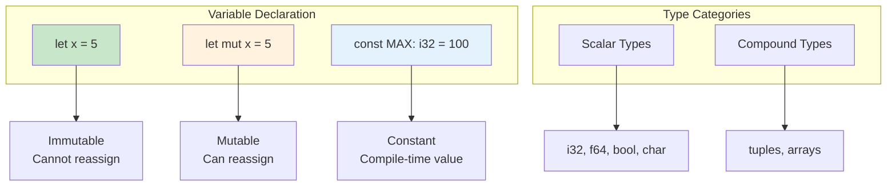
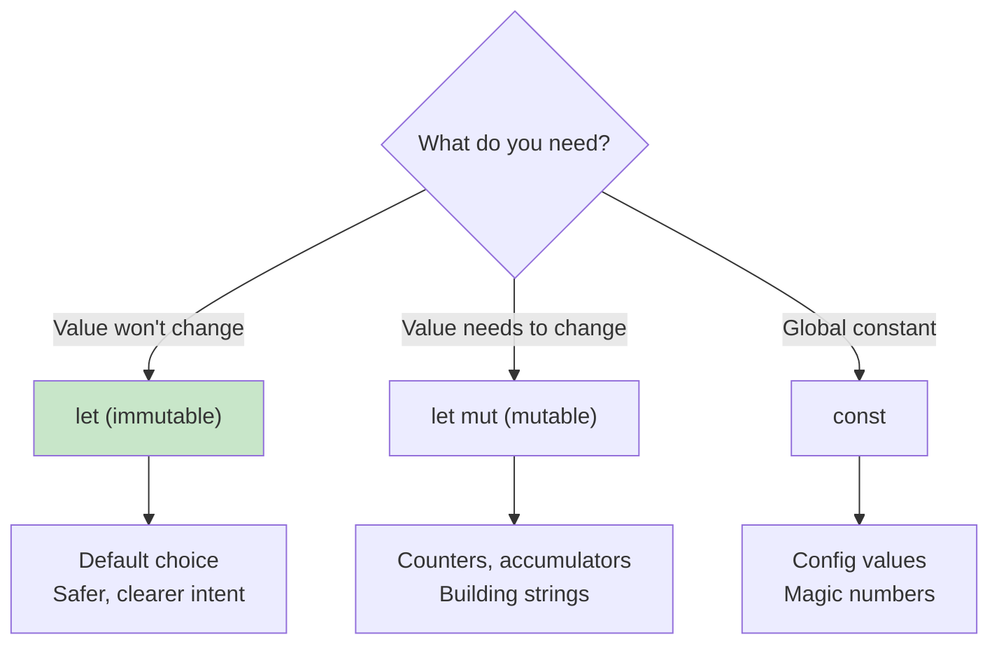
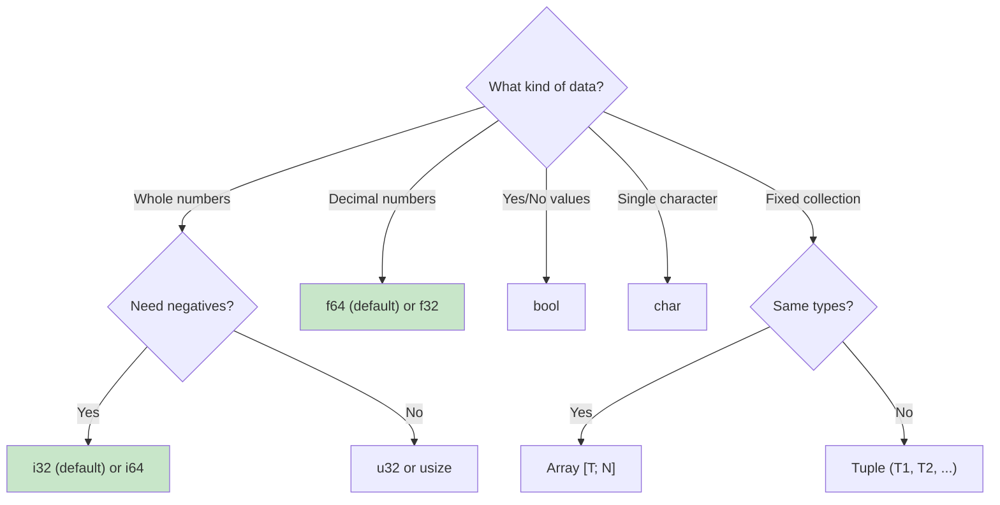

# Variables and Types

Rust is a statically typed language with type inference. Let's explore how to declare variables and use different data types.

## Overview

Understanding variables and types is fundamental to Rust programming. Rust's type system is powerful yet ergonomic, catching errors at compile time while often inferring types automatically.



## When to Use Each Declaration



{: .best-practice }
> **Prefer immutability by default.** Use `let` without `mut` unless you specifically need to modify the variable. This makes code easier to reason about and prevents accidental modifications.

## Variables with `let`

Variables are declared with the `let` keyword:

```rust
fn main() {
    let x = 5;
    println!("x = {}", x);
}
```

### Immutability by Default

Variables are **immutable by default**:

```rust
fn main() {
    let x = 5;
    x = 6;  // Error: cannot assign twice to immutable variable
}
```

### Mutable Variables with `mut`

Add `mut` to make a variable mutable:

```rust
fn main() {
    let mut x = 5;
    println!("x = {}", x);
    x = 6;  // This works!
    println!("x = {}", x);
}
```

### Shadowing

You can declare a new variable with the same name:

```rust
fn main() {
    let x = 5;
    let x = x + 1;      // Shadow with new value
    let x = x * 2;      // Shadow again
    println!("x = {}", x);  // Prints: x = 12

    // Can even change type
    let spaces = "   ";
    let spaces = spaces.len();  // Now it's a number!
}
```

{: .note }
Shadowing is different from `mut`. With shadowing, you create a new variable; with `mut`, you modify the existing one.

## Constants

Constants are always immutable and require type annotation:

```rust
const MAX_POINTS: u32 = 100_000;
const PI: f64 = 3.14159;
```

| Feature | `let` | `const` |
|---------|-------|---------|
| Mutability | Can be `mut` | Always immutable |
| Type annotation | Optional | Required |
| Compile-time | No | Yes |
| Shadowing | Yes | No |

## Scalar Types

Rust has four primary scalar types:

### Integers

| Length | Signed | Unsigned |
|--------|--------|----------|
| 8-bit | `i8` | `u8` |
| 16-bit | `i16` | `u16` |
| 32-bit | `i32` | `u32` |
| 64-bit | `i64` | `u64` |
| 128-bit | `i128` | `u128` |
| arch | `isize` | `usize` |

```rust
fn main() {
    let a: i32 = -42;
    let b: u32 = 42;
    let c = 98_222;        // Decimal with separator
    let d = 0xff;          // Hex
    let e = 0o77;          // Octal
    let f = 0b1111_0000;   // Binary
    let g = b'A';          // Byte (u8 only)
}
```

### Floating-Point

```rust
fn main() {
    let x = 2.0;      // f64 (default)
    let y: f32 = 3.0; // f32
}
```

### Boolean

```rust
fn main() {
    let t = true;
    let f: bool = false;
}
```

### Character

```rust
fn main() {
    let c = 'z';
    let heart = '❤';
    let emoji = '😀';
}
```

{: .note }
`char` is 4 bytes (Unicode scalar value), not 1 byte like in C.

## Compound Types

### Tuples

Fixed-size collection of different types:

```rust
fn main() {
    let tup: (i32, f64, u8) = (500, 6.4, 1);

    // Destructuring
    let (x, y, z) = tup;
    println!("y = {}", y);

    // Index access
    let five_hundred = tup.0;
    let six_point_four = tup.1;
    let one = tup.2;
}
```

### Arrays

Fixed-size collection of same type:

```rust
fn main() {
    let a = [1, 2, 3, 4, 5];
    let months = ["Jan", "Feb", "Mar"];

    // With type annotation
    let a: [i32; 5] = [1, 2, 3, 4, 5];

    // Initialize with same value
    let zeros = [0; 5];  // [0, 0, 0, 0, 0]

    // Access elements
    let first = a[0];
    let second = a[1];
}
```

{: .warning }
Array index out of bounds causes a **panic** at runtime:
```rust
let a = [1, 2, 3];
let element = a[10];  // Runtime panic!
```

## Type Inference

Rust infers types when possible:

```rust
fn main() {
    let x = 5;              // i32 (default integer)
    let y = 2.0;            // f64 (default float)
    let z = true;           // bool
    let s = "hello";        // &str
    let v = vec![1, 2, 3];  // Vec<i32>
}
```

Sometimes you need to help the compiler:

```rust
fn main() {
    // Error: type annotations needed
    // let guess = "42".parse().unwrap();

    // Fixed: specify the type
    let guess: u32 = "42".parse().unwrap();

    // Or use turbofish syntax
    let guess = "42".parse::<u32>().unwrap();
}
```

## Type Conversions

### Numeric Casting with `as`

```rust
fn main() {
    let x: i32 = 10;
    let y: f64 = x as f64;

    let a: f64 = 3.9;
    let b: i32 = a as i32;  // Truncates to 3

    let c: u8 = 255;
    let d: i8 = c as i8;    // Wraps to -1
}
```

{: .warning }
`as` can lose data. Use `try_into()` for safe conversions:
```rust
use std::convert::TryInto;

let x: i32 = 1000;
let y: u8 = x.try_into().unwrap_or(255);
```

## Common Patterns

### Multiple Assignment

```rust
fn main() {
    let (x, y, z) = (1, 2, 3);
    let [a, b, c] = [1, 2, 3];
}
```

### Ignoring Values

```rust
fn main() {
    let (x, _, z) = (1, 2, 3);  // Ignore second value
    let _ = some_function();     // Ignore return value
}
```

### Type Aliases

```rust
type Kilometers = i32;

fn main() {
    let distance: Kilometers = 100;
}
```

## Summary Table

| Type | Example | Size |
|------|---------|------|
| `i32` | `-42` | 4 bytes |
| `u64` | `42` | 8 bytes |
| `f64` | `3.14` | 8 bytes |
| `bool` | `true` | 1 byte |
| `char` | `'a'` | 4 bytes |
| `(i32, f64)` | `(1, 2.0)` | 12 bytes |
| `[i32; 3]` | `[1, 2, 3]` | 12 bytes |

## Type Selection Guide



## Best Practices

{: .best-practice }
> **Variable and Type Guidelines:**
> 1. **Prefer immutability** - use `let` without `mut` by default
> 2. **Let the compiler infer** - only annotate when needed
> 3. **Use `i32` for integers** - it's the default and usually fastest
> 4. **Use `f64` for floats** - more precision, similar speed to f32
> 5. **Use `usize` for indices** - matches pointer size
> 6. **Prefer shadowing over `mut`** when transforming values

{: .warning }
> **Common Pitfalls:**
> - Integer overflow panics in debug mode, wraps in release
> - `as` casts can lose data silently - use `try_into()` for safety
> - Array index out of bounds causes a runtime panic

## Exercises

1. Create variables of each scalar type
2. Create a tuple with 3 different types and access each element
3. Create an array and iterate over it
4. Practice shadowing by transforming a string to its length

## See Also

- [Example Code](https://github.com/MichaelTien8901/rust-guide-tutorial/tree/master/examples/part2/variables-types)

## Next Steps

Learn about [Functions]() to organize your code.
