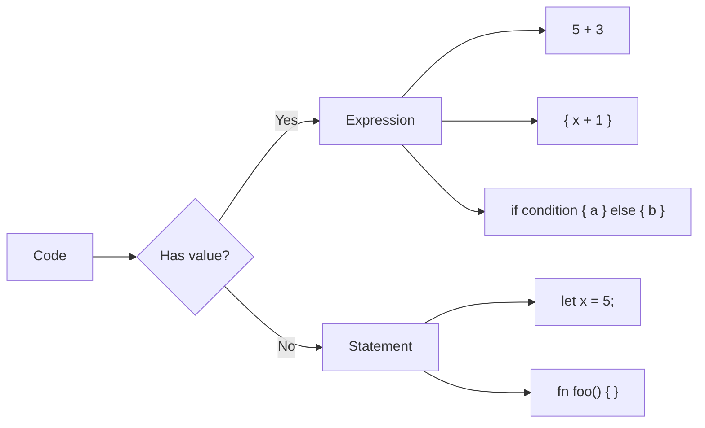

# Functions

Functions are the building blocks of Rust programs. They're defined with `fn` and follow specific conventions.

## Function Syntax

```rust
fn main() {
    println!("Hello from main!");
    another_function();
}

fn another_function() {
    println!("Hello from another_function!");
}
```

{: .note }
Rust uses **snake_case** for function and variable names by convention.

## Parameters

Functions can take parameters with explicit types:

```rust
fn main() {
    greet("Alice");
    print_sum(5, 3);
}

fn greet(name: &str) {
    println!("Hello, {}!", name);
}

fn print_sum(x: i32, y: i32) {
    println!("{} + {} = {}", x, y, x + y);
}
```

{: .important }
Parameter types are **required**. Rust doesn't infer parameter types.

## Return Values

Specify return type with `->`:

```rust
fn add(x: i32, y: i32) -> i32 {
    x + y  // No semicolon = return value
}

fn main() {
    let result = add(5, 3);
    println!("5 + 3 = {}", result);
}
```

### Explicit Return

Use `return` for early returns:

```rust
fn absolute(x: i32) -> i32 {
    if x < 0 {
        return -x;  // Early return
    }
    x  // Implicit return
}
```

## Statements vs Expressions

Rust distinguishes between statements and expressions:

```rust
fn main() {
    // Statement - performs action, no value
    let x = 5;  // This is a statement

    // Expression - evaluates to a value
    let y = {
        let x = 3;
        x + 1  // No semicolon - this is the block's value
    };  // y = 4

    // Adding semicolon makes it a statement (returns ())
    let z = {
        let x = 3;
        x + 1;  // Semicolon - returns ()
    };  // z = ()
}
```



## Functions as Expressions

Control flow constructs are expressions:

```rust
fn main() {
    let condition = true;

    // if is an expression
    let number = if condition { 5 } else { 6 };

    // match is an expression
    let description = match number {
        1 => "one",
        2 => "two",
        _ => "many",
    };
}
```

## Unit Type `()`

Functions without return value return `()` (unit):

```rust
fn print_hello() {
    println!("Hello!");
}  // Implicitly returns ()

fn explicit_unit() -> () {
    println!("Same thing!");
}
```

## Multiple Return Values

Use tuples to return multiple values:

```rust
fn divide(dividend: i32, divisor: i32) -> (i32, i32) {
    let quotient = dividend / divisor;
    let remainder = dividend % divisor;
    (quotient, remainder)
}

fn main() {
    let (q, r) = divide(10, 3);
    println!("10 / 3 = {} remainder {}", q, r);
}
```

## Generic Functions

Functions can work with multiple types using generics:

```rust
fn largest<T: PartialOrd>(a: T, b: T) -> T {
    if a > b { a } else { b }
}

fn main() {
    println!("{}", largest(5, 10));       // Works with i32
    println!("{}", largest(3.14, 2.71));  // Works with f64
}
```

## Function Pointers

Functions can be passed as values:

```rust
fn add_one(x: i32) -> i32 {
    x + 1
}

fn apply(f: fn(i32) -> i32, x: i32) -> i32 {
    f(x)
}

fn main() {
    let result = apply(add_one, 5);
    println!("Result: {}", result);  // 6
}
```

## Associated Functions and Methods

Functions associated with types:

```rust
struct Rectangle {
    width: u32,
    height: u32,
}

impl Rectangle {
    // Associated function (no self) - called with ::
    fn new(width: u32, height: u32) -> Rectangle {
        Rectangle { width, height }
    }

    // Method (takes self) - called with .
    fn area(&self) -> u32 {
        self.width * self.height
    }
}

fn main() {
    let rect = Rectangle::new(30, 50);  // Associated function
    println!("Area: {}", rect.area());   // Method
}
```

## Diverging Functions

Functions that never return use `!`:

```rust
fn forever() -> ! {
    loop {
        // Never exits
    }
}

fn panic_example() -> ! {
    panic!("This function never returns!");
}
```

## Documentation Comments

Document functions with `///`:

```rust
/// Adds two numbers together.
///
/// # Arguments
///
/// * `a` - The first number
/// * `b` - The second number
///
/// # Returns
///
/// The sum of `a` and `b`
///
/// # Examples
///
/// ```
/// let result = add(2, 3);
/// assert_eq!(result, 5);
/// ```
fn add(a: i32, b: i32) -> i32 {
    a + b
}
```

## Common Patterns

### Builder Pattern Entry

```rust
fn greet_with_default() {
    greet_with_name("World");
}

fn greet_with_name(name: &str) {
    println!("Hello, {}!", name);
}
```

### Early Return for Validation

```rust
fn process(value: i32) -> Result<i32, &'static str> {
    if value < 0 {
        return Err("Value must be non-negative");
    }
    if value > 100 {
        return Err("Value must be <= 100");
    }
    Ok(value * 2)
}
```

## Summary

| Concept | Syntax |
|---------|--------|
| Basic function | `fn name() { }` |
| With parameters | `fn name(x: i32) { }` |
| With return | `fn name() -> i32 { 5 }` |
| Early return | `return value;` |
| Unit return | `fn name() -> () { }` |
| Never returns | `fn name() -> ! { loop {} }` |

## Exercises

1. Write a function that calculates the factorial of a number
2. Write a function that returns the min and max of three numbers
3. Write a function that takes a function pointer and applies it twice

## Next Steps

Now learn about [Ownership](), Rust's most unique feature.
