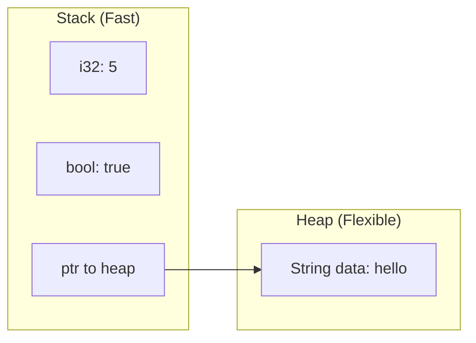
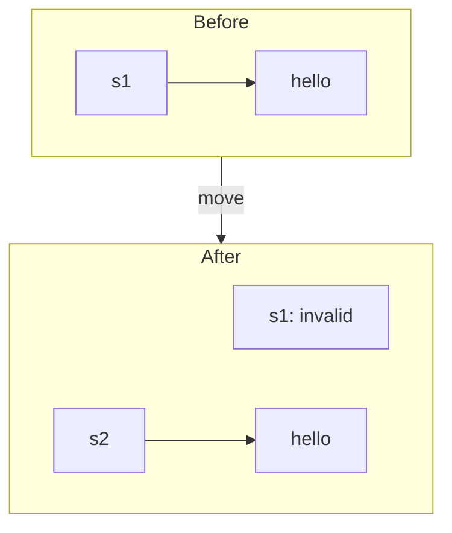
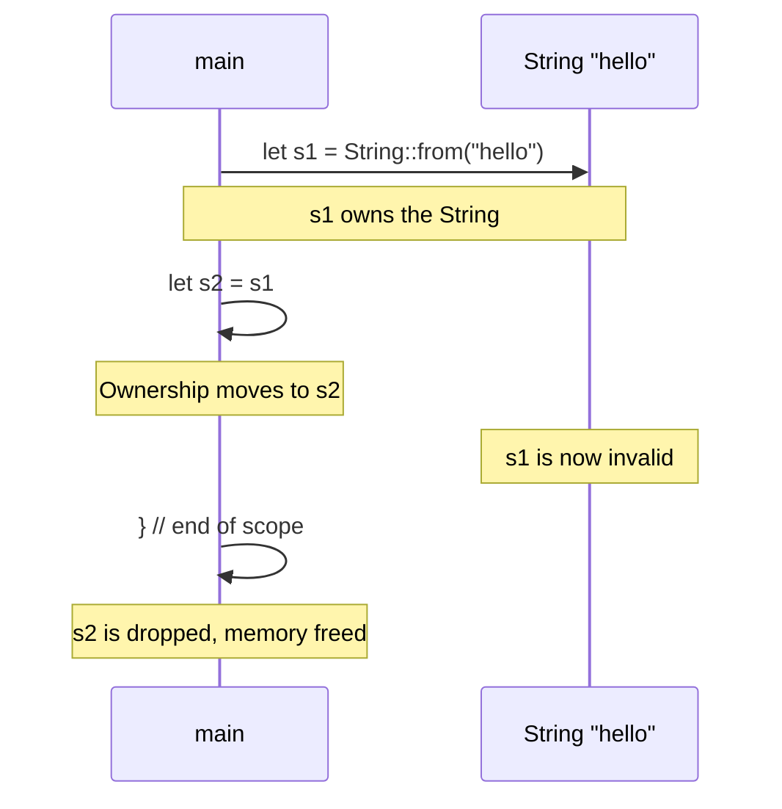

# Ownership

Ownership is Rust's most unique feature and enables memory safety without garbage collection. Understanding ownership is crucial for writing Rust code.

## The Three Rules of Ownership

1. Each value in Rust has an **owner**
2. There can only be **one owner** at a time
3. When the owner goes out of scope, the value is **dropped**

```rust
fn main() {
    {
        let s = String::from("hello");  // s is the owner
        // s is valid here
    }  // s goes out of scope, memory is freed
}
```

## Stack vs Heap



| Stack | Heap |
|-------|------|
| Fixed size, known at compile time | Dynamic size |
| Very fast allocation | Slower allocation |
| Automatically cleaned up | Managed by ownership |
| `i32`, `bool`, `char`, `[T; N]` | `String`, `Vec<T>`, `Box<T>` |

## Move Semantics

When you assign a heap value to another variable, ownership **moves**:

```rust
fn main() {
    let s1 = String::from("hello");
    let s2 = s1;  // s1's ownership moves to s2

    // println!("{}", s1);  // Error! s1 is no longer valid
    println!("{}", s2);     // Works!
}
```



## Copy Types

Simple types on the stack implement `Copy` and are copied, not moved:

```rust
fn main() {
    let x = 5;
    let y = x;  // x is copied to y

    println!("x = {}, y = {}", x, y);  // Both valid!
}
```

Types that implement `Copy`:
- All integer types (`i32`, `u64`, etc.)
- `bool`
- `char`
- Floating-point types (`f32`, `f64`)
- Tuples of `Copy` types: `(i32, bool)`
- Arrays of `Copy` types: `[i32; 5]`

{: .note }
If a type implements `Drop`, it cannot implement `Copy`.

## Clone

For heap types, use `clone()` to create a deep copy:

```rust
fn main() {
    let s1 = String::from("hello");
    let s2 = s1.clone();  // Deep copy

    println!("s1 = {}, s2 = {}", s1, s2);  // Both valid!
}
```

{: .warning }
`clone()` can be expensive for large data. Use it intentionally.

## Ownership and Functions

Passing a value to a function moves or copies it:

```rust
fn main() {
    let s = String::from("hello");
    takes_ownership(s);        // s moves into function
    // println!("{}", s);      // Error! s is invalid

    let x = 5;
    makes_copy(x);             // x is copied
    println!("x = {}", x);     // Works! x is still valid
}

fn takes_ownership(s: String) {
    println!("{}", s);
}  // s is dropped here

fn makes_copy(x: i32) {
    println!("{}", x);
}
```

## Return Values and Ownership

Functions can transfer ownership back:

```rust
fn main() {
    let s1 = gives_ownership();         // Ownership moves to s1

    let s2 = String::from("hello");
    let s3 = takes_and_gives_back(s2);  // s2 moves in, s3 gets ownership
}

fn gives_ownership() -> String {
    String::from("yours")  // Ownership moves to caller
}

fn takes_and_gives_back(s: String) -> String {
    s  // Ownership moves to caller
}
```

## The Problem with Move Semantics

This pattern is tedious:

```rust
fn main() {
    let s1 = String::from("hello");
    let (s2, len) = calculate_length(s1);  // Have to return s back!
    println!("'{}' has length {}", s2, len);
}

fn calculate_length(s: String) -> (String, usize) {
    let length = s.len();
    (s, length)  // Return string AND result
}
```

{: .tip }
The solution to this problem is **borrowing**, covered in the next chapter.

## Ownership in Data Structures

Structs own their fields:

```rust
struct User {
    name: String,    // User owns this String
    age: u32,
}

fn main() {
    let user = User {
        name: String::from("Alice"),
        age: 30,
    };

    let name = user.name;  // Partial move!
    // println!("{}", user.name);  // Error! name was moved
    println!("{}", user.age);       // Works! age wasn't moved
}
```

## Common Ownership Patterns

### Transfer Ownership In, Process, Transfer Out

```rust
fn process(mut data: Vec<i32>) -> Vec<i32> {
    data.push(42);
    data
}
```

### Create and Return

```rust
fn create_greeting(name: &str) -> String {
    format!("Hello, {}!", name)
}
```

### Take Ownership to Consume

```rust
impl Resource {
    fn close(self) {  // Takes ownership
        // Resource is dropped at end of function
    }
}
```

## Visualizing Ownership



## Summary

| Action | Stack Type | Heap Type |
|--------|------------|-----------|
| Assignment | Copy | Move |
| Function param | Copy | Move |
| To keep both | Just use | Clone |
| Return | Copy | Move |

## Mental Model

Think of ownership like physical objects:
- You can **give** something away (move)
- You can **lend** something (borrow - next chapter)
- You can **copy** something (clone)
- When you're done with something you own, it's destroyed

## Exercises

1. Predict which lines will compile:
   ```rust
   let s1 = String::from("hello");
   let s2 = s1;
   println!("{}", s1);
   println!("{}", s2);
   ```

2. Fix this code without changing the function signature:
   ```rust
   fn main() {
       let s = String::from("hello");
       print_string(s);
       println!("{}", s);
   }
   fn print_string(s: String) {
       println!("{}", s);
   }
   ```

## Next Steps

Learn about [Borrowing]() to use values without taking ownership.
