# Ownership

## Overview

**Ownership** is Rust's most distinctive feature—a system of rules that manages memory without garbage collection. It's the foundation for Rust's memory safety guarantees and eliminates entire classes of bugs at compile time.


**Key insight**: Ownership rules are checked at compile time, so there's no runtime overhead. If your code compiles, memory is managed correctly.

## When Ownership Matters

| Situation | What Happens | Your Action |
|-----------|--------------|-------------|
| Assigning heap data | Ownership moves | Clone if you need both |
| Passing to function | Ownership moves | Pass reference instead |
| Returning from function | Ownership transfers out | Just return the value |
| Going out of scope | Value is dropped | Nothing—automatic |
| Working with `Copy` types | Value is copied | Nothing—automatic |


## The Three Rules of Ownership

These rules are enforced at compile time:


```rust
fn main() {
    {                                    // Scope begins
        let s = String::from("hello");   // s is the owner
        // s is valid and usable here
    }                                    // Scope ends - s is dropped
    // s no longer exists, memory is freed
}
```

## Stack vs Heap: Memory Layout

Understanding where data lives is crucial for understanding ownership:

```mermaid
flowchart LR
    subgraph Stack["Stack (Fast, Fixed)"]
        direction TB
        S1["x: i32 = 5"]
        S2["y: bool = true"]
        S3["ptr ─────────────"]
        S4["len: 5"]
        S5["cap: 5"]
    end

    subgraph Heap["Heap (Flexible, Managed)"]
        H1["'h' 'e' 'l' 'l' 'o'"]
    end

    S3 --> H1
```



| Stack | Heap |
|-------|------|
| Fixed size, known at compile time | Dynamic size, can grow |
| Very fast allocation/deallocation | Slower allocation |
| Automatically cleaned up (LIFO) | Managed by ownership |
| `i32`, `bool`, `char`, `[T; N]`, tuples | `String`, `Vec<T>`, `Box<T>`, `HashMap` |

## Move Semantics

When you assign a heap value to another variable, ownership **moves**:

```rust
fn main() {
    let s1 = String::from("hello");
    let s2 = s1;  // Ownership MOVES from s1 to s2

    // println!("{}", s1);  // ❌ ERROR! s1 is no longer valid
    println!("{}", s2);     // ✓ Works! s2 is the owner
}
```



```mermaid
flowchart LR
    subgraph Before["Before: let s2 = s1"]
        A1["s1"] --> D1["ptr|len|cap"]
        D1 --> H1["'hello'"]
    end

    subgraph After["After: s1 is INVALID"]
        A2["s1 ❌"]
        A3["s2"] --> D2["ptr|len|cap"]
        D2 --> H2["'hello'"]
    end

    Before -->|"Move"| After

    style A2 fill:#FFB6C1
```

### Why Move Instead of Copy?

```mermaid
flowchart TD
    A["If both s1 and s2 pointed<br/>to same heap data..."] --> B["Both go out of scope"]
    B --> C["Double free! 💥"]
    C --> D["Memory corruption"]

    E["With move semantics..."] --> F["Only s2 owns the data"]
    F --> G["Only s2 drops it"]
    G --> H["Memory safe ✓"]

    style C fill:#FFB6C1
    style H fill:#90EE90
```



## Copy Types

Simple stack-only types implement `Copy` and are copied, not moved:

```rust
fn main() {
    let x = 5;
    let y = x;  // x is COPIED to y (not moved)

    println!("x = {}, y = {}", x, y);  // ✓ Both valid!
}
```

### What Implements Copy?

```mermaid
flowchart TD
    A{Is it Copy?} -->|"Integers"| Y["i8, i16, i32, i64, i128<br/>u8, u16, u32, u64, u128 ✓"]
    A -->|"Floats"| Y2["f32, f64 ✓"]
    A -->|"Boolean"| Y3["bool ✓"]
    A -->|"Character"| Y4["char ✓"]
    A -->|"Tuples of Copy"| Y5["(i32, bool) ✓"]
    A -->|"Arrays of Copy"| Y6["[i32; 5] ✓"]
    A -->|"Has heap data"| N["String, Vec ✗"]
    A -->|"Implements Drop"| N2["Custom cleanup ✗"]

    style Y fill:#90EE90
    style Y2 fill:#90EE90
    style Y3 fill:#90EE90
    style Y4 fill:#90EE90
    style Y5 fill:#90EE90
    style Y6 fill:#90EE90
    style N fill:#FFB6C1
    style N2 fill:#FFB6C1
```



{: .note }
If a type implements `Drop` (custom cleanup), it cannot implement `Copy`. The two are mutually exclusive.

## Clone: Explicit Deep Copy

For heap types, use `clone()` to create a deep copy:

```rust
fn main() {
    let s1 = String::from("hello");
    let s2 = s1.clone();  // Deep copy - both own separate data

    println!("s1 = {}, s2 = {}", s1, s2);  // ✓ Both valid!
}
```


{: .warning }
`clone()` copies all heap data, which can be expensive for large structures. Use it intentionally.

## Ownership and Functions

Passing a value to a function moves or copies it, just like assignment:

```rust
fn main() {
    let s = String::from("hello");
    takes_ownership(s);        // s is MOVED into the function
    // println!("{}", s);      // ❌ ERROR! s is invalid

    let x = 5;
    makes_copy(x);             // x is COPIED (i32 is Copy)
    println!("x = {}", x);     // ✓ Works! x is still valid
}

fn takes_ownership(s: String) {
    println!("{}", s);
}  // s is dropped here - memory freed

fn makes_copy(x: i32) {
    println!("{}", x);
}  // x goes out of scope, nothing special happens
```



```mermaid
sequenceDiagram
    participant main
    participant takes_ownership
    participant makes_copy

    Note over main: let s = String::from("hello")
    main->>takes_ownership: s (ownership moves)
    Note over main: s is now INVALID
    Note over takes_ownership: s dropped at end

    Note over main: let x = 5
    main->>makes_copy: x (value copied)
    Note over main: x still valid ✓
```

## Return Values and Ownership

Functions can transfer ownership back to the caller:

```rust
fn main() {
    let s1 = gives_ownership();         // Ownership comes to s1
    println!("{}", s1);                  // s1 owns "yours"

    let s2 = String::from("hello");
    let s3 = takes_and_gives_back(s2);  // s2 moves in, result comes to s3
    // s2 is invalid, s3 owns the string
}

fn gives_ownership() -> String {
    String::from("yours")  // Ownership moves to caller
}

fn takes_and_gives_back(s: String) -> String {
    s  // Just return it - ownership moves to caller
}
```


## The Problem: Tedious Ownership Transfers

Sometimes you want to use a value without taking ownership:

```rust
fn main() {
    let s1 = String::from("hello");
    let (s2, len) = calculate_length(s1);  // Tedious: return the string back
    println!("'{}' has length {}", s2, len);
}

fn calculate_length(s: String) -> (String, usize) {
    let length = s.len();
    (s, length)  // Have to return both the string AND the result
}
```

{: .tip }
This is where **borrowing** comes in! See the next chapter to learn how references solve this problem elegantly.

## Ownership in Data Structures

Structs own their fields:

```rust
struct User {
    name: String,    // User owns this String
    age: u32,        // And this integer
}

fn main() {
    let user = User {
        name: String::from("Alice"),
        age: 30,
    };

    let name = user.name;  // Partial move! name field moved out
    // println!("{}", user.name);  // ❌ ERROR! name was moved
    println!("{}", user.age);       // ✓ Works! age wasn't moved
}
```


## Common Ownership Patterns

### Pattern 1: Transfer In, Process, Transfer Out

```rust
fn process(mut data: Vec<i32>) -> Vec<i32> {
    data.push(42);
    data.sort();
    data  // Transfer ownership back
}
```

### Pattern 2: Create and Return

```rust
fn create_greeting(name: &str) -> String {
    format!("Hello, {}!", name)  // New String, caller owns it
}
```

### Pattern 3: Take Ownership to Consume

```rust
impl Connection {
    fn close(self) {  // Takes ownership - self consumed
        // Connection is dropped at end
        // Prevents use after close!
    }
}
```

### Pattern 4: Builder Pattern

```rust
impl StringBuilder {
    fn append(mut self, s: &str) -> Self {
        self.buffer.push_str(s);
        self  // Return ownership for chaining
    }

    fn build(self) -> String {
        self.buffer  // Consume builder, return result
    }
}

// Usage: ownership flows through chain
let result = StringBuilder::new()
    .append("Hello")
    .append(" World")
    .build();
```

## Visualizing Ownership Flow


## Common Mistakes and Fixes

### Mistake 1: Using After Move

```rust
// ❌ WRONG
let s1 = String::from("hello");
let s2 = s1;
println!("{}", s1);  // Error: value moved

// ✓ FIX: Clone if you need both
let s1 = String::from("hello");
let s2 = s1.clone();
println!("{} {}", s1, s2);  // Both valid

// ✓ BETTER: Use references (borrowing)
let s1 = String::from("hello");
let s2 = &s1;  // Borrow, don't move
println!("{} {}", s1, s2);
```

### Mistake 2: Returning Reference to Local

```rust
// ❌ WRONG
fn create() -> &String {
    let s = String::from("hello");
    &s  // Error: s is dropped, reference would dangle
}

// ✓ FIX: Return owned value
fn create() -> String {
    String::from("hello")  // Ownership transfers to caller
}
```

## Mental Model

Think of ownership like physical objects:


| Action | Physical | Rust |
|--------|----------|------|
| Give away | Hand over book | `let s2 = s1;` (move) |
| Lend | Let friend read | `let r = &s1;` (borrow) |
| Copy | Photocopy document | `let s2 = s1.clone();` |
| Destroy | Throw in trash | Value goes out of scope |

## Summary


| Concept | Stack Types | Heap Types |
|---------|-------------|------------|
| Assignment | Copy | Move |
| Function param | Copy | Move |
| Need both values | Just use | Clone |
| Want to share | Just use | Borrow |

## Exercises

1. Predict which lines will compile:
   ```rust
   let s1 = String::from("hello");
   let s2 = s1;
   println!("{}", s1);
   println!("{}", s2);
   ```

2. Fix this code without changing the function signature:
   ```rust
   fn main() {
       let s = String::from("hello");
       print_string(s);
       println!("{}", s);
   }
   fn print_string(s: String) {
       println!("{}", s);
   }
   ```

3. Explain why `Vec<i32>` doesn't implement `Copy` even though `i32` does.

## See Also

- [Example Code](https://github.com/MichaelTien8901/rust-guide-tutorial/tree/main/examples/part2/ownership)

## Next Steps

Learn about [Borrowing]() to use values without taking ownership.
