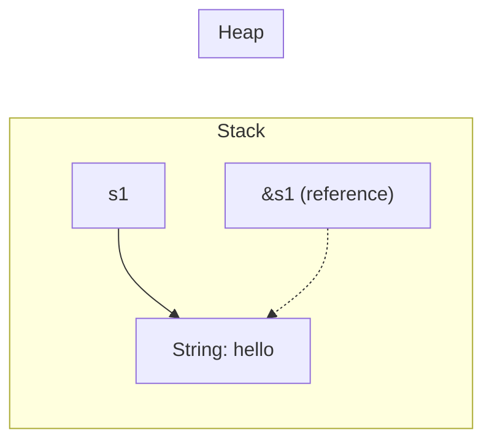
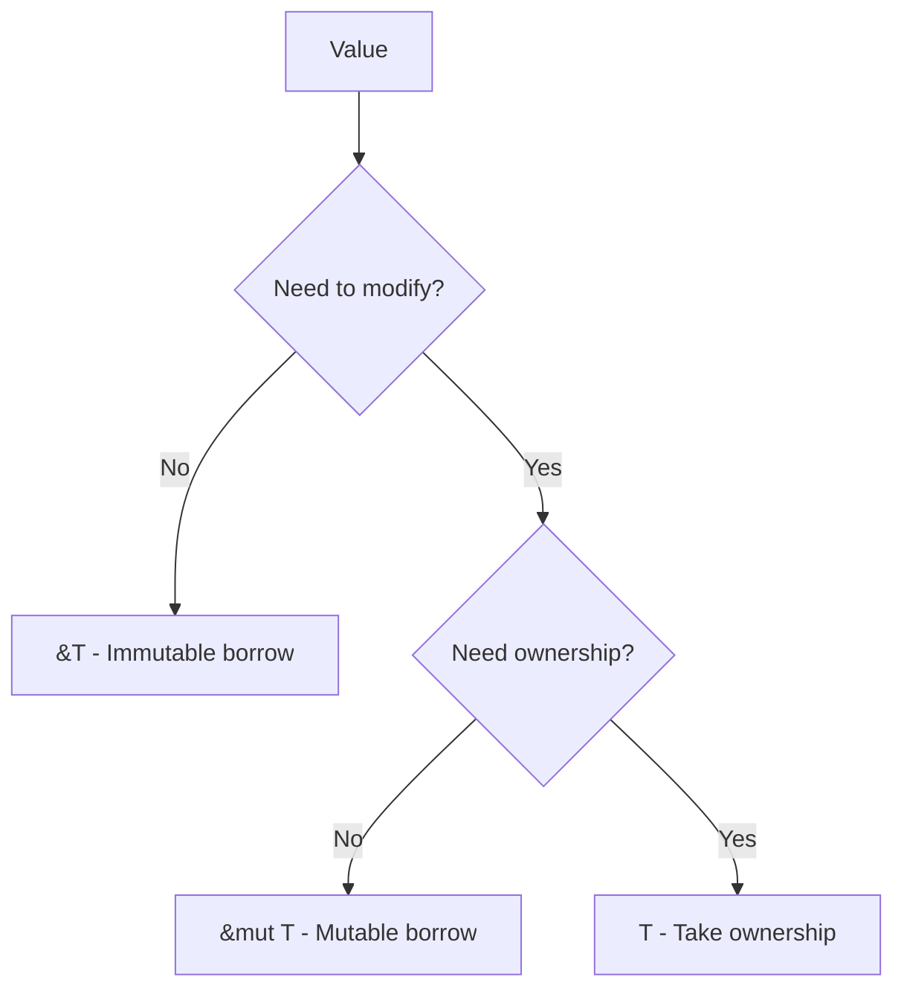

# Borrowing and References

Borrowing lets you use a value without taking ownership. References are how you borrow.

## References

A reference is like a pointer that's guaranteed to be valid:

```rust
fn main() {
    let s1 = String::from("hello");
    let len = calculate_length(&s1);  // Borrow s1
    println!("'{}' has length {}", s1, len);  // s1 still valid!
}

fn calculate_length(s: &String) -> usize {
    s.len()
}  // s goes out of scope, but doesn't drop what it refers to
```



## Borrowing Rules

Rust enforces these rules at compile time:

1. At any given time, you can have **either**:
   - One mutable reference, **OR**
   - Any number of immutable references
2. References must always be **valid**

## Immutable References

Multiple immutable borrows are allowed:

```rust
fn main() {
    let s = String::from("hello");

    let r1 = &s;  // OK
    let r2 = &s;  // OK - multiple immutable refs allowed

    println!("{} and {}", r1, r2);
}
```

## Mutable References

Only one mutable borrow at a time:

```rust
fn main() {
    let mut s = String::from("hello");

    let r1 = &mut s;
    // let r2 = &mut s;  // Error! Can't have two mutable refs

    r1.push_str(", world");
    println!("{}", r1);
}
```

## Combining Mutable and Immutable

Can't mix mutable and immutable borrows:

```rust
fn main() {
    let mut s = String::from("hello");

    let r1 = &s;      // OK - immutable borrow
    let r2 = &s;      // OK - another immutable borrow
    // let r3 = &mut s;  // Error! Can't borrow as mutable while immutable refs exist

    println!("{} and {}", r1, r2);
    // r1 and r2 are no longer used after this point

    let r3 = &mut s;  // OK now - previous refs are done
    println!("{}", r3);
}
```

{: .note }
Rust's borrow checker tracks when references are **last used**, not just when they go out of scope. This is called Non-Lexical Lifetimes (NLL).

## Why These Rules?

The borrowing rules prevent:

### Data Races

```rust
// This would be a data race in other languages
let mut data = vec![1, 2, 3];

let r1 = &data;
data.push(4);       // Error! Can't mutate while borrowed
println!("{:?}", r1);
```

### Dangling References

```rust
// This would create a dangling pointer
fn dangle() -> &String {      // Error!
    let s = String::from("hello");
    &s  // s is dropped, reference would be invalid
}
```

## The `ref` Keyword

In patterns, `ref` creates a reference:

```rust
fn main() {
    let tuple = (String::from("hello"), 5);

    // Without ref - would move the String
    // let (s, n) = tuple;

    // With ref - borrows instead
    let (ref s, n) = tuple;
    println!("{}, {}", s, n);
    println!("{:?}", tuple);  // tuple still valid
}
```

## Reborrowing

You can create a new borrow from an existing one:

```rust
fn main() {
    let mut s = String::from("hello");
    let r1 = &mut s;

    // Reborrow - r1 temporarily gives up access
    modify(r1);  // Implicit reborrow: &mut *r1
    r1.push_str("!");  // r1 usable again
}

fn modify(s: &mut String) {
    s.push_str(" world");
}
```

## Slices are Borrows

Slices are a kind of reference:

```rust
fn main() {
    let s = String::from("hello world");

    let hello = &s[0..5];   // Borrow part of s
    let world = &s[6..11];  // Borrow another part

    println!("{} {}", hello, world);
}
```

## Common Patterns

### Borrow in Function Parameters

```rust
// Take a reference instead of ownership
fn print_length(s: &String) {
    println!("Length: {}", s.len());
}

// Even better: take &str for flexibility
fn print_length_better(s: &str) {
    println!("Length: {}", s.len());
}
```

### Return References (with Lifetimes)

```rust
fn first_word(s: &str) -> &str {
    match s.find(' ') {
        Some(i) => &s[..i],
        None => s,
    }
}
```

### Mutable Borrow for Modification

```rust
fn append_world(s: &mut String) {
    s.push_str(" world");
}

fn main() {
    let mut greeting = String::from("hello");
    append_world(&mut greeting);
    println!("{}", greeting);  // "hello world"
}
```

## Reference Comparison

| Type | Syntax | Can Mutate | Multiple Allowed |
|------|--------|------------|------------------|
| Owned | `T` | If `mut` | N/A |
| Immutable ref | `&T` | No | Yes |
| Mutable ref | `&mut T` | Yes | No |

## Dereferencing

Use `*` to access the value behind a reference:

```rust
fn main() {
    let x = 5;
    let r = &x;

    // Must dereference to compare or use the value
    assert_eq!(5, *r);

    // But many operations auto-deref
    println!("{}", r);  // Auto-derefs for Display
}
```

## Summary



## Exercises

1. Fix this code:
   ```rust
   fn main() {
       let mut s = String::from("hello");
       let r1 = &s;
       let r2 = &mut s;
       println!("{}, {}", r1, r2);
   }
   ```

2. Why doesn't this compile?
   ```rust
   fn main() {
       let r;
       {
           let x = 5;
           r = &x;
       }
       println!("{}", r);
   }
   ```

## Next Steps

Learn about [Lifetimes]() to understand how Rust tracks reference validity.
