# Borrowing and References

## Overview

**Borrowing** lets you use a value without taking ownership. Instead of moving data, you create a **reference** that points to it. This enables sharing data safely while Rust's borrow checker enforces memory safety at compile time.


**Key insight**: References are like pointers, but the compiler guarantees they're always valid—no null pointers, no dangling references, no data races.

## When to Use Borrowing

| Situation | Use | Why |
|-----------|-----|-----|
| Read data without owning | `&T` | Share without transfer |
| Modify data without owning | `&mut T` | Temporary exclusive access |
| Pass large data to function | `&T` | Avoid expensive copy/move |
| Return data from struct | `&T` | Share without cloning |
| Store reference temporarily | `&T` with lifetime | Limited-time access |


## The Two Borrowing Rules

Rust enforces these at compile time:

```mermaid
flowchart TD
    subgraph "Rule 1: Exclusivity"
        R1["At any time, EITHER:<br/>• One mutable reference<br/>• Any number of immutable references"]
    end

    subgraph "Rule 2: Validity"
        R2["References must always<br/>point to valid data"]
    end

    R1 --> C["No data races"]
    R2 --> D["No dangling pointers"]

    style C fill:#90EE90
    style D fill:#90EE90
```



## Immutable References (`&T`)

Read-only access—multiple allowed simultaneously:

```rust
fn main() {
    let s = String::from("hello");

    let r1 = &s;  // ✓ First immutable borrow
    let r2 = &s;  // ✓ Second immutable borrow - OK!
    let r3 = &s;  // ✓ Third one - still OK!

    println!("{}, {}, {}", r1, r2, r3);  // All can read
    println!("{}", s);  // Owner can still read too
}
```


### References in Function Parameters

```rust
fn main() {
    let s = String::from("hello");
    let len = calculate_length(&s);  // Borrow s
    println!("'{}' has length {}", s, len);  // s still valid!
}

fn calculate_length(s: &String) -> usize {
    s.len()
}  // s goes out of scope, but doesn't drop what it refers to
```



```mermaid
sequenceDiagram
    participant main
    participant calculate_length

    Note over main: s owns "hello"
    main->>calculate_length: &s (borrow)
    Note over calculate_length: s: &String
    calculate_length->>calculate_length: s.len() = 5
    calculate_length-->>main: return 5
    Note over main: s still valid ✓
```

## Mutable References (`&mut T`)

Exclusive access for modification—only one at a time:

```rust
fn main() {
    let mut s = String::from("hello");

    let r1 = &mut s;  // ✓ Mutable borrow
    r1.push_str(", world");

    // let r2 = &mut s;  // ❌ ERROR! Can't have two mutable refs

    println!("{}", r1);  // "hello, world"
}
```


### Why Only One Mutable Reference?

```mermaid
flowchart TD
    subgraph "Without restriction"
        A1["r1 = &mut data"]
        A2["r2 = &mut data"]
        A1 --> B1["r1 modifies"]
        A2 --> B2["r2 modifies"]
        B1 --> C1["Data race! 💥"]
        B2 --> C1
    end

    subgraph "With Rust's rules"
        D1["r1 = &mut data"]
        D2["r2 = &mut data ❌ BLOCKED"]
        D1 --> E1["Only r1 modifies"]
        E1 --> F1["Safe ✓"]
    end

    style C1 fill:#FFB6C1
    style F1 fill:#90EE90
```



## Mixing Mutable and Immutable

You cannot have a mutable reference while immutable references exist:

```rust
fn main() {
    let mut s = String::from("hello");

    let r1 = &s;      // ✓ Immutable borrow
    let r2 = &s;      // ✓ Another immutable borrow
    // let r3 = &mut s;  // ❌ ERROR! Can't borrow as mutable

    println!("{} and {}", r1, r2);
    // r1 and r2 are no longer used after this point

    let r3 = &mut s;  // ✓ NOW it's OK - previous refs are done
    r3.push_str(" world");
    println!("{}", r3);
}
```

### Non-Lexical Lifetimes (NLL)

Rust tracks when references are **last used**, not just scope boundaries:

```mermaid
flowchart TD
    A["let r1 = &s"] --> B["let r2 = &s"]
    B --> C["println!(r1, r2)"]
    C --> D["r1, r2 no longer used"]
    D --> E["let r3 = &mut s ✓"]

    style D fill:#90EE90
    style E fill:#90EE90
```



## What Borrowing Prevents

### Data Races

```rust
let mut data = vec![1, 2, 3];

let r1 = &data;
// data.push(4);    // ❌ ERROR! Can't mutate while borrowed
println!("{:?}", r1);

// After r1 is done:
data.push(4);       // ✓ OK now
```

### Dangling References

```rust
// ❌ WON'T COMPILE
fn dangle() -> &String {
    let s = String::from("hello");
    &s  // s is dropped here, reference would be invalid!
}

// ✓ SOLUTION: Return owned value
fn no_dangle() -> String {
    String::from("hello")  // Ownership transfers to caller
}
```


## Dereferencing

Use `*` to access the value behind a reference:

```rust
fn main() {
    let x = 5;
    let r = &x;

    // Explicit dereference
    assert_eq!(5, *r);

    // Many operations auto-deref
    println!("{}", r);  // Auto-derefs for Display

    // Mutable dereference
    let mut y = 10;
    let r_mut = &mut y;
    *r_mut += 5;
    println!("{}", y);  // 15
}
```

## Slices: References to Portions

Slices are references to contiguous sequences:

```rust
fn main() {
    let s = String::from("hello world");

    let hello = &s[0..5];   // Slice of first 5 bytes
    let world = &s[6..11];  // Slice of bytes 6-10

    println!("{} {}", hello, world);  // "hello world"
}
```


### String Slices vs String

```rust
// Prefer &str over &String for parameters
fn print_length(s: &str) {  // Accepts both String and &str
    println!("Length: {}", s.len());
}

fn main() {
    let owned = String::from("hello");
    let literal = "world";

    print_length(&owned);   // &String coerces to &str
    print_length(literal);  // &str directly
}
```

## The `ref` Keyword

In patterns, `ref` creates a reference (opposite of `&` in expressions):

```rust
fn main() {
    let tuple = (String::from("hello"), 5);

    // Without ref - would move the String
    // let (s, n) = tuple;  // s takes ownership

    // With ref - borrows instead
    let (ref s, n) = tuple;
    println!("{}, {}", s, n);
    println!("{:?}", tuple);  // tuple still valid!
}
```

## Reborrowing

Create a new borrow from an existing one:

```rust
fn main() {
    let mut s = String::from("hello");
    let r1 = &mut s;

    // Reborrow - r1 temporarily gives up access
    modify(r1);  // Implicit reborrow: &mut *r1

    // r1 usable again after modify returns
    r1.push_str("!");
    println!("{}", r1);
}

fn modify(s: &mut String) {
    s.push_str(" world");
}
```

## Common Patterns

### Pattern 1: Borrow for Reading

```rust
fn analyze(data: &[i32]) -> (i32, i32, f64) {
    let sum: i32 = data.iter().sum();
    let max = *data.iter().max().unwrap_or(&0);
    let avg = sum as f64 / data.len() as f64;
    (sum, max, avg)
}
```

### Pattern 2: Mutable Borrow for Modification

```rust
fn append_greeting(s: &mut String, name: &str) {
    s.push_str("Hello, ");
    s.push_str(name);
    s.push('!');
}

fn main() {
    let mut message = String::new();
    append_greeting(&mut message, "World");
    println!("{}", message);  // "Hello, World!"
}
```

### Pattern 3: Return Reference from Method

```rust
struct User {
    name: String,
    email: String,
}

impl User {
    fn name(&self) -> &str {  // Borrows from self
        &self.name
    }

    fn set_name(&mut self, name: String) {
        self.name = name;
    }
}
```

### Pattern 4: Multiple Immutable, Then Mutable

```rust
fn main() {
    let mut data = vec![3, 1, 4, 1, 5];

    // Phase 1: Read-only operations
    let max = data.iter().max().copied();
    let sum: i32 = data.iter().sum();
    println!("Max: {:?}, Sum: {}", max, sum);

    // Phase 2: Modification (after immutable refs done)
    data.sort();
    data.push(9);
    println!("Sorted: {:?}", data);
}
```

## Reference Comparison Table

| Type | Syntax | Mutate? | Multiple? | Coexist with &mut? |
|------|--------|---------|-----------|---------------------|
| Owned | `T` | If `mut` | N/A | N/A |
| Immutable ref | `&T` | No | Yes | No |
| Mutable ref | `&mut T` | Yes | No | No |

## Common Mistakes and Fixes

### Mistake 1: Mutable Borrow While Immutable Exists

```rust
// ❌ WON'T COMPILE
let mut v = vec![1, 2, 3];
let first = &v[0];      // Immutable borrow
v.push(4);              // Tries to mutate - ERROR!
println!("{}", first);

// ✓ FIX: Complete immutable use first
let mut v = vec![1, 2, 3];
let first = v[0];       // Copy the value
v.push(4);              // Now safe to mutate
println!("{}", first);
```

### Mistake 2: Returning Reference to Local

```rust
// ❌ WON'T COMPILE
fn get_str() -> &str {
    let s = String::from("hello");
    &s  // s dropped, reference invalid
}

// ✓ FIX: Return owned or use static
fn get_str_owned() -> String {
    String::from("hello")
}

fn get_str_static() -> &'static str {
    "hello"  // String literal lives forever
}
```

### Mistake 3: Multiple Mutable Borrows

```rust
// ❌ WON'T COMPILE
let mut s = String::from("hello");
let r1 = &mut s;
let r2 = &mut s;  // ERROR! Two mutable refs
r1.push_str(" world");

// ✓ FIX: Sequential borrows
let mut s = String::from("hello");
{
    let r1 = &mut s;
    r1.push_str(" world");
}  // r1 ends here
let r2 = &mut s;  // Now OK
r2.push('!');
```

## Borrowing Decision Flowchart


## Summary


| Concept | Description |
|---------|-------------|
| `&T` | Immutable reference - can read |
| `&mut T` | Mutable reference - can modify |
| `*r` | Dereference - access value |
| `&slice[..]` | Slice - reference to portion |
| NLL | Compiler tracks actual usage, not just scope |

## Exercises

1. Fix this code:
   ```rust
   fn main() {
       let mut s = String::from("hello");
       let r1 = &s;
       let r2 = &mut s;
       println!("{}, {}", r1, r2);
   }
   ```

2. Why doesn't this compile?
   ```rust
   fn main() {
       let r;
       {
           let x = 5;
           r = &x;
       }
       println!("{}", r);
   }
   ```

3. Rewrite to use borrowing instead of cloning:
   ```rust
   fn process(data: Vec<i32>) -> Vec<i32> {
       println!("Sum: {}", data.iter().sum::<i32>());
       data
   }
   ```

## Next Steps

Learn about [Lifetimes]() to understand how Rust tracks reference validity.
