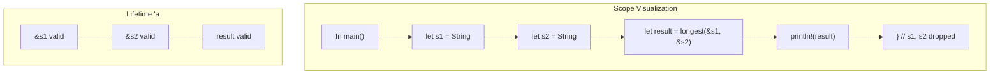

# Lifetimes

Lifetimes are Rust's way of ensuring references are always valid. They're part of the type system but often inferred automatically.

## What Are Lifetimes?

A lifetime is the scope during which a reference is valid:

```rust
fn main() {
    let r;                // ---------+-- 'a
                          //          |
    {                     //          |
        let x = 5;        // -+-- 'b  |
        r = &x;           //  |       |
    }                     // -+       |
                          //          |
    // println!("{}", r); // Error! x doesn't live long enough
}                         // ---------+
```

{: .important }
The borrow checker ensures references don't outlive the data they refer to.

## Lifetime Annotations

When the compiler can't infer lifetimes, you provide explicit annotations:

```rust
// 'a is a lifetime parameter
fn longest<'a>(x: &'a str, y: &'a str) -> &'a str {
    if x.len() > y.len() { x } else { y }
}
```

### Syntax

- `'a` - Lifetime parameter (by convention, short lowercase names)
- `&'a T` - Reference with lifetime `'a`
- `&'a mut T` - Mutable reference with lifetime `'a`

## Why Lifetimes Are Needed

Without annotations, the compiler can't know which input the return value comes from:

```rust
// Error: missing lifetime specifier
fn longest(x: &str, y: &str) -> &str {
    if x.len() > y.len() { x } else { y }
}
```

With annotations, we tell the compiler the return value lives as long as both inputs:

```rust
fn longest<'a>(x: &'a str, y: &'a str) -> &'a str {
    if x.len() > y.len() { x } else { y }
}

fn main() {
    let s1 = String::from("long");
    let s2 = String::from("longer string");

    let result = longest(&s1, &s2);
    println!("Longest: {}", result);
}
```

## Lifetime Elision Rules

The compiler applies three rules to infer lifetimes:

1. **Each parameter gets its own lifetime**
   ```rust
   fn foo(x: &str, y: &str)
   // becomes
   fn foo<'a, 'b>(x: &'a str, y: &'b str)
   ```

2. **If one input lifetime, output gets that lifetime**
   ```rust
   fn foo(x: &str) -> &str
   // becomes
   fn foo<'a>(x: &'a str) -> &'a str
   ```

3. **If `&self` or `&mut self`, output gets self's lifetime**
   ```rust
   impl Foo {
       fn bar(&self, x: &str) -> &str
       // becomes
       fn bar<'a, 'b>(&'a self, x: &'b str) -> &'a str
   }
   ```

## Common Lifetime Patterns

### Single Input Reference

```rust
// Lifetime elided - compiler applies rule 2
fn first_word(s: &str) -> &str {
    &s[..s.find(' ').unwrap_or(s.len())]
}
```

### Multiple Input References

```rust
// Need explicit annotation - compiler can't decide
fn longest<'a>(x: &'a str, y: &'a str) -> &'a str {
    if x.len() > y.len() { x } else { y }
}
```

### Struct with References

```rust
// Struct that holds a reference needs lifetime parameter
struct Excerpt<'a> {
    part: &'a str,
}

fn main() {
    let novel = String::from("Call me Ishmael. Some years ago...");
    let first_sentence = novel.split('.').next().unwrap();
    let excerpt = Excerpt { part: first_sentence };
}
```

### Methods with Lifetimes

```rust
impl<'a> Excerpt<'a> {
    fn level(&self) -> i32 {
        3  // No reference in return, no annotation needed
    }

    fn announce(&self, announcement: &str) -> &str {
        println!("Attention: {}", announcement);
        self.part  // Returns reference from self, rule 3 applies
    }
}
```

## The `'static` Lifetime

`'static` means the reference lives for the entire program:

```rust
// String literals have 'static lifetime
let s: &'static str = "I live forever!";

// Owned data can be leaked to 'static
let leaked: &'static str = Box::leak(Box::new(String::from("leaked")));
```

{: .warning }
Don't use `'static` to "fix" lifetime errors. It's usually the wrong solution.

## Multiple Lifetime Parameters

When lifetimes are independent:

```rust
fn foo<'a, 'b>(x: &'a str, y: &'b str) -> &'a str {
    x  // Only x's lifetime matters for return
}
```

## Lifetime Bounds

Require one lifetime to outlive another:

```rust
// 'b must live at least as long as 'a
fn foo<'a, 'b: 'a>(x: &'a str, y: &'b str) -> &'a str {
    if x.len() > 0 { x } else { y }
}
```

## Lifetimes with Generics

Combine lifetimes with type parameters:

```rust
use std::fmt::Display;

fn longest_with_announcement<'a, T>(
    x: &'a str,
    y: &'a str,
    ann: T,
) -> &'a str
where
    T: Display,
{
    println!("Announcement: {}", ann);
    if x.len() > y.len() { x } else { y }
}
```

## Visualizing Lifetimes



## Common Mistakes

### Returning Reference to Local Variable

```rust
// Error: cannot return reference to local variable
fn create_string() -> &String {
    let s = String::from("hello");
    &s  // s is dropped at end of function!
}

// Fix: return owned value
fn create_string() -> String {
    String::from("hello")
}
```

### Conflicting Lifetimes

```rust
// Error: lifetimes may not be compatible
fn longest<'a, 'b>(x: &'a str, y: &'b str) -> &'a str {
    if x.len() > y.len() { x } else { y }  // y has different lifetime!
}

// Fix: use same lifetime
fn longest<'a>(x: &'a str, y: &'a str) -> &'a str {
    if x.len() > y.len() { x } else { y }
}
```

## Summary

| Concept | Example |
|---------|---------|
| Lifetime parameter | `'a` |
| Reference with lifetime | `&'a str` |
| Multiple lifetimes | `<'a, 'b>` |
| Static lifetime | `&'static str` |
| Lifetime bound | `'b: 'a` |
| Struct with lifetime | `struct Foo<'a> { x: &'a str }` |

## Mental Model

Think of lifetimes as:
- **Labels** that connect references to the data they borrow
- **Constraints** that the compiler checks
- **Documentation** about how long references are valid

## Exercises

1. Add lifetime annotations to make this compile:
   ```rust
   fn first_word(s: &str) -> &str {
       &s[..s.find(' ').unwrap_or(s.len())]
   }
   ```

2. Why doesn't this compile?
   ```rust
   struct Holder<'a> {
       value: &'a str,
   }
   fn create() -> Holder {
       let s = String::from("hello");
       Holder { value: &s }
   }
   ```

## Next Steps

Learn about [Structs]() to create custom data types.
