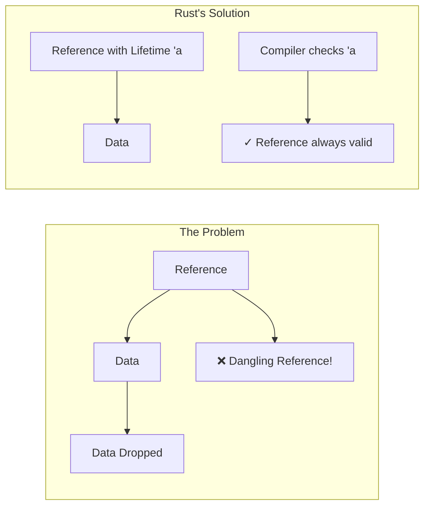
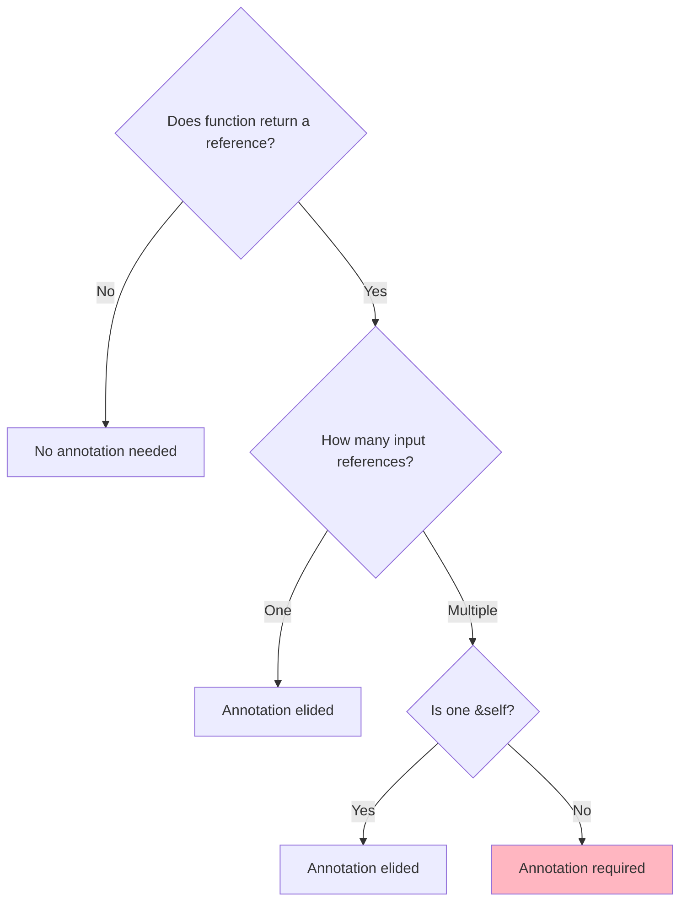
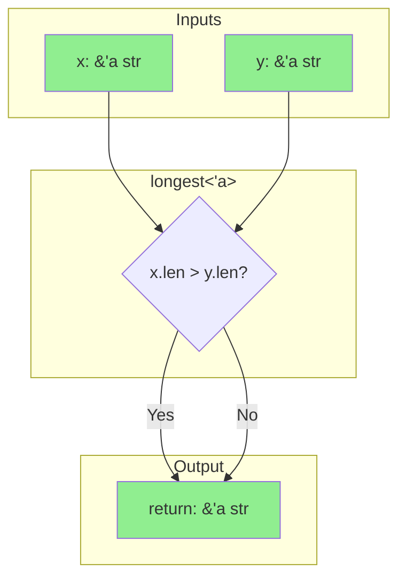
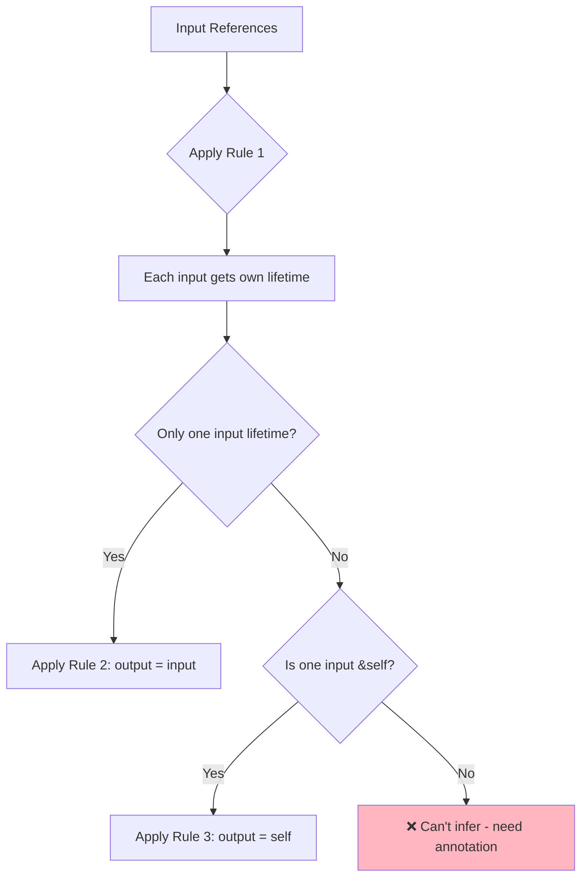
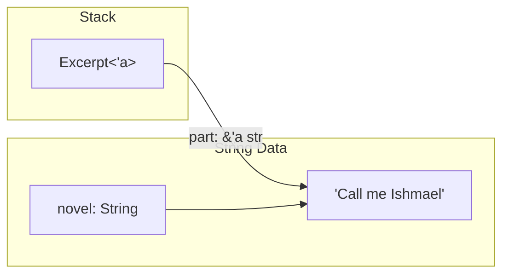
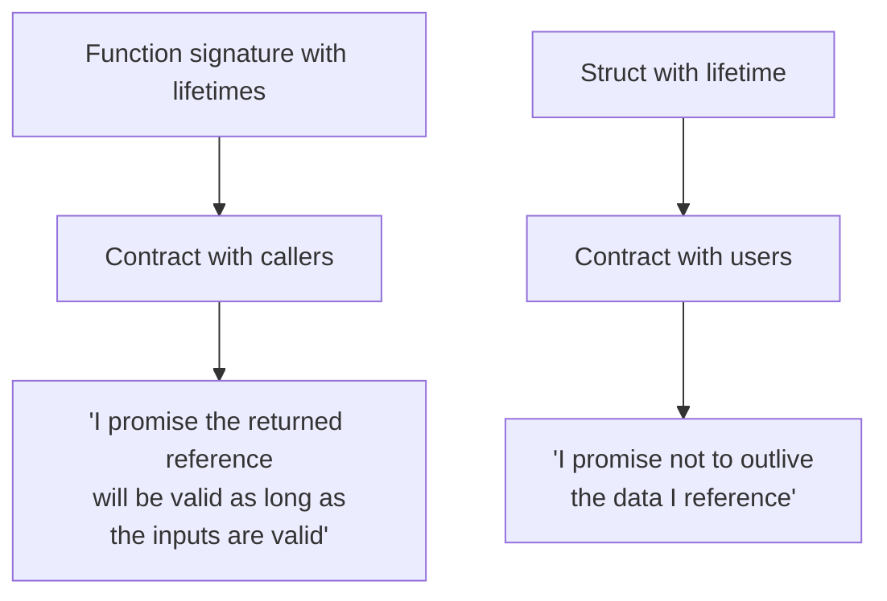

# Lifetimes

## Overview

**Lifetimes** are Rust's way of ensuring references are always valid. Every reference in Rust has a lifetime—the scope during which that reference is valid. Most of the time, lifetimes are implicit and inferred, just like types.



**Key insight**: Lifetimes don't change how long data lives—they describe relationships between references that the compiler can verify.

## When Do You Need Lifetime Annotations?

| Situation | Annotation Needed? |
|-----------|-------------------|
| Function with one input reference | No (elided) |
| Function with multiple input references returning a reference | Yes |
| Struct holding a reference | Yes |
| Methods returning `&self` data | No (elided) |
| Generic functions with references | Usually yes |



## Understanding Lifetimes Visually

A lifetime is simply the scope where a reference is valid:

```rust
fn main() {
    let r;                // ---------+-- 'a starts
                          //          |
    {                     //          |
        let x = 5;        // -+-- 'b  |
        r = &x;           //  |       |  'b is shorter than 'a
    }                     // -+       |  x dropped here
                          //          |
    // println!("{}", r); // Error!   |  r would be dangling
}                         // ---------+
```



```mermaid
gantt
    title Lifetime Visualization
    dateFormat X
    axisFormat %s

    section Variables
    x exists       :a, 0, 3
    r exists       :b, 0, 5

    section References
    r = &x valid   :crit, c, 2, 3
    r dangling     :done, d, 3, 5
```

{: .important }
The borrow checker ensures no reference outlives the data it refers to.

## Lifetime Annotation Syntax

Lifetime annotations describe relationships—they don't change how long values live.

```rust
&i32        // A reference (lifetime inferred)
&'a i32     // A reference with explicit lifetime 'a
&'a mut i32 // A mutable reference with lifetime 'a
```

### Reading Lifetime Annotations

```rust
fn longest<'a>(x: &'a str, y: &'a str) -> &'a str
//        ^^^    ^^          ^^           ^^
//         │      │           │            │
//         │      └───────────┴────────────┘
//         │         All these share lifetime 'a
//         │
//         └── Declare lifetime parameter
```

**Translation**: "The returned reference will be valid as long as **both** input references are valid."

## The `longest` Function: A Deep Dive

### The Problem

```rust
// Won't compile! Which input does the return come from?
fn longest(x: &str, y: &str) -> &str {
    if x.len() > y.len() { x } else { y }
}
```

The compiler doesn't know if the return value comes from `x` or `y`, so it can't verify the lifetime.

### The Solution

```rust
fn longest<'a>(x: &'a str, y: &'a str) -> &'a str {
    if x.len() > y.len() { x } else { y }
}
```



### How It Works in Practice

```rust
fn main() {
    let s1 = String::from("long");          // ----+-- s1's scope
    {                                        //     |
        let s2 = String::from("longer");    // -+--|-- s2's scope
                                            //  |  |
        let result = longest(&s1, &s2);     //  |  |
        println!("Longest: {}", result);    //  |  |  ✓ Both valid here
    }                                        // -+  |  s2 dropped
                                            //     |
    // Can't use result here—s2 is gone!    //     |
}                                            // ----+  s1 dropped
```

The lifetime `'a` becomes the **overlap** of both input lifetimes—the shorter of the two.

## Lifetime Elision Rules

The compiler automatically infers lifetimes using three rules:

### Rule 1: Each Input Gets Its Own Lifetime

```rust
fn foo(x: &str, y: &str)
// Compiler sees:
fn foo<'a, 'b>(x: &'a str, y: &'b str)
```

### Rule 2: Single Input → Output Gets Same Lifetime

```rust
fn foo(x: &str) -> &str
// Compiler sees:
fn foo<'a>(x: &'a str) -> &'a str
```

### Rule 3: `&self` Input → Output Gets `self`'s Lifetime

```rust
impl MyStruct {
    fn foo(&self, x: &str) -> &str
    // Compiler sees:
    fn foo<'a, 'b>(&'a self, x: &'b str) -> &'a str
}
```



## Structs with References

When a struct holds a reference, it needs a lifetime parameter:

```rust
struct Excerpt<'a> {
    part: &'a str,
}
```

**Why?** The struct can't outlive the data it references.



### Complete Example

```rust
struct Excerpt<'a> {
    part: &'a str,
}

fn main() {
    let novel = String::from("Call me Ishmael. Some years ago...");
    //          ↑ novel owns the String data

    let first_sentence = novel.split('.').next().unwrap();
    //                   ↑ first_sentence borrows from novel

    let excerpt = Excerpt { part: first_sentence };
    //            ↑ excerpt.part borrows from novel (transitively)

    println!("Excerpt: {}", excerpt.part);
}
// novel dropped here - excerpt can't outlive novel
```

### Methods on Structs with Lifetimes

```rust
impl<'a> Excerpt<'a> {
    // No lifetime annotation needed - returns owned data
    fn level(&self) -> i32 {
        3
    }

    // Rule 3 applies - output tied to &self
    fn announce(&self, announcement: &str) -> &str {
        println!("Attention: {}", announcement);
        self.part  // Returns data from self
    }
}
```

## The `'static` Lifetime

`'static` means the reference is valid for the entire program duration.

```rust
// String literals are 'static - baked into binary
let s: &'static str = "I live forever!";
```

### When `'static` Appears

| Source | Example |
|--------|---------|
| String literals | `"hello"` |
| Constants | `const X: &str = "hi"` |
| Leaked memory | `Box::leak(...)` |
| Global statics | `static S: &str = "..."` |

{: .warning }
**Don't use `'static` to "fix" lifetime errors!** It usually means your design needs rethinking.

```rust
// ❌ WRONG - Don't do this
fn bad<'a>(x: &'a str) -> &'static str {
    // ...
}

// ✓ RIGHT - Return owned data instead
fn good(x: &str) -> String {
    x.to_string()
}
```

## Multiple Lifetime Parameters

When lifetimes are truly independent:

```rust
fn foo<'a, 'b>(x: &'a str, y: &'b str) -> &'a str {
    println!("y: {}", y);  // Use y but don't return it
    x  // Only return x - only 'a matters for output
}
```

### Lifetime Bounds

Express that one lifetime must outlive another:

```rust
// 'b: 'a means 'b lives at least as long as 'a
fn foo<'a, 'b: 'a>(x: &'a str, y: &'b str) -> &'a str {
    if x.len() > 0 { x } else { y }  // Can return either now
}
```



```mermaid
gantt
    title Lifetime Bounds: 'b must outlive 'a
    dateFormat X
    axisFormat %s

    section Lifetimes
    'b (longer)    :a, 0, 5
    'a (shorter)   :b, 1, 4
```

## Lifetimes with Generics

Combine type parameters and lifetime parameters:

```rust
use std::fmt::Display;

fn longest_with_announcement<'a, T>(
    x: &'a str,
    y: &'a str,
    ann: T,
) -> &'a str
where
    T: Display,
{
    println!("Announcement: {}", ann);
    if x.len() > y.len() { x } else { y }
}
```

## Common Mistakes and Fixes

### Mistake 1: Returning Reference to Local

```rust
// ❌ WON'T COMPILE
fn create_string() -> &String {
    let s = String::from("hello");
    &s  // s is dropped at end of function!
}

// ✓ FIX: Return owned value
fn create_string() -> String {
    String::from("hello")
}
```

### Mistake 2: Struct Outliving Data

```rust
// ❌ WON'T COMPILE
fn create_excerpt() -> Excerpt {
    let s = String::from("hello");
    Excerpt { part: &s }  // s dropped, excerpt would dangle!
}

// ✓ FIX: Store owned data
struct OwnedExcerpt {
    part: String,  // Own the data
}

fn create_excerpt() -> OwnedExcerpt {
    OwnedExcerpt { part: String::from("hello") }
}
```

### Mistake 3: Conflicting Lifetimes

```rust
// ❌ WON'T COMPILE
fn longest<'a, 'b>(x: &'a str, y: &'b str) -> &'a str {
    if x.len() > y.len() { x } else { y }  // Can't return y with lifetime 'b!
}

// ✓ FIX: Use same lifetime
fn longest<'a>(x: &'a str, y: &'a str) -> &'a str {
    if x.len() > y.len() { x } else { y }
}
```

## Mental Model

Think of lifetimes as **contracts**:



## Summary

| Concept | Syntax | When Needed |
|---------|--------|-------------|
| Lifetime parameter | `'a` | Declare in `<>` |
| Reference with lifetime | `&'a str` | When compiler can't infer |
| Static lifetime | `'static` | Program-duration references |
| Lifetime bound | `'b: 'a` | When one must outlive another |
| Struct lifetime | `struct Foo<'a>` | Struct holds references |

## Key Takeaways

1. **Lifetimes prevent dangling references** - They don't change when data is dropped
2. **Most lifetimes are inferred** - Elision rules handle common cases
3. **Annotations describe relationships** - They help the compiler verify safety
4. **When in doubt, own the data** - `String` instead of `&str`, etc.
5. **`'static` is rarely the answer** - Rethink your design instead

## Exercises

1. Add lifetime annotations to make this compile:
   ```rust
   fn first_word(s: &str) -> &str {
       &s[..s.find(' ').unwrap_or(s.len())]
   }
   ```

2. Explain why this doesn't compile:
   ```rust
   struct Holder<'a> {
       value: &'a str,
   }
   fn create() -> Holder {
       let s = String::from("hello");
       Holder { value: &s }
   }
   ```

3. Fix this function:
   ```rust
   fn longest_or_default<'a>(x: &'a str, y: &'a str, default: &str) -> &'a str {
       if x.len() > 0 { x }
       else if y.len() > 0 { y }
       else { default }
   }
   ```

## See Also

- [Example Code](https://github.com/MichaelTien8901/rust-guide-tutorial/tree/master/examples/part2/lifetimes)

## Next Steps

Learn about [Structs]() to create custom data types.
