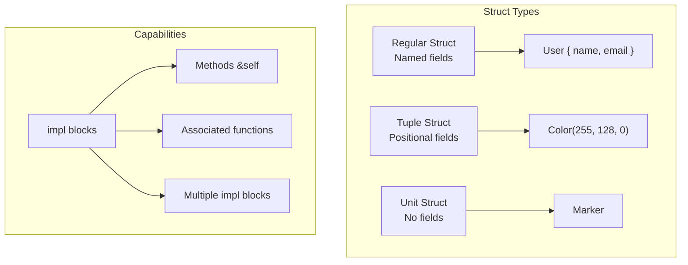
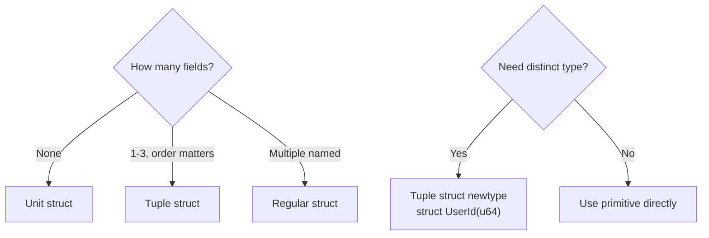
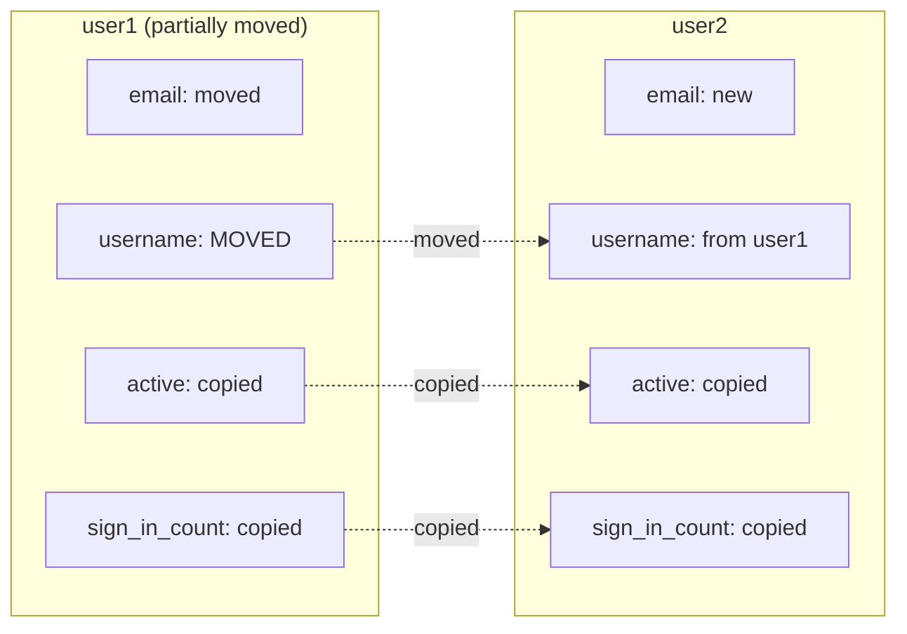
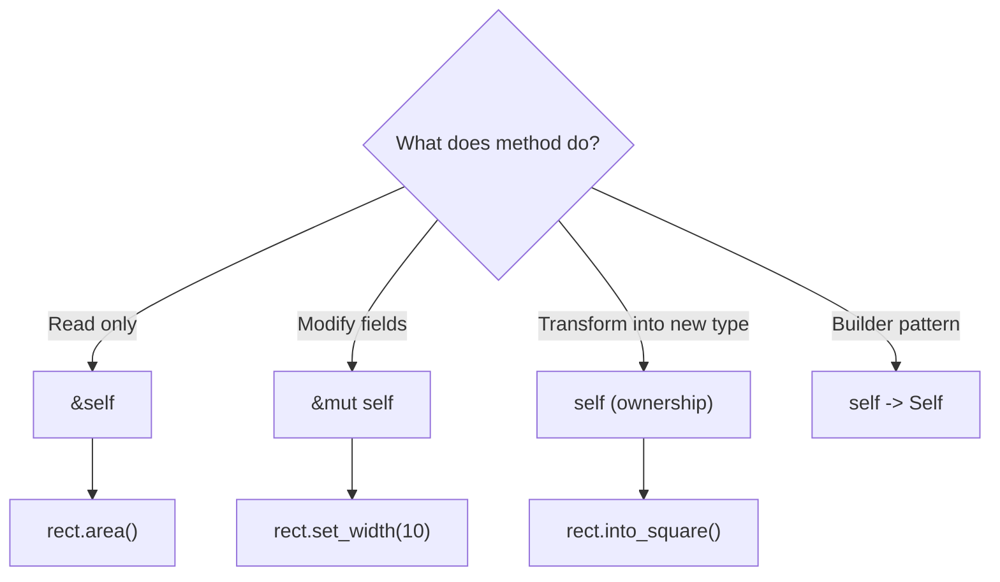
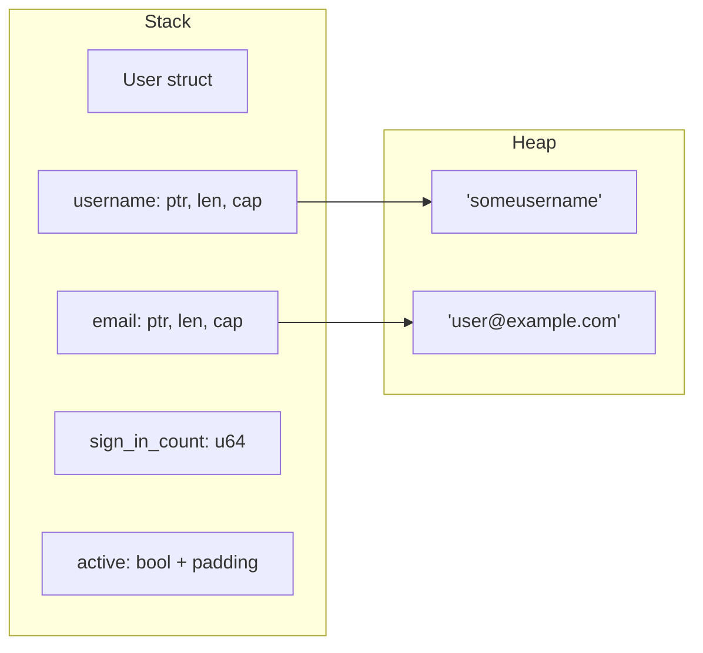
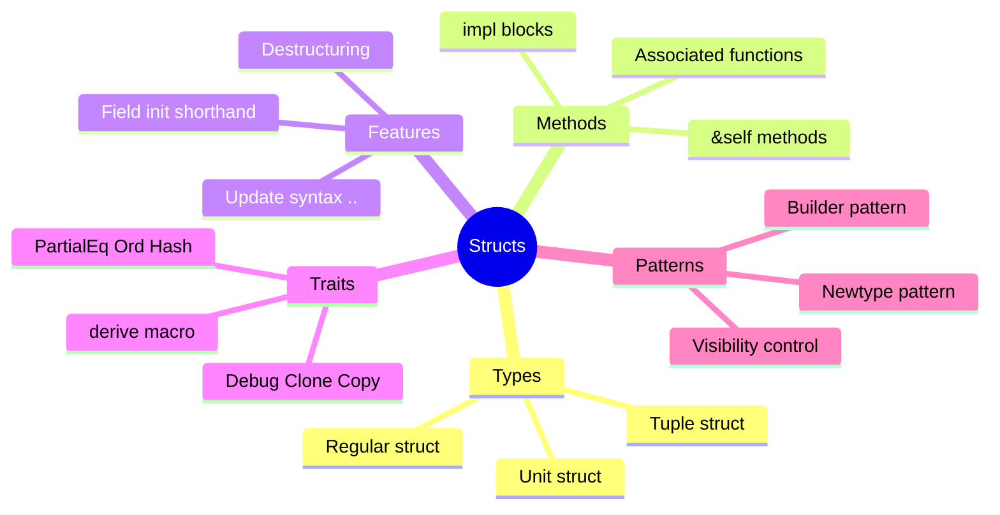

# Structs

## Overview

**Structs** are Rust's primary way to create custom data types by grouping related values together. They're similar to classes in OOP languages but without inheritance—composition and traits handle that instead.



**Key insight**: Structs own their data by default. Use references (`&str`) only when you need to borrow, and add lifetime parameters when you do.

## When to Use Each Struct Type

| Type | Use Case | Example |
|------|----------|---------|
| Regular struct | Multiple named fields | `User { name, email, age }` |
| Tuple struct | Few fields, position meaningful | `Point(x, y)`, `Color(r, g, b)` |
| Unit struct | Type marker, trait implementation | `struct Meters;` |



## Defining Structs

```rust
struct User {
    username: String,
    email: String,
    sign_in_count: u64,
    active: bool,
}
```

## Creating Instances

```rust
fn main() {
    let user1 = User {
        email: String::from("user@example.com"),
        username: String::from("someusername"),
        active: true,
        sign_in_count: 1,
    };
}
```

## Accessing Fields

Use dot notation:

```rust
fn main() {
    let mut user1 = User {
        email: String::from("user@example.com"),
        username: String::from("someusername"),
        active: true,
        sign_in_count: 1,
    };

    user1.email = String::from("new@example.com");
    println!("Email: {}", user1.email);
}
```

{: .note }
The entire instance must be mutable to modify any field.

## Field Init Shorthand

When variable names match field names:

```rust
fn build_user(email: String, username: String) -> User {
    User {
        email,           // Shorthand for email: email
        username,        // Shorthand for username: username
        active: true,
        sign_in_count: 1,
    }
}
```

## Struct Update Syntax

Create a new instance using values from another:

```rust
fn main() {
    let user1 = User {
        email: String::from("user@example.com"),
        username: String::from("someusername"),
        active: true,
        sign_in_count: 1,
    };

    let user2 = User {
        email: String::from("another@example.com"),
        ..user1  // Use remaining fields from user1
    };

    // Note: user1.username was moved to user2
    // println!("{}", user1.username);  // Error!
    println!("{}", user1.active);       // OK - bool is Copy
}
```



{: .warning }
When using struct update syntax with non-Copy types, the source struct becomes partially moved and unusable.
```

## Tuple Structs

Named tuples:

```rust
struct Color(i32, i32, i32);
struct Point(i32, i32, i32);

fn main() {
    let black = Color(0, 0, 0);
    let origin = Point(0, 0, 0);

    // Access by index
    println!("R: {}", black.0);

    // Destructure
    let Color(r, g, b) = black;
}
```

## Unit-Like Structs

Structs with no fields:

```rust
struct AlwaysEqual;

fn main() {
    let subject = AlwaysEqual;
}
```

Useful for implementing traits on types without data.

## Methods with `impl`

Add methods to structs using `impl` blocks:

```rust
struct Rectangle {
    width: u32,
    height: u32,
}

impl Rectangle {
    fn area(&self) -> u32 {
        self.width * self.height
    }

    fn can_hold(&self, other: &Rectangle) -> bool {
        self.width > other.width && self.height > other.height
    }
}

fn main() {
    let rect = Rectangle { width: 30, height: 50 };
    println!("Area: {}", rect.area());
}
```

### The `self` Parameter

| Syntax | Meaning | When to Use |
|--------|---------|-------------|
| `&self` | Immutable borrow | Read data, most common |
| `&mut self` | Mutable borrow | Modify data |
| `self` | Takes ownership | Transform or consume |

```rust
impl Rectangle {
    fn area(&self) -> u32 {
        self.width * self.height
    }

    fn set_width(&mut self, width: u32) {
        self.width = width;
    }

    fn consume(self) -> u32 {
        self.width * self.height
        // self is dropped after this
    }
}
```



## Associated Functions

Functions without `self` - called with `::`:

```rust
impl Rectangle {
    // Associated function (constructor pattern)
    fn new(width: u32, height: u32) -> Rectangle {
        Rectangle { width, height }
    }

    fn square(size: u32) -> Rectangle {
        Rectangle { width: size, height: size }
    }
}

fn main() {
    let rect = Rectangle::new(30, 50);
    let square = Rectangle::square(10);
}
```

## Multiple `impl` Blocks

You can have multiple `impl` blocks:

```rust
impl Rectangle {
    fn area(&self) -> u32 {
        self.width * self.height
    }
}

impl Rectangle {
    fn perimeter(&self) -> u32 {
        2 * (self.width + self.height)
    }
}
```

## Deriving Traits

Add functionality with derive macros:

```rust
#[derive(Debug, Clone, PartialEq)]
struct Point {
    x: i32,
    y: i32,
}

fn main() {
    let p1 = Point { x: 1, y: 2 };
    let p2 = p1.clone();

    println!("{:?}", p1);           // Debug
    println!("{}", p1 == p2);       // PartialEq
}
```

Common derivable traits:

| Trait | Purpose |
|-------|---------|
| `Debug` | `{:?}` formatting |
| `Clone` | `.clone()` method |
| `Copy` | Implicit copying |
| `PartialEq` | `==` comparison |
| `Eq` | Strict equality |
| `PartialOrd` | `<`, `>` comparison |
| `Ord` | Total ordering |
| `Hash` | Hashing support |
| `Default` | Default value |

## Struct Visibility

By default, fields are private:

```rust
mod shapes {
    pub struct Rectangle {
        pub width: u32,   // Public field
        height: u32,      // Private field
    }

    impl Rectangle {
        pub fn new(width: u32, height: u32) -> Rectangle {
            Rectangle { width, height }
        }

        pub fn height(&self) -> u32 {
            self.height
        }
    }
}
```

## Generic Structs

Structs can be generic over types:

```rust
struct Point<T> {
    x: T,
    y: T,
}

impl<T> Point<T> {
    fn x(&self) -> &T {
        &self.x
    }
}

fn main() {
    let int_point = Point { x: 5, y: 10 };
    let float_point = Point { x: 1.0, y: 4.0 };
}
```

## Pattern Matching with Structs

Destructure in patterns:

```rust
fn main() {
    let p = Point { x: 0, y: 7 };

    // Destructure all fields
    let Point { x, y } = p;

    // Rename fields
    let Point { x: a, y: b } = p;

    // Match specific values
    match p {
        Point { x: 0, y } => println!("On y-axis at {}", y),
        Point { x, y: 0 } => println!("On x-axis at {}", x),
        Point { x, y } => println!("At ({}, {})", x, y),
    }
}
```

## Common Patterns

### Builder Pattern

```rust
struct Request {
    url: String,
    method: String,
    headers: Vec<(String, String)>,
}

struct RequestBuilder {
    url: String,
    method: String,
    headers: Vec<(String, String)>,
}

impl RequestBuilder {
    fn new(url: &str) -> Self {
        RequestBuilder {
            url: url.to_string(),
            method: "GET".to_string(),
            headers: vec![],
        }
    }

    fn method(mut self, method: &str) -> Self {
        self.method = method.to_string();
        self
    }

    fn header(mut self, key: &str, value: &str) -> Self {
        self.headers.push((key.to_string(), value.to_string()));
        self
    }

    fn build(self) -> Request {
        Request {
            url: self.url,
            method: self.method,
            headers: self.headers,
        }
    }
}
```

## Memory Layout

Understanding how structs are laid out in memory:



{: .note }
Struct fields may be reordered by the compiler for optimal memory alignment. Use `#[repr(C)]` if you need guaranteed layout.

## Summary



| Concept | Syntax | Purpose |
|---------|--------|---------|
| Regular struct | `struct Name { field: Type }` | Named fields |
| Tuple struct | `struct Name(Type, Type)` | Positional fields |
| Unit struct | `struct Name;` | Marker types |
| Method | `fn method(&self)` | Instance behavior |
| Associated fn | `fn new() -> Self` | Constructors |
| Update syntax | `..other` | Copy fields from another |

## Exercises

1. Create a `Circle` struct with a `radius` and implement `area()` and `circumference()`
2. Create a `Student` struct with `name`, `age`, and `grades` (Vec<f64>), implement `average_grade()`
3. Implement the builder pattern for a `Config` struct

## See Also

- [Builder Pattern]() - Fluent APIs and advanced builder patterns
- [Example Code](https://github.com/MichaelTien8901/rust-guide-tutorial/tree/main/examples/part2/structs)

## Next Steps

Learn about [Enums]() for types that can be one of several variants.
