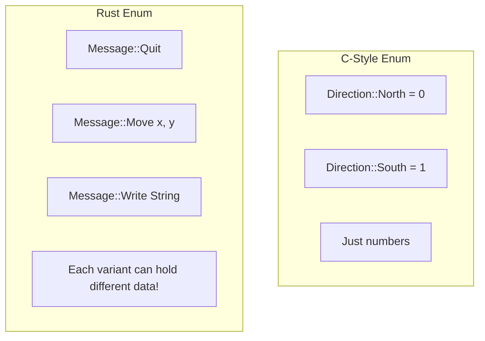
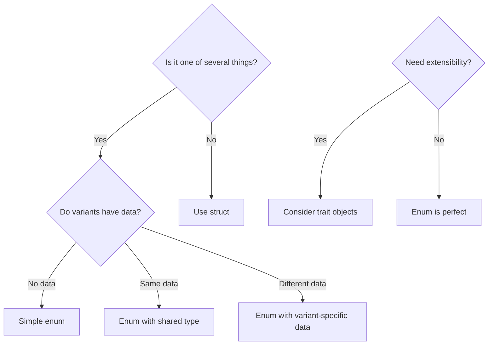
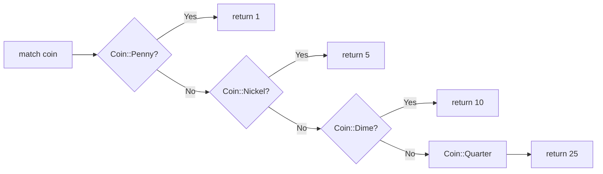
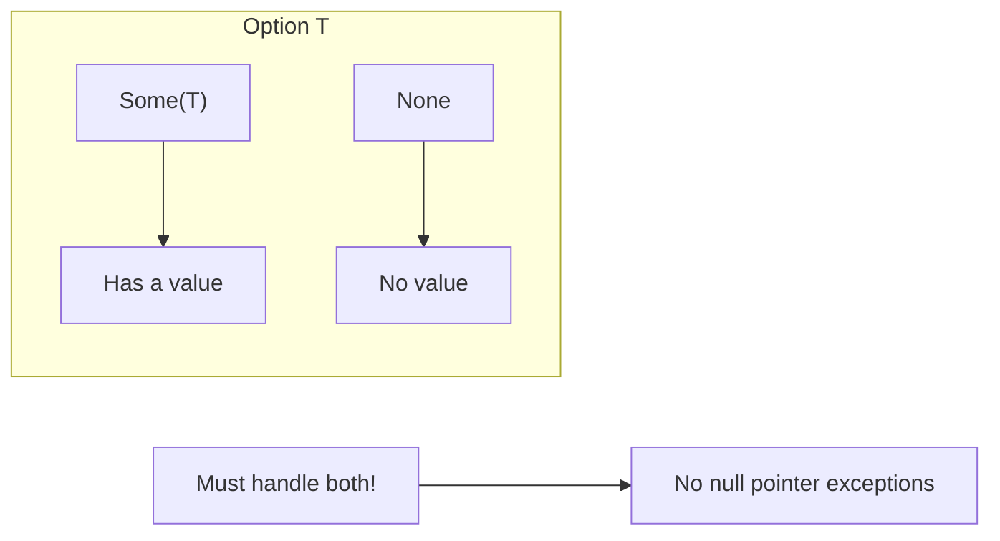
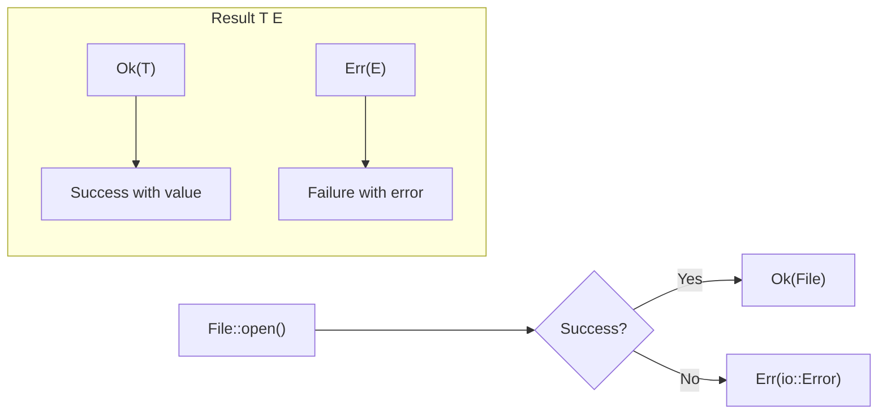
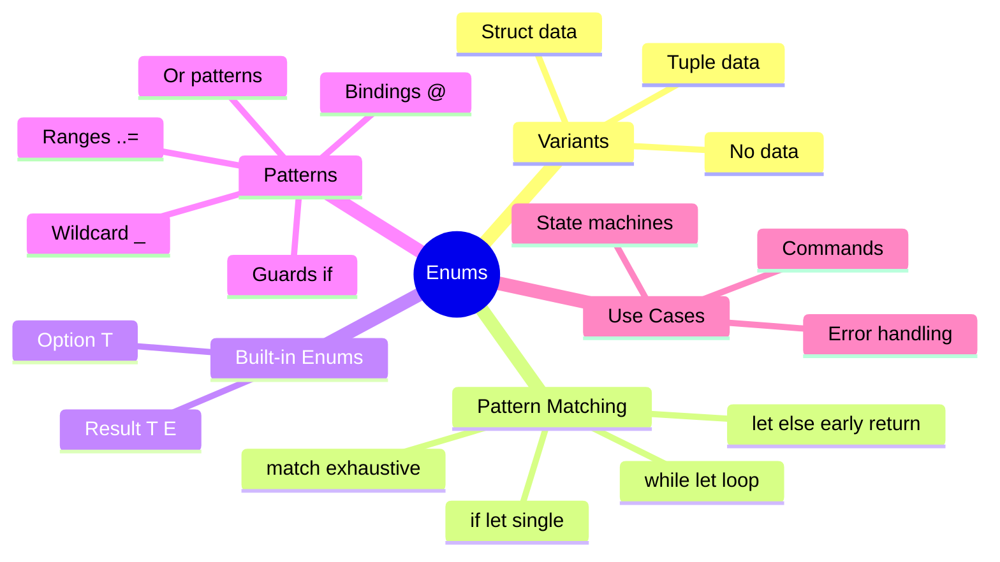

# Enums and Pattern Matching

## Overview

**Enums** (enumerations) let you define a type by listing its possible variants. Unlike C-style enums, Rust enums can hold data in each variant, making them incredibly powerful for modeling states and alternatives.



**Key insight**: Rust enums + pattern matching = algebraic data types. They let you model "one of these things" with compile-time exhaustiveness checking.

## When to Use Enums

| Situation | Use Enum | Example |
|-----------|----------|---------|
| Multiple exclusive states | Yes | `ConnectionState { Connecting, Connected, Disconnected }` |
| Optional value | Yes (`Option<T>`) | `Some(value)` or `None` |
| Success or failure | Yes (`Result<T,E>`) | `Ok(data)` or `Err(error)` |
| Commands/messages | Yes | `Command { Start, Stop, Pause }` |
| Type needs method variants | No, use trait | Different behaviors, same interface |



## Defining Enums

```rust
enum Direction {
    North,
    South,
    East,
    West,
}

fn main() {
    let dir = Direction::North;
}
```

## Enums with Data

Variants can hold data:

```rust
enum Message {
    Quit,                       // No data
    Move { x: i32, y: i32 },   // Named fields (struct-like)
    Write(String),              // Single value (tuple-like)
    ChangeColor(i32, i32, i32), // Multiple values
}

fn main() {
    let m1 = Message::Quit;
    let m2 = Message::Move { x: 10, y: 20 };
    let m3 = Message::Write(String::from("hello"));
    let m4 = Message::ChangeColor(255, 0, 0);
}
```

## Methods on Enums

```rust
impl Message {
    fn call(&self) {
        match self {
            Message::Quit => println!("Quit"),
            Message::Move { x, y } => println!("Move to ({}, {})", x, y),
            Message::Write(s) => println!("Write: {}", s),
            Message::ChangeColor(r, g, b) => println!("Color: {}, {}, {}", r, g, b),
        }
    }
}
```

## The `match` Expression

`match` is exhaustive pattern matching—the compiler ensures you handle every case.



```rust
enum Coin {
    Penny,
    Nickel,
    Dime,
    Quarter,
}

fn value_in_cents(coin: Coin) -> u32 {
    match coin {
        Coin::Penny => 1,
        Coin::Nickel => 5,
        Coin::Dime => 10,
        Coin::Quarter => 25,
    }
}
```

### Match Must Be Exhaustive

```rust
// Error: non-exhaustive patterns
fn incomplete(coin: Coin) -> u32 {
    match coin {
        Coin::Penny => 1,
        // Missing other variants!
    }
}
```

### The `_` Placeholder

Match any remaining patterns:

```rust
fn describe(coin: Coin) {
    match coin {
        Coin::Penny => println!("Lucky penny!"),
        _ => println!("Some other coin"),
    }
}
```

### Matching with Values

```rust
enum UsState {
    Alabama,
    Alaska,
    // ...
}

enum Coin {
    Penny,
    Nickel,
    Dime,
    Quarter(UsState),
}

fn value_in_cents(coin: Coin) -> u32 {
    match coin {
        Coin::Penny => 1,
        Coin::Nickel => 5,
        Coin::Dime => 10,
        Coin::Quarter(state) => {
            println!("Quarter from {:?}", state);
            25
        }
    }
}
```

## The `Option<T>` Enum

Rust's way of handling nullable values—there's no `null` in Rust!



```rust
enum Option<T> {
    Some(T),
    None,
}
```

```rust
fn main() {
    let some_number: Option<i32> = Some(5);
    let no_number: Option<i32> = None;

    // Must handle both cases
    match some_number {
        Some(n) => println!("Got: {}", n),
        None => println!("Got nothing"),
    }
}
```

### Working with Option

```rust
fn divide(a: f64, b: f64) -> Option<f64> {
    if b == 0.0 {
        None
    } else {
        Some(a / b)
    }
}

fn main() {
    let result = divide(10.0, 2.0);

    // Pattern matching
    match result {
        Some(x) => println!("Result: {}", x),
        None => println!("Cannot divide by zero"),
    }

    // if let
    if let Some(x) = divide(10.0, 2.0) {
        println!("Result: {}", x);
    }

    // unwrap_or
    let value = divide(10.0, 0.0).unwrap_or(0.0);

    // map
    let doubled = divide(10.0, 2.0).map(|x| x * 2.0);
}
```

## The `Result<T, E>` Enum

For operations that can fail—explicit error handling without exceptions.



```rust
enum Result<T, E> {
    Ok(T),
    Err(E),
}
```

```rust
use std::fs::File;

fn main() {
    let file = File::open("hello.txt");

    match file {
        Ok(f) => println!("File opened: {:?}", f),
        Err(e) => println!("Error: {}", e),
    }
}
```

## `if let` Syntax

Concise matching for single patterns:

```rust
fn main() {
    let some_value = Some(3);

    // Verbose match
    match some_value {
        Some(3) => println!("three!"),
        _ => (),
    }

    // Concise if let
    if let Some(3) = some_value {
        println!("three!");
    }
}
```

### `if let` with `else`

```rust
fn main() {
    let coin = Coin::Quarter(UsState::Alaska);

    if let Coin::Quarter(state) = coin {
        println!("Quarter from {:?}", state);
    } else {
        println!("Not a quarter");
    }
}
```

## `while let` Loops

```rust
fn main() {
    let mut stack = vec![1, 2, 3];

    while let Some(top) = stack.pop() {
        println!("{}", top);
    }
}
```

## `let else` (Rust 1.65+)

```rust
fn get_name(id: Option<u32>) -> String {
    let Some(id) = id else {
        return String::from("Anonymous");
    };
    format!("User {}", id)
}
```

## Pattern Matching Details

### Multiple Patterns

```rust
fn main() {
    let x = 1;

    match x {
        1 | 2 => println!("one or two"),
        3 => println!("three"),
        _ => println!("anything"),
    }
}
```

### Ranges

```rust
fn main() {
    let x = 5;

    match x {
        1..=5 => println!("one through five"),
        _ => println!("something else"),
    }

    let c = 'c';
    match c {
        'a'..='j' => println!("early letter"),
        'k'..='z' => println!("late letter"),
        _ => println!("something else"),
    }
}
```

### Destructuring

```rust
struct Point {
    x: i32,
    y: i32,
}

fn main() {
    let p = Point { x: 0, y: 7 };

    match p {
        Point { x: 0, y } => println!("On y axis at {}", y),
        Point { x, y: 0 } => println!("On x axis at {}", x),
        Point { x, y } => println!("At ({}, {})", x, y),
    }
}
```

### Guards

```rust
fn main() {
    let num = Some(4);

    match num {
        Some(x) if x < 5 => println!("less than five: {}", x),
        Some(x) => println!("{}", x),
        None => (),
    }
}
```

### @ Bindings

```rust
fn main() {
    let msg = Message::Move { x: 5, y: 10 };

    match msg {
        Message::Move { x: x @ 1..=10, y } => {
            println!("x is in range: {}, y: {}", x, y)
        }
        _ => println!("other"),
    }
}
```

## Common Enum Patterns

### State Machines

```rust
enum State {
    Idle,
    Running { progress: u32 },
    Finished { result: String },
    Failed { error: String },
}

impl State {
    fn next(self) -> State {
        match self {
            State::Idle => State::Running { progress: 0 },
            State::Running { progress } if progress >= 100 => {
                State::Finished { result: "Done".to_string() }
            }
            State::Running { progress } => {
                State::Running { progress: progress + 10 }
            }
            other => other,
        }
    }
}
```

### Command Pattern

```rust
enum Command {
    Start,
    Stop,
    Move { x: i32, y: i32 },
    Say(String),
}

fn execute(cmd: Command) {
    match cmd {
        Command::Start => println!("Starting..."),
        Command::Stop => println!("Stopping..."),
        Command::Move { x, y } => println!("Moving to ({}, {})", x, y),
        Command::Say(msg) => println!("Saying: {}", msg),
    }
}
```

## Summary



| Feature | Syntax | Use Case |
|---------|--------|----------|
| Define enum | `enum Name { A, B }` | Simple variants |
| With tuple data | `Name { A(i32) }` | Associated value |
| With struct data | `Name { A { x: i32 } }` | Named fields |
| Match | `match val { A => ... }` | Exhaustive handling |
| If let | `if let Some(x) = opt { }` | Single pattern |
| While let | `while let Some(x) = iter.next()` | Pattern loop |
| Wildcard | `_` | Catch-all |
| Or pattern | `A \| B => ...` | Multiple matches |
| Guard | `x if x > 5 => ...` | Conditional match |

## Exercises

1. Create a `TrafficLight` enum and implement a `duration()` method
2. Implement a simple calculator using a `Operation` enum
3. Create a `Tree<T>` enum for a binary tree

## Next Steps

Learn about [Error Handling]() with Result and the ? operator.
