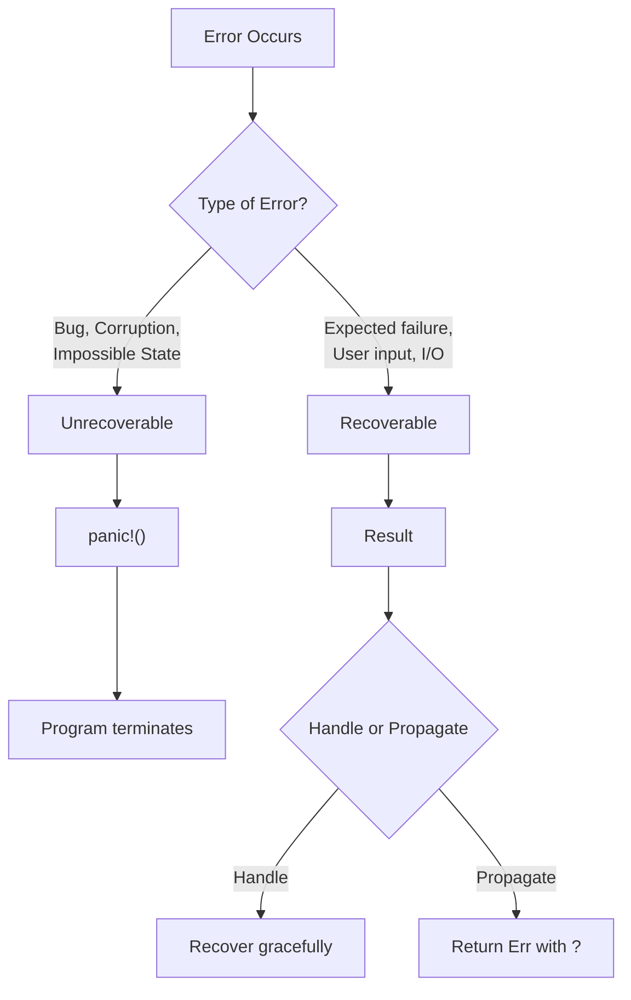
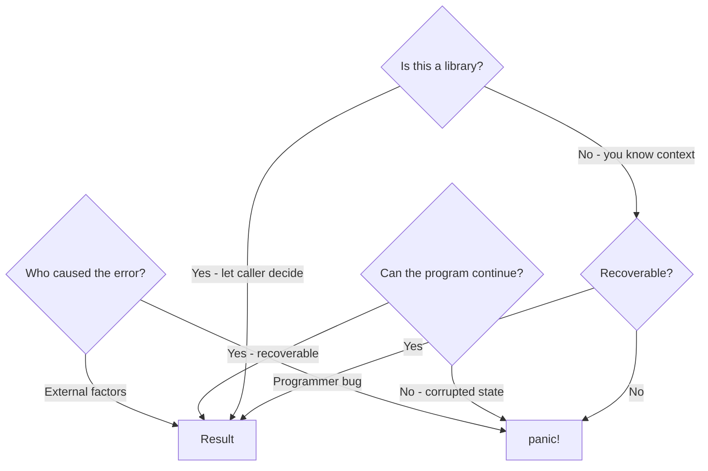
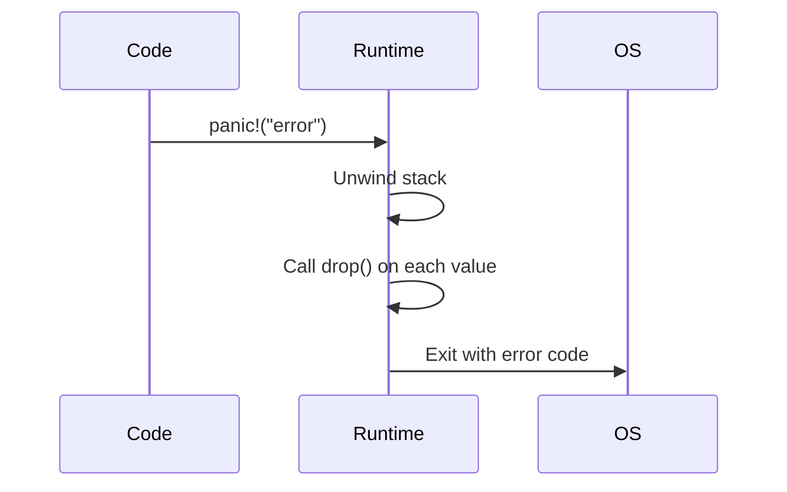
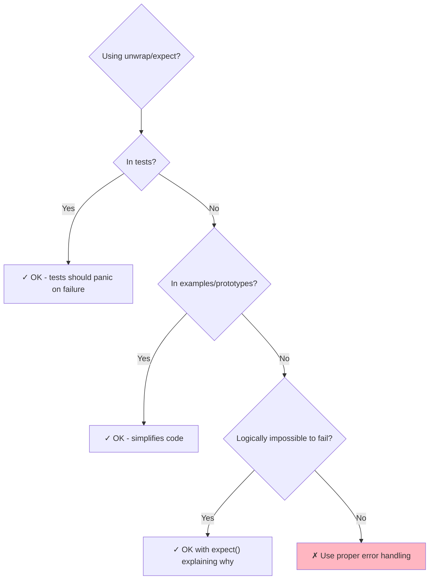
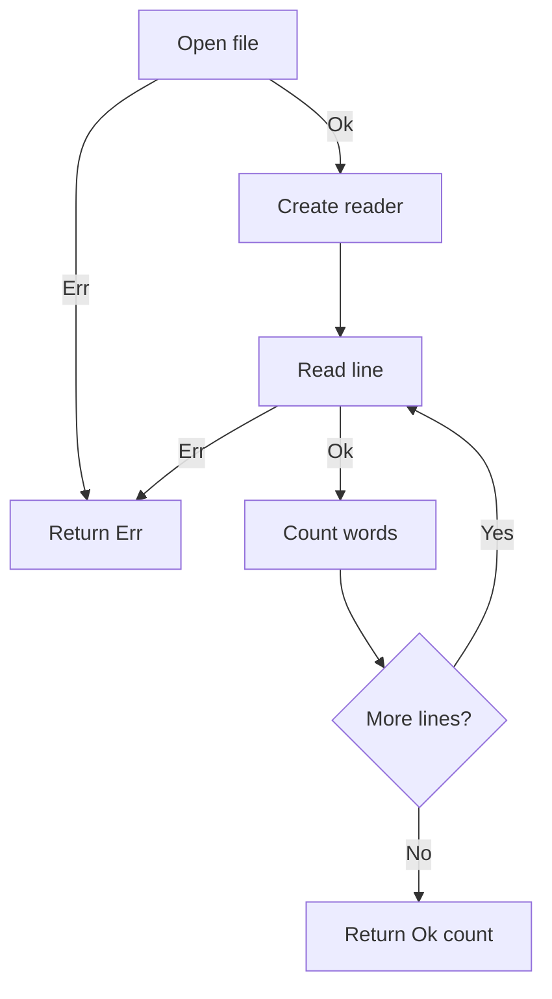
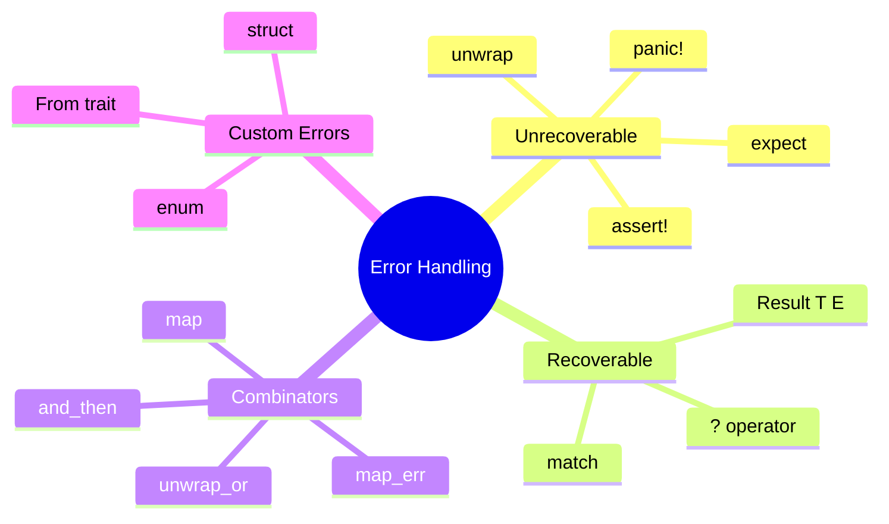

# Error Handling

## Overview

Rust takes a unique approach to error handling: it separates errors into **recoverable** (`Result`) and **unrecoverable** (`panic!`). This forces you to think about error cases explicitly, leading to more robust code.



**Key insight**: Unlike exceptions in other languages, Rust errors are values that must be explicitly handled or propagated.

## When to Use Each Approach

| Situation | Use | Example |
|-----------|-----|---------|
| Index out of bounds (bug) | `panic!` | `v[99]` on 3-element vec |
| File not found | `Result` | User-specified config file |
| Invalid user input | `Result` | Parsing user-entered number |
| Invariant violated | `panic!` | Data structure corrupted |
| Network timeout | `Result` | HTTP request failed |
| Division by zero (bug) | `panic!` | Shouldn't reach this code |



## Unrecoverable Errors: `panic!`

### When Programs Panic

```rust
fn main() {
    // Explicit panic
    panic!("Something went terribly wrong!");

    // Implicit panics from bugs
    let v = vec![1, 2, 3];
    v[99];  // Index out of bounds → panic!

    let x: Option<i32> = None;
    x.unwrap();  // Unwrap on None → panic!

    assert!(1 == 2);  // Assertion failed → panic!
}
```

### Viewing Backtraces

```bash
# See full stack trace
RUST_BACKTRACE=1 cargo run

# Even more detail
RUST_BACKTRACE=full cargo run
```

### Panic Behavior



{: .note }
In release builds, you can configure `panic = "abort"` in Cargo.toml to skip unwinding for smaller binaries.

## Recoverable Errors: `Result<T, E>`

### The Result Type

```rust
enum Result<T, E> {
    Ok(T),   // Success with value
    Err(E),  // Failure with error
}
```

### Basic Pattern Matching

```rust
use std::fs::File;

fn main() {
    let result = File::open("config.txt");

    let file = match result {
        Ok(f) => {
            println!("File opened successfully");
            f
        }
        Err(e) => {
            println!("Failed to open file: {}", e);
            return;
        }
    };
}
```

### Handling Different Error Types

```rust
use std::fs::File;
use std::io::ErrorKind;

fn main() {
    let file = match File::open("config.txt") {
        Ok(f) => f,
        Err(e) => match e.kind() {
            ErrorKind::NotFound => {
                // Create file if it doesn't exist
                File::create("config.txt")
                    .expect("Failed to create file")
            }
            ErrorKind::PermissionDenied => {
                panic!("Permission denied - check file permissions");
            }
            other => {
                panic!("Unexpected error: {:?}", other);
            }
        },
    };
}
```

## The `?` Operator: Elegant Error Propagation

The `?` operator is Rust's way of propagating errors concisely.

### How It Works

```rust
// With ? operator
fn read_config() -> Result<String, io::Error> {
    let mut file = File::open("config.txt")?;
    let mut contents = String::new();
    file.read_to_string(&mut contents)?;
    Ok(contents)
}

// Equivalent match expression
fn read_config_verbose() -> Result<String, io::Error> {
    let mut file = match File::open("config.txt") {
        Ok(f) => f,
        Err(e) => return Err(e),
    };
    let mut contents = String::new();
    match file.read_to_string(&mut contents) {
        Ok(_) => Ok(contents),
        Err(e) => return Err(e),
    }
}
```

```mermaid
flowchart LR
    A["File::open()?"] --> B{Result?}
    B -->|Ok(file)| C[Continue with file]
    B -->|Err(e)| D[return Err(e)]

    style D fill:#FFB6C1
```

### Chaining with `?`

```rust
use std::fs::File;
use std::io::{self, Read};

fn read_username() -> Result<String, io::Error> {
    let mut username = String::new();
    File::open("username.txt")?.read_to_string(&mut username)?;
    Ok(username)
}

// Even shorter with std::fs
fn read_username_short() -> Result<String, io::Error> {
    std::fs::read_to_string("username.txt")
}
```

### `?` with Option

```rust
fn last_char_of_first_line(text: &str) -> Option<char> {
    text.lines()    // Iterator over lines
        .next()?    // First line, or return None
        .chars()    // Iterator over chars
        .last()     // Last char
}

// Equivalent match
fn last_char_verbose(text: &str) -> Option<char> {
    let first_line = match text.lines().next() {
        Some(line) => line,
        None => return None,
    };
    first_line.chars().last()
}
```

## Shortcuts: `unwrap` and `expect`

### When to Use Them



### `unwrap()` - Returns value or panics

```rust
// Only use when failure is impossible or in prototypes
let home = std::env::var("HOME").unwrap();
```

### `expect()` - Panics with custom message

```rust
// Preferred over unwrap - documents why it won't fail
let config: Config = toml::from_str(&config_text)
    .expect("Embedded config should always be valid TOML");
```

## Converting Between Result and Option

```rust
// Option → Result
let opt: Option<i32> = Some(42);
let result: Result<i32, &str> = opt.ok_or("Value not found");

// Result → Option (discards error)
let result: Result<i32, &str> = Ok(42);
let opt: Option<i32> = result.ok();  // Some(42)

let result: Result<i32, &str> = Err("error");
let opt: Option<i32> = result.ok();  // None
```

## Combinator Methods

Functional-style error handling:

```rust
fn process_data(input: &str) -> Result<i32, String> {
    input
        .parse::<i32>()
        .map(|n| n * 2)                    // Transform Ok value
        .map_err(|e| e.to_string())        // Transform Err value
}

fn get_config_or_default() -> Config {
    load_config()
        .unwrap_or(Config::default())      // Default on error
}

fn get_computed_default() -> Config {
    load_config()
        .unwrap_or_else(|_| compute_default())  // Lazy default
}
```

### Combinator Cheat Sheet

| Method | Ok Behavior | Err Behavior |
|--------|-------------|--------------|
| `map(f)` | Apply `f` to value | Pass through |
| `map_err(f)` | Pass through | Apply `f` to error |
| `and_then(f)` | Apply `f` (returns Result) | Pass through |
| `or_else(f)` | Pass through | Apply `f` (returns Result) |
| `unwrap_or(v)` | Return value | Return `v` |
| `unwrap_or_else(f)` | Return value | Call `f()` |
| `unwrap_or_default()` | Return value | Return `Default::default()` |

## Custom Error Types

### Simple Error Struct

```rust
use std::fmt;
use std::error::Error;

#[derive(Debug)]
struct ConfigError {
    message: String,
}

impl fmt::Display for ConfigError {
    fn fmt(&self, f: &mut fmt::Formatter) -> fmt::Result {
        write!(f, "Configuration error: {}", self.message)
    }
}

impl Error for ConfigError {}

// Usage
fn load_config() -> Result<Config, ConfigError> {
    Err(ConfigError {
        message: "File not found".to_string(),
    })
}
```

### Error Enum for Multiple Cases

```rust
use std::fmt;
use std::error::Error;
use std::io;

#[derive(Debug)]
enum AppError {
    Io(io::Error),
    Parse(std::num::ParseIntError),
    Config(String),
}

impl fmt::Display for AppError {
    fn fmt(&self, f: &mut fmt::Formatter) -> fmt::Result {
        match self {
            AppError::Io(e) => write!(f, "I/O error: {}", e),
            AppError::Parse(e) => write!(f, "Parse error: {}", e),
            AppError::Config(msg) => write!(f, "Config error: {}", msg),
        }
    }
}

impl Error for AppError {
    fn source(&self) -> Option<&(dyn Error + 'static)> {
        match self {
            AppError::Io(e) => Some(e),
            AppError::Parse(e) => Some(e),
            AppError::Config(_) => None,
        }
    }
}

// Enable ? with automatic conversion
impl From<io::Error> for AppError {
    fn from(err: io::Error) -> Self {
        AppError::Io(err)
    }
}

impl From<std::num::ParseIntError> for AppError {
    fn from(err: std::num::ParseIntError) -> Self {
        AppError::Parse(err)
    }
}
```

### Usage with `?`

```rust
fn process_file(path: &str) -> Result<i32, AppError> {
    let content = std::fs::read_to_string(path)?;  // io::Error → AppError
    let number: i32 = content.trim().parse()?;      // ParseIntError → AppError
    Ok(number * 2)
}
```

## `main()` Returning Result

```rust
use std::error::Error;

fn main() -> Result<(), Box<dyn Error>> {
    let config = std::fs::read_to_string("config.toml")?;
    let data = process(&config)?;
    println!("Processed: {:?}", data);
    Ok(())
}
```

When `main` returns `Err`, Rust prints the error and exits with code 1.

## Error Handling Flow Example

```rust
use std::fs::File;
use std::io::{self, BufRead, BufReader};

fn count_words_in_file(path: &str) -> Result<usize, io::Error> {
    let file = File::open(path)?;
    let reader = BufReader::new(file);

    let mut count = 0;
    for line in reader.lines() {
        let line = line?;  // Handle potential I/O error
        count += line.split_whitespace().count();
    }

    Ok(count)
}

fn main() {
    match count_words_in_file("document.txt") {
        Ok(count) => println!("Word count: {}", count),
        Err(e) => {
            eprintln!("Error reading file: {}", e);
            std::process::exit(1);
        }
    }
}
```



## Summary



| When | Use |
|------|-----|
| Bug in code | `panic!` |
| Test assertions | `panic!`, `assert!` |
| Expected failures | `Result` |
| Propagate errors | `?` |
| Transform errors | `map_err` |
| Default on failure | `unwrap_or` |
| Custom error info | Custom error type |

## Exercises

1. Write a function that reads a number from a file and returns `Result<i32, Error>`
2. Create a custom error type for a temperature converter (invalid format, out of range)
3. Refactor code using `unwrap()` to use `?` operator

## See Also

- [Error Patterns]() - Advanced patterns with thiserror and anyhow
- [Error Handling Libraries]() - Library reference

## Next Steps

Learn about [Traits]() to define shared behavior.
