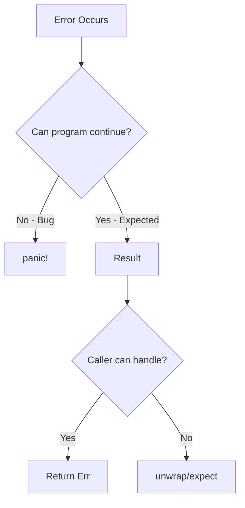

# Error Handling

Rust has two categories of errors: **recoverable** (Result) and **unrecoverable** (panic).

## Unrecoverable Errors with `panic!`

For bugs and unrecoverable situations:

```rust
fn main() {
    panic!("crash and burn");
}
```

### Common Panic Sources

```rust
fn main() {
    // Index out of bounds
    let v = vec![1, 2, 3];
    v[99];  // panic!

    // Unwrap on None
    let x: Option<i32> = None;
    x.unwrap();  // panic!

    // Explicit assertion
    assert!(1 == 2);  // panic!
}
```

### Viewing Backtraces

```bash
RUST_BACKTRACE=1 cargo run
```

## Recoverable Errors with `Result`

```rust
enum Result<T, E> {
    Ok(T),
    Err(E),
}
```

### Basic Usage

```rust
use std::fs::File;

fn main() {
    let file = File::open("hello.txt");

    let file = match file {
        Ok(f) => f,
        Err(e) => {
            println!("Error opening file: {}", e);
            return;
        }
    };
}
```

### Matching Different Errors

```rust
use std::fs::File;
use std::io::ErrorKind;

fn main() {
    let file = File::open("hello.txt");

    let file = match file {
        Ok(f) => f,
        Err(e) => match e.kind() {
            ErrorKind::NotFound => match File::create("hello.txt") {
                Ok(fc) => fc,
                Err(e) => panic!("Couldn't create file: {:?}", e),
            },
            other => panic!("Couldn't open file: {:?}", other),
        },
    };
}
```

### Cleaner with Closures

```rust
use std::fs::File;
use std::io::ErrorKind;

fn main() {
    let file = File::open("hello.txt").unwrap_or_else(|error| {
        if error.kind() == ErrorKind::NotFound {
            File::create("hello.txt").unwrap_or_else(|error| {
                panic!("Couldn't create file: {:?}", error);
            })
        } else {
            panic!("Couldn't open file: {:?}", error);
        }
    });
}
```

## Shortcuts: `unwrap` and `expect`

### `unwrap()`

Returns value or panics:

```rust
let file = File::open("hello.txt").unwrap();
```

### `expect()`

Like unwrap with custom message:

```rust
let file = File::open("hello.txt")
    .expect("Failed to open hello.txt");
```

{: .warning }
Use `unwrap()` and `expect()` sparingly. They're good for prototyping but should be replaced with proper error handling in production code.

## The `?` Operator

Propagate errors concisely:

```rust
use std::fs::File;
use std::io::{self, Read};

fn read_username() -> Result<String, io::Error> {
    let mut file = File::open("username.txt")?;  // Returns Err if failed
    let mut username = String::new();
    file.read_to_string(&mut username)?;
    Ok(username)
}
```

### How `?` Works

```rust
// This:
let file = File::open("hello.txt")?;

// Is equivalent to:
let file = match File::open("hello.txt") {
    Ok(f) => f,
    Err(e) => return Err(e.into()),
};
```

### Chaining with `?`

```rust
fn read_username() -> Result<String, io::Error> {
    let mut username = String::new();
    File::open("username.txt")?.read_to_string(&mut username)?;
    Ok(username)
}
```

### Even Shorter

```rust
use std::fs;

fn read_username() -> Result<String, io::Error> {
    fs::read_to_string("username.txt")
}
```

## `?` with Option

The `?` operator also works with Option:

```rust
fn last_char_of_first_line(text: &str) -> Option<char> {
    text.lines().next()?.chars().last()
}
```

## Error Type Conversion

`?` automatically converts errors using `From`:

```rust
use std::error::Error;
use std::fs::File;
use std::io::Read;

fn read_file() -> Result<String, Box<dyn Error>> {
    let mut file = File::open("hello.txt")?;
    let mut contents = String::new();
    file.read_to_string(&mut contents)?;
    Ok(contents)
}
```

## `main` with Result

```rust
use std::error::Error;
use std::fs::File;

fn main() -> Result<(), Box<dyn Error>> {
    let file = File::open("hello.txt")?;
    Ok(())
}
```

## Custom Error Types

### Simple Custom Error

```rust
#[derive(Debug)]
struct ParseError {
    message: String,
}

impl std::fmt::Display for ParseError {
    fn fmt(&self, f: &mut std::fmt::Formatter) -> std::fmt::Result {
        write!(f, "Parse error: {}", self.message)
    }
}

impl std::error::Error for ParseError {}
```

### Enum for Multiple Errors

```rust
#[derive(Debug)]
enum AppError {
    Io(std::io::Error),
    Parse(std::num::ParseIntError),
    Custom(String),
}

impl std::fmt::Display for AppError {
    fn fmt(&self, f: &mut std::fmt::Formatter) -> std::fmt::Result {
        match self {
            AppError::Io(e) => write!(f, "IO error: {}", e),
            AppError::Parse(e) => write!(f, "Parse error: {}", e),
            AppError::Custom(msg) => write!(f, "Error: {}", msg),
        }
    }
}

impl std::error::Error for AppError {}

impl From<std::io::Error> for AppError {
    fn from(err: std::io::Error) -> AppError {
        AppError::Io(err)
    }
}
```

## When to Panic vs Return Result

### Use `panic!` When:
- Bug in your code (invariant violation)
- Unrecoverable state
- Tests and examples
- Prototyping

### Use `Result` When:
- Expected failure modes (file not found, network error)
- User or external input
- Library code (let caller decide)



## Common Patterns

### Converting Option to Result

```rust
fn get_value(opt: Option<i32>) -> Result<i32, &'static str> {
    opt.ok_or("Value not found")
}
```

### Default on Error

```rust
let value = some_result.unwrap_or(default_value);
let value = some_result.unwrap_or_else(|| compute_default());
let value = some_result.unwrap_or_default();  // Requires Default trait
```

### Mapping Errors

```rust
let result: Result<i32, String> = "42"
    .parse::<i32>()
    .map_err(|e| format!("Parse failed: {}", e));
```

### Combining Results

```rust
fn combine() -> Result<(i32, i32), &'static str> {
    let a = "42".parse::<i32>().map_err(|_| "parse a failed")?;
    let b = "24".parse::<i32>().map_err(|_| "parse b failed")?;
    Ok((a, b))
}
```

## Summary

| Method | Behavior |
|--------|----------|
| `unwrap()` | Returns value or panics |
| `expect(msg)` | Returns value or panics with message |
| `?` | Returns value or propagates error |
| `unwrap_or(v)` | Returns value or default |
| `unwrap_or_else(f)` | Returns value or computes default |
| `ok_or(e)` | Converts Option to Result |
| `map_err(f)` | Transforms error type |

## Exercises

1. Write a function that reads a number from a file and returns `Result<i32, Error>`
2. Create a custom error type for a temperature converter (invalid format, out of range)
3. Refactor code using `unwrap()` to use `?` operator

## See Also

- [Error Patterns]() - Advanced patterns with thiserror and anyhow
- [Error Handling Libraries]() - Library reference

## Next Steps

Learn about [Traits]() to define shared behavior.
