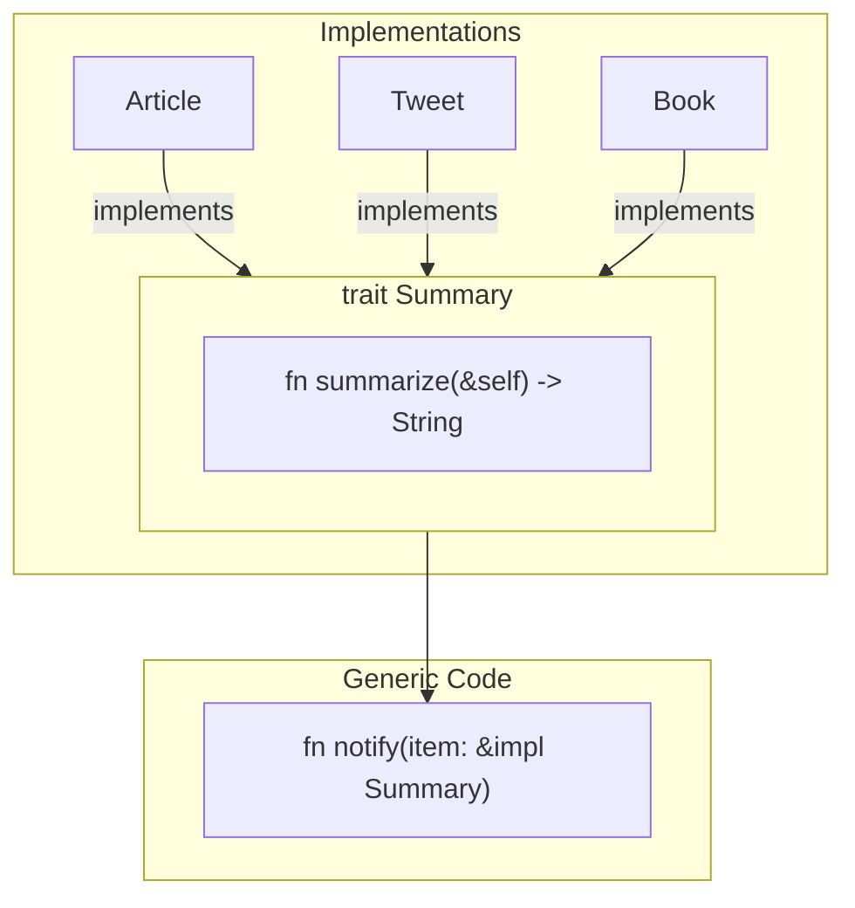
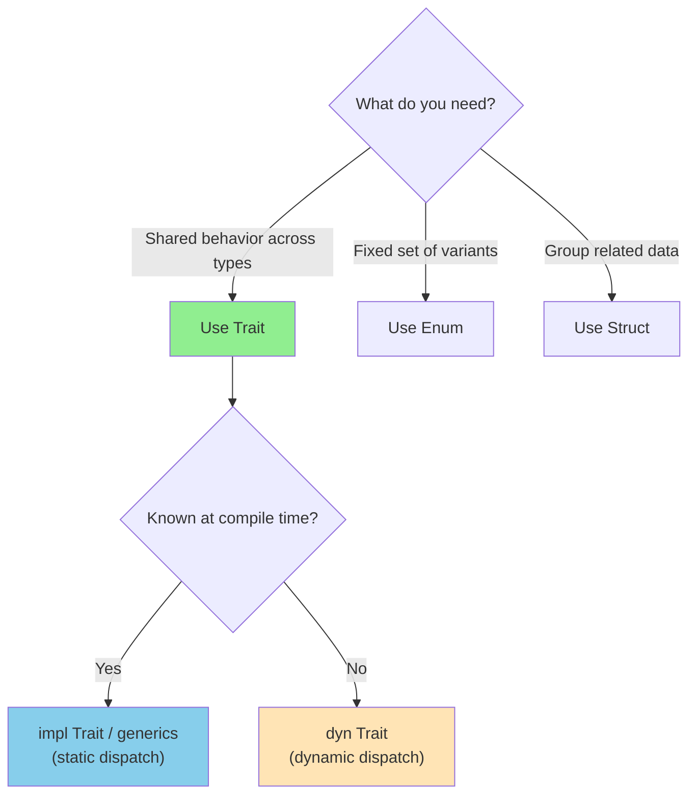
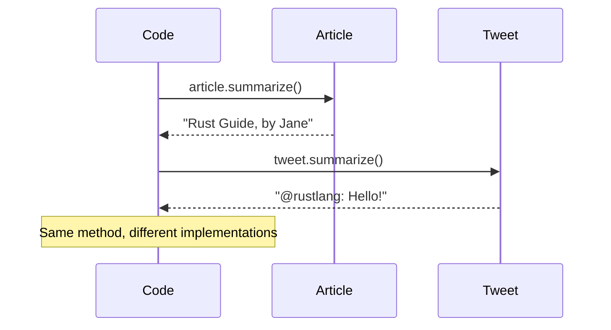
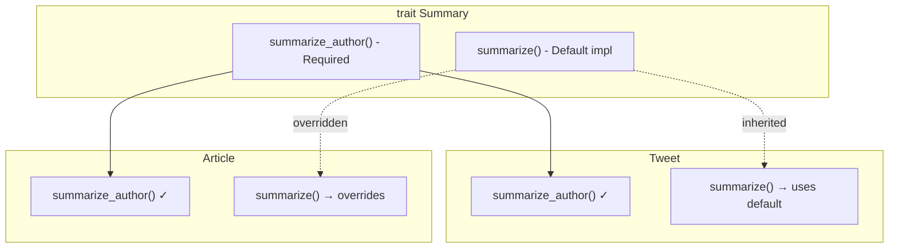
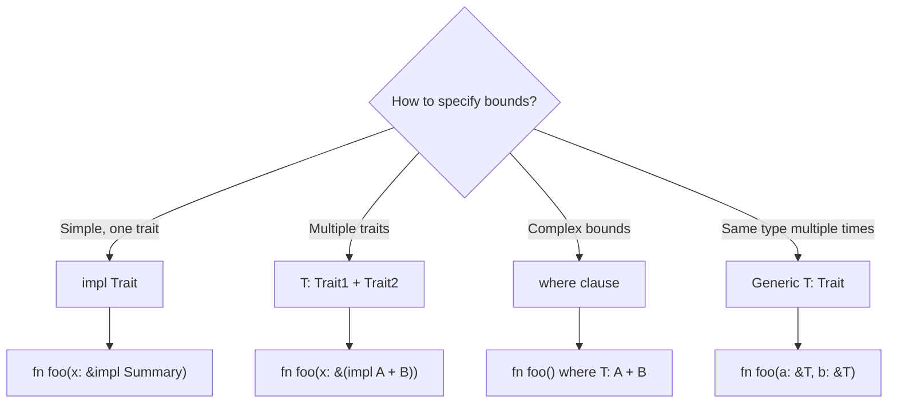
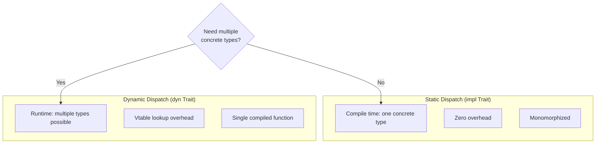
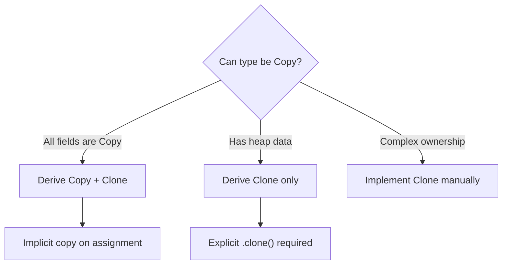
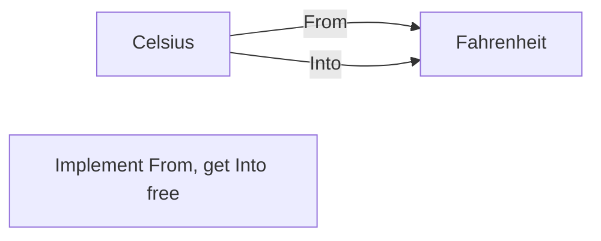
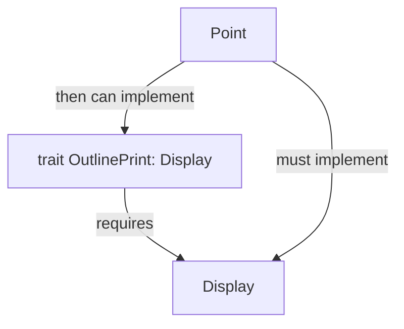
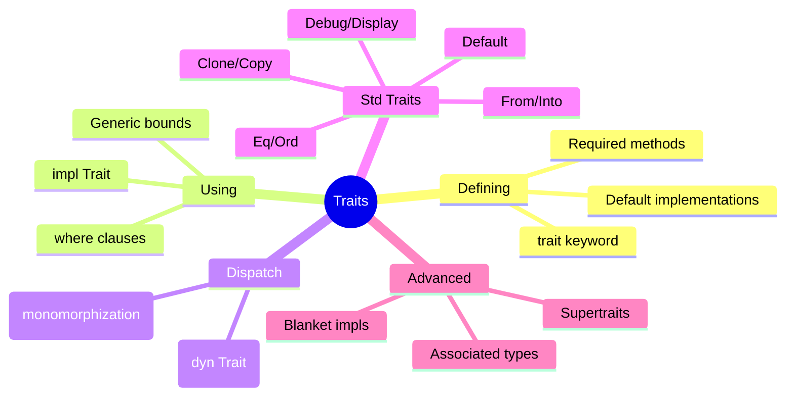

# Traits

## Overview

**Traits** define shared behavior that types can implement. They're Rust's primary mechanism for polymorphism—similar to interfaces in other languages, but more powerful with features like default implementations and associated types.



**Key insight**: Traits let you write code that works with any type implementing certain behavior, enabling both code reuse and abstraction.

## When to Use Traits

| Scenario | Use Trait | Alternative |
|----------|-----------|-------------|
| Define shared behavior | ✓ | - |
| Accept multiple types with same behavior | ✓ | Enum if fixed set |
| Operator overloading (+, -, ==) | ✓ | - |
| Enable external crate types in your code | ✓ | - |
| Simple data grouping | ✗ | Struct |
| Fixed set of variants | ✗ | Enum |



## Defining and Implementing Traits

### Basic Trait Definition

```rust
trait Summary {
    fn summarize(&self) -> String;
}
```

### Implementing for Types

```rust
struct Article {
    title: String,
    author: String,
    content: String,
}

impl Summary for Article {
    fn summarize(&self) -> String {
        format!("{}, by {}", self.title, self.author)
    }
}

struct Tweet {
    username: String,
    content: String,
}

impl Summary for Tweet {
    fn summarize(&self) -> String {
        format!("@{}: {}", self.username, self.content)
    }
}
```



### Using Traits

```rust
fn main() {
    let article = Article {
        title: String::from("Rust is Great"),
        author: String::from("Jane Doe"),
        content: String::from("..."),
    };

    let tweet = Tweet {
        username: String::from("rustlang"),
        content: String::from("Hello, Rustaceans!"),
    };

    println!("{}", article.summarize());
    println!("{}", tweet.summarize());
}
```

## Default Implementations

Traits can provide default behavior that implementors can override:

```rust
trait Summary {
    // Required: implementors must provide this
    fn summarize_author(&self) -> String;

    // Default: uses summarize_author, can be overridden
    fn summarize(&self) -> String {
        format!("(Read more from {}...)", self.summarize_author())
    }
}

impl Summary for Tweet {
    fn summarize_author(&self) -> String {
        format!("@{}", self.username)
    }
    // Uses default summarize()
}

impl Summary for Article {
    fn summarize_author(&self) -> String {
        self.author.clone()
    }

    // Override default
    fn summarize(&self) -> String {
        format!("{} by {}", self.title, self.author)
    }
}
```



## Traits as Parameters

### `impl Trait` Syntax (Simple)

```rust
// Accept any type implementing Summary
fn notify(item: &impl Summary) {
    println!("Breaking news! {}", item.summarize());
}

// Works with any Summary implementor
notify(&article);
notify(&tweet);
```

### Trait Bound Syntax (Flexible)

```rust
// Equivalent to impl Trait, but more explicit
fn notify<T: Summary>(item: &T) {
    println!("Breaking news! {}", item.summarize());
}

// Useful when you need the same type for multiple params
fn notify_twice<T: Summary>(a: &T, b: &T) {
    // a and b must be the same concrete type
}
```

### Multiple Trait Bounds

```rust
use std::fmt::Display;

// Must implement both traits
fn notify(item: &(impl Summary + Display)) {
    println!("{}", item);           // Display
    println!("{}", item.summarize()); // Summary
}

// Trait bound syntax
fn notify<T: Summary + Display>(item: &T) {
    // ...
}
```

### `where` Clauses for Complex Bounds

```rust
// Without where - hard to read
fn some_function<T: Display + Clone, U: Clone + Debug>(t: &T, u: &U) -> i32 {
    // ...
}

// With where - cleaner
fn some_function<T, U>(t: &T, u: &U) -> i32
where
    T: Display + Clone,
    U: Clone + Debug,
{
    // ...
}
```



## Returning Types that Implement Traits

### `impl Trait` in Return Position

```rust
fn create_summarizable() -> impl Summary {
    Tweet {
        username: String::from("horse_ebooks"),
        content: String::from("of course"),
    }
}
```

{: .warning }
You can only return **one concrete type** with `impl Trait`:

```rust
// ❌ WON'T COMPILE - different concrete types
fn create_summarizable(switch: bool) -> impl Summary {
    if switch {
        Article { /* ... */ }  // One type
    } else {
        Tweet { /* ... */ }    // Different type!
    }
}
```

### Trait Objects for Dynamic Dispatch

Use `dyn Trait` when you need runtime polymorphism:

```rust
// Can hold different types at runtime
fn create_summarizable(switch: bool) -> Box<dyn Summary> {
    if switch {
        Box::new(Article { /* ... */ })
    } else {
        Box::new(Tweet { /* ... */ })
    }
}

// Accept mixed collection
fn print_all(items: &[&dyn Summary]) {
    for item in items {
        println!("{}", item.summarize());
    }
}
```



## Common Standard Library Traits

### Display and Debug

```rust
use std::fmt;

struct Point {
    x: i32,
    y: i32,
}

// Display: user-friendly output with {}
impl fmt::Display for Point {
    fn fmt(&self, f: &mut fmt::Formatter) -> fmt::Result {
        write!(f, "({}, {})", self.x, self.y)
    }
}

// Debug: programmer-friendly output with {:?}
impl fmt::Debug for Point {
    fn fmt(&self, f: &mut fmt::Formatter) -> fmt::Result {
        f.debug_struct("Point")
            .field("x", &self.x)
            .field("y", &self.y)
            .finish()
    }
}

// Or derive Debug automatically
#[derive(Debug)]
struct Point2 { x: i32, y: i32 }
```

### Clone and Copy

```rust
// Clone: explicit duplication
#[derive(Clone)]
struct DeepClone {
    data: Vec<i32>,  // Vec must be cloned explicitly
}

// Copy: implicit bitwise copy (must also be Clone)
#[derive(Clone, Copy)]
struct ShallowCopy {
    x: i32,
    y: i32,
}

fn main() {
    let a = ShallowCopy { x: 1, y: 2 };
    let b = a;  // Copy - a still valid
    println!("{}, {}", a.x, b.x);

    let c = DeepClone { data: vec![1, 2, 3] };
    let d = c.clone();  // Must explicitly clone
    // c is still valid
}
```



### PartialEq and Eq

```rust
#[derive(PartialEq)]
struct Point {
    x: i32,
    y: i32,
}

fn main() {
    let p1 = Point { x: 1, y: 2 };
    let p2 = Point { x: 1, y: 2 };
    let p3 = Point { x: 3, y: 4 };

    assert!(p1 == p2);  // PartialEq enables ==
    assert!(p1 != p3);  // and !=
}

// Eq: marker trait for types where a == a is always true
// (floats can't be Eq because NaN != NaN)
#[derive(PartialEq, Eq)]
struct Integer(i32);
```

### From and Into

```rust
struct Celsius(f64);
struct Fahrenheit(f64);

impl From<Celsius> for Fahrenheit {
    fn from(c: Celsius) -> Self {
        Fahrenheit(c.0 * 9.0 / 5.0 + 32.0)
    }
}

fn main() {
    let c = Celsius(100.0);

    // From
    let f1 = Fahrenheit::from(c);

    // Into (auto-implemented when From exists)
    let c2 = Celsius(0.0);
    let f2: Fahrenheit = c2.into();

    // Works in function calls too
    fn process(f: Fahrenheit) { /* ... */ }
    process(Celsius(50.0).into());
}
```



### Default

```rust
#[derive(Default)]
struct Config {
    debug: bool,      // defaults to false
    timeout: u32,     // defaults to 0
    name: String,     // defaults to ""
}

fn main() {
    // All defaults
    let config1 = Config::default();

    // Partial override
    let config2 = Config {
        debug: true,
        ..Default::default()
    };
}
```

## Operator Overloading

Implement traits from `std::ops` to enable operators:

```rust
use std::ops::Add;

#[derive(Debug, Copy, Clone)]
struct Point {
    x: i32,
    y: i32,
}

impl Add for Point {
    type Output = Point;  // Associated type

    fn add(self, other: Point) -> Point {
        Point {
            x: self.x + other.x,
            y: self.y + other.y,
        }
    }
}

fn main() {
    let p1 = Point { x: 1, y: 0 };
    let p2 = Point { x: 2, y: 3 };
    let p3 = p1 + p2;  // Uses Add trait
    println!("{:?}", p3);  // Point { x: 3, y: 3 }
}
```

| Operator | Trait | Method |
|----------|-------|--------|
| `+` | `Add` | `add(self, rhs)` |
| `-` | `Sub` | `sub(self, rhs)` |
| `*` | `Mul` | `mul(self, rhs)` |
| `/` | `Div` | `div(self, rhs)` |
| `==` | `PartialEq` | `eq(&self, other)` |
| `<` `>` | `PartialOrd` | `partial_cmp(&self, other)` |
| `[]` | `Index` | `index(&self, idx)` |
| `*x` | `Deref` | `deref(&self)` |

## Supertraits

Require another trait to be implemented:

```rust
use std::fmt;

// OutlinePrint requires Display
trait OutlinePrint: fmt::Display {
    fn outline_print(&self) {
        let output = self.to_string();  // Uses Display
        let len = output.len();
        println!("{}", "*".repeat(len + 4));
        println!("* {} *", output);
        println!("{}", "*".repeat(len + 4));
    }
}

struct Point { x: i32, y: i32 }

// Must implement Display first
impl fmt::Display for Point {
    fn fmt(&self, f: &mut fmt::Formatter) -> fmt::Result {
        write!(f, "({}, {})", self.x, self.y)
    }
}

// Now can implement OutlinePrint
impl OutlinePrint for Point {}
```



## Associated Types

Define placeholder types within a trait:

```rust
trait Iterator {
    type Item;  // Associated type

    fn next(&mut self) -> Option<Self::Item>;
}

struct Counter {
    count: u32,
}

impl Iterator for Counter {
    type Item = u32;  // Specify concrete type

    fn next(&mut self) -> Option<Self::Item> {
        self.count += 1;
        if self.count < 6 {
            Some(self.count)
        } else {
            None
        }
    }
}
```

### Why Associated Types vs Generics?

```rust
// With generics: can implement multiple times
trait Container<T> {
    fn get(&self) -> T;
}

impl Container<i32> for MyType { /* ... */ }
impl Container<String> for MyType { /* ... */ }

// With associated types: one implementation per type
trait Container {
    type Item;
    fn get(&self) -> Self::Item;
}

impl Container for MyType {
    type Item = i32;  // Only one choice
    fn get(&self) -> i32 { /* ... */ }
}
```

## Blanket Implementations

Implement a trait for all types matching a bound:

```rust
// From std: ToString for all Display types
impl<T: Display> ToString for T {
    fn to_string(&self) -> String {
        // Uses Display::fmt internally
    }
}

// Now any Display type has to_string()
struct Point { x: i32, y: i32 }

impl Display for Point {
    fn fmt(&self, f: &mut fmt::Formatter) -> fmt::Result {
        write!(f, "({}, {})", self.x, self.y)
    }
}

// Point automatically gets to_string()!
let s = Point { x: 1, y: 2 }.to_string();
```

## Common Derive Traits

| Trait | Purpose | Derive? | Notes |
|-------|---------|---------|-------|
| `Debug` | `{:?}` formatting | Yes | Almost always derive |
| `Display` | `{}` formatting | No | Must implement manually |
| `Clone` | `.clone()` | Yes | For explicit copies |
| `Copy` | Implicit copy | Yes | Only for simple stack types |
| `PartialEq` | `==` comparison | Yes | Usually derive |
| `Eq` | Strict equality | Yes | Marker, requires PartialEq |
| `PartialOrd` | `<`, `>` comparison | Yes | Usually derive |
| `Ord` | Total ordering | Yes | Requires Eq |
| `Hash` | Hashing | Yes | For HashMap keys |
| `Default` | Default value | Yes | When sensible defaults exist |

```rust
// Common derive combination
#[derive(Debug, Clone, PartialEq, Eq, Hash, Default)]
struct User {
    id: u64,
    name: String,
}
```

## Summary



| Concept | Syntax | Use Case |
|---------|--------|----------|
| Define trait | `trait Name { }` | Declare shared behavior |
| Implement | `impl Trait for Type` | Provide behavior |
| Bound parameter | `fn f(x: &impl Trait)` | Accept any implementor |
| Generic bound | `fn f<T: Trait>(x: &T)` | More flexible bounds |
| Multiple bounds | `T: Trait1 + Trait2` | Require multiple traits |
| Where clause | `where T: Trait` | Clean complex bounds |
| Trait object | `&dyn Trait` | Runtime polymorphism |

## Exercises

1. Create a `Drawable` trait with a `draw()` method and implement it for `Circle` and `Rectangle`
2. Implement `Display` for a custom `Temperature` type
3. Create a `Validator` trait and implement it for different validation rules

## See Also

- [Advanced Traits]() - Associated types, supertraits, and more
- [Generics]() - Type parameters and trait bounds
- [Example Code](https://github.com/MichaelTien8901/rust-guide-tutorial/tree/main/examples/part2/traits)

## Next Steps

Learn about [Generics]() to write flexible, reusable code.
