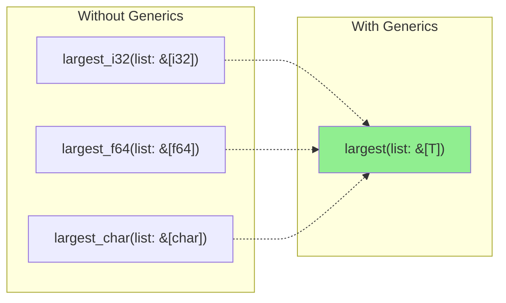
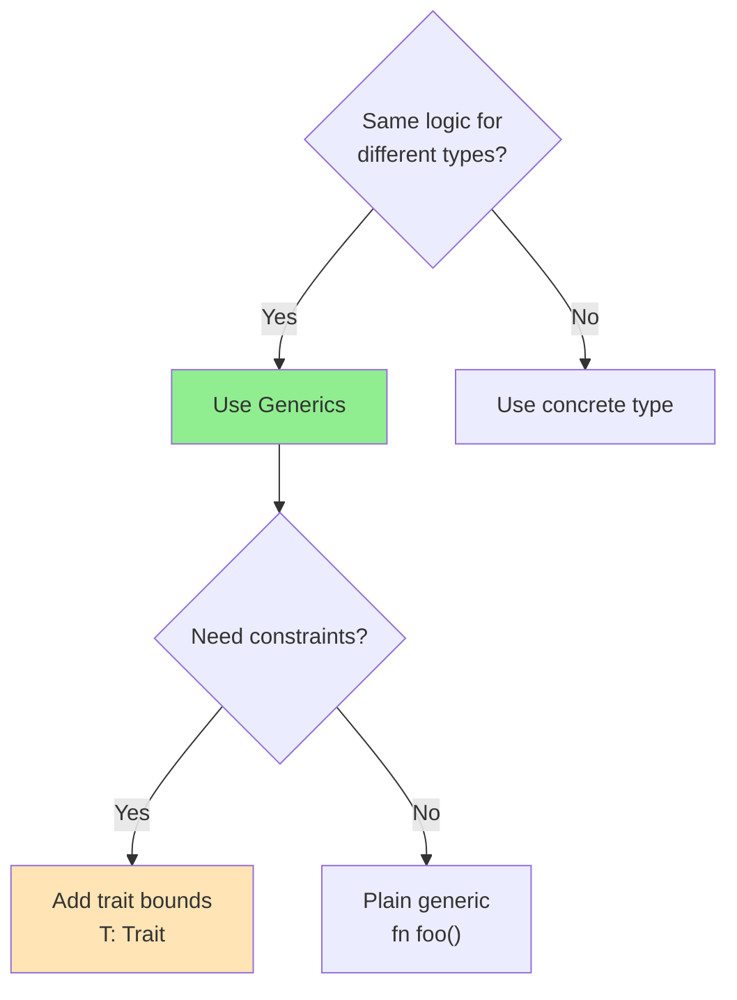
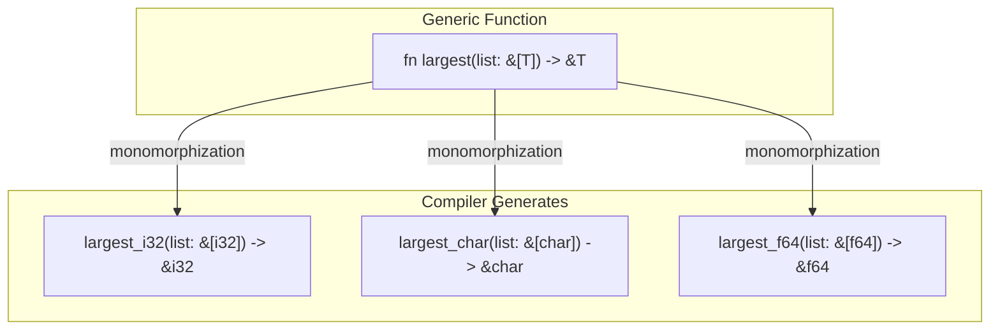
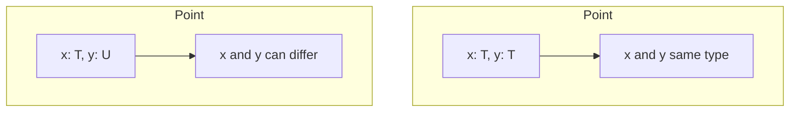
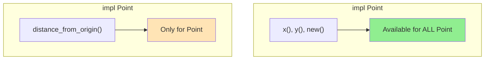
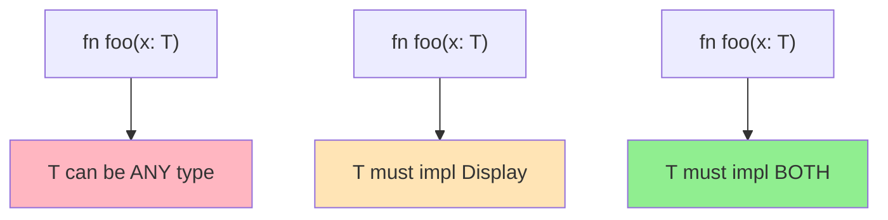
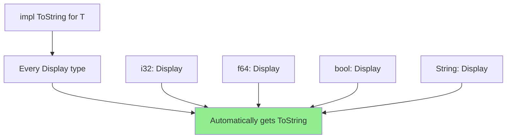
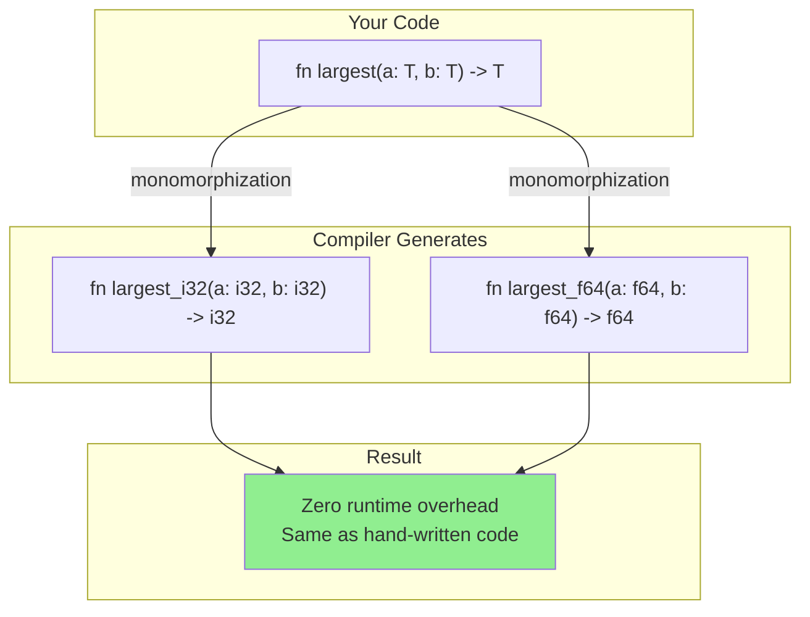
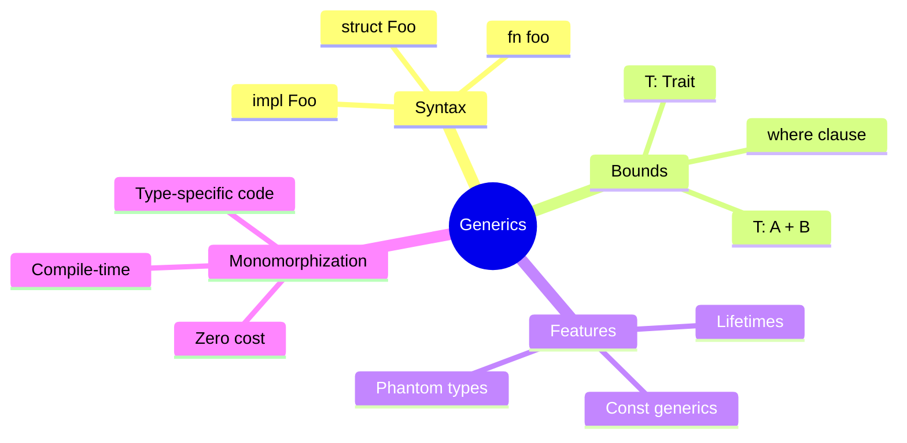

# Generics

## Overview

**Generics** let you write code that works with multiple types while maintaining full type safety. Instead of writing separate functions for each type, you write one function that works with any type meeting certain requirements.



**Key insight**: Generics are a zero-cost abstraction. The compiler generates specialized code for each concrete type (monomorphization), so generic code runs as fast as hand-written specific code.

## When to Use Generics

| Scenario | Use Generics? | Example |
|----------|--------------|---------|
| Same logic, different types | ✓ Yes | `Vec<T>`, `Option<T>` |
| Need type flexibility | ✓ Yes | `fn swap<T>(a: &mut T, b: &mut T)` |
| Algorithm independent of type | ✓ Yes | `fn sort<T: Ord>(list: &mut [T])` |
| Type-specific behavior | ✗ No | Use trait with implementations |
| Known fixed type | ✗ No | Just use the concrete type |



## The Problem Generics Solve

Without generics, you'd duplicate code:

```rust
// Duplicated logic for each type!
fn largest_i32(list: &[i32]) -> &i32 {
    let mut largest = &list[0];
    for item in list {
        if item > largest { largest = item; }
    }
    largest
}

fn largest_char(list: &[char]) -> &char {
    let mut largest = &list[0];
    for item in list {
        if item > largest { largest = item; }
    }
    largest
}
// Imagine doing this for every type...
```

## Generic Functions

One function works for all types:

```rust
fn largest<T: PartialOrd>(list: &[T]) -> &T {
    let mut largest = &list[0];
    for item in list {
        if item > largest {
            largest = item;
        }
    }
    largest
}

fn main() {
    let numbers = vec![34, 50, 25, 100, 65];
    println!("Largest number: {}", largest(&numbers));

    let chars = vec!['y', 'm', 'a', 'q'];
    println!("Largest char: {}", largest(&chars));
}
```



## Generic Structs

```rust
// Single type parameter
struct Point<T> {
    x: T,
    y: T,
}

fn main() {
    let integer_point = Point { x: 5, y: 10 };
    let float_point = Point { x: 1.0, y: 4.0 };

    // Error: x and y must be same type
    // let mixed = Point { x: 5, y: 4.0 };
}
```

### Multiple Type Parameters

```rust
struct Point<T, U> {
    x: T,
    y: U,
}

fn main() {
    let mixed = Point { x: 5, y: 4.0 };      // Point<i32, f64>
    let both_int = Point { x: 1, y: 2 };     // Point<i32, i32>
    let both_str = Point { x: "a", y: "b" }; // Point<&str, &str>
}
```



## Generic Enums

Standard library uses generics extensively:

```rust
// Option: value may or may not exist
enum Option<T> {
    Some(T),
    None,
}

// Result: operation may succeed or fail
enum Result<T, E> {
    Ok(T),
    Err(E),
}

fn main() {
    let some_number: Option<i32> = Some(5);
    let no_number: Option<i32> = None;

    let success: Result<i32, String> = Ok(42);
    let failure: Result<i32, String> = Err("error".to_string());
}
```

## Generic Methods

```rust
struct Point<T> {
    x: T,
    y: T,
}

// Methods for any T
impl<T> Point<T> {
    fn x(&self) -> &T {
        &self.x
    }

    fn y(&self) -> &T {
        &self.y
    }

    fn new(x: T, y: T) -> Self {
        Point { x, y }
    }
}

// Methods only for specific types
impl Point<f64> {
    fn distance_from_origin(&self) -> f64 {
        (self.x.powi(2) + self.y.powi(2)).sqrt()
    }
}

fn main() {
    let p = Point::new(3.0, 4.0);
    println!("Distance: {}", p.distance_from_origin()); // 5.0

    let p_int = Point::new(3, 4);
    // p_int.distance_from_origin(); // Error! Only for f64
}
```



### Mixed Generic Parameters

```rust
struct Point<T, U> {
    x: T,
    y: U,
}

impl<T, U> Point<T, U> {
    // Method introduces its own generic parameters
    fn mixup<V, W>(self, other: Point<V, W>) -> Point<T, W> {
        Point {
            x: self.x,   // Takes x from self (type T)
            y: other.y,  // Takes y from other (type W)
        }
    }
}

fn main() {
    let p1 = Point { x: 5, y: 10.4 };       // Point<i32, f64>
    let p2 = Point { x: "Hello", y: 'c' };  // Point<&str, char>

    let p3 = p1.mixup(p2);  // Point<i32, char>
    println!("p3.x = {}, p3.y = {}", p3.x, p3.y);
}
```

## Trait Bounds

Constrain generics to types with specific capabilities:

```rust
use std::fmt::Display;

// T must implement Display to be printed
fn print_pair<T: Display, U: Display>(a: T, b: U) {
    println!("({}, {})", a, b);
}

// T must be comparable AND displayable
fn print_largest<T: PartialOrd + Display>(a: T, b: T) {
    let largest = if a > b { a } else { b };
    println!("Largest: {}", largest);
}
```



### `where` Clauses

For complex bounds, use `where` for readability:

```rust
use std::fmt::{Debug, Display};

// Hard to read
fn complex<T: Display + Clone, U: Clone + Debug>(t: &T, u: &U) -> i32 {
    // ...
}

// Cleaner with where
fn complex<T, U>(t: &T, u: &U) -> i32
where
    T: Display + Clone,
    U: Clone + Debug,
{
    // ...
}
```

## Conditional Implementation

Implement methods only when bounds are met:

```rust
use std::fmt::Display;

struct Pair<T> {
    x: T,
    y: T,
}

// Always available
impl<T> Pair<T> {
    fn new(x: T, y: T) -> Self {
        Self { x, y }
    }
}

// Only when T is comparable AND displayable
impl<T: Display + PartialOrd> Pair<T> {
    fn cmp_display(&self) {
        if self.x >= self.y {
            println!("Largest: {}", self.x);
        } else {
            println!("Largest: {}", self.y);
        }
    }
}

fn main() {
    let pair = Pair::new(5, 10);
    pair.cmp_display();  // Works - i32 impls Display + PartialOrd

    let pair2 = Pair::new(vec![1], vec![2]);
    // pair2.cmp_display();  // Error - Vec doesn't impl Display
}
```

## Blanket Implementations

Implement a trait for ALL types meeting a bound:

```rust
use std::fmt::Display;

// From standard library: any Display type gets ToString
impl<T: Display> ToString for T {
    fn to_string(&self) -> String {
        format!("{}", self)
    }
}

// Now EVERY Display type has .to_string()
let s = 42.to_string();        // "42"
let s = 3.14.to_string();      // "3.14"
let s = true.to_string();      // "true"
```



## Const Generics

Generic over constant values (Rust 1.51+):

```rust
// Array with generic size
struct Array<T, const N: usize> {
    data: [T; N],
}

impl<T: Default + Copy, const N: usize> Array<T, N> {
    fn new() -> Self {
        Array {
            data: [T::default(); N],
        }
    }

    fn len(&self) -> usize {
        N  // Const generic is a compile-time constant
    }
}

fn main() {
    let arr5: Array<i32, 5> = Array::new();
    let arr10: Array<f64, 10> = Array::new();

    println!("arr5 length: {}", arr5.len());   // 5
    println!("arr10 length: {}", arr10.len()); // 10
}
```

## Generic Lifetimes

Combine type and lifetime parameters:

```rust
struct Excerpt<'a> {
    part: &'a str,
}

impl<'a> Excerpt<'a> {
    fn new(text: &'a str) -> Self {
        Excerpt { part: text }
    }

    fn part(&self) -> &str {
        self.part
    }
}

// Type generics + lifetime generics
fn longest_with_announcement<'a, T: Display>(
    x: &'a str,
    y: &'a str,
    ann: T,
) -> &'a str {
    println!("Announcement: {}", ann);
    if x.len() > y.len() { x } else { y }
}
```

## Turbofish Syntax (`::<>`)

Explicitly specify type parameters:

```rust
fn main() {
    // Type inference
    let v: Vec<i32> = Vec::new();

    // Turbofish - explicit type
    let v = Vec::<i32>::new();

    // Useful with parse
    let n: i32 = "42".parse().unwrap();      // Type annotation
    let n = "42".parse::<i32>().unwrap();    // Turbofish

    // With collect
    let nums: Vec<i32> = (0..5).collect();   // Type annotation
    let nums = (0..5).collect::<Vec<i32>>(); // Turbofish
}
```

## Phantom Types

Type parameter not used in fields, but affects type:

```rust
use std::marker::PhantomData;

// Distance with unit type
struct Distance<Unit> {
    value: f64,
    _marker: PhantomData<Unit>,
}

struct Meters;
struct Feet;

impl<U> Distance<U> {
    fn new(value: f64) -> Self {
        Distance { value, _marker: PhantomData }
    }
}

fn main() {
    let d1: Distance<Meters> = Distance::new(100.0);
    let d2: Distance<Feet> = Distance::new(328.0);

    // Can't accidentally mix units!
    // let sum = d1.value + d2.value;  // Would be wrong semantically
    // But Rust doesn't prevent this automatically...

    // Type-safe operations require explicit conversion
}
```

## Monomorphization: Zero-Cost Abstraction

The compiler generates specific code for each type used:

```rust
// Your generic code
fn largest<T: PartialOrd>(a: T, b: T) -> T {
    if a > b { a } else { b }
}

let x = largest(5, 10);      // Uses i32
let y = largest(1.0, 2.0);   // Uses f64
```



{: .tip }
Generics have **zero runtime cost**—they're as fast as writing type-specific functions by hand.

## Common Generic Patterns

### Pattern 1: Generic Constructor

```rust
struct Wrapper<T> {
    value: T,
}

impl<T> Wrapper<T> {
    fn new(value: T) -> Self {
        Wrapper { value }
    }

    fn into_inner(self) -> T {
        self.value
    }
}
```

### Pattern 2: Generic Conversion

```rust
impl<T, U> From<Wrapper<T>> for Wrapper<U>
where
    U: From<T>,
{
    fn from(wrapper: Wrapper<T>) -> Self {
        Wrapper {
            value: U::from(wrapper.value),
        }
    }
}
```

### Pattern 3: Builder with Generics

```rust
struct Builder<State> {
    value: i32,
    _state: PhantomData<State>,
}

struct Initial;
struct Configured;

impl Builder<Initial> {
    fn new() -> Self {
        Builder { value: 0, _state: PhantomData }
    }

    fn configure(self, value: i32) -> Builder<Configured> {
        Builder { value, _state: PhantomData }
    }
}

impl Builder<Configured> {
    fn build(self) -> i32 {
        self.value
    }
}

// Can only build after configuring!
let result = Builder::new()
    .configure(42)
    .build();
```

### Pattern 4: Default Type Parameters

```rust
struct Container<T, Allocator = DefaultAllocator> {
    data: Vec<T>,
    _allocator: PhantomData<Allocator>,
}

// Usually use default
let c: Container<i32> = Container::default();

// Can specify custom allocator
let c: Container<i32, CustomAllocator> = Container::default();
```

## Summary



| Feature | Syntax | Example |
|---------|--------|---------|
| Generic function | `fn foo<T>()` | `fn swap<T>(a: &mut T, b: &mut T)` |
| Generic struct | `struct S<T>` | `struct Point<T> { x: T, y: T }` |
| Generic enum | `enum E<T>` | `enum Option<T> { Some(T), None }` |
| Trait bound | `T: Trait` | `fn print<T: Display>(x: T)` |
| Multiple bounds | `T: A + B` | `T: Clone + Debug` |
| Where clause | `where T: Trait` | Cleaner complex bounds |
| Const generic | `const N: usize` | `struct Array<T, const N: usize>` |
| Turbofish | `::<Type>` | `"42".parse::<i32>()` |

## Exercises

1. Create a generic `Stack<T>` with push, pop, and peek methods
2. Implement a generic `min` function for any type that implements `PartialOrd`
3. Create a `Matrix<T, const ROWS: usize, const COLS: usize>` type with basic operations

## See Also

- [Traits]() - Defining shared behavior
- [Advanced Traits]() - Associated types and advanced patterns
- [Advanced Types]() - Newtype pattern and type aliases

## Next Steps

Congratulations! You've completed Part 2: Fundamentals. Continue to [Part 3: Intermediate]() to learn about collections, iterators, and concurrency.
