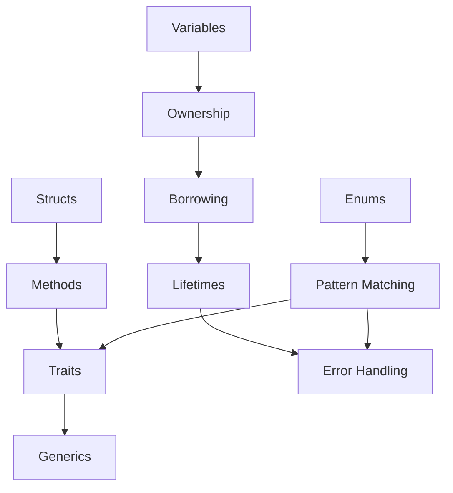

# Part 2: Rust Fundamentals

This part covers the core concepts that make Rust unique: ownership, borrowing, and lifetimes. Mastering these concepts is essential for writing idiomatic Rust code.

## What You'll Learn

- Variables, mutability, and data types
- Functions and control flow
- Rust's ownership system
- References and borrowing
- Lifetimes
- Structs and enums
- Pattern matching
- Error handling
- Traits and generics

## Chapters

1. [Variables and Types]() - let, mut, scalars, and compounds
2. [Functions]() - Syntax, parameters, and returns
3. [Ownership]() - Rust's unique memory model
4. [Borrowing]() - References and the borrowing rules
5. [Lifetimes]() - Annotations and elision
6. [Structs]() - Custom data types
7. [Enums]() - Pattern matching with Option and Result
8. [Error Handling]() - Panic, Result, and the ? operator
9. [Traits]() - Shared behavior
10. [Generics]() - Type parameters and bounds

## The Big Picture



## Prerequisites

- Completed [Part 1: Getting Started]()
- Rust installed and working
- Basic programming knowledge

## Key Concepts Preview

### Ownership

Every value has exactly one owner. When the owner goes out of scope, the value is dropped:

```rust
{
    let s = String::from("hello");  // s owns the String
}  // s goes out of scope, String is dropped
```

### Borrowing

You can borrow references to values without taking ownership:

```rust
fn calculate_length(s: &String) -> usize {
    s.len()  // Use s, but don't own it
}
```

### Lifetimes

Lifetimes ensure references are valid:

```rust
fn longest<'a>(x: &'a str, y: &'a str) -> &'a str {
    if x.len() > y.len() { x } else { y }
}
```

{: .tip }
Don't worry if these look confusing now. Each chapter explains these concepts step by step with plenty of examples.

## Time Estimate

Plan for 4-6 hours to work through this part thoroughly. Take breaks between chapters to let the concepts sink in.

## Next Steps

Start with [Variables and Types]() to begin your Rust journey.
