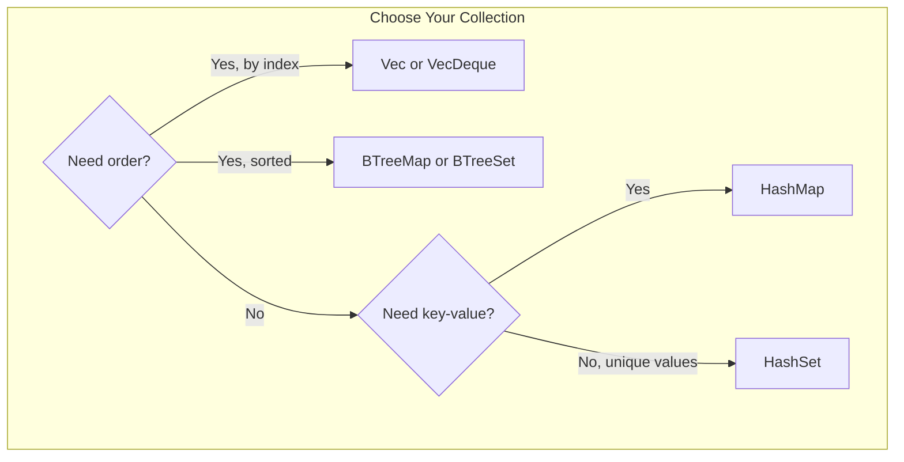
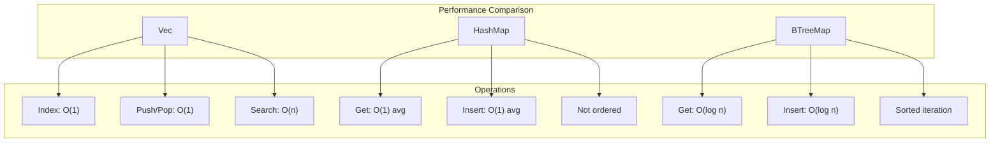
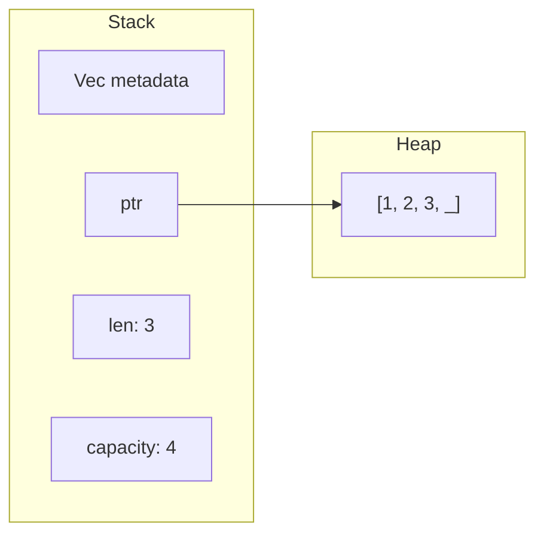
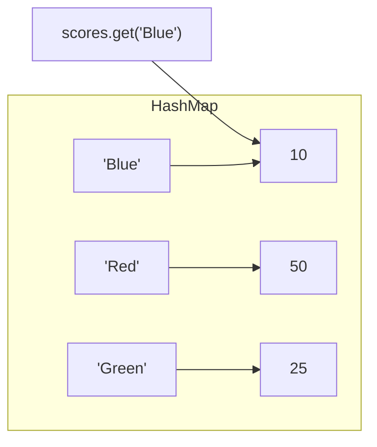
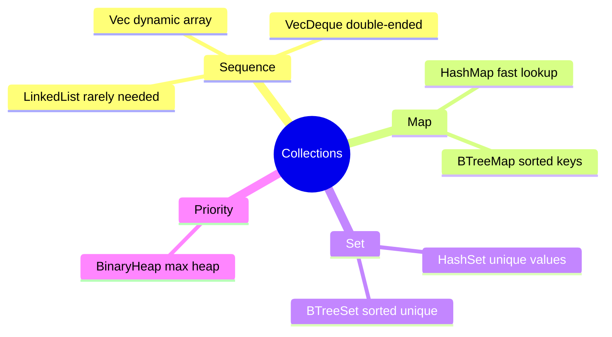

# Collections

## Overview

**Collections** are data structures that can hold multiple values and grow or shrink at runtime. Unlike arrays and tuples (stored on the stack with fixed size), collections store data on the heap.



**Key insight**: Choose collections based on your access patterns—`Vec` for indexed access, `HashMap` for key lookup, `HashSet` for membership testing.

## When to Use Each Collection

| Collection | Best For | Avoid When |
|------------|----------|------------|
| `Vec<T>` | Ordered sequences, stack-like access | Need fast key lookup |
| `HashMap<K,V>` | Fast key-based lookup | Need ordering |
| `HashSet<T>` | Unique values, membership tests | Need duplicates |
| `VecDeque<T>` | Push/pop both ends (queue) | Only need one end |
| `BTreeMap<K,V>` | Sorted key order, range queries | Unordered is fine |
| `BinaryHeap<T>` | Priority queue, always get max | Need arbitrary access |



## Vec<T> - Dynamic Arrays

### Creating Vectors



```rust
fn main() {
    // Empty vector with type annotation
    let v: Vec<i32> = Vec::new();

    // Using vec! macro
    let v = vec![1, 2, 3];

    // With capacity
    let mut v = Vec::with_capacity(10);
}
```

### Adding Elements

```rust
fn main() {
    let mut v = Vec::new();

    v.push(1);
    v.push(2);
    v.push(3);

    // Extend from iterator
    v.extend([4, 5, 6]);
}
```

### Accessing Elements

```rust
fn main() {
    let v = vec![1, 2, 3, 4, 5];

    // Index (panics if out of bounds)
    let third = v[2];

    // get() returns Option (safe)
    match v.get(2) {
        Some(x) => println!("Third element: {}", x),
        None => println!("No third element"),
    }

    // First and last
    let first = v.first();  // Option<&T>
    let last = v.last();    // Option<&T>
}
```

### Iterating

```rust
fn main() {
    let v = vec![1, 2, 3];

    // Immutable iteration
    for i in &v {
        println!("{}", i);
    }

    // Mutable iteration
    let mut v = vec![1, 2, 3];
    for i in &mut v {
        *i += 10;
    }

    // Consuming iteration
    for i in v {
        println!("{}", i);
    }
    // v is no longer valid
}
```

### Common Operations

```rust
fn main() {
    let mut v = vec![1, 2, 3, 4, 5];

    // Length and capacity
    println!("len: {}, capacity: {}", v.len(), v.capacity());

    // Remove elements
    let last = v.pop();              // Remove last
    let second = v.remove(1);        // Remove at index
    v.retain(|x| *x > 2);           // Keep elements matching predicate

    // Insert
    v.insert(0, 10);                 // Insert at index

    // Sort
    v.sort();
    v.sort_by(|a, b| b.cmp(a));     // Reverse sort

    // Dedup
    v.dedup();                       // Remove consecutive duplicates
}
```

## HashMap<K, V>

A hash map stores key-value pairs with O(1) average lookup time.



### Creating HashMaps

```rust
use std::collections::HashMap;

fn main() {
    // Empty
    let mut scores: HashMap<String, i32> = HashMap::new();

    // From iterators
    let teams = vec![String::from("Blue"), String::from("Red")];
    let initial_scores = vec![10, 50];
    let scores: HashMap<_, _> = teams.into_iter().zip(initial_scores).collect();
}
```

### Inserting and Updating

```rust
use std::collections::HashMap;

fn main() {
    let mut scores = HashMap::new();

    // Insert
    scores.insert(String::from("Blue"), 10);
    scores.insert(String::from("Red"), 50);

    // Overwrite
    scores.insert(String::from("Blue"), 25);

    // Insert only if key doesn't exist
    scores.entry(String::from("Yellow")).or_insert(50);

    // Update based on old value
    let count = scores.entry(String::from("Blue")).or_insert(0);
    *count += 1;
}
```

### Accessing Values

```rust
use std::collections::HashMap;

fn main() {
    let mut scores = HashMap::new();
    scores.insert(String::from("Blue"), 10);

    // get() returns Option<&V>
    let score = scores.get("Blue");

    // Direct access (panics if missing in some APIs)
    if let Some(s) = scores.get("Blue") {
        println!("Score: {}", s);
    }

    // Check existence
    if scores.contains_key("Blue") {
        println!("Blue team exists");
    }
}
```

### Iterating

```rust
use std::collections::HashMap;

fn main() {
    let scores = HashMap::from([
        (String::from("Blue"), 10),
        (String::from("Red"), 50),
    ]);

    // Iterate over key-value pairs
    for (key, value) in &scores {
        println!("{}: {}", key, value);
    }

    // Keys only
    for key in scores.keys() {
        println!("{}", key);
    }

    // Values only
    for value in scores.values() {
        println!("{}", value);
    }
}
```

## String

Strings in Rust are UTF-8 encoded.

### String Types

| Type | Description |
|------|-------------|
| `String` | Owned, growable |
| `&str` | Borrowed string slice |
| `&'static str` | String literal |

### Creating Strings

```rust
fn main() {
    // From literal
    let s = String::from("hello");
    let s = "hello".to_string();

    // Empty
    let s = String::new();

    // With capacity
    let s = String::with_capacity(10);
}
```

### Modifying Strings

```rust
fn main() {
    let mut s = String::from("hello");

    // Append
    s.push(' ');           // Single char
    s.push_str("world");   // String slice

    // Concatenate
    let s1 = String::from("Hello, ");
    let s2 = String::from("world!");
    let s3 = s1 + &s2;     // s1 is moved

    // format! macro (doesn't move)
    let s1 = String::from("Hello");
    let s2 = String::from("world");
    let s3 = format!("{}, {}!", s1, s2);
}
```

### Indexing and Slicing

```rust
fn main() {
    let s = String::from("hello");

    // Cannot index directly (UTF-8 safety)
    // let c = s[0];  // Error!

    // Slice by byte range (must be valid UTF-8 boundary)
    let hello = &s[0..5];

    // Iterate over chars
    for c in s.chars() {
        println!("{}", c);
    }

    // Iterate over bytes
    for b in s.bytes() {
        println!("{}", b);
    }
}
```

{: .warning }
String indexing by byte position can panic if you split a multi-byte character.

### Common Operations

```rust
fn main() {
    let s = String::from("  hello world  ");

    // Trim whitespace
    let trimmed = s.trim();

    // Split
    for word in s.split_whitespace() {
        println!("{}", word);
    }

    // Replace
    let new_s = s.replace("hello", "hi");

    // Contains
    if s.contains("hello") {
        println!("Found!");
    }

    // Length
    println!("Bytes: {}", s.len());
    println!("Chars: {}", s.chars().count());
}
```

## Other Collections

| Collection | Use Case |
|------------|----------|
| `VecDeque<T>` | Double-ended queue |
| `LinkedList<T>` | Linked list (rarely needed) |
| `HashSet<T>` | Unique values, fast lookup |
| `BTreeMap<K, V>` | Sorted map |
| `BTreeSet<T>` | Sorted set |
| `BinaryHeap<T>` | Priority queue |

### HashSet Example

```rust
use std::collections::HashSet;

fn main() {
    let mut books = HashSet::new();

    books.insert("A Game of Thrones");
    books.insert("The Name of the Wind");
    books.insert("A Game of Thrones");  // Duplicate ignored

    println!("Books: {}", books.len());  // 2

    // Set operations
    let set1: HashSet<_> = [1, 2, 3].into_iter().collect();
    let set2: HashSet<_> = [2, 3, 4].into_iter().collect();

    let intersection: HashSet<_> = set1.intersection(&set2).collect();
    let union: HashSet<_> = set1.union(&set2).collect();
}
```

## Summary



| Collection | Ordered | Unique | Access | Use Case |
|------------|---------|--------|--------|----------|
| `Vec<T>` | Yes | No | Index O(1) | Default choice for lists |
| `VecDeque<T>` | Yes | No | Index O(1) | Queue/deque operations |
| `HashMap<K,V>` | No | Keys | Key O(1)* | Fast key-value lookup |
| `HashSet<T>` | No | Yes | Contains O(1)* | Membership testing |
| `BTreeMap<K,V>` | Sorted | Keys | Key O(log n) | Range queries, sorted iteration |
| `BTreeSet<T>` | Sorted | Yes | Contains O(log n) | Sorted unique values |
| `BinaryHeap<T>` | Heap | No | Max O(1) | Priority queue |

*O(1) average, O(n) worst case

## Exercises

1. Count word frequency in a text using HashMap
2. Remove duplicates from a Vec while preserving order
3. Implement a simple LRU cache using HashMap and VecDeque

## Next Steps

Learn about [Iterators]() to process collections efficiently.
