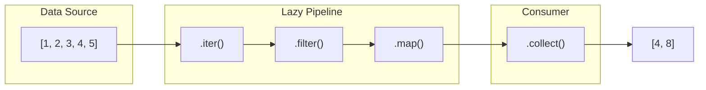
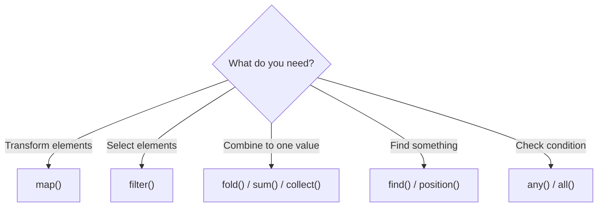
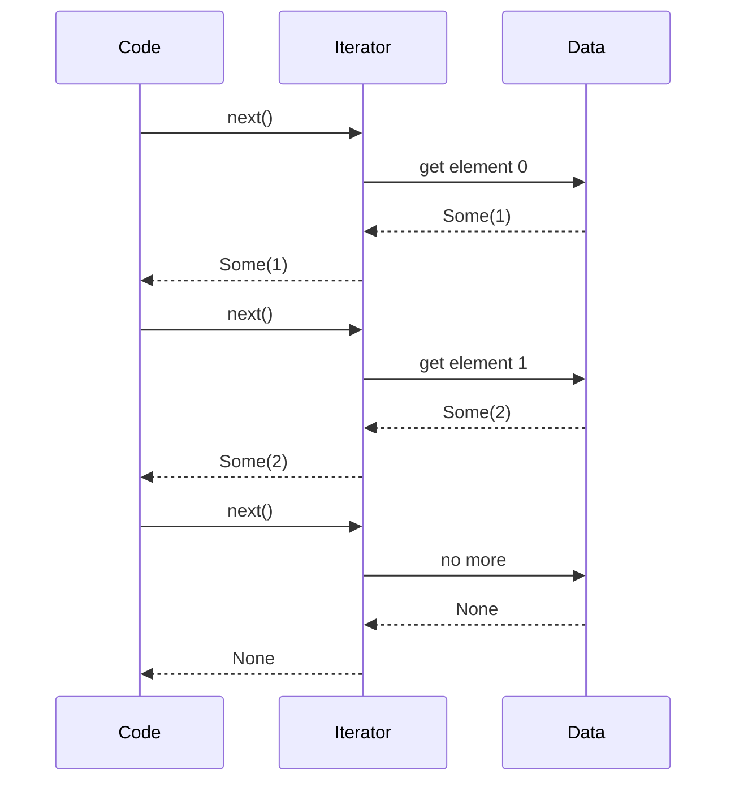
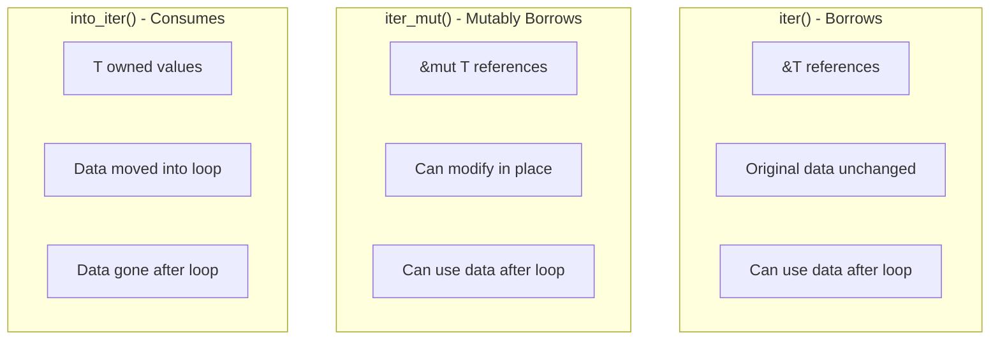
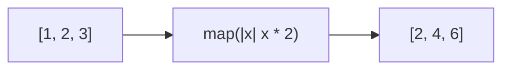
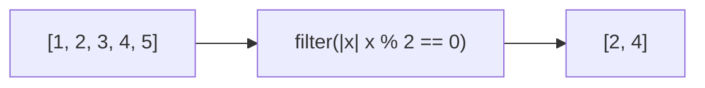
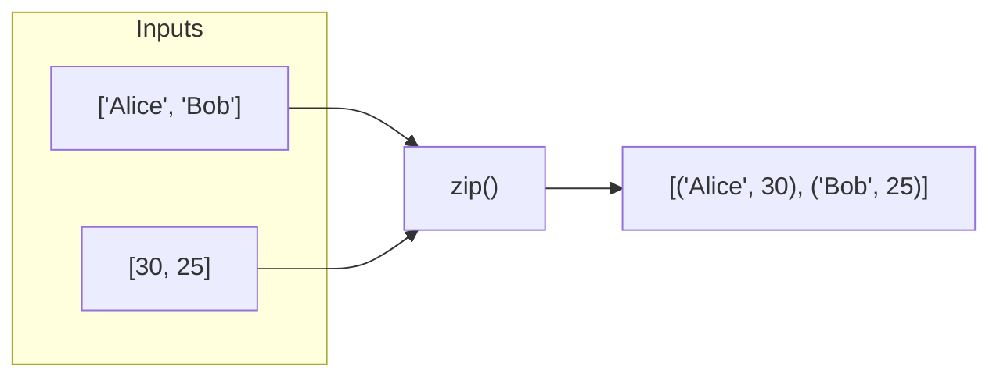
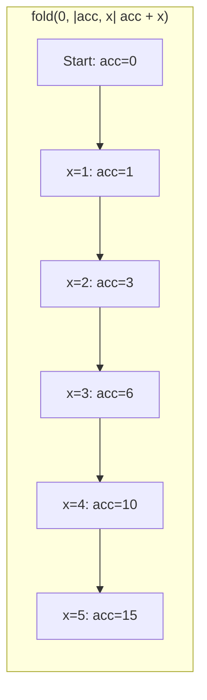
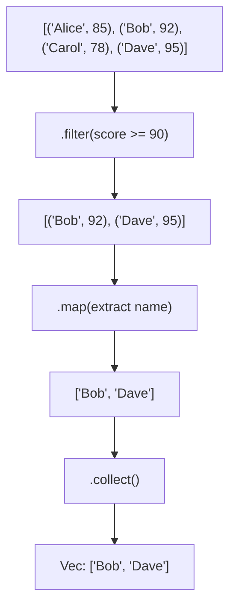
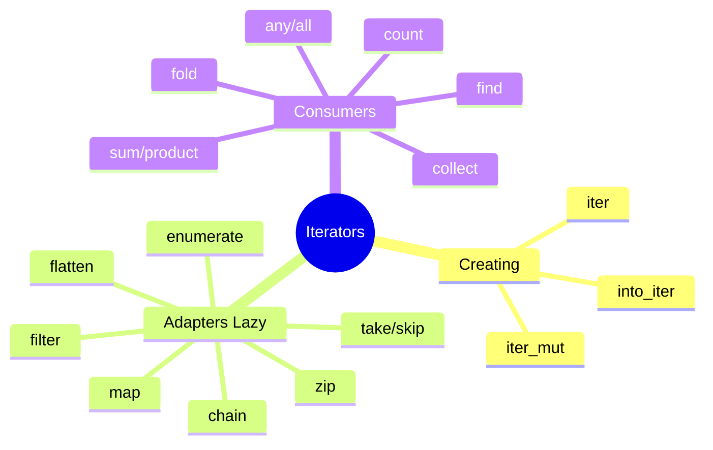

# Iterators

## Overview

**Iterators** are Rust's abstraction for processing sequences of elements. They are:
- **Lazy**: No work is done until you consume the iterator
- **Composable**: Chain multiple operations fluently
- **Zero-cost**: Compile to the same code as hand-written loops



**Key insight**: Adapters like `filter()` and `map()` don't execute immediately—they build a pipeline that executes when you call a consumer like `collect()`.

## When to Use Iterators

| Scenario | Approach |
|----------|----------|
| Transform each element | `iter().map(...)` |
| Filter elements | `iter().filter(...)` |
| Reduce to single value | `iter().fold(...)` or `sum()` |
| Find an element | `iter().find(...)` |
| Check a condition | `iter().any(...)` or `all(...)` |
| Process in parallel | `par_iter()` with rayon |



## The Iterator Trait

Every iterator implements this trait:

```rust
trait Iterator {
    type Item;  // The type of elements
    fn next(&mut self) -> Option<Self::Item>;  // Get next element
}
```



## Creating Iterators: iter(), iter_mut(), into_iter()

Understanding the three ways to iterate is crucial:



### `iter()` - Borrow Elements

```rust
fn main() {
    let v = vec![1, 2, 3];

    for x in v.iter() {
        println!("{}", x);  // x is &i32
    }

    // v is still valid!
    println!("Length: {}", v.len());
}
```

### `iter_mut()` - Mutably Borrow Elements

```rust
fn main() {
    let mut v = vec![1, 2, 3];

    for x in v.iter_mut() {
        *x *= 2;  // x is &mut i32
    }

    println!("{:?}", v);  // [2, 4, 6]
}
```

### `into_iter()` - Consume Elements

```rust
fn main() {
    let v = vec![String::from("a"), String::from("b")];

    for s in v.into_iter() {
        println!("{}", s);  // s is String (owned)
    }

    // v is no longer valid - it was consumed!
    // println!("{:?}", v);  // Error!
}
```

### Quick Reference

| Method | Element Type | Ownership | Use After? |
|--------|--------------|-----------|------------|
| `iter()` | `&T` | Borrows | Yes |
| `iter_mut()` | `&mut T` | Mutably borrows | Yes |
| `into_iter()` | `T` | Takes ownership | No |

## Iterator Adapters (Lazy)

Adapters transform iterators without consuming them.

### `map()` - Transform Each Element

```rust
let doubled: Vec<i32> = vec![1, 2, 3]
    .iter()
    .map(|x| x * 2)
    .collect();
// [2, 4, 6]
```



### `filter()` - Keep Matching Elements

```rust
let evens: Vec<&i32> = vec![1, 2, 3, 4, 5]
    .iter()
    .filter(|x| *x % 2 == 0)
    .collect();
// [&2, &4]
```



### `filter_map()` - Filter and Transform

Combines filter and map, skipping `None` values:

```rust
let numbers: Vec<i32> = vec!["1", "two", "3", "four"]
    .iter()
    .filter_map(|s| s.parse().ok())
    .collect();
// [1, 3]
```

### `take()` and `skip()`

```rust
let v = vec![1, 2, 3, 4, 5];

let first_three: Vec<_> = v.iter().take(3).collect();  // [1, 2, 3]
let skip_two: Vec<_> = v.iter().skip(2).collect();     // [3, 4, 5]
```

### `enumerate()` - Add Index

```rust
for (index, value) in vec!['a', 'b', 'c'].iter().enumerate() {
    println!("{}: {}", index, value);
}
// 0: a
// 1: b
// 2: c
```

### `zip()` - Pair Two Iterators

```rust
let names = vec!["Alice", "Bob"];
let ages = vec![30, 25];

let people: Vec<_> = names.iter().zip(ages.iter()).collect();
// [("Alice", 30), ("Bob", 25)]
```



### `chain()` - Concatenate Iterators

```rust
let a = vec![1, 2];
let b = vec![3, 4];

let combined: Vec<_> = a.iter().chain(b.iter()).collect();
// [1, 2, 3, 4]
```

### `flatten()` - Flatten Nested Structure

```rust
let nested = vec![vec![1, 2], vec![3, 4]];
let flat: Vec<_> = nested.into_iter().flatten().collect();
// [1, 2, 3, 4]
```

### `flat_map()` - Map Then Flatten

```rust
let words = vec!["hello", "world"];
let chars: Vec<_> = words.iter()
    .flat_map(|s| s.chars())
    .collect();
// ['h', 'e', 'l', 'l', 'o', 'w', 'o', 'r', 'l', 'd']
```

## Consuming Adapters (Execute Pipeline)

These methods consume the iterator and produce a result.

### `collect()` - Gather Into Collection

```rust
// Into Vec
let v: Vec<i32> = (1..=5).collect();

// Into HashSet
use std::collections::HashSet;
let set: HashSet<i32> = (1..=5).collect();

// Into HashMap
use std::collections::HashMap;
let map: HashMap<_, _> = vec![("a", 1), ("b", 2)].into_iter().collect();
```

### `sum()` and `product()`

```rust
let sum: i32 = (1..=5).sum();      // 15
let product: i32 = (1..=5).product();  // 120
```

### `fold()` - Custom Reduction

```rust
// Sum with initial value
let sum = (1..=5).fold(0, |acc, x| acc + x);  // 15

// Build a string
let s = (1..=5).fold(String::new(), |acc, x| {
    format!("{}{}", acc, x)
});  // "12345"

// Complex accumulator
let (evens, odds): (Vec<_>, Vec<_>) = (1..=10)
    .fold((vec![], vec![]), |(mut e, mut o), x| {
        if x % 2 == 0 { e.push(x); } else { o.push(x); }
        (e, o)
    });
```



### `find()` - First Match

```rust
let v = vec![1, 2, 3, 4, 5];
let first_even = v.iter().find(|x| *x % 2 == 0);  // Some(&2)
let not_found = v.iter().find(|x| *x > 10);       // None
```

### `position()` - Index of First Match

```rust
let v = vec![1, 2, 3, 4, 5];
let pos = v.iter().position(|x| *x == 3);  // Some(2)
```

### `any()` and `all()`

```rust
let v = vec![1, 2, 3, 4, 5];

let has_even = v.iter().any(|x| x % 2 == 0);     // true
let all_positive = v.iter().all(|x| *x > 0);     // true
let all_even = v.iter().all(|x| x % 2 == 0);     // false
```

### `count()`, `min()`, `max()`

```rust
let v = vec![3, 1, 4, 1, 5, 9];

let count = v.iter().count();                    // 6
let min = v.iter().min();                        // Some(&1)
let max = v.iter().max();                        // Some(&9)
let even_count = v.iter().filter(|x| *x % 2 == 0).count();  // 1
```

## Chaining Operations

Build complex pipelines by chaining adapters:

```rust
let data = vec![
    ("Alice", 85),
    ("Bob", 92),
    ("Carol", 78),
    ("Dave", 95),
];

let top_scorers: Vec<&str> = data.iter()
    .filter(|(_, score)| *score >= 90)  // Keep high scores
    .map(|(name, _)| *name)              // Extract names
    .collect();

// ["Bob", "Dave"]
```



## Creating Custom Iterators

```rust
struct Fibonacci {
    curr: u64,
    next: u64,
}

impl Fibonacci {
    fn new() -> Self {
        Fibonacci { curr: 0, next: 1 }
    }
}

impl Iterator for Fibonacci {
    type Item = u64;

    fn next(&mut self) -> Option<Self::Item> {
        let result = self.curr;
        self.curr = self.next;
        self.next = result + self.next;
        Some(result)
    }
}

fn main() {
    // First 10 Fibonacci numbers
    let fibs: Vec<_> = Fibonacci::new().take(10).collect();
    // [0, 1, 1, 2, 3, 5, 8, 13, 21, 34]

    // Sum of even Fibonacci numbers under 100
    let sum: u64 = Fibonacci::new()
        .take_while(|&x| x < 100)
        .filter(|x| x % 2 == 0)
        .sum();
    // 44
}
```

## Performance: Zero-Cost Abstraction

Iterators compile to the same code as manual loops:

```rust
// These produce IDENTICAL assembly:

// Iterator version
let sum: i32 = (0..1000)
    .filter(|x| x % 2 == 0)
    .map(|x| x * x)
    .sum();

// Manual loop version
let mut sum = 0;
for x in 0..1000 {
    if x % 2 == 0 {
        sum += x * x;
    }
}
```

The compiler optimizes iterator chains into efficient loops with no function call overhead.

## Common Patterns

### Process and Collect

```rust
let processed: Vec<_> = data.iter()
    .filter(|x| x.is_valid())
    .map(|x| x.transform())
    .collect();
```

### Find and Extract

```rust
let result = items.iter()
    .find(|x| x.id == target_id)
    .map(|x| x.value.clone());  // Returns Option<Value>
```

### Partition

```rust
let (passing, failing): (Vec<_>, Vec<_>) = students.iter()
    .partition(|s| s.grade >= 60);
```

### Group By (using fold)

```rust
use std::collections::HashMap;

let by_category: HashMap<&str, Vec<&Item>> = items.iter()
    .fold(HashMap::new(), |mut map, item| {
        map.entry(item.category).or_default().push(item);
        map
    });
```

## Summary



| Adapter | Purpose |
|---------|---------|
| `map()` | Transform elements |
| `filter()` | Keep matching elements |
| `take(n)` | First n elements |
| `skip(n)` | Skip first n |
| `enumerate()` | Add index |
| `zip()` | Pair with another iterator |
| `chain()` | Concatenate iterators |
| `flatten()` | Flatten nested iterators |
| `collect()` | Gather into collection |
| `fold()` | Reduce to single value |
| `find()` | First matching element |

## See Also

- [Utilities Libraries]() - itertools and more iterator utilities
- [Closures]() - The anonymous functions used with iterators

## Next Steps

Learn about [Closures]() to understand the anonymous functions used in iterators.
