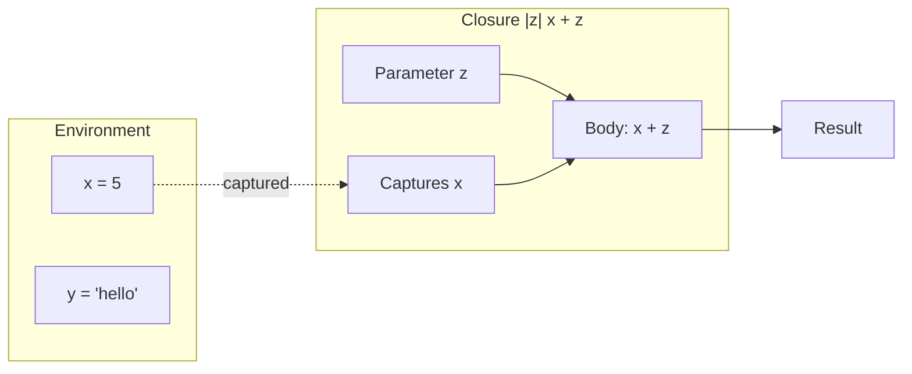
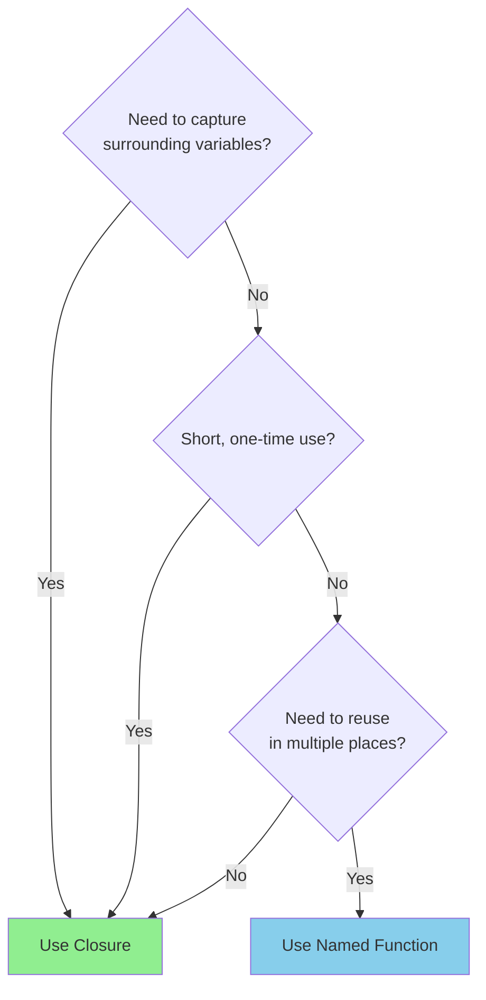
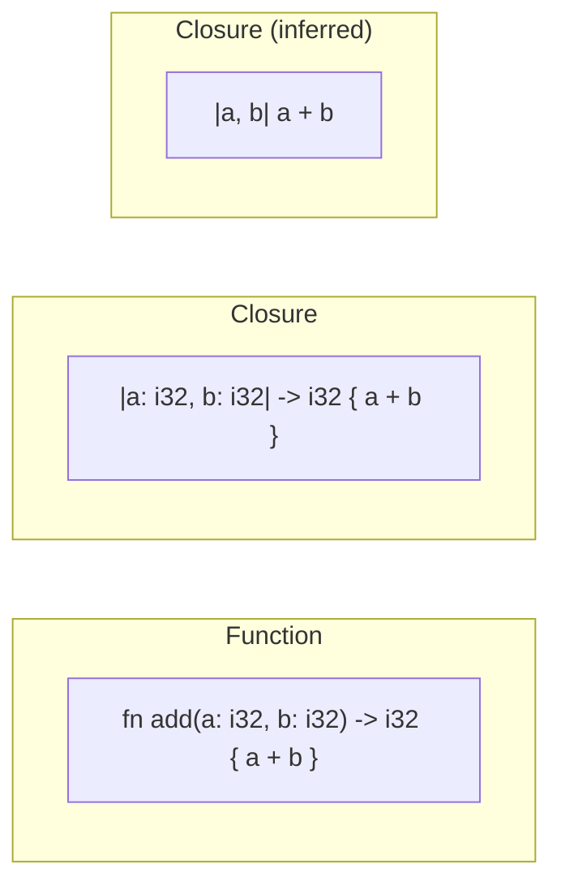
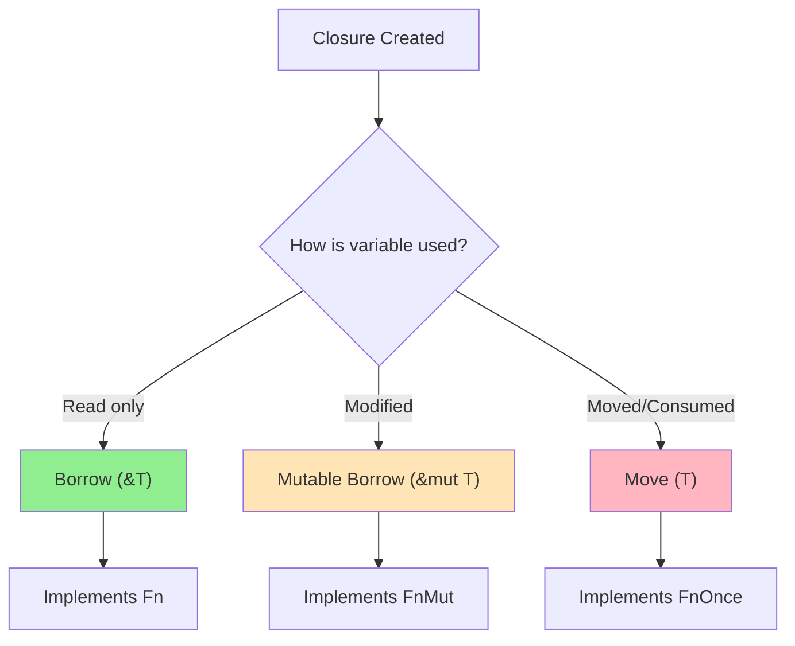
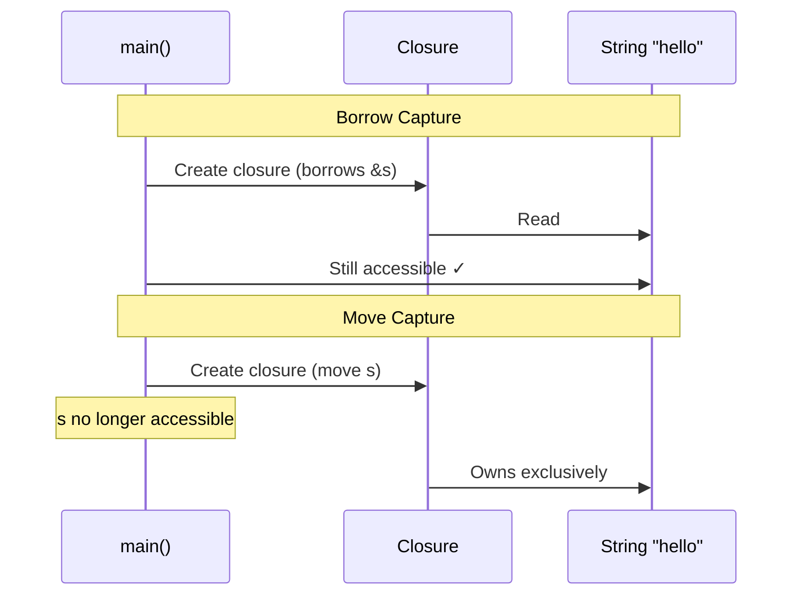
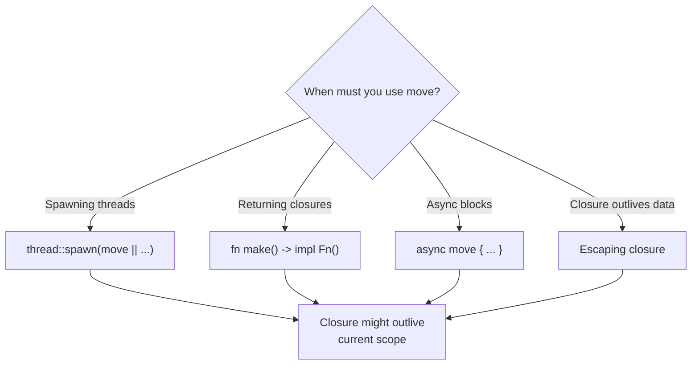
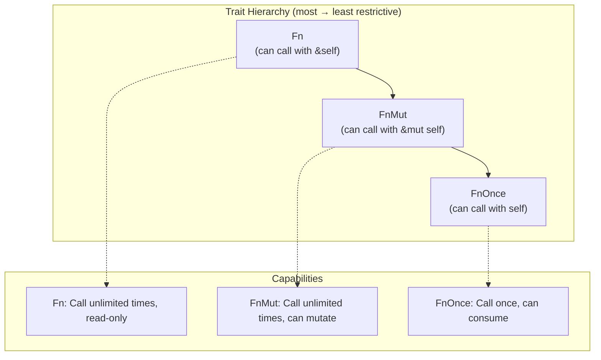
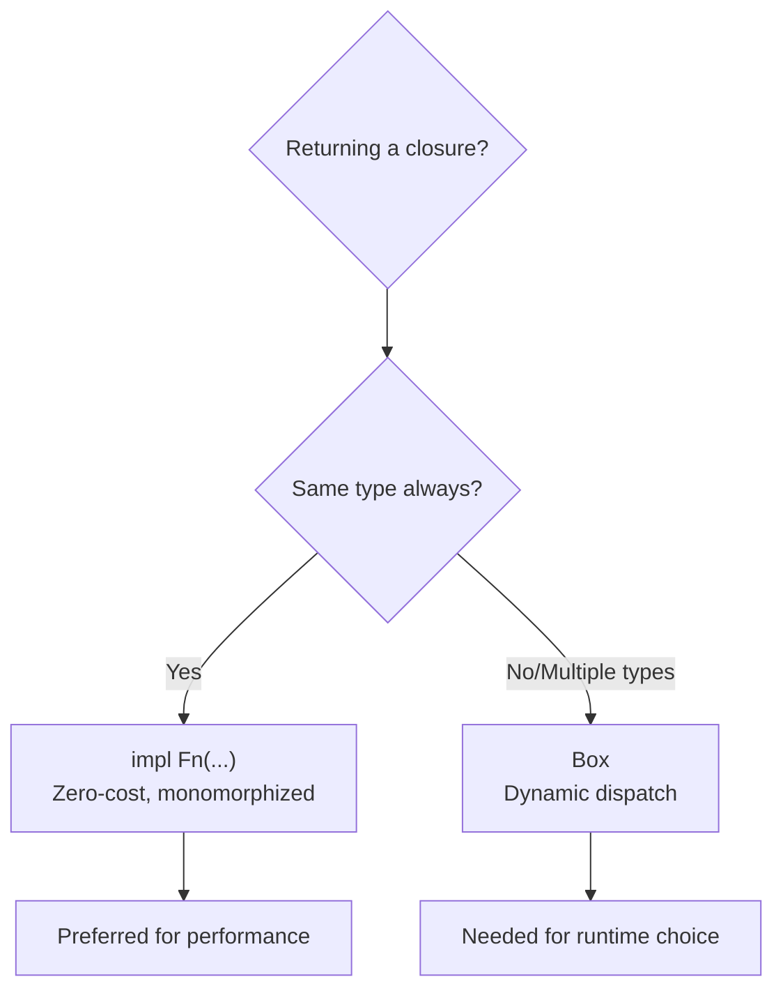
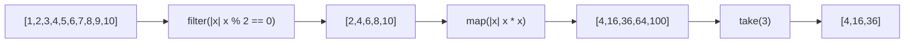
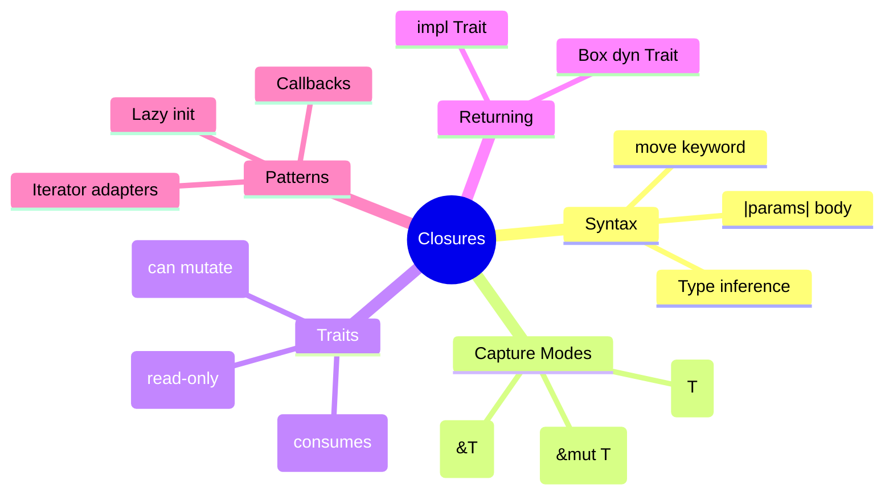

# Closures

## Overview

**Closures** are anonymous functions that can capture variables from their enclosing environment. They're one of Rust's most powerful features, enabling functional programming patterns like `map`, `filter`, and `fold`.



**Key insight**: Unlike regular functions, closures can "close over" their environment—capturing variables from the scope where they're defined.

## When to Use Closures

| Scenario | Use Closure | Use Function |
|----------|-------------|--------------|
| Need to capture environment | ✓ | ✗ |
| Pass behavior to iterator methods | ✓ Common | Possible |
| Short, one-off logic | ✓ Preferred | Overkill |
| Reusable, named behavior | Possible | ✓ Preferred |
| Need to be generic over types | ✗ | ✓ |
| Callbacks and event handlers | ✓ Common | Possible |



## Basic Syntax

```rust
fn main() {
    // Full syntax with type annotations
    let add = |a: i32, b: i32| -> i32 { a + b };

    // Type inference (most common)
    let add = |a, b| a + b;

    // Single expression (no braces needed)
    let double = |x| x * 2;

    // No parameters
    let greet = || println!("Hello!");

    println!("{}", add(1, 2));    // 3
    println!("{}", double(5));    // 10
    greet();                       // Hello!
}
```

### Syntax Comparison



## Capturing the Environment

Closures can capture variables from their enclosing scope—this is what makes them special.

```rust
fn main() {
    let multiplier = 3;

    // Closure captures `multiplier` from environment
    let multiply = |x| x * multiplier;

    println!("{}", multiply(5));  // 15
    println!("{}", multiply(10)); // 30

    // multiplier is still accessible here
    println!("Multiplier was: {}", multiplier);
}
```

### The Three Capture Modes

Rust closures capture variables in the least restrictive way possible:



### Capture Mode Examples

```rust
fn main() {
    // === BORROW (Immutable) ===
    let s = String::from("hello");
    let print = || println!("{}", s);  // Borrows s as &String
    print();
    print();  // Can call multiple times
    println!("{}", s);  // s still valid!

    // === MUTABLE BORROW ===
    let mut count = 0;
    let mut increment = || {
        count += 1;  // Mutably borrows count
    };
    increment();
    increment();
    println!("Count: {}", count);  // 2

    // === MOVE (Ownership Transfer) ===
    let s = String::from("hello");
    let consume = move || {
        println!("{}", s);  // s moved into closure
        drop(s);            // Can drop because we own it
    };
    consume();
    // consume();  // Error: closure consumed s
    // println!("{}", s);  // Error: s was moved
}
```



## The `move` Keyword

Force a closure to take ownership of all captured variables:

```rust
fn main() {
    let data = vec![1, 2, 3];

    // Without move: borrows data
    let print_ref = || println!("{:?}", data);

    // With move: takes ownership of data
    let print_owned = move || println!("{:?}", data);

    // data is no longer accessible here
    // println!("{:?}", data);  // Error!
}
```

### When `move` is Required



```rust
use std::thread;

fn main() {
    let v = vec![1, 2, 3];

    // REQUIRED: thread might outlive main's scope
    let handle = thread::spawn(move || {
        println!("Vector: {:?}", v);
    });

    handle.join().unwrap();
}
```

## Closure Traits: Fn, FnMut, FnOnce

Every closure implements one or more of these traits based on how it captures:



| Trait | `self` Type | Can Call Multiple Times? | Can Mutate Captures? | Can Consume Captures? |
|-------|-------------|--------------------------|----------------------|-----------------------|
| `Fn` | `&self` | ✓ Yes | ✗ No | ✗ No |
| `FnMut` | `&mut self` | ✓ Yes | ✓ Yes | ✗ No |
| `FnOnce` | `self` | ✗ Once only | ✓ Yes | ✓ Yes |

{: .note }
`Fn` implies `FnMut` implies `FnOnce`. A closure implementing `Fn` can be used anywhere `FnOnce` is expected.

### Trait Determination

```rust
fn main() {
    let s = String::from("hello");

    // Implements Fn (only reads s)
    let read_only = || println!("{}", s);

    // Implements FnMut (mutates captured variable)
    let mut x = 0;
    let mut mutating = || x += 1;

    // Implements FnOnce (consumes captured value)
    let consuming = || drop(s);
}
```

### Using Trait Bounds

```rust
// FnOnce: Can be called at least once
fn call_once<F: FnOnce() -> i32>(f: F) -> i32 {
    f()  // Consumes f
}

// FnMut: Can be called multiple times, may mutate
fn call_twice<F: FnMut()>(mut f: F) {
    f();
    f();
}

// Fn: Can be called multiple times, read-only
fn call_many<F: Fn() -> i32>(f: F) -> i32 {
    f() + f() + f()  // Call as many times as needed
}
```

## Returning Closures

Since closures have unique, unnameable types, you must use either `impl Trait` or trait objects.

### Using `impl Trait` (Single Type)

```rust
fn make_adder(x: i32) -> impl Fn(i32) -> i32 {
    move |y| x + y
}

fn main() {
    let add_5 = make_adder(5);
    let add_10 = make_adder(10);

    println!("{}", add_5(3));   // 8
    println!("{}", add_10(3));  // 13
}
```

### Using `Box<dyn Trait>` (Multiple Types)

```rust
fn make_operation(op: &str) -> Box<dyn Fn(i32, i32) -> i32> {
    match op {
        "add" => Box::new(|a, b| a + b),
        "mul" => Box::new(|a, b| a * b),
        "sub" => Box::new(|a, b| a - b),
        _ => Box::new(|a, _| a),
    }
}

fn main() {
    let add = make_operation("add");
    let mul = make_operation("mul");

    println!("{}", add(5, 3));  // 8
    println!("{}", mul(5, 3));  // 15
}
```



## Common Patterns

### Pattern 1: Iterator Adapters

Closures power functional-style data processing:

```rust
fn main() {
    let numbers = vec![1, 2, 3, 4, 5, 6, 7, 8, 9, 10];

    let result: Vec<i32> = numbers.iter()
        .filter(|x| *x % 2 == 0)      // Keep even numbers
        .map(|x| x * x)                // Square them
        .take(3)                       // First 3
        .collect();

    println!("{:?}", result);  // [4, 16, 36]
}
```



### Pattern 2: Callbacks

```rust
fn process_items<F>(items: &[i32], on_item: F)
where
    F: Fn(i32, usize),  // item, index
{
    for (index, &item) in items.iter().enumerate() {
        on_item(item, index);
    }
}

fn main() {
    process_items(&[10, 20, 30], |item, idx| {
        println!("Item {} at index {}", item, idx);
    });
}
```

### Pattern 3: Lazy Initialization

```rust
fn get_or_compute<F>(cache: &mut Option<i32>, compute: F) -> i32
where
    F: FnOnce() -> i32,  // Only called if needed
{
    *cache.get_or_insert_with(compute)
}

fn main() {
    let mut cache: Option<i32> = None;

    // First call: computes value
    let value = get_or_compute(&mut cache, || {
        println!("Computing...");
        expensive_calculation()
    });

    // Second call: uses cached value
    let value = get_or_compute(&mut cache, || {
        println!("This won't print");
        expensive_calculation()
    });
}
```

### Pattern 4: Configuration Builders

```rust
struct Request {
    url: String,
    timeout: u32,
}

impl Request {
    fn configure<F>(mut self, f: F) -> Self
    where
        F: FnOnce(&mut Self),
    {
        f(&mut self);
        self
    }
}

fn main() {
    let request = Request { url: String::new(), timeout: 30 }
        .configure(|r| {
            r.url = "https://api.example.com".into();
            r.timeout = 60;
        });
}
```

## Common Mistakes

### Mistake 1: Borrowing When Move is Needed

```rust
// ❌ WON'T COMPILE - closure may outlive data
fn bad() -> impl Fn() {
    let s = String::from("hello");
    || println!("{}", s)  // s borrowed, but dropped at function end
}

// ✓ FIX: Use move
fn good() -> impl Fn() {
    let s = String::from("hello");
    move || println!("{}", s)  // s moved into closure
}
```

### Mistake 2: Mutating Without `mut`

```rust
// ❌ WON'T COMPILE
fn bad() {
    let mut x = 0;
    let increment = || x += 1;  // Closure needs to be mut
    increment();
}

// ✓ FIX: Make closure binding mutable
fn good() {
    let mut x = 0;
    let mut increment = || x += 1;
    increment();
    println!("{}", x);  // 1
}
```

### Mistake 3: Wrong Trait Bound

```rust
// ❌ WON'T COMPILE - FnOnce can't be called twice
fn bad<F: FnOnce()>(f: F) {
    f();
    f();  // Error: f already consumed
}

// ✓ FIX: Use FnMut or Fn
fn good<F: FnMut()>(mut f: F) {
    f();
    f();  // OK
}
```

## Closures vs Functions

| Feature | Closure | Function |
|---------|---------|----------|
| Capture environment | ✓ Yes | ✗ No |
| Type inference | ✓ Yes | ✗ No |
| Unique type per instance | ✓ Yes | ✗ No (named type) |
| Can be generic | ✗ No | ✓ Yes |
| Can be `const` | ✗ No | ✓ Yes |
| Can be recursive | ✗ Not directly | ✓ Yes |

## Summary



| Concept | Description |
|---------|-------------|
| `|args| body` | Basic closure syntax |
| `move` | Force ownership transfer |
| `Fn` | Read-only, callable many times |
| `FnMut` | Mutable, callable many times |
| `FnOnce` | Consuming, callable once |
| `impl Fn()` | Return single closure type |
| `Box<dyn Fn()>` | Return multiple closure types |

## See Also

- [Iterators]() - Closures power iterator combinators
- [Threads]() - Using closures with `move` for thread safety

## Next Steps

Learn about [Smart Pointers]() for heap allocation and shared ownership.
