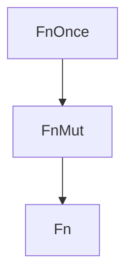

# Closures

Closures are anonymous functions that can capture their environment.

## Basic Syntax

```rust
fn main() {
    // Full syntax
    let add = |a: i32, b: i32| -> i32 { a + b };

    // Type inference
    let add = |a, b| a + b;

    // Single expression (no braces needed)
    let double = |x| x * 2;

    println!("{}", add(1, 2));    // 3
    println!("{}", double(5));    // 10
}
```

## Capturing the Environment

Closures can capture variables from their enclosing scope:

```rust
fn main() {
    let x = 4;

    // Captures x by reference
    let equal_to_x = |z| z == x;

    println!("{}", equal_to_x(4));  // true
}
```

### Capture Modes

```rust
fn main() {
    let s = String::from("hello");

    // Borrow (default for reads)
    let print = || println!("{}", s);
    print();
    println!("{}", s);  // s still valid

    // Mutable borrow
    let mut s = String::from("hello");
    let mut append = || s.push_str(" world");
    append();
    println!("{}", s);  // "hello world"

    // Move (ownership transfer)
    let s = String::from("hello");
    let consume = move || println!("{}", s);
    consume();
    // println!("{}", s);  // Error: s was moved
}
```

## The move Keyword

Force the closure to take ownership:

```rust
fn main() {
    let v = vec![1, 2, 3];

    // Required for threads
    let handle = std::thread::spawn(move || {
        println!("{:?}", v);
    });

    handle.join().unwrap();
}
```

## Closure Traits

Closures implement one or more of these traits:

| Trait | Description | `self` |
|-------|-------------|--------|
| `FnOnce` | Called once, may consume captures | `self` |
| `FnMut` | Called multiple times, may mutate | `&mut self` |
| `Fn` | Called multiple times, read-only | `&self` |



{: .note }
`Fn` implies `FnMut` implies `FnOnce`. A closure implementing `Fn` can be used where `FnOnce` is expected.

### Using Trait Bounds

```rust
// Accepts any callable
fn call_once<F: FnOnce() -> i32>(f: F) -> i32 {
    f()
}

// Can call multiple times
fn call_twice<F: FnMut()>(mut f: F) {
    f();
    f();
}

// Read-only access to captures
fn call_many<F: Fn() -> i32>(f: F) -> i32 {
    f() + f() + f()
}
```

## Returning Closures

Use `impl Trait` or `Box<dyn Trait>`:

```rust
// impl Trait (single concrete type)
fn make_adder(x: i32) -> impl Fn(i32) -> i32 {
    move |y| x + y
}

// Box<dyn Trait> (multiple possible types)
fn make_operation(op: &str) -> Box<dyn Fn(i32, i32) -> i32> {
    match op {
        "add" => Box::new(|a, b| a + b),
        "mul" => Box::new(|a, b| a * b),
        _ => Box::new(|a, _| a),
    }
}
```

## Closures as Function Parameters

```rust
fn apply<F>(f: F, x: i32) -> i32
where
    F: Fn(i32) -> i32,
{
    f(x)
}

fn main() {
    let double = |x| x * 2;
    let result = apply(double, 5);
    println!("{}", result);  // 10
}
```

## Common Patterns

### Callbacks

```rust
fn process_with_callback<F>(data: &[i32], callback: F)
where
    F: Fn(i32),
{
    for &item in data {
        callback(item);
    }
}

fn main() {
    process_with_callback(&[1, 2, 3], |x| println!("{}", x));
}
```

### Lazy Initialization

```rust
fn get_or_compute<F>(cache: &mut Option<i32>, compute: F) -> i32
where
    F: FnOnce() -> i32,
{
    *cache.get_or_insert_with(compute)
}
```

### Iterator Methods

```rust
fn main() {
    let v = vec![1, 2, 3, 4, 5];

    // All use closures
    let doubled: Vec<_> = v.iter().map(|x| x * 2).collect();
    let evens: Vec<_> = v.iter().filter(|x| *x % 2 == 0).collect();
    let sum: i32 = v.iter().fold(0, |acc, x| acc + x);
}
```

## Closures vs Functions

| Feature | Closure | Function |
|---------|---------|----------|
| Capture environment | Yes | No |
| Type inference | Yes | No |
| Generic | No | Yes |
| Named | No | Yes |
| Can be `const` | No | Yes |

## See Also

- [Iterators]() - Closures power iterator combinators

## Next Steps

Learn about [Smart Pointers]() for heap allocation and shared ownership.
