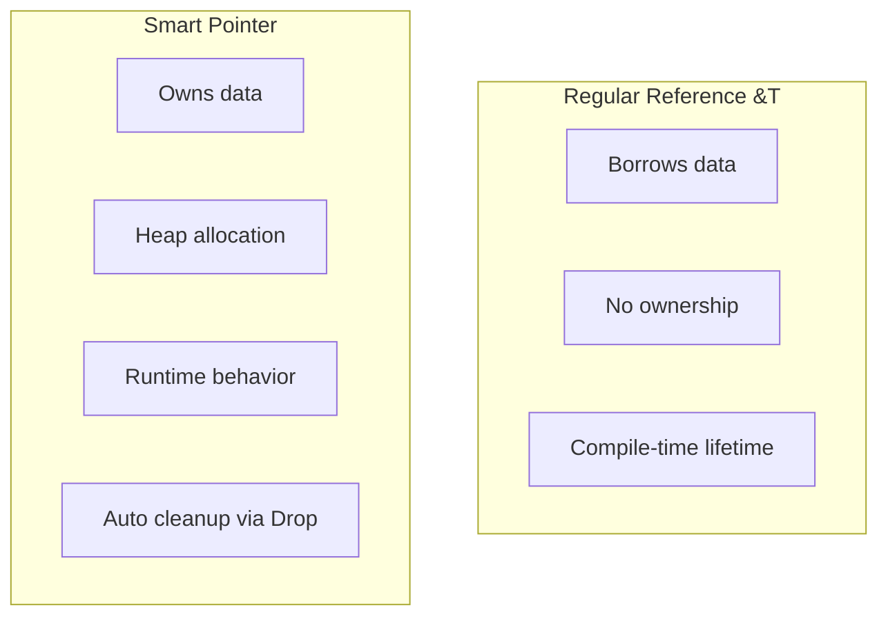
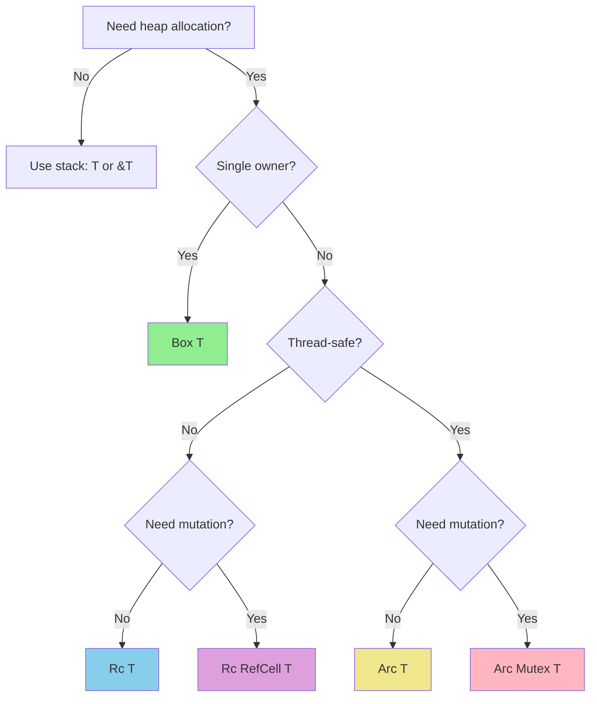
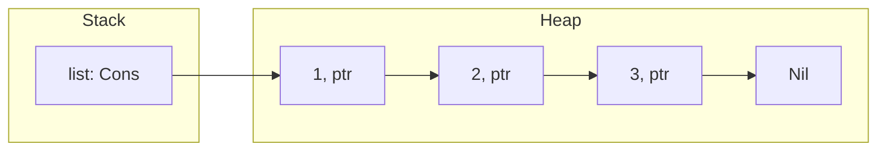
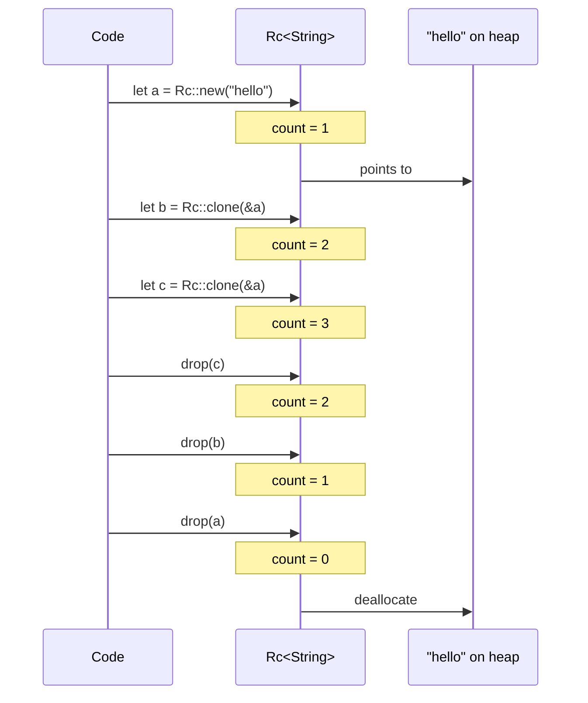
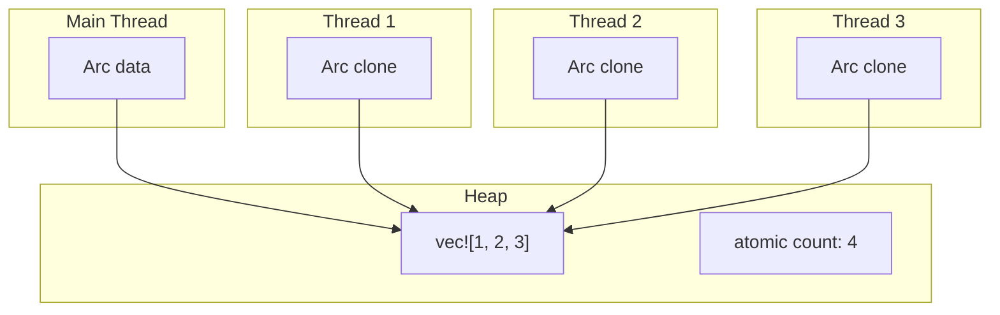
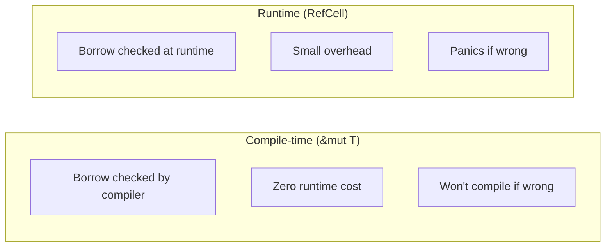
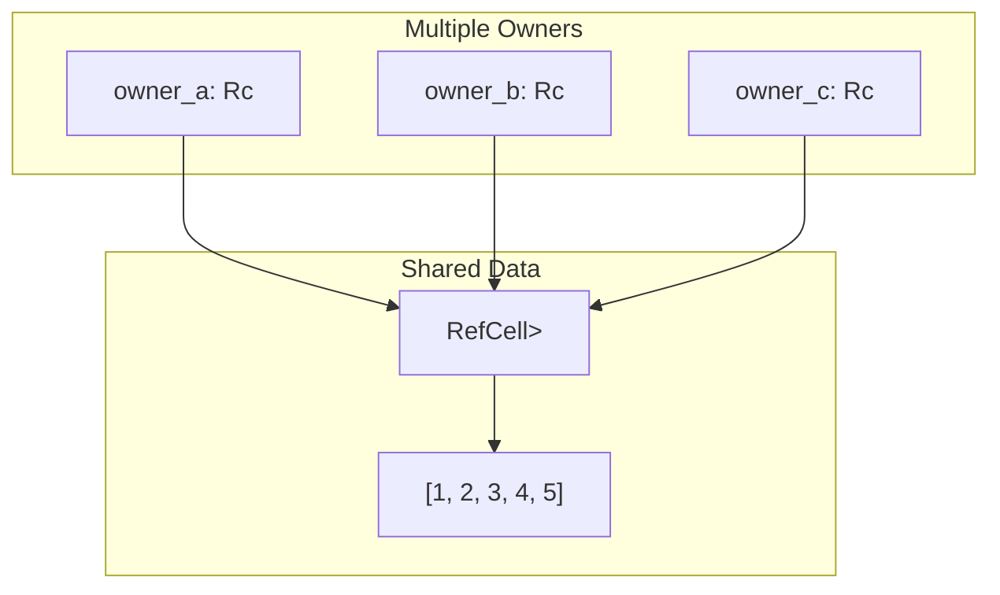
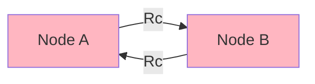
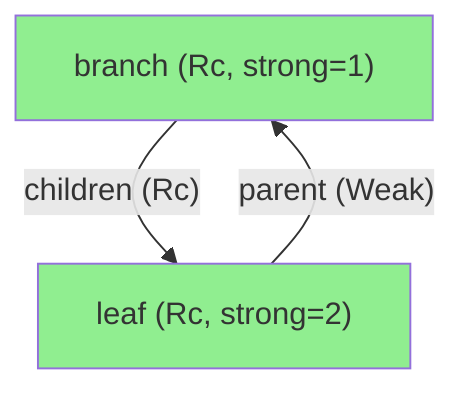

# Smart Pointers

## Overview

**Smart pointers** are data structures that act like pointers but include additional metadata and capabilities. Unlike regular references (`&T`), smart pointers often **own** the data they point to.



**Why use smart pointers?**
- Store data on the heap instead of the stack
- Share ownership between multiple parts of code
- Allow mutation through immutable references (interior mutability)
- Enable recursive data structures

## Choosing the Right Smart Pointer

Use this decision flowchart to pick the right type:



## Box\<T\> - Simple Heap Allocation

### What It Is

`Box<T>` puts data on the heap with a single owner. When the Box goes out of scope, the heap memory is freed.

### When to Use Box

| Use Case | Why |
|----------|-----|
| Large data | Avoid stack overflow |
| Recursive types | Allow indirection for compile-time sizing |
| Trait objects | `Box<dyn Trait>` for dynamic dispatch |
| Transfer ownership | Move large data without copying |

### Basic Usage

```rust
fn main() {
    // Allocate on heap
    let b = Box::new(5);
    println!("b = {}", b);  // Auto-derefs to access value

    // Box owns the data
    let x = *b;  // Move value out of box
    // b is no longer valid
}
```

### Recursive Types

Without Box, recursive types have infinite size:

```rust
// Won't compile - infinite size!
// enum List {
//     Cons(i32, List),  // How big is List? Contains a List!
//     Nil,
// }

// Works - Box has known size (pointer)
enum List {
    Cons(i32, Box<List>),  // Box is just a pointer
    Nil,
}

fn main() {
    let list = List::Cons(1,
        Box::new(List::Cons(2,
            Box::new(List::Cons(3,
                Box::new(List::Nil))))));
}
```



## Rc\<T\> - Reference Counting

### What It Is

`Rc<T>` (Reference Counted) enables **shared ownership**. Multiple parts of your code can read the same data. The data is freed when the last owner is dropped.

### When to Use Rc

| Use Case | Why |
|----------|-----|
| Shared read-only data | Multiple owners, single thread |
| Graph structures | Nodes with multiple parents |
| Caching | Share expensive computations |

{: .warning }
`Rc<T>` is **not thread-safe**. Use `Arc<T>` for multi-threaded code.

### How Reference Counting Works



### Basic Usage

```rust
use std::rc::Rc;

fn main() {
    let a = Rc::new(String::from("hello"));
    println!("count after a: {}", Rc::strong_count(&a));  // 1

    let b = Rc::clone(&a);  // Increment count, not deep copy!
    println!("count after b: {}", Rc::strong_count(&a));  // 2

    {
        let c = Rc::clone(&a);
        println!("count after c: {}", Rc::strong_count(&a));  // 3
    }  // c dropped, count decrements

    println!("count after c drops: {}", Rc::strong_count(&a));  // 2
}
```

### Shared List Example

```rust
use std::rc::Rc;

enum List {
    Cons(i32, Rc<List>),
    Nil,
}

fn main() {
    //     a = [5] -> [10] -> Nil
    //                 ^
    //     b = [3] ----+
    //                 ^
    //     c = [4] ----+

    let a = Rc::new(List::Cons(5, Rc::new(List::Cons(10, Rc::new(List::Nil)))));
    let b = List::Cons(3, Rc::clone(&a));
    let c = List::Cons(4, Rc::clone(&a));
}
```

## Arc\<T\> - Atomic Reference Counting

### What It Is

`Arc<T>` is the **thread-safe** version of `Rc<T>`. It uses atomic operations for the reference count, making it safe to share across threads.

### When to Use Arc

| Use Case | Why |
|----------|-----|
| Shared data across threads | Thread-safe reference counting |
| Read-only shared state | Configuration, lookup tables |
| With Mutex/RwLock | Shared mutable state across threads |

### Basic Usage

```rust
use std::sync::Arc;
use std::thread;

fn main() {
    let data = Arc::new(vec![1, 2, 3]);

    let handles: Vec<_> = (0..3).map(|i| {
        let data = Arc::clone(&data);  // Clone Arc, not data
        thread::spawn(move || {
            println!("Thread {} sees: {:?}", i, data);
        })
    }).collect();

    for handle in handles {
        handle.join().unwrap();
    }
}
```



## RefCell\<T\> - Interior Mutability

### What It Is

`RefCell<T>` enables **interior mutability**—mutating data even when you only have an immutable reference. It enforces borrowing rules at **runtime** instead of compile time.

### When to Use RefCell

| Use Case | Why |
|----------|-----|
| Mutating through &self | When API requires &self but you need mutation |
| Mock objects in tests | Test doubles that record calls |
| Caching/memoization | Cache results inside immutable struct |

{: .warning }
`RefCell<T>` will **panic** at runtime if you violate borrowing rules (e.g., two mutable borrows).

### Compile-time vs Runtime Borrowing



### Basic Usage

```rust
use std::cell::RefCell;

fn main() {
    let data = RefCell::new(5);

    // Immutable borrow
    {
        let r = data.borrow();
        println!("Value: {}", *r);
    }  // r dropped here

    // Mutable borrow
    {
        let mut w = data.borrow_mut();
        *w += 1;
    }  // w dropped here

    println!("New value: {}", data.borrow());
}
```

### Interior Mutability Pattern

```rust
use std::cell::RefCell;

struct Logger {
    messages: RefCell<Vec<String>>,
}

impl Logger {
    fn new() -> Self {
        Logger { messages: RefCell::new(Vec::new()) }
    }

    // Takes &self (immutable) but can mutate messages!
    fn log(&self, msg: &str) {
        self.messages.borrow_mut().push(msg.to_string());
    }

    fn get_logs(&self) -> Vec<String> {
        self.messages.borrow().clone()
    }
}

fn main() {
    let logger = Logger::new();
    logger.log("First message");
    logger.log("Second message");
    println!("{:?}", logger.get_logs());
}
```

## Combining Rc and RefCell

The most powerful pattern: shared ownership with interior mutability.



```rust
use std::rc::Rc;
use std::cell::RefCell;

fn main() {
    // Shared, mutable list
    let shared = Rc::new(RefCell::new(vec![1, 2, 3]));

    let a = Rc::clone(&shared);
    let b = Rc::clone(&shared);

    // Both can mutate!
    a.borrow_mut().push(4);
    b.borrow_mut().push(5);

    println!("{:?}", shared.borrow());  // [1, 2, 3, 4, 5]
}
```

## Weak\<T\> - Breaking Reference Cycles

### The Problem: Reference Cycles



With `Rc`, if A points to B and B points to A, neither will ever be freed—a **memory leak**.

### The Solution: Weak References

`Weak<T>` doesn't increment the strong count. Use it for "back-references" that shouldn't keep data alive.

```rust
use std::rc::{Rc, Weak};
use std::cell::RefCell;

struct Node {
    value: i32,
    parent: RefCell<Weak<Node>>,      // Weak reference to parent
    children: RefCell<Vec<Rc<Node>>>, // Strong references to children
}

fn main() {
    let leaf = Rc::new(Node {
        value: 3,
        parent: RefCell::new(Weak::new()),
        children: RefCell::new(vec![]),
    });

    let branch = Rc::new(Node {
        value: 5,
        parent: RefCell::new(Weak::new()),
        children: RefCell::new(vec![Rc::clone(&leaf)]),
    });

    // Set leaf's parent (weak reference)
    *leaf.parent.borrow_mut() = Rc::downgrade(&branch);

    // Access parent through weak reference
    if let Some(parent) = leaf.parent.borrow().upgrade() {
        println!("Leaf's parent value: {}", parent.value);
    }
}
```



## Performance Comparison

| Type | Allocation | Clone Cost | Thread Safe | Mutability |
|------|------------|------------|-------------|------------|
| `Box<T>` | Heap | Moves | No | If `mut` |
| `Rc<T>` | Heap | Counter++ | No | No |
| `Arc<T>` | Heap | Atomic++ | Yes | No |
| `RefCell<T>` | Stack/Heap | N/A | No | Runtime checked |
| `Mutex<T>` | Stack/Heap | N/A | Yes | Lock-based |

## Common Patterns

### Pattern 1: Shared Configuration

```rust
use std::sync::Arc;

struct Config {
    db_url: String,
    max_connections: u32,
}

fn main() {
    let config = Arc::new(Config {
        db_url: "postgres://localhost/db".into(),
        max_connections: 10,
    });

    // Pass to multiple subsystems
    let db = Database::new(Arc::clone(&config));
    let cache = Cache::new(Arc::clone(&config));
}
```

### Pattern 2: Tree with Parent References

```rust
use std::rc::{Rc, Weak};
use std::cell::RefCell;

type NodeRef = Rc<RefCell<TreeNode>>;
type WeakNodeRef = Weak<RefCell<TreeNode>>;

struct TreeNode {
    value: i32,
    parent: Option<WeakNodeRef>,   // Weak to parent
    children: Vec<NodeRef>,        // Strong to children
}
```

### Pattern 3: Mock Objects in Tests

```rust
use std::cell::RefCell;

trait Messenger {
    fn send(&self, msg: &str);
}

struct MockMessenger {
    sent_messages: RefCell<Vec<String>>,
}

impl Messenger for MockMessenger {
    fn send(&self, msg: &str) {
        // Can mutate through &self!
        self.sent_messages.borrow_mut().push(msg.to_string());
    }
}

#[test]
fn test_sends_message() {
    let mock = MockMessenger {
        sent_messages: RefCell::new(vec![]),
    };
    mock.send("hello");
    assert_eq!(mock.sent_messages.borrow().len(), 1);
}
```

## Summary Decision Table

| Situation | Use |
|-----------|-----|
| Need heap allocation, single owner | `Box<T>` |
| Multiple owners, single thread | `Rc<T>` |
| Multiple owners + mutation, single thread | `Rc<RefCell<T>>` |
| Multiple owners, multi-threaded (read-only) | `Arc<T>` |
| Multiple owners + mutation, multi-threaded | `Arc<Mutex<T>>` or `Arc<RwLock<T>>` |
| Break reference cycles | `Weak<T>` |
| Interior mutability, single thread | `RefCell<T>` or `Cell<T>` |

## See Also

- [Memory Layout]() - How pointers are represented in memory
- [Ownership]() - Foundational ownership concepts
- [Threads]() - Using Arc with threads
- [Mutex]() - Thread-safe mutation
- [Example Code](https://github.com/MichaelTien8901/rust-guide-tutorial/tree/master/examples/part3/smart-pointers)

## Next Steps

Learn about [Threads]() for concurrent programming.
