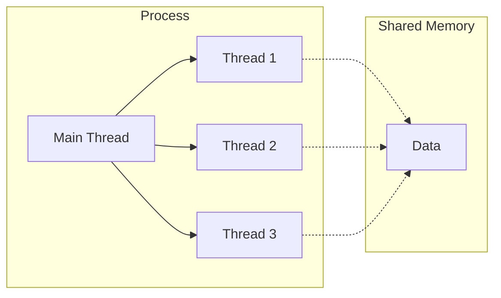
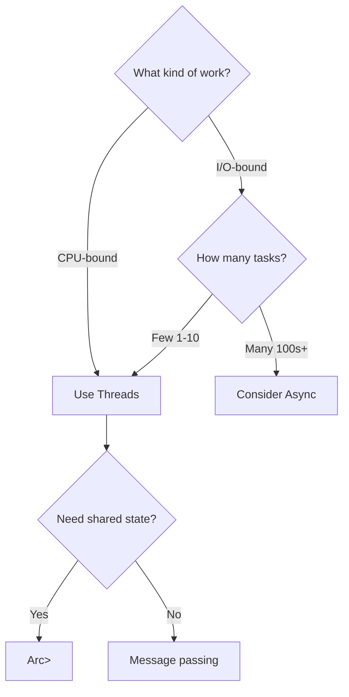
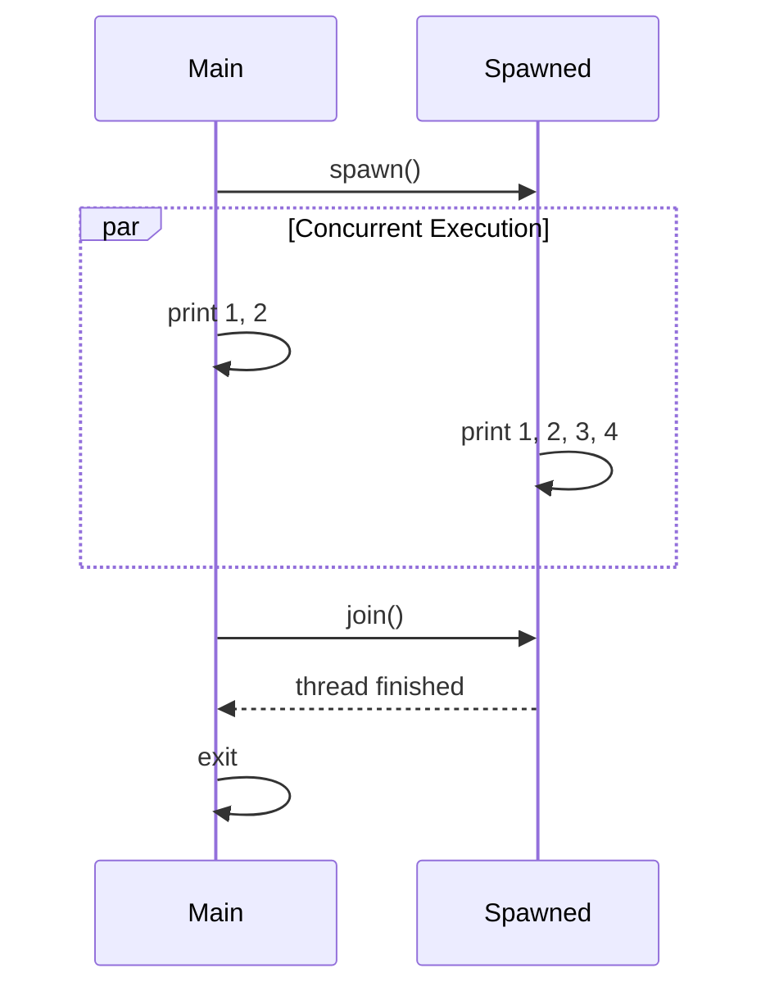
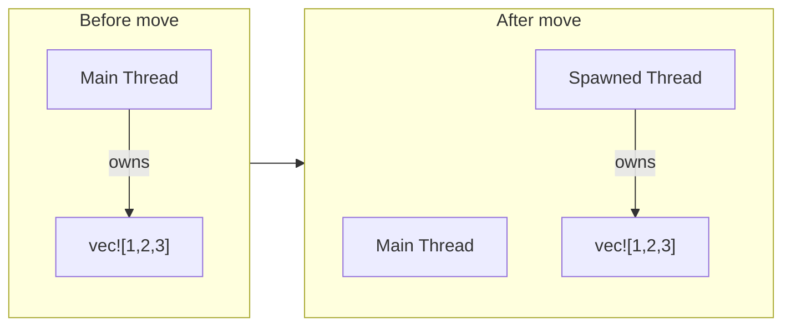
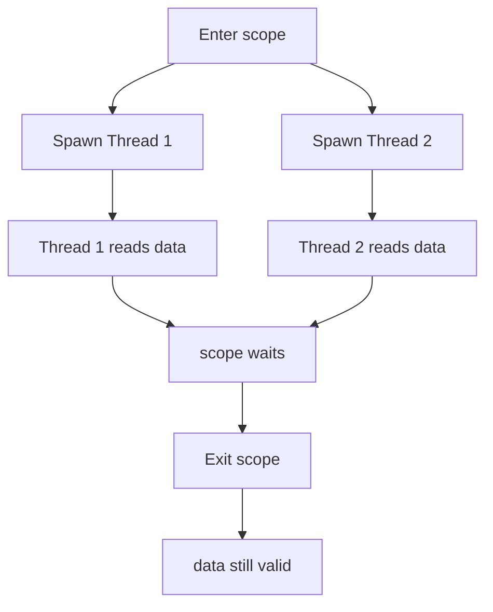
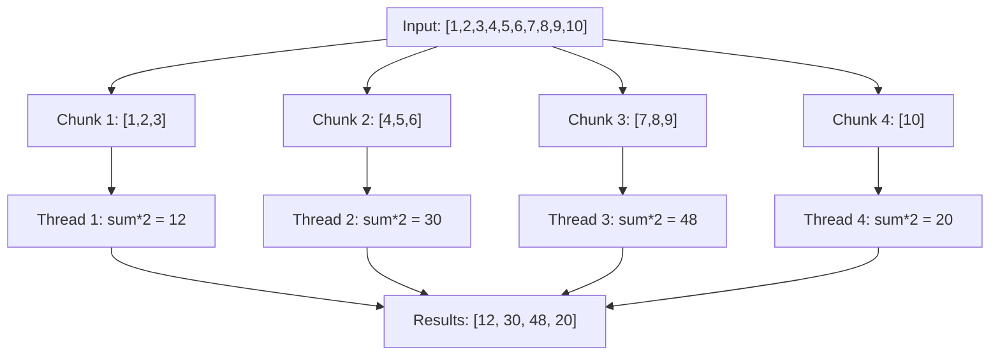
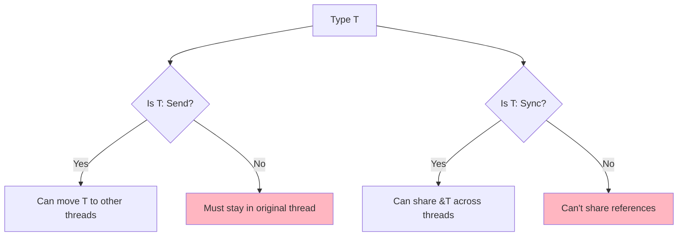
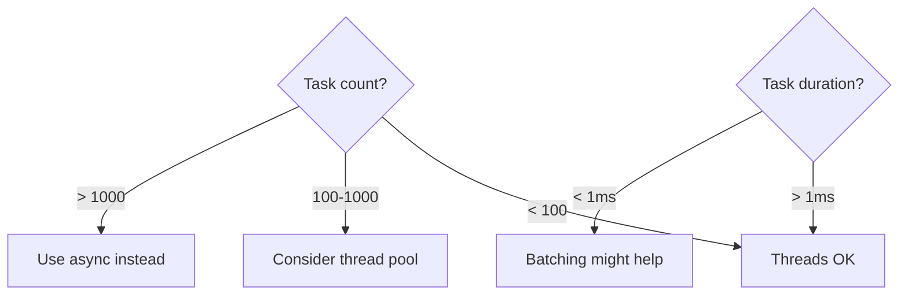
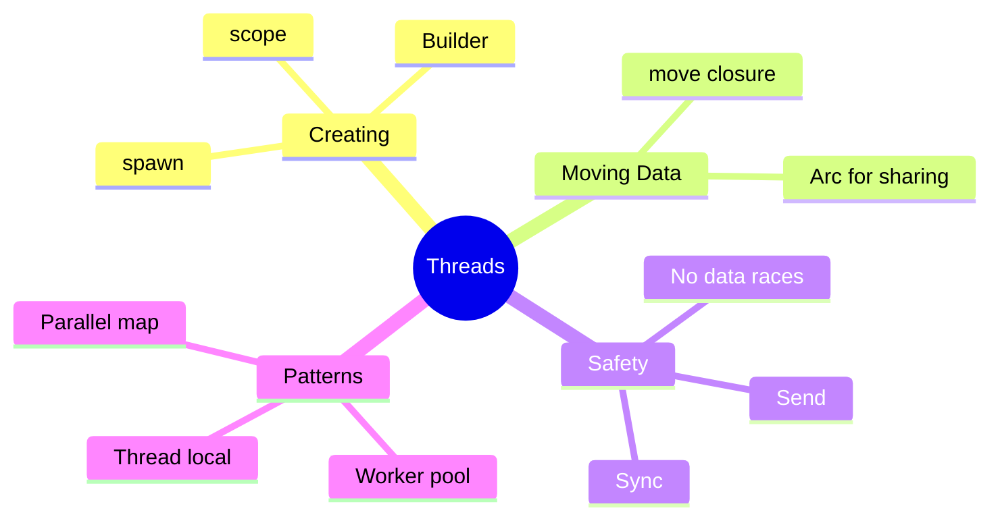

# Threads

## Overview

**Threads** enable concurrent execution—running multiple pieces of code simultaneously. Rust's ownership system prevents data races at compile time, making concurrent programming safer than in most languages.



**Key insight**: Rust prevents data races at compile time through its ownership rules. If it compiles, it's free of data races.

## When to Use Threads

| Use Case | Threads | Async |
|----------|---------|-------|
| CPU-intensive computation | ✓ Best choice | ✗ Blocks runtime |
| Parallel data processing | ✓ Best choice | ✗ |
| Many I/O operations | Possible | ✓ More efficient |
| Simple blocking I/O | ✓ Simpler | Overkill |
| Real-time requirements | ✓ OS scheduling | Varies |



## Creating Threads

### Basic Thread Spawn

```rust
use std::thread;
use std::time::Duration;

fn main() {
    // Spawn a new thread
    let handle = thread::spawn(|| {
        for i in 1..5 {
            println!("Hi from spawned thread: {}", i);
            thread::sleep(Duration::from_millis(1));
        }
    });

    // Main thread continues
    for i in 1..3 {
        println!("Hi from main thread: {}", i);
        thread::sleep(Duration::from_millis(1));
    }

    // Wait for spawned thread to finish
    handle.join().unwrap();
}
```



### Thread Builder (Named Threads)

```rust
use std::thread;

fn main() {
    let builder = thread::Builder::new()
        .name("worker-1".into())
        .stack_size(32 * 1024);  // 32 KB stack

    let handle = builder.spawn(|| {
        println!("Thread name: {:?}", thread::current().name());
    }).unwrap();

    handle.join().unwrap();
}
```

## Moving Data Into Threads

### The Problem

```rust
use std::thread;

fn main() {
    let v = vec![1, 2, 3];

    // ❌ WON'T COMPILE - closure may outlive `v`
    let handle = thread::spawn(|| {
        println!("{:?}", v);  // Borrows v
    });

    // Main thread might drop v before spawned thread uses it!
}
```

### The Solution: `move` Closure

```rust
use std::thread;

fn main() {
    let v = vec![1, 2, 3];

    // ✓ WORKS - v is moved into the thread
    let handle = thread::spawn(move || {
        println!("{:?}", v);  // Owns v
    });

    // v is no longer accessible here
    // println!("{:?}", v);  // Error!

    handle.join().unwrap();
}
```



## Returning Values from Threads

```rust
use std::thread;

fn main() {
    let handle = thread::spawn(|| {
        // Do some computation
        let sum: i32 = (1..=100).sum();
        sum  // Return value
    });

    // Get the return value
    let result = handle.join().unwrap();
    println!("Sum: {}", result);  // Sum: 5050
}
```

### Handling Thread Panics

```rust
use std::thread;

fn main() {
    let handle = thread::spawn(|| {
        panic!("Oops!");
    });

    // join() returns Result
    match handle.join() {
        Ok(value) => println!("Thread returned: {:?}", value),
        Err(e) => println!("Thread panicked: {:?}", e),
    }

    println!("Main thread continues");
}
```

## Scoped Threads (Rust 1.63+)

Scoped threads can **borrow** data from the parent scope without `move`.

### The Problem with Regular Threads

```rust
fn main() {
    let data = vec![1, 2, 3];

    // Regular thread can't borrow - might outlive data
    // thread::spawn(|| println!("{:?}", data));  // Error!
}
```

### Solution: `thread::scope`

```rust
use std::thread;

fn main() {
    let mut data = vec![1, 2, 3];

    thread::scope(|s| {
        // Thread 1: read data
        s.spawn(|| {
            println!("Thread 1 reads: {:?}", data);
        });

        // Thread 2: also read data
        s.spawn(|| {
            println!("Thread 2 reads: {:?}", data);
        });
    });  // All threads MUST finish before scope exits

    // data is still valid and accessible!
    data.push(4);
    println!("After threads: {:?}", data);
}
```



### Mutable Borrowing with Scoped Threads

```rust
use std::thread;

fn main() {
    let mut results = vec![];

    thread::scope(|s| {
        s.spawn(|| {
            // Exclusive access is still enforced
            results.push(compute_chunk_1());
        });

        // Can't borrow mutably again while first borrow is active
        // s.spawn(|| results.push(compute_chunk_2()));  // Error!
    });

    println!("{:?}", results);
}
```

## Parallel Processing Pattern

### Processing Chunks in Parallel

```rust
use std::thread;

fn main() {
    let data = vec![1, 2, 3, 4, 5, 6, 7, 8, 9, 10];
    let chunk_size = 3;

    let results: Vec<i32> = thread::scope(|s| {
        let handles: Vec<_> = data
            .chunks(chunk_size)
            .map(|chunk| {
                s.spawn(move || {
                    // Process each chunk
                    chunk.iter().map(|n| n * 2).sum::<i32>()
                })
            })
            .collect();

        // Collect results
        handles.into_iter()
            .map(|h| h.join().unwrap())
            .collect()
    });

    println!("Chunk sums: {:?}", results);  // [12, 30, 48, 20]
}
```



## Thread Safety: Send and Sync

Rust uses two marker traits to ensure thread safety:

### `Send` - Can Be Moved to Another Thread

```rust
// Most types are Send
let data = vec![1, 2, 3];  // Vec<i32> is Send
thread::spawn(move || {
    // data moved here - OK because Vec<i32>: Send
});
```

### `Sync` - Can Be Shared Between Threads

```rust
use std::sync::Arc;

// Arc<T> is Sync if T is Sync
let shared = Arc::new(vec![1, 2, 3]);

let s1 = Arc::clone(&shared);
let s2 = Arc::clone(&shared);

thread::spawn(move || println!("{:?}", s1));
thread::spawn(move || println!("{:?}", s2));
```

### Types That Are NOT Thread-Safe

```rust
use std::rc::Rc;
use std::cell::RefCell;

// Rc is NOT Send - reference counting isn't atomic
let rc = Rc::new(5);
// thread::spawn(move || println!("{}", rc));  // Error!

// RefCell is NOT Sync - interior mutability isn't thread-safe
let cell = RefCell::new(5);
// Can't share &RefCell across threads
```



## Common Patterns

### Pattern 1: Worker Pool

```rust
use std::thread;
use std::sync::mpsc;

fn main() {
    let (tx, rx) = mpsc::channel();

    // Spawn workers
    let handles: Vec<_> = (0..4).map(|id| {
        let tx = tx.clone();
        thread::spawn(move || {
            // Simulate work
            thread::sleep(std::time::Duration::from_millis(100));
            tx.send(format!("Worker {} done", id)).unwrap();
        })
    }).collect();

    drop(tx);  // Close sender so rx.iter() terminates

    // Collect results
    for msg in rx {
        println!("{}", msg);
    }

    for h in handles {
        h.join().unwrap();
    }
}
```

### Pattern 2: Parallel Map

```rust
use std::thread;

fn parallel_map<T, U, F>(data: Vec<T>, f: F) -> Vec<U>
where
    T: Send + 'static,
    U: Send + 'static,
    F: Fn(T) -> U + Send + Copy + 'static,
{
    let handles: Vec<_> = data
        .into_iter()
        .map(|item| thread::spawn(move || f(item)))
        .collect();

    handles.into_iter()
        .map(|h| h.join().unwrap())
        .collect()
}

fn main() {
    let numbers = vec![1, 2, 3, 4, 5];
    let doubled = parallel_map(numbers, |n| n * 2);
    println!("{:?}", doubled);  // [2, 4, 6, 8, 10]
}
```

## Thread Local Storage

```rust
use std::cell::RefCell;
use std::thread;

thread_local! {
    static COUNTER: RefCell<u32> = RefCell::new(0);
}

fn main() {
    COUNTER.with(|c| *c.borrow_mut() += 1);

    let handle = thread::spawn(|| {
        // Each thread gets its own COUNTER
        COUNTER.with(|c| *c.borrow_mut() += 1);
        COUNTER.with(|c| println!("Thread counter: {}", c.borrow()));
    });

    handle.join().unwrap();
    COUNTER.with(|c| println!("Main counter: {}", c.borrow()));
}
// Output:
// Thread counter: 1
// Main counter: 1
```

## Performance Considerations

| Aspect | Cost |
|--------|------|
| Thread creation | ~1-10 μs |
| Thread memory | ~2 MB stack (configurable) |
| Context switch | ~1-10 μs |
| Mutex lock | ~25 ns (uncontended) |

### When to Avoid Many Threads



## Summary



| Concept | Description |
|---------|-------------|
| `thread::spawn` | Create new thread with closure |
| `handle.join()` | Wait for thread to finish |
| `move` closure | Transfer ownership to thread |
| `thread::scope` | Borrow data without move |
| `Send` | Type can be moved between threads |
| `Sync` | Type can be shared between threads |

## See Also

- [Channels]() - Message passing between threads
- [Mutex]() - Shared mutable state
- [Real-Time Constraints]() - Deterministic threading for embedded systems
- [RTOS Integration]() - Real-time operating system patterns

## Next Steps

Learn about [Channels]() for message passing between threads.
