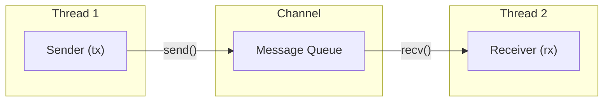
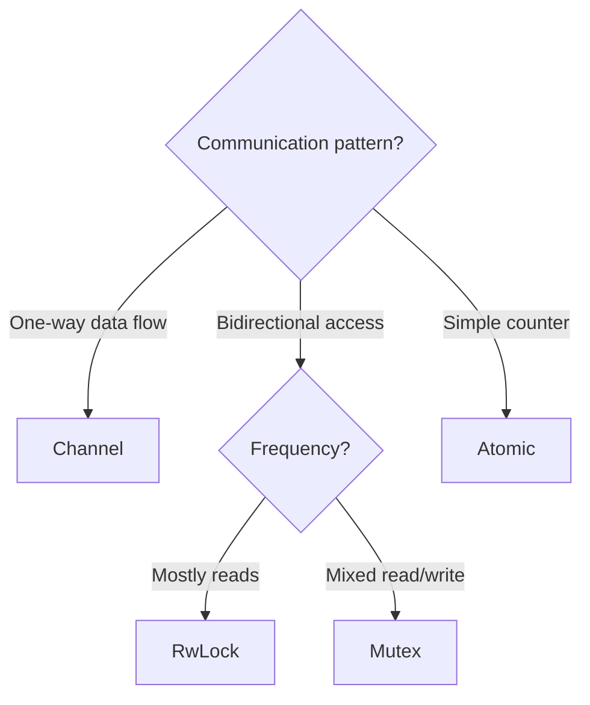
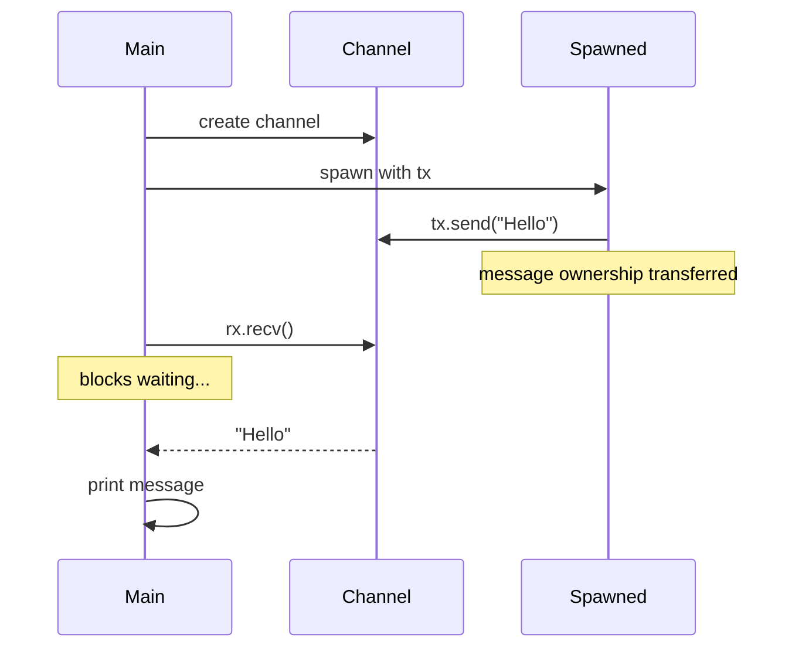
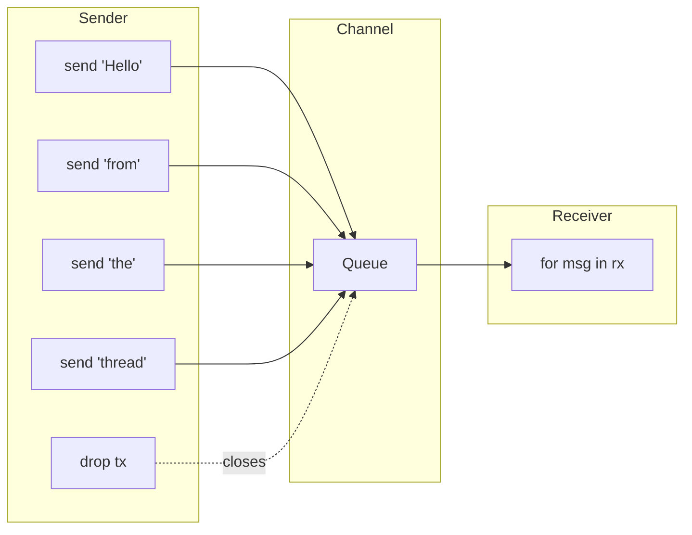
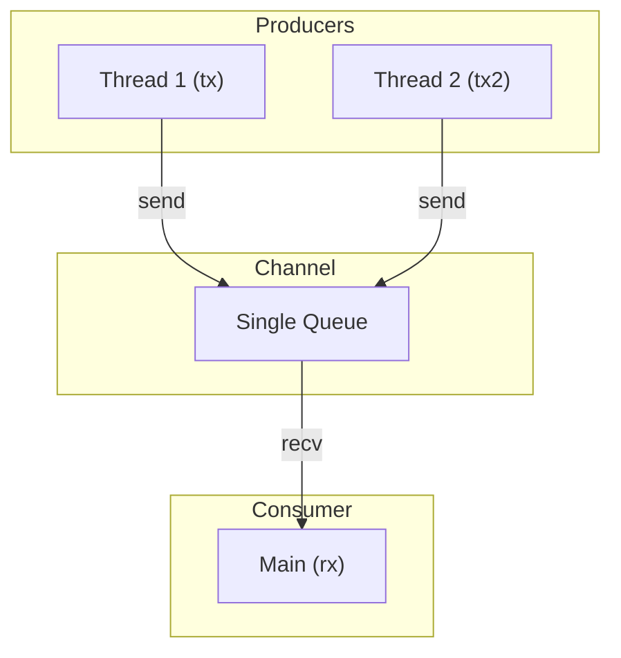
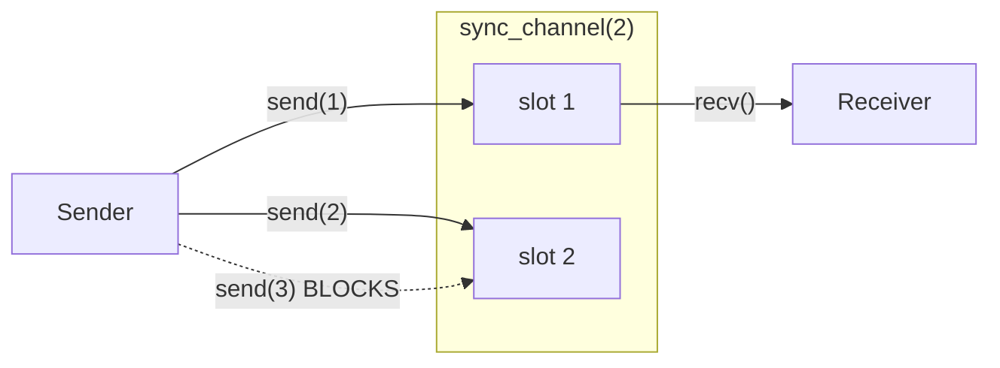
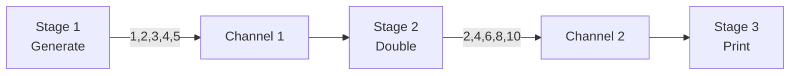
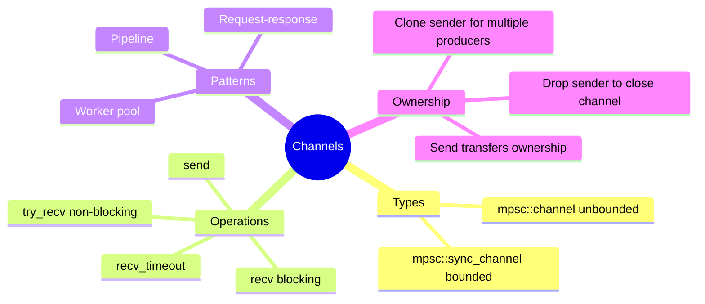

# Channels

## Overview

**Channels** provide a way for threads to communicate by sending messages. This is Rust's implementation of the "share memory by communicating" philosophy—instead of sharing data directly, threads send copies of data through channels.



**Key insight**: Channels transfer ownership of data between threads. Once you send a value, you can no longer use it in the sending thread.

## When to Use Channels

| Scenario | Use Channels | Use Shared State |
|----------|--------------|------------------|
| Producer-consumer pattern | Yes | No |
| Event-driven architecture | Yes | No |
| Pipeline processing | Yes | No |
| Simple shared counter | No | `Mutex` or `Atomic` |
| Frequent read, rare write | No | `RwLock` |



## Channel Types

| Type | Sender | Receiver | Bounded |
|------|--------|----------|---------|
| `mpsc::channel` | Multiple | Single | No (unbounded) |
| `mpsc::sync_channel` | Multiple | Single | Yes (bounded) |
| `crossbeam::channel` | Multiple | Multiple | Both options |

**mpsc** = Multiple Producer, Single Consumer

## Basic Channel

```rust
use std::sync::mpsc;
use std::thread;

fn main() {
    // Create a channel - returns (sender, receiver)
    let (tx, rx) = mpsc::channel();

    // Spawn thread with sender
    thread::spawn(move || {
        let message = String::from("Hello from thread");
        tx.send(message).unwrap();
        // message is moved - can't use it here anymore!
    });

    // Receive in main thread (blocks until message arrives)
    let received = rx.recv().unwrap();
    println!("Got: {}", received);
}
```



## Multiple Messages

```rust
use std::sync::mpsc;
use std::thread;
use std::time::Duration;

fn main() {
    let (tx, rx) = mpsc::channel();

    thread::spawn(move || {
        let messages = vec!["Hello", "from", "the", "thread"];
        for msg in messages {
            tx.send(msg).unwrap();
            thread::sleep(Duration::from_millis(100));
        }
        // tx is dropped here - channel closes
    });

    // Iterate over received messages
    // Loop ends when channel closes (tx dropped)
    for received in rx {
        println!("Got: {}", received);
    }
}
```



## Multiple Producers (Clone Sender)

```rust
use std::sync::mpsc;
use std::thread;

fn main() {
    let (tx, rx) = mpsc::channel();

    // Clone sender for second thread
    let tx2 = tx.clone();

    thread::spawn(move || {
        tx.send("from thread 1").unwrap();
    });

    thread::spawn(move || {
        tx2.send("from thread 2").unwrap();
    });

    // Receive from both senders
    for _ in 0..2 {
        let msg = rx.recv().unwrap();
        println!("{}", msg);
    }
}
```



## Bounded Channels (sync_channel)

Bounded channels block the sender when the buffer is full:

```rust
use std::sync::mpsc;
use std::thread;

fn main() {
    // Channel with buffer size of 2
    let (tx, rx) = mpsc::sync_channel(2);

    thread::spawn(move || {
        tx.send(1).unwrap();  // Goes into buffer
        tx.send(2).unwrap();  // Goes into buffer
        println!("Sent 1 and 2");

        tx.send(3).unwrap();  // BLOCKS until rx receives one
        println!("Sent 3");
    });

    thread::sleep(std::time::Duration::from_secs(1));

    // Now receive - this unblocks the sender
    println!("Received: {}", rx.recv().unwrap());
    println!("Received: {}", rx.recv().unwrap());
    println!("Received: {}", rx.recv().unwrap());
}
```



## Non-blocking Operations

### try_recv - Non-blocking Receive

```rust
use std::sync::mpsc;

fn main() {
    let (tx, rx) = mpsc::channel::<i32>();

    // Check without blocking
    match rx.try_recv() {
        Ok(msg) => println!("Got: {}", msg),
        Err(mpsc::TryRecvError::Empty) => println!("No message yet"),
        Err(mpsc::TryRecvError::Disconnected) => println!("Channel closed"),
    }
}
```

### recv_timeout - Receive with Timeout

```rust
use std::sync::mpsc;
use std::time::Duration;

fn main() {
    let (tx, rx) = mpsc::channel::<i32>();

    match rx.recv_timeout(Duration::from_secs(1)) {
        Ok(msg) => println!("Got: {}", msg),
        Err(mpsc::RecvTimeoutError::Timeout) => println!("Timed out"),
        Err(mpsc::RecvTimeoutError::Disconnected) => println!("Channel closed"),
    }
}
```

## Common Patterns

### Worker Pool

```rust
use std::sync::mpsc;
use std::thread;

fn main() {
    let (tx, rx) = mpsc::channel();

    // Spawn worker threads
    let handles: Vec<_> = (0..4).map(|id| {
        let tx = tx.clone();
        thread::spawn(move || {
            // Simulate work
            let result = id * 10;
            tx.send((id, result)).unwrap();
        })
    }).collect();

    drop(tx);  // Drop original sender so rx.iter() terminates

    // Collect results
    for (id, result) in rx {
        println!("Worker {} produced {}", id, result);
    }

    for h in handles {
        h.join().unwrap();
    }
}
```

### Pipeline

```rust
use std::sync::mpsc;
use std::thread;

fn main() {
    // Stage 1 -> Stage 2 -> Stage 3
    let (tx1, rx1) = mpsc::channel();
    let (tx2, rx2) = mpsc::channel();

    // Stage 1: Generate numbers
    thread::spawn(move || {
        for i in 1..=5 {
            tx1.send(i).unwrap();
        }
    });

    // Stage 2: Double them
    thread::spawn(move || {
        for n in rx1 {
            tx2.send(n * 2).unwrap();
        }
    });

    // Stage 3: Print results
    for result in rx2 {
        println!("Result: {}", result);
    }
}
```



### Request-Response

```rust
use std::sync::mpsc;
use std::thread;

struct Request {
    data: String,
    response_tx: mpsc::Sender<String>,
}

fn main() {
    let (request_tx, request_rx) = mpsc::channel::<Request>();

    // Server thread
    thread::spawn(move || {
        for req in request_rx {
            let response = format!("Processed: {}", req.data);
            req.response_tx.send(response).unwrap();
        }
    });

    // Client sends request
    let (response_tx, response_rx) = mpsc::channel();
    request_tx.send(Request {
        data: "Hello".to_string(),
        response_tx,
    }).unwrap();

    // Wait for response
    let response = response_rx.recv().unwrap();
    println!("{}", response);
}
```

## Error Handling

| Method | Error Type | Meaning |
|--------|------------|---------|
| `send()` | `SendError` | Receiver dropped |
| `recv()` | `RecvError` | All senders dropped |
| `try_recv()` | `TryRecvError::Empty` | No message available |
| `try_recv()` | `TryRecvError::Disconnected` | All senders dropped |

```rust
use std::sync::mpsc;

fn main() {
    let (tx, rx) = mpsc::channel::<i32>();

    drop(rx);  // Drop receiver

    // Send fails because receiver is gone
    match tx.send(42) {
        Ok(()) => println!("Sent"),
        Err(e) => println!("Send failed: {}", e.0),  // e.0 is the unsent value
    }
}
```

## Summary



| Concept | Description |
|---------|-------------|
| `mpsc::channel()` | Create unbounded channel |
| `mpsc::sync_channel(n)` | Create bounded channel with n slots |
| `tx.send(val)` | Send value (transfers ownership) |
| `rx.recv()` | Receive value (blocks) |
| `rx.try_recv()` | Try receive (non-blocking) |
| `tx.clone()` | Create additional sender |
| `for msg in rx` | Iterate until channel closes |

## See Also

- [Threads]() - Creating threads to use with channels
- [Mutex]() - Alternative: shared state concurrency

## Next Steps

Learn about [Mutex]() for shared state concurrency.
