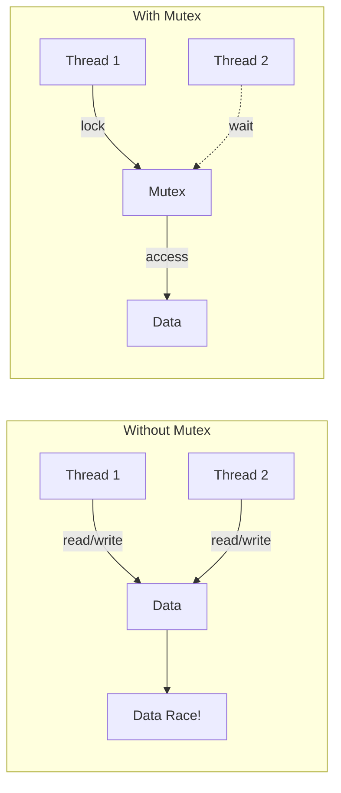
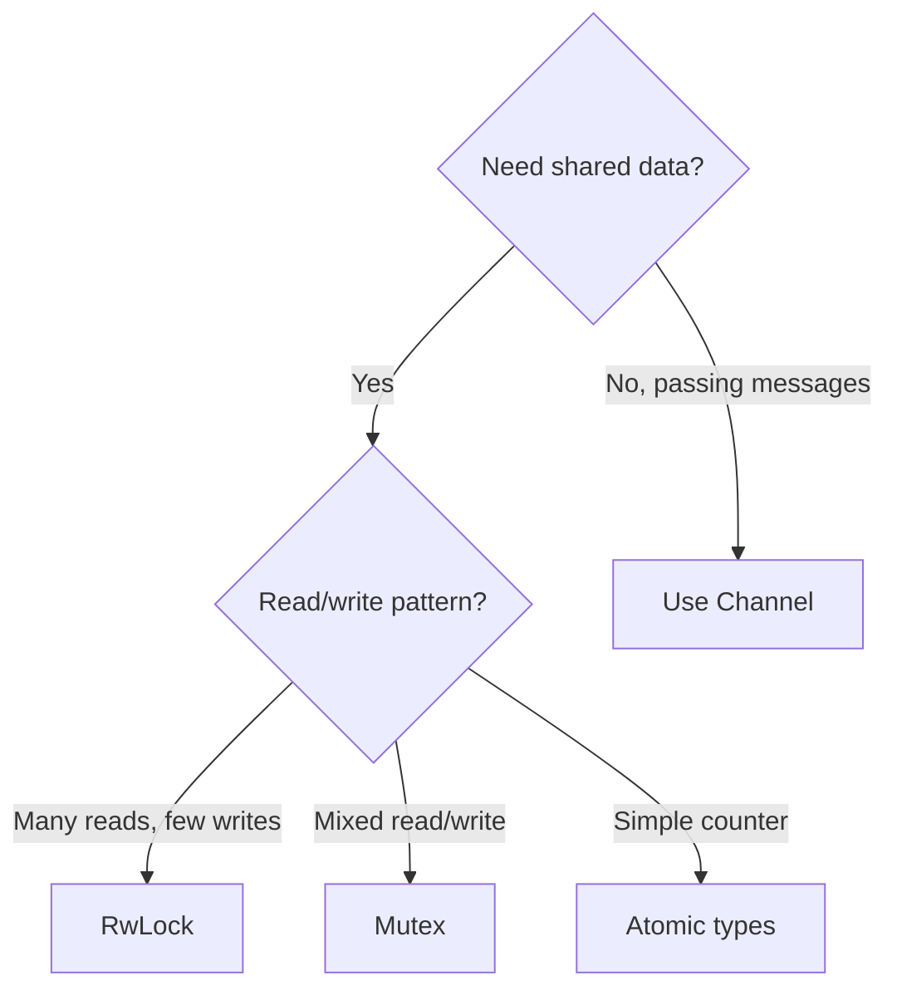
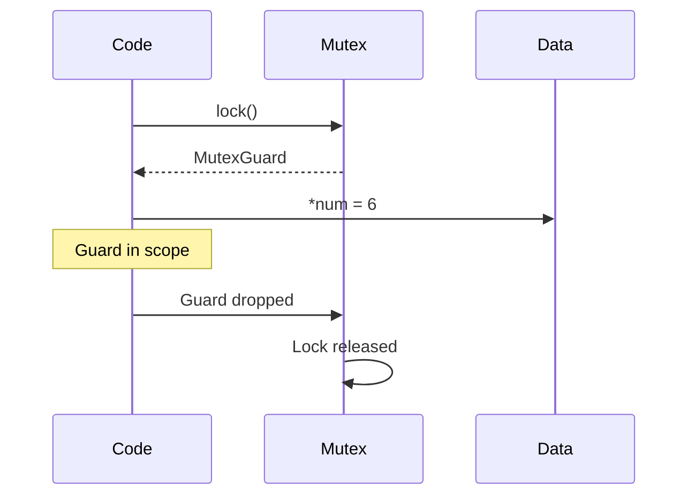
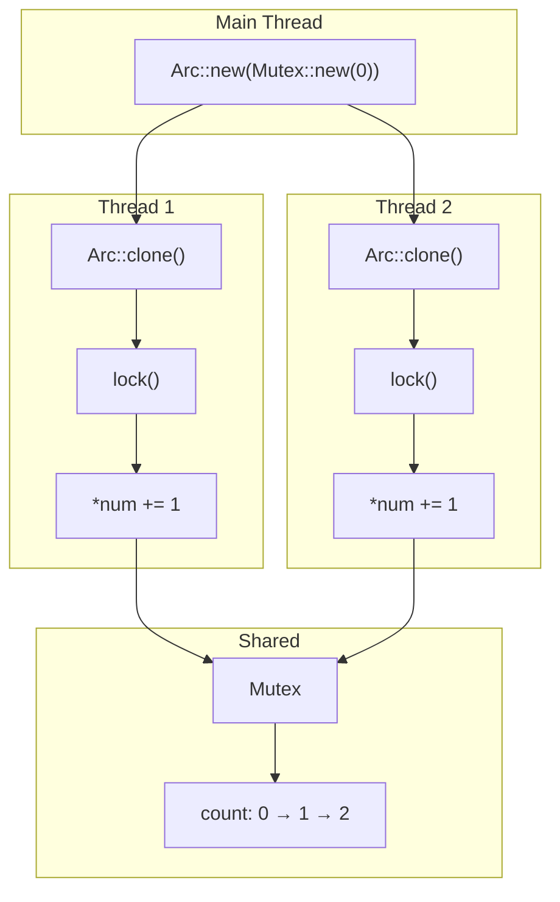
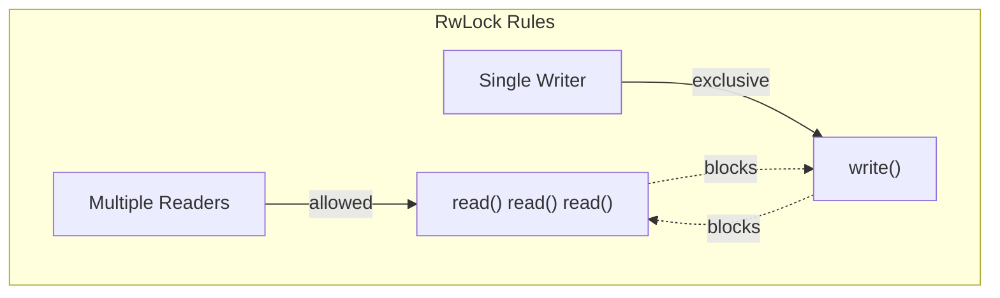
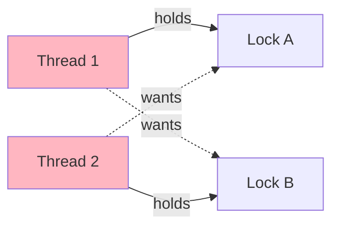
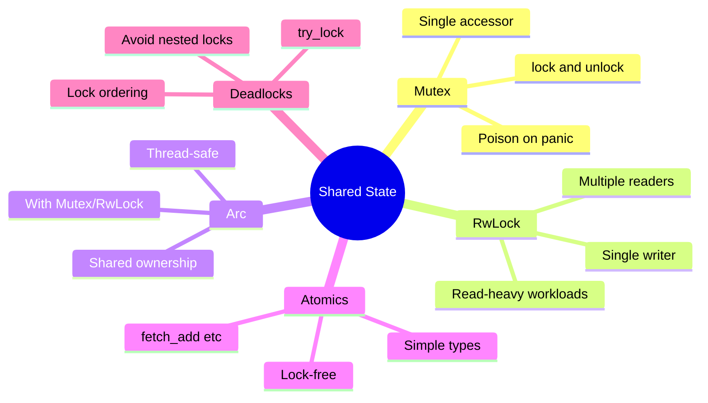

# Mutex and Shared State

## Overview

A **Mutex** (mutual exclusion) protects shared data by ensuring only one thread can access it at a time. While channels transfer data ownership, mutexes allow multiple threads to share the same data safely.



**Key insight**: The Rust type system ensures you can only access the data after acquiring the lock, and the lock is automatically released when it goes out of scope.

## When to Use Mutex vs Channels

| Scenario | Use Mutex | Use Channel |
|----------|-----------|-------------|
| Shared counter/state | Yes | No |
| Multiple readers, rare writes | `RwLock` | No |
| Producer-consumer | No | Yes |
| One-way data flow | No | Yes |
| Complex shared object | Yes | No |



## Basic Mutex Usage

```rust
use std::sync::Mutex;

fn main() {
    // Mutex wraps the data it protects
    let m = Mutex::new(5);

    {
        // lock() returns a MutexGuard
        let mut num = m.lock().unwrap();

        // MutexGuard implements Deref/DerefMut
        *num = 6;

        println!("Inside lock: {}", num);
    }  // MutexGuard dropped here → lock released

    println!("After lock: {:?}", m);
}
```



## Sharing Mutex Between Threads with Arc

`Mutex` alone can't be shared between threads—you need `Arc` (Atomic Reference Counting):

```rust
use std::sync::{Arc, Mutex};
use std::thread;

fn main() {
    // Arc allows multiple ownership across threads
    let counter = Arc::new(Mutex::new(0));
    let mut handles = vec![];

    for _ in 0..10 {
        // Clone the Arc (not the Mutex)
        let counter = Arc::clone(&counter);

        let handle = thread::spawn(move || {
            // Lock the mutex
            let mut num = counter.lock().unwrap();
            *num += 1;
            // Lock released when `num` goes out of scope
        });
        handles.push(handle);
    }

    // Wait for all threads
    for handle in handles {
        handle.join().unwrap();
    }

    println!("Result: {}", *counter.lock().unwrap());  // 10
}
```



## RwLock: Multiple Readers or Single Writer

When you have many reads and few writes, `RwLock` is more efficient:

```rust
use std::sync::RwLock;

fn main() {
    let lock = RwLock::new(vec![1, 2, 3]);

    // Multiple readers can access simultaneously
    {
        let r1 = lock.read().unwrap();
        let r2 = lock.read().unwrap();  // OK - both are readers
        println!("r1: {:?}, r2: {:?}", *r1, *r2);
    }

    // Only one writer at a time
    {
        let mut w = lock.write().unwrap();
        w.push(4);
        // No readers allowed while writing
    }

    println!("Final: {:?}", lock.read().unwrap());
}
```



### Mutex vs RwLock

| Feature | Mutex | RwLock |
|---------|-------|--------|
| Multiple readers | No | Yes |
| Performance (read-heavy) | Lower | Higher |
| Performance (write-heavy) | Higher | Lower |
| Complexity | Simpler | More complex |
| Deadlock risk | Lower | Higher (reader starvation) |

## Lock Poisoning

If a thread panics while holding a lock, the Mutex becomes "poisoned":

```rust
use std::sync::{Arc, Mutex};
use std::thread;

fn main() {
    let data = Arc::new(Mutex::new(vec![1, 2, 3]));
    let data_clone = Arc::clone(&data);

    // This thread will panic while holding the lock
    let handle = thread::spawn(move || {
        let mut guard = data_clone.lock().unwrap();
        guard.push(4);
        panic!("Oops!");  // Lock is poisoned
    });

    let _ = handle.join();  // Thread panicked

    // Attempting to lock returns Err(PoisonError)
    match data.lock() {
        Ok(guard) => println!("Data: {:?}", *guard),
        Err(poisoned) => {
            // Can still access data if you choose to
            let guard = poisoned.into_inner();
            println!("Recovered data: {:?}", *guard);
        }
    }
}
```

## Non-blocking: try_lock

```rust
use std::sync::Mutex;

fn main() {
    let m = Mutex::new(5);

    let guard = m.lock().unwrap();

    // Another attempt while lock is held
    match m.try_lock() {
        Ok(g) => println!("Got lock: {}", *g),
        Err(_) => println!("Lock is busy"),  // This happens
    }

    drop(guard);  // Release first lock

    // Now try_lock succeeds
    if let Ok(g) = m.try_lock() {
        println!("Got lock: {}", *g);
    }
}
```

## Deadlock Prevention

### What is a Deadlock?



### Deadlock Example

```rust
// ❌ DEADLOCK RISK
use std::sync::{Arc, Mutex};
use std::thread;

fn main() {
    let a = Arc::new(Mutex::new(1));
    let b = Arc::new(Mutex::new(2));

    let a1 = Arc::clone(&a);
    let b1 = Arc::clone(&b);

    let h1 = thread::spawn(move || {
        let _a = a1.lock().unwrap();  // Lock A first
        thread::sleep(std::time::Duration::from_millis(1));
        let _b = b1.lock().unwrap();  // Then lock B
    });

    let a2 = Arc::clone(&a);
    let b2 = Arc::clone(&b);

    let h2 = thread::spawn(move || {
        let _b = b2.lock().unwrap();  // Lock B first
        thread::sleep(std::time::Duration::from_millis(1));
        let _a = a2.lock().unwrap();  // Then lock A → DEADLOCK!
    });

    h1.join().unwrap();
    h2.join().unwrap();
}
```

### Prevention Strategies

| Strategy | Description |
|----------|-------------|
| **Lock ordering** | Always acquire locks in the same order |
| **try_lock with timeout** | Give up if lock not available |
| **Single lock** | Use one Mutex for related data |
| **Lock-free structures** | Use atomics when possible |

```rust
// ✓ SAFE - Consistent lock ordering
fn safe_transfer(
    from: &Mutex<i32>,
    to: &Mutex<i32>,
    amount: i32,
) {
    // Always lock in address order
    let (first, second) = if std::ptr::from_ref(from) < std::ptr::from_ref(to) {
        (from, to)
    } else {
        (to, from)
    };

    let mut f = first.lock().unwrap();
    let mut s = second.lock().unwrap();

    // Now safe to operate on both
    *f -= amount;
    *s += amount;
}
```

## Atomic Types: Lock-Free Alternatives

For simple operations, atomics are faster than mutexes:

```rust
use std::sync::atomic::{AtomicU64, Ordering};
use std::sync::Arc;
use std::thread;

fn main() {
    let counter = Arc::new(AtomicU64::new(0));
    let mut handles = vec![];

    for _ in 0..10 {
        let counter = Arc::clone(&counter);
        handles.push(thread::spawn(move || {
            for _ in 0..1000 {
                counter.fetch_add(1, Ordering::Relaxed);
            }
        }));
    }

    for h in handles {
        h.join().unwrap();
    }

    println!("Result: {}", counter.load(Ordering::Relaxed));  // 10000
}
```

### Atomic Operations

| Operation | Description |
|-----------|-------------|
| `load()` | Read value |
| `store()` | Write value |
| `fetch_add()` | Add and return old |
| `fetch_sub()` | Subtract and return old |
| `compare_exchange()` | CAS operation |
| `swap()` | Exchange values |

## Common Patterns

### Pattern 1: Shared Configuration

```rust
use std::sync::{Arc, RwLock};

struct Config {
    debug: bool,
    max_connections: u32,
}

fn main() {
    let config = Arc::new(RwLock::new(Config {
        debug: false,
        max_connections: 100,
    }));

    // Multiple threads can read
    let cfg = config.read().unwrap();
    println!("Debug: {}", cfg.debug);

    // One thread can update
    {
        let mut cfg = config.write().unwrap();
        cfg.max_connections = 200;
    }
}
```

### Pattern 2: Thread-Safe Cache

```rust
use std::collections::HashMap;
use std::sync::{Arc, Mutex};

type Cache = Arc<Mutex<HashMap<String, String>>>;

fn get_or_compute(cache: &Cache, key: &str) -> String {
    // Check cache first
    {
        let cache = cache.lock().unwrap();
        if let Some(value) = cache.get(key) {
            return value.clone();
        }
    }  // Release lock before computing

    // Compute value (without holding lock)
    let value = expensive_computation(key);

    // Store in cache
    {
        let mut cache = cache.lock().unwrap();
        cache.insert(key.to_string(), value.clone());
    }

    value
}
```

### Pattern 3: Scoped Lock Access

```rust
use std::sync::Mutex;

struct Counter {
    value: Mutex<i32>,
}

impl Counter {
    fn increment(&self) -> i32 {
        let mut guard = self.value.lock().unwrap();
        *guard += 1;
        *guard  // Return new value
    }  // Lock released here

    fn get(&self) -> i32 {
        *self.value.lock().unwrap()
    }  // Lock released immediately
}
```

## Summary



| Type | Use Case | Thread-Safe |
|------|----------|-------------|
| `Mutex<T>` | Exclusive access to T | Yes |
| `RwLock<T>` | Many readers, one writer | Yes |
| `Arc<T>` | Shared ownership | Yes (with inner sync) |
| `AtomicT` | Simple lock-free ops | Yes |
| `RefCell<T>` | Interior mutability | No (single thread) |

## See Also

- [Smart Pointers]() - Arc and Rc reference counting
- [Channels]() - Message passing alternative
- [Real-Time Constraints]() - Lock-free patterns for embedded systems

## Next Steps

Learn about [Async Basics]() for asynchronous programming.
