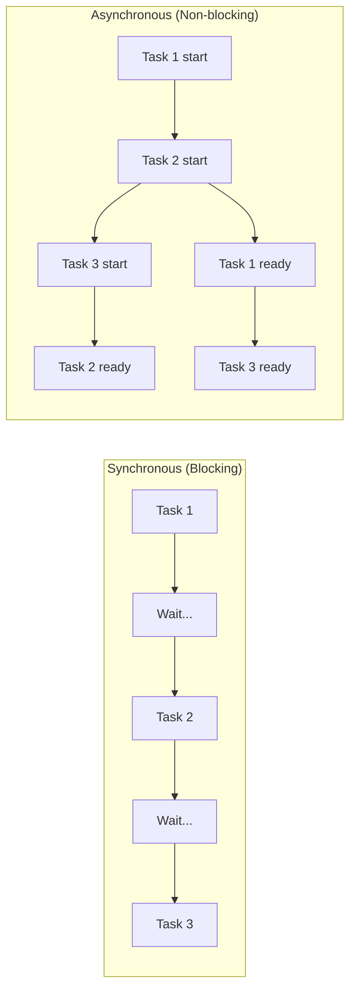
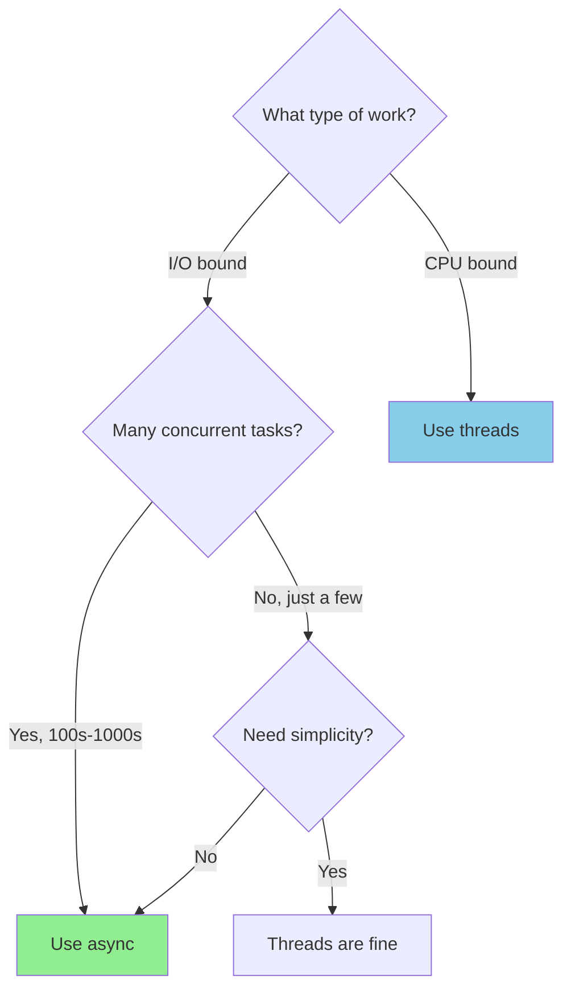
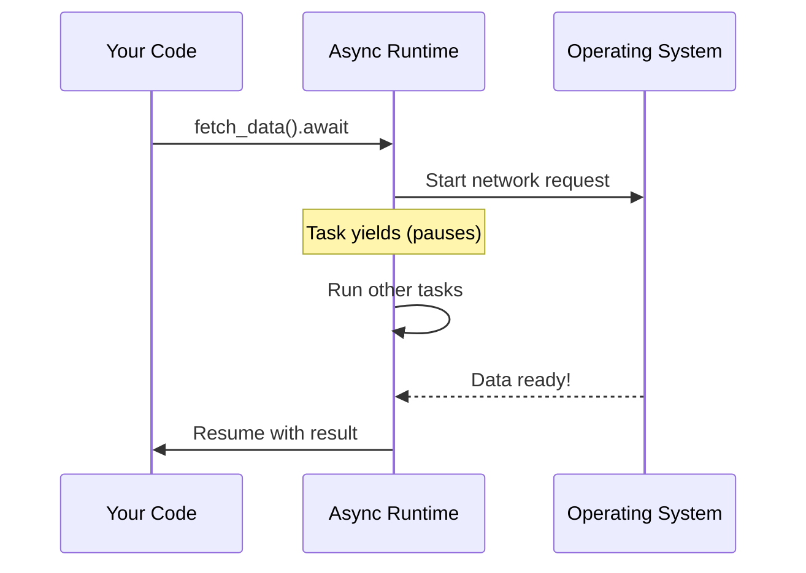
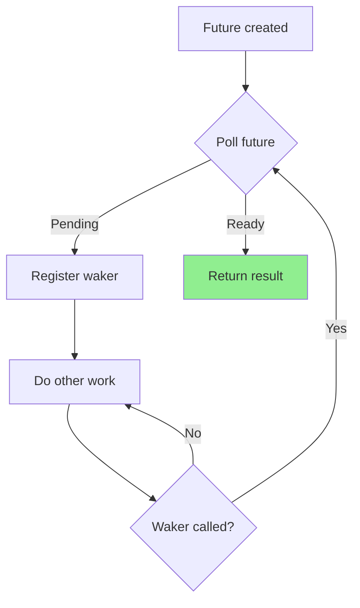
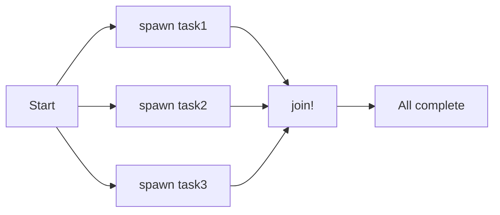
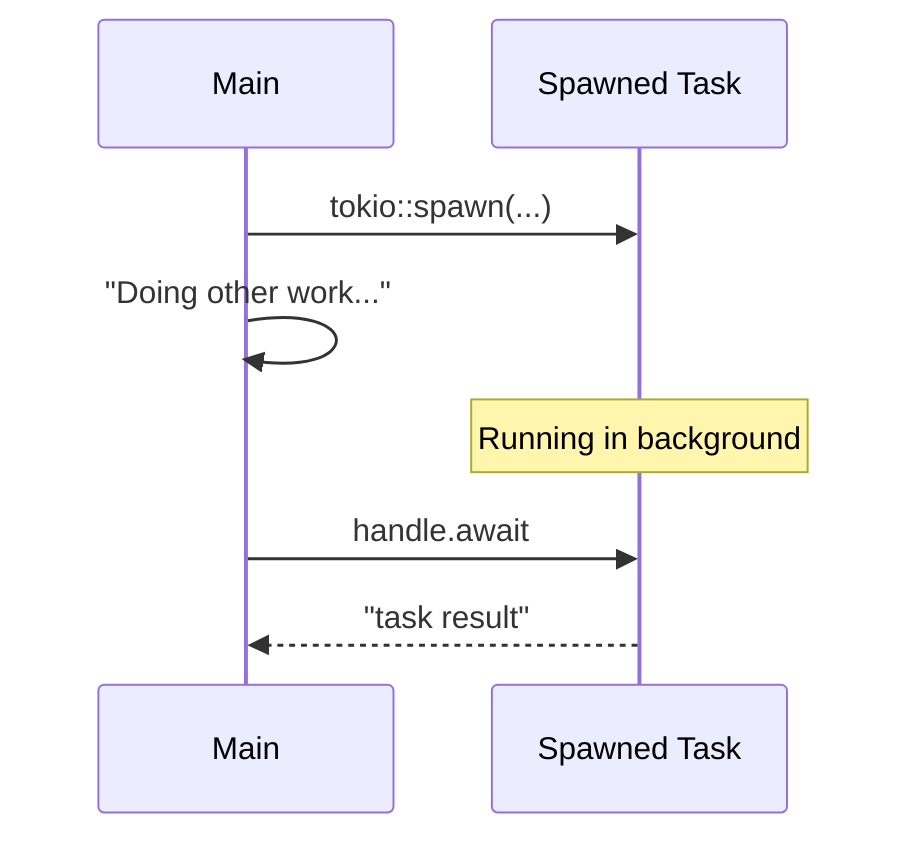
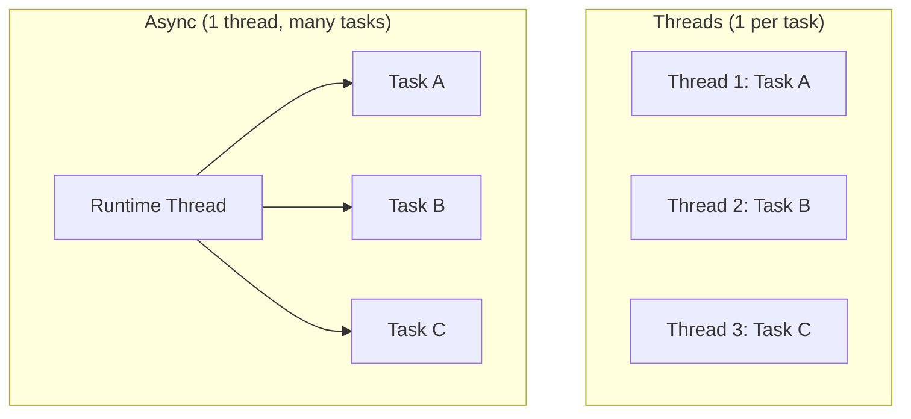
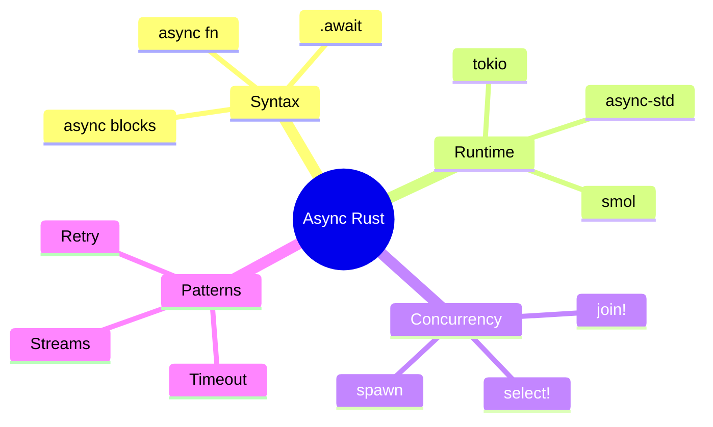

# Async Basics

## Overview

**Async/await** is Rust's way of writing asynchronous code that looks like synchronous code. It enables efficient I/O-bound concurrency without the overhead of threads.



**Key insight**: Async code can pause (yield) while waiting for I/O, allowing other tasks to make progress on the same thread.

## When to Use Async

| Use Case | Async | Threads |
|----------|-------|---------|
| Many I/O operations (network, files) | ✓ Best choice | Works but wasteful |
| CPU-intensive computation | ✗ Avoid | ✓ Best choice |
| Thousands of concurrent tasks | ✓ Lightweight | ✗ Too expensive |
| Simple blocking operations | ✗ Overhead not worth it | ✓ Simpler |
| Web servers, network clients | ✓ Ideal | Possible |



## How Async Works

### The Mental Model



### Futures: The Building Block

A **Future** is a value that may not be ready yet. It represents an asynchronous computation.

```rust
// async fn returns a Future
async fn fetch_data() -> String {
    "data".to_string()
}

// This is roughly equivalent to:
fn fetch_data() -> impl Future<Output = String> {
    async {
        "data".to_string()
    }
}
```

### The Polling Model



{: .note }
You don't poll futures manually—the async runtime does this for you.

## Basic Syntax

### Async Functions

```rust
// Declare an async function
async fn greet(name: &str) -> String {
    format!("Hello, {}!", name)
}

// Async functions return Futures, not values directly
// The function body doesn't run until you .await it
```

### The `.await` Keyword

```rust
async fn main_example() {
    // .await pauses this function until the Future is ready
    let greeting = greet("World").await;
    println!("{}", greeting);

    // You can chain .await
    let data = fetch_user(1).await
        .process().await
        .save().await;
}
```

**Important**: `.await` can only be used inside an `async` context.

## Running Async Code: The Runtime

Async code needs a **runtime** to execute. Rust doesn't include one in std—you choose your own.

### Tokio (Most Popular)

```toml
# Cargo.toml
[dependencies]
tokio = { version = "1", features = ["full"] }
```

```rust
#[tokio::main]
async fn main() {
    println!("Hello from async!");
    let result = fetch_data().await;
    println!("Got: {}", result);
}

async fn fetch_data() -> String {
    // Simulate network delay
    tokio::time::sleep(tokio::time::Duration::from_millis(100)).await;
    "data from server".to_string()
}
```

### What `#[tokio::main]` Does

```rust
// This:
#[tokio::main]
async fn main() {
    my_async_fn().await;
}

// Expands to roughly:
fn main() {
    tokio::runtime::Runtime::new()
        .unwrap()
        .block_on(async {
            my_async_fn().await;
        });
}
```

## Concurrent Execution

### Running Tasks in Parallel



### `tokio::join!` - Wait for All

```rust
use tokio::time::{sleep, Duration};

async fn task_a() -> u32 {
    sleep(Duration::from_millis(100)).await;
    println!("Task A done");
    1
}

async fn task_b() -> u32 {
    sleep(Duration::from_millis(50)).await;
    println!("Task B done");
    2
}

#[tokio::main]
async fn main() {
    // Run concurrently, wait for both
    let (a, b) = tokio::join!(task_a(), task_b());
    println!("Results: {}, {}", a, b);
    // Output:
    // Task B done
    // Task A done
    // Results: 1, 2
}
```

### `tokio::select!` - Wait for First

```rust
use tokio::time::{sleep, Duration};

#[tokio::main]
async fn main() {
    tokio::select! {
        _ = sleep(Duration::from_millis(100)) => {
            println!("100ms elapsed");
        }
        _ = sleep(Duration::from_millis(50)) => {
            println!("50ms elapsed first!");
        }
    }
    // Output: 50ms elapsed first!
}
```

### `tokio::spawn` - Background Tasks

```rust
#[tokio::main]
async fn main() {
    // Spawn a task that runs independently
    let handle = tokio::spawn(async {
        sleep(Duration::from_millis(100)).await;
        "task result"
    });

    // Do other work while task runs
    println!("Doing other work...");

    // Wait for task to complete
    let result = handle.await.unwrap();
    println!("Task returned: {}", result);
}
```



## Practical Example: Concurrent HTTP Requests

```rust
use tokio;

// Simulated HTTP client
async fn fetch_url(url: &str) -> String {
    // In real code, use reqwest or similar
    tokio::time::sleep(tokio::time::Duration::from_millis(100)).await;
    format!("Response from {}", url)
}

#[tokio::main]
async fn main() {
    let urls = vec![
        "https://api.example.com/users",
        "https://api.example.com/posts",
        "https://api.example.com/comments",
    ];

    // Sequential: ~300ms total
    // for url in &urls {
    //     let response = fetch_url(url).await;
    //     println!("{}", response);
    // }

    // Concurrent: ~100ms total
    let futures: Vec<_> = urls.iter()
        .map(|url| fetch_url(url))
        .collect();

    let results = futures::future::join_all(futures).await;

    for result in results {
        println!("{}", result);
    }
}
```



```mermaid
gantt
    title Sequential vs Concurrent
    dateFormat X
    axisFormat %Lms

    section Sequential
    Request 1    :a, 0, 100
    Request 2    :b, 100, 200
    Request 3    :c, 200, 300

    section Concurrent
    Request 1    :d, 0, 100
    Request 2    :e, 0, 100
    Request 3    :f, 0, 100
```

## Async Streams

Process data as it arrives:

```rust
use tokio_stream::StreamExt;

async fn process_stream() {
    let mut stream = tokio_stream::iter(vec![1, 2, 3, 4, 5]);

    while let Some(value) = stream.next().await {
        println!("Got: {}", value);
    }
}
```

## Common Patterns

### Pattern 1: Timeout

```rust
use tokio::time::{timeout, Duration};

async fn with_timeout() -> Result<String, &'static str> {
    let result = timeout(
        Duration::from_secs(5),
        slow_operation()
    ).await;

    match result {
        Ok(value) => Ok(value),
        Err(_) => Err("Operation timed out"),
    }
}
```

### Pattern 2: Retry Logic

```rust
async fn fetch_with_retry(url: &str, max_retries: u32) -> Result<String, String> {
    for attempt in 1..=max_retries {
        match fetch_url(url).await {
            Ok(response) => return Ok(response),
            Err(e) if attempt < max_retries => {
                println!("Attempt {} failed, retrying...", attempt);
                tokio::time::sleep(Duration::from_secs(1)).await;
            }
            Err(e) => return Err(e),
        }
    }
    Err("Max retries exceeded".to_string())
}
```

### Pattern 3: Graceful Shutdown

```rust
use tokio::signal;

#[tokio::main]
async fn main() {
    let server = tokio::spawn(async {
        // Run server
        loop {
            // Handle requests
            tokio::time::sleep(Duration::from_secs(1)).await;
        }
    });

    // Wait for Ctrl+C
    signal::ctrl_c().await.unwrap();
    println!("Shutting down...");

    server.abort();  // Cancel the server task
}
```

## Common Mistakes

### Mistake 1: Blocking in Async Code

```rust
// ❌ WRONG - blocks the entire runtime!
async fn bad() {
    std::thread::sleep(Duration::from_secs(1));  // Blocking!
}

// ✓ RIGHT - yields to runtime
async fn good() {
    tokio::time::sleep(Duration::from_secs(1)).await;  // Async!
}
```

### Mistake 2: Forgetting to `.await`

```rust
async fn fetch() -> String { "data".into() }

async fn bad() {
    let future = fetch();  // Future created but never polled!
    // Nothing happens
}

async fn good() {
    let data = fetch().await;  // Actually runs
    println!("{}", data);
}
```

### Mistake 3: Holding Locks Across `.await`

```rust
use std::sync::Mutex;

// ❌ WRONG - Mutex guard held across await point
async fn bad(data: &Mutex<Vec<i32>>) {
    let mut guard = data.lock().unwrap();
    some_async_operation().await;  // Other tasks can't access data!
    guard.push(1);
}

// ✓ RIGHT - Release lock before await
async fn good(data: &Mutex<Vec<i32>>) {
    {
        let mut guard = data.lock().unwrap();
        guard.push(1);
    }  // Lock released here
    some_async_operation().await;
}

// ✓ BETTER - Use tokio::sync::Mutex for async
use tokio::sync::Mutex;

async fn better(data: &Mutex<Vec<i32>>) {
    let mut guard = data.lock().await;  // Async-aware lock
    some_async_operation().await;
    guard.push(1);
}
```

## Async vs Threads Comparison



| Aspect | Async | Threads |
|--------|-------|---------|
| Memory per task | ~Few KB | ~2MB stack |
| Context switch | Very fast | OS kernel |
| 10,000 tasks | Easy | Difficult |
| CPU-bound work | Poor | Good |
| Learning curve | Steeper | Gentler |

## Summary



| Concept | Purpose |
|---------|---------|
| `async fn` | Declare async function returning Future |
| `.await` | Suspend until Future is ready |
| `Future` | Represents async computation |
| Runtime | Polls futures, manages tasks |
| `join!` | Run multiple futures concurrently |
| `select!` | Race futures, take first result |
| `spawn` | Run task in background |

## See Also

- [Web Services]() - Build async web applications
- [Async Runtimes]() - Runtime comparison and details
- [Threads]() - OS thread-based concurrency

## Next Steps

Continue to [Part 4: Advanced]() for unsafe, FFI, and macros.
