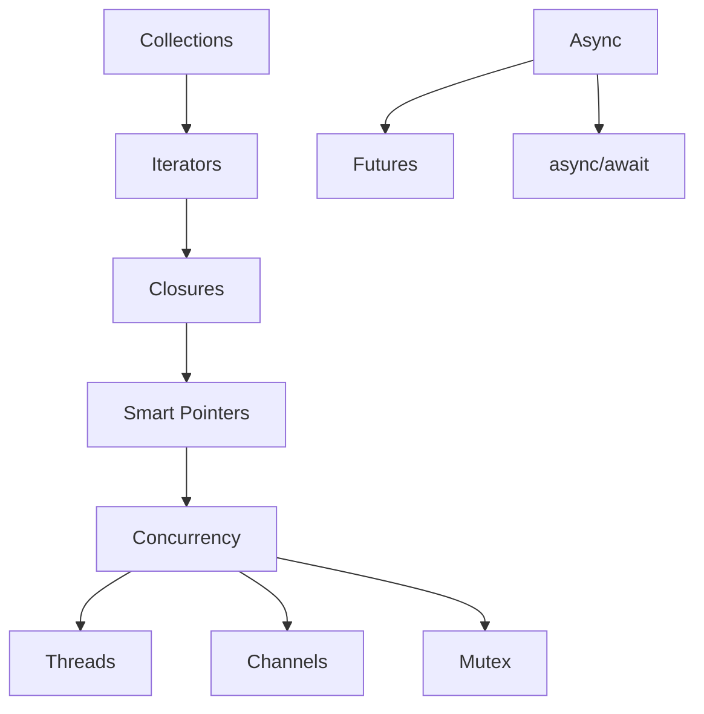

# Part 3: Intermediate Rust

This part covers collections, iterators, closures, smart pointers, and concurrency—the tools you need for real-world Rust programming.

## What You'll Learn

- Working with collections (Vec, HashMap, String)
- Iterator patterns and adaptors
- Closures and capturing
- Smart pointers (Box, Rc, Arc, RefCell)
- Multi-threaded programming
- Channels for message passing
- Mutexes and shared state
- Introduction to async/await

## Chapters

1. [Collections]() - Vec, HashMap, and String
2. [Iterators]() - Patterns and adapters
3. [Closures]() - Anonymous functions and capturing
4. [Smart Pointers]() - Box, Rc, Arc, RefCell
5. [Threads]() - Spawning and joining
6. [Channels]() - Message passing
7. [Mutex]() - Shared state concurrency
8. [Async Basics]() - Introduction to async/await

## The Big Picture

## Prerequisites

- Completed [Part 2: Fundamentals]()
- Understanding of ownership and borrowing
- Familiarity with traits and generics

## Time Estimate

Plan for 4-6 hours to work through this part. Concurrency concepts may require extra practice.

## Next Steps

Start with [Collections]() to learn about Rust's data structures.
