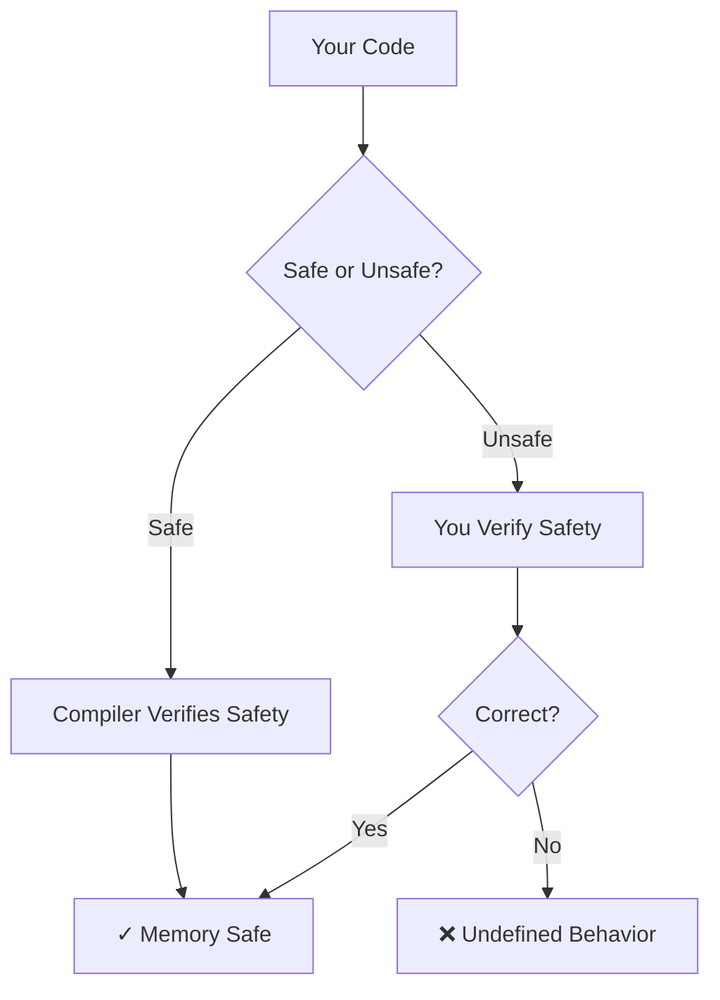
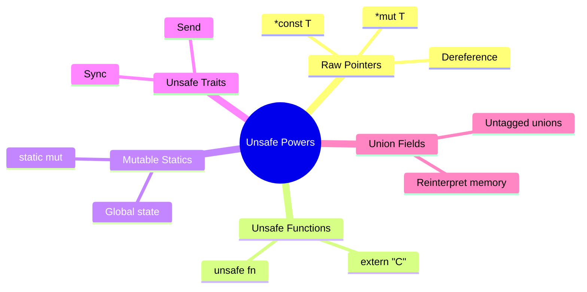
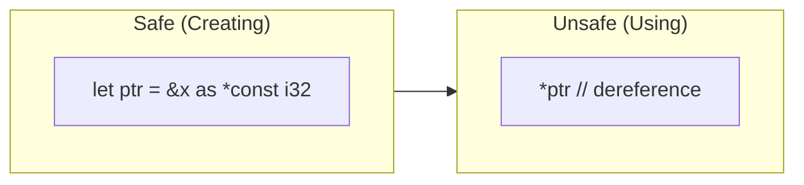
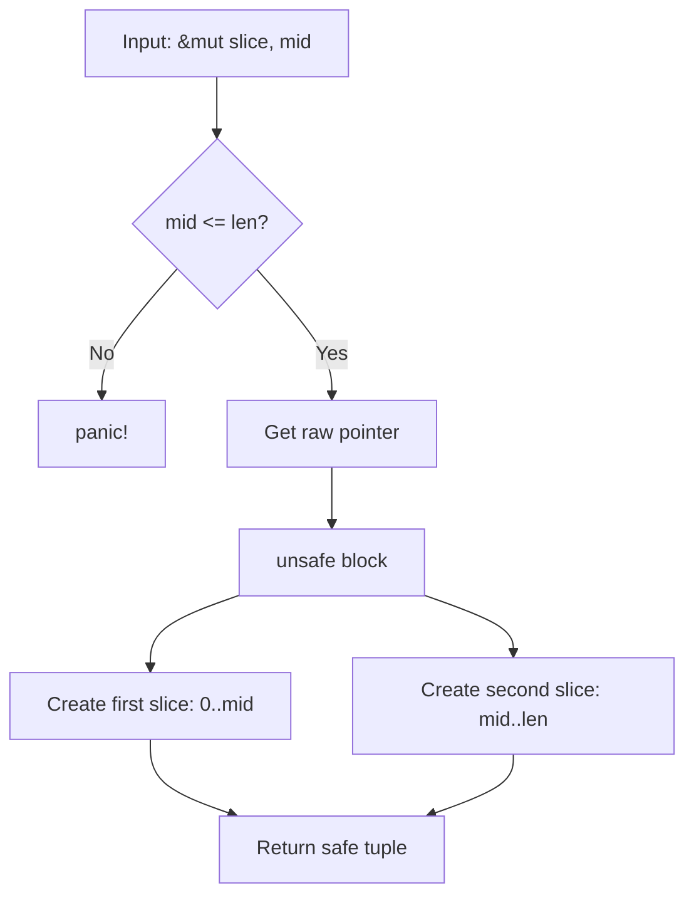
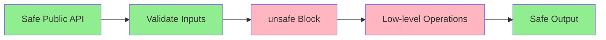
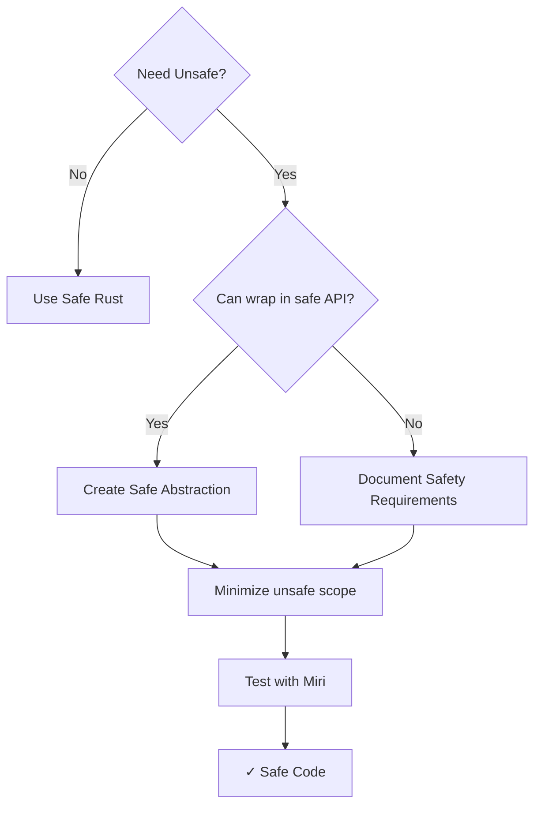

# Unsafe Rust

## Overview

**Unsafe Rust** is a subset of the language that bypasses Rust's safety guarantees. While Rust's compiler prevents memory errors at compile time, some operations cannot be verified by the borrow checker. Unsafe code tells the compiler: "Trust me, I've manually verified this is correct."



{: .important }
Unsafe doesn't mean the code is dangerous—it means the **programmer** takes responsibility for safety instead of the compiler.

## When to Use Unsafe

| Use Case | Why Unsafe is Needed |
|----------|---------------------|
| FFI (calling C code) | Rust can't verify external code |
| Hardware access | Direct memory/register manipulation |
| Performance-critical code | Bypass bounds checking |
| Implementing data structures | Custom memory layouts |
| Safe abstractions | Building safe APIs over unsafe operations |

**Rule of thumb**: Use unsafe only when safe Rust cannot express what you need, and always wrap it in a safe abstraction.

## The Five Unsafe Superpowers

Unsafe code can do five things that safe Rust cannot:



### 1. Dereference Raw Pointers

Raw pointers (`*const T` and `*mut T`) are like C pointers—no safety guarantees.

```rust
fn main() {
    let mut num = 5;

    // Creating raw pointers is safe
    let r1 = &num as *const i32;      // immutable raw pointer
    let r2 = &mut num as *mut i32;    // mutable raw pointer

    // Dereferencing requires unsafe
    unsafe {
        println!("r1 points to: {}", *r1);
        *r2 = 10;  // Modify through raw pointer
        println!("r2 points to: {}", *r2);
    }
}
```

**When to use**: FFI, building custom data structures, or when you need pointers that can be null.



### 2. Call Unsafe Functions

Functions marked `unsafe` have preconditions the caller must uphold.

```rust
// This function has a safety contract
unsafe fn dangerous(ptr: *const i32) -> i32 {
    // Safety: Caller must ensure ptr is valid and aligned
    *ptr
}

fn main() {
    let x = 42;
    let ptr = &x as *const i32;

    // Must acknowledge the danger
    unsafe {
        let value = dangerous(ptr);
        println!("Value: {}", value);
    }
}
```

**When to use**: When the operation's safety depends on conditions the compiler can't check.

### 3. Access Mutable Static Variables

Static variables have a fixed memory address. Mutable statics are unsafe because multiple threads could access them simultaneously.

```rust
static mut COUNTER: u32 = 0;

fn increment() {
    unsafe {
        COUNTER += 1;  // Data race possible!
    }
}

fn main() {
    increment();
    increment();
    unsafe {
        println!("COUNTER: {}", COUNTER);
    }
}
```

{: .warning }
Mutable statics can cause data races. Prefer `Mutex`, `AtomicU32`, or other synchronization primitives.

**When to use**: Low-level code, FFI callbacks, or when you truly need global mutable state.

### 4. Implement Unsafe Traits

Some traits have invariants that can't be verified by the compiler.

```rust
// The Send and Sync traits are unsafe to implement
// because the compiler can't verify thread safety

struct MyType {
    ptr: *mut i32,
}

// We promise MyType is safe to send between threads
unsafe impl Send for MyType {}

// We promise MyType is safe to share between threads
unsafe impl Sync for MyType {}
```

**When to use**: When implementing low-level concurrency primitives or FFI wrappers.

### 5. Access Union Fields

Unions store different types in the same memory location (like C unions).

```rust
union IntOrFloat {
    i: i32,
    f: f32,
}

fn main() {
    let u = IntOrFloat { i: 42 };

    // Reading a union field is unsafe—we might interpret
    // the bits incorrectly
    unsafe {
        println!("As int: {}", u.i);
        println!("As float: {}", u.f);  // Reinterprets same bits!
    }
}
```

**When to use**: FFI with C unions, or reinterpreting memory (like network protocols).

## Safe Abstractions Over Unsafe

The most important pattern: wrap unsafe code in a safe API.

### Example: Safe `split_at_mut`

The standard library's `split_at_mut` needs unsafe internally, but provides a safe interface:

```rust
fn split_at_mut(values: &mut [i32], mid: usize) -> (&mut [i32], &mut [i32]) {
    let len = values.len();
    let ptr = values.as_mut_ptr();

    // Precondition check (makes the unsafe code safe)
    assert!(mid <= len, "mid out of bounds");

    unsafe {
        // Safety: We've verified mid <= len, so:
        // - ptr..ptr+mid is valid
        // - ptr+mid..ptr+len is valid
        // - The two slices don't overlap
        (
            std::slice::from_raw_parts_mut(ptr, mid),
            std::slice::from_raw_parts_mut(ptr.add(mid), len - mid),
        )
    }
}
```



### The Pattern



## Common Unsafe Patterns

### Pattern 1: Bounds-Check Elimination

When you know an index is valid but the compiler doesn't:

```rust
fn sum_first_n(slice: &[i32], n: usize) -> i32 {
    assert!(n <= slice.len());  // Safety check

    let mut sum = 0;
    for i in 0..n {
        // SAFETY: We verified n <= len, so i < len
        unsafe {
            sum += *slice.get_unchecked(i);
        }
    }
    sum
}
```

### Pattern 2: Transmuting Types

Reinterpret memory as a different type:

```rust
fn bytes_to_u32(bytes: [u8; 4]) -> u32 {
    // SAFETY: u32 and [u8; 4] have the same size and alignment
    unsafe { std::mem::transmute(bytes) }
}
```

{: .warning }
Transmute is extremely dangerous. Prefer `from_ne_bytes`, `to_ne_bytes`, or bytemuck crate.

### Pattern 3: Pin and Self-Referential Structs

For async and self-referential data:

```rust
use std::pin::Pin;
use std::marker::PhantomPinned;

struct SelfRef {
    value: String,
    ptr: *const String,  // Points to value
    _pin: PhantomPinned,
}

impl SelfRef {
    fn new(value: String) -> Pin<Box<Self>> {
        let mut boxed = Box::new(SelfRef {
            value,
            ptr: std::ptr::null(),
            _pin: PhantomPinned,
        });

        let ptr = &boxed.value as *const String;
        // SAFETY: We won't move the Box after this
        unsafe {
            let mut_ref = Pin::as_mut(&mut Pin::new_unchecked(&mut *boxed));
            Pin::get_unchecked_mut(mut_ref).ptr = ptr;
        }

        unsafe { Pin::new_unchecked(boxed) }
    }
}
```

## Documenting Safety

Always document why unsafe code is safe:

```rust
/// Reads a value from a raw pointer.
///
/// # Safety
///
/// The caller must ensure that:
/// - `ptr` is non-null
/// - `ptr` is properly aligned for `T`
/// - `ptr` points to a valid instance of `T`
/// - No other code has a mutable reference to the data
unsafe fn read_ptr<T>(ptr: *const T) -> T
where
    T: Copy,
{
    *ptr
}
```

## Safety Checklist

Before writing unsafe code, verify:

| Check | Question |
|-------|----------|
| ✓ Null | Is the pointer definitely non-null? |
| ✓ Alignment | Is the pointer properly aligned? |
| ✓ Validity | Does it point to valid, initialized memory? |
| ✓ Aliasing | Are there conflicting references? |
| ✓ Bounds | Is array access within bounds? |
| ✓ Lifetime | Will the data outlive the pointer? |

## Tools for Unsafe Code

| Tool | Purpose |
|------|---------|
| Miri | Detects undefined behavior |
| AddressSanitizer | Memory error detection |
| ThreadSanitizer | Data race detection |
| cargo-careful | Extra runtime checks |

```bash
# Run with Miri
rustup +nightly component add miri
cargo +nightly miri run

# Run with sanitizers
RUSTFLAGS="-Z sanitizer=address" cargo +nightly run
```

## Common Mistakes

### ❌ Assuming Valid Pointers

```rust
// WRONG: ptr might be dangling
unsafe fn bad(ptr: *const i32) -> i32 {
    *ptr  // Could be undefined behavior!
}

// RIGHT: Document and validate
/// # Safety: ptr must be valid and properly aligned
unsafe fn good(ptr: *const i32) -> i32 {
    debug_assert!(!ptr.is_null());
    *ptr
}
```

### ❌ Creating Invalid References

```rust
// WRONG: References must always be valid
let ptr: *const i32 = std::ptr::null();
let _ref: &i32 = unsafe { &*ptr };  // UB: null reference!

// RIGHT: Use Option for nullable
let ptr: *const i32 = std::ptr::null();
let opt: Option<&i32> = unsafe { ptr.as_ref() };  // Returns None
```

## Summary



| Principle | Description |
|-----------|-------------|
| Minimize | Keep unsafe blocks as small as possible |
| Encapsulate | Wrap unsafe in safe abstractions |
| Document | Explain why the code is safe |
| Validate | Check preconditions before unsafe |
| Test | Use Miri and sanitizers |

## See Also

- [Memory Layout]() - Understanding memory representation
- [no_std Basics]() - Systems programming without the standard library
- [FFI]() - Calling C code requires unsafe

## Next Steps

Learn about [FFI]() for calling C code from Rust.
