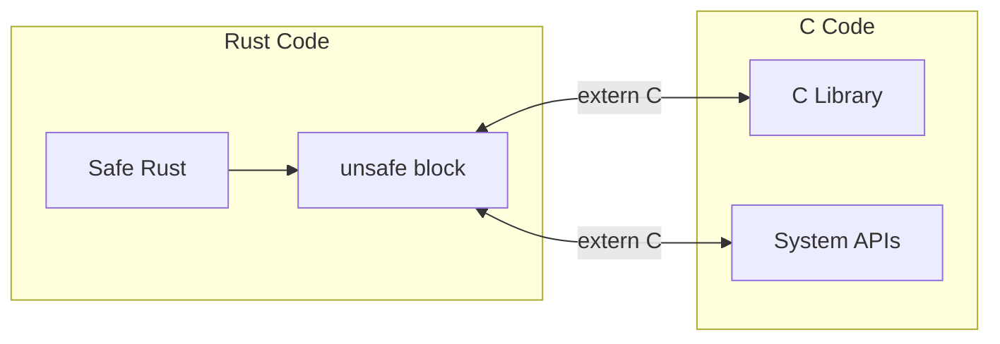
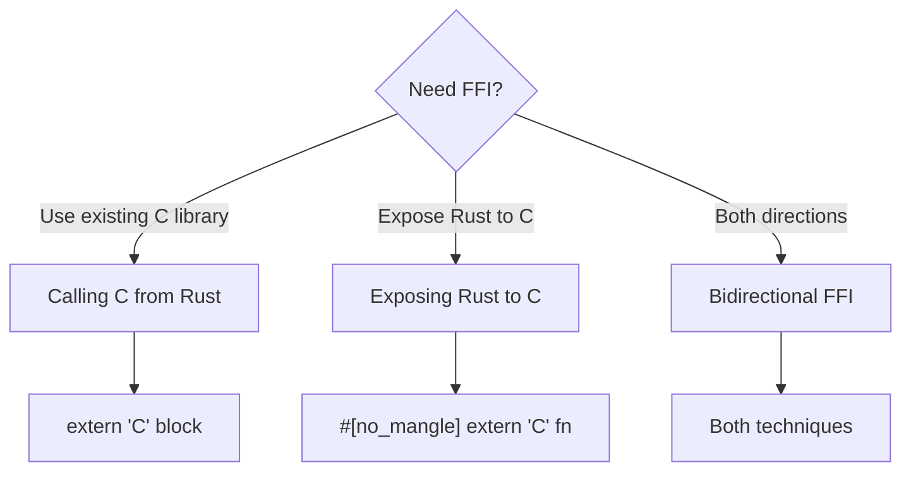
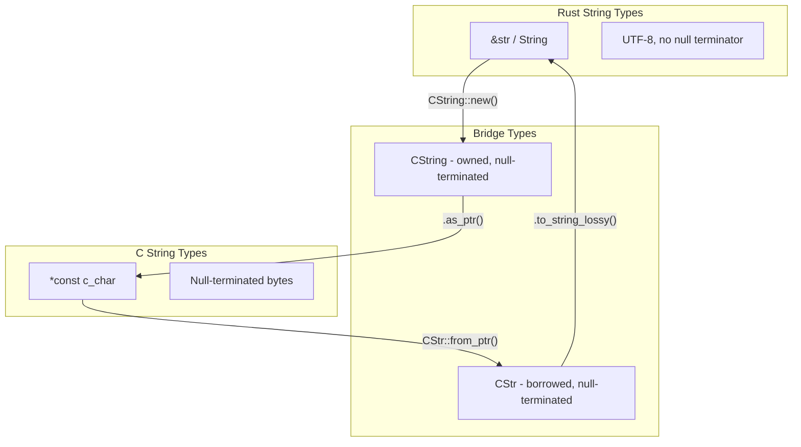
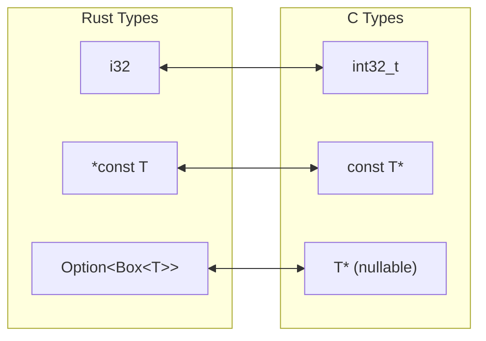
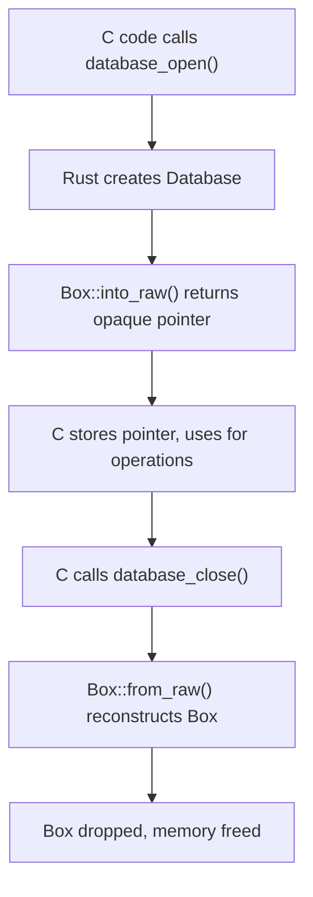
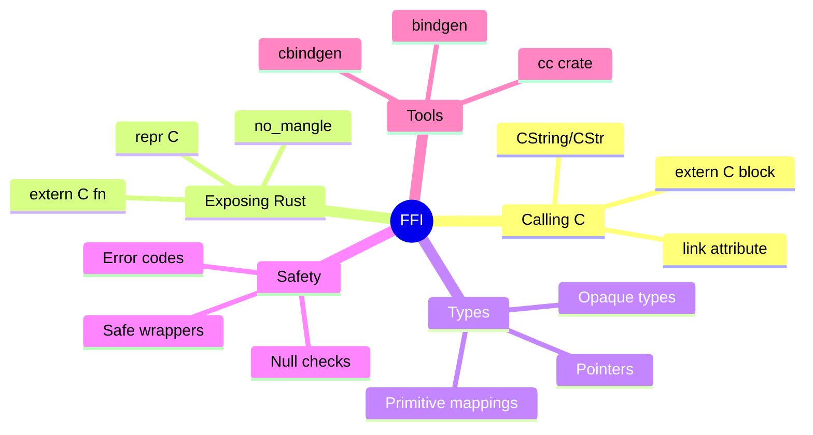

# Foreign Function Interface (FFI)

## Overview

**FFI** (Foreign Function Interface) allows Rust to interoperate with code written in other languages, primarily C. This is essential for using existing C libraries, integrating with operating systems, and embedding Rust in other programs.



**Key insight**: FFI requires `unsafe` because Rust can't verify the correctness of external code. Always wrap FFI calls in safe abstractions.

## When to Use FFI

| Use Case | Example |
|----------|---------|
| System libraries | OpenSSL, SQLite, zlib |
| OS APIs | POSIX, Windows API |
| Hardware interfaces | Device drivers |
| Legacy codebases | Integrating C/C++ code |
| Embedding Rust | Rust in Python, Ruby, etc. |



## Calling C Functions from Rust

### Basic C Function Calls

```rust
// Declare external C functions
extern "C" {
    fn abs(input: i32) -> i32;
    fn sqrt(x: f64) -> f64;
    fn strlen(s: *const i8) -> usize;
}

fn main() {
    unsafe {
        println!("abs(-3) = {}", abs(-3));
        println!("sqrt(9) = {}", sqrt(9.0));
    }
}
```

### Linking to Libraries

```rust
// Link to specific library
#[link(name = "crypto")]
extern "C" {
    fn RAND_bytes(buf: *mut u8, num: i32) -> i32;
}

// Static linking
#[link(name = "mylib", kind = "static")]
extern "C" {
    fn my_function() -> i32;
}
```

### C String Handling

```rust
use std::ffi::{CStr, CString};
use std::os::raw::c_char;

extern "C" {
    fn puts(s: *const c_char) -> i32;
    fn getenv(name: *const c_char) -> *const c_char;
}

fn safe_puts(s: &str) {
    let c_string = CString::new(s).expect("CString::new failed");
    unsafe {
        puts(c_string.as_ptr());
    }
}

fn safe_getenv(name: &str) -> Option<String> {
    let c_name = CString::new(name).ok()?;
    unsafe {
        let ptr = getenv(c_name.as_ptr());
        if ptr.is_null() {
            None
        } else {
            Some(CStr::from_ptr(ptr).to_string_lossy().into_owned())
        }
    }
}
```



## Exposing Rust to C

### Basic Rust Function for C

```rust
// Prevent name mangling so C can find the function
#[no_mangle]
pub extern "C" fn rust_add(a: i32, b: i32) -> i32 {
    a + b
}

#[no_mangle]
pub extern "C" fn rust_multiply(a: i32, b: i32) -> i32 {
    a * b
}
```

### Corresponding C Header

```c
// rust_math.h
#ifndef RUST_MATH_H
#define RUST_MATH_H

#include <stdint.h>

int32_t rust_add(int32_t a, int32_t b);
int32_t rust_multiply(int32_t a, int32_t b);

#endif
```

### String Parameters

```rust
use std::ffi::CStr;
use std::os::raw::c_char;

#[no_mangle]
pub extern "C" fn rust_greet(name: *const c_char) {
    let c_str = unsafe {
        if name.is_null() {
            return;
        }
        CStr::from_ptr(name)
    };

    if let Ok(name_str) = c_str.to_str() {
        println!("Hello, {}!", name_str);
    }
}
```

## C-Compatible Types

### The `repr(C)` Attribute

```rust
// Guarantees C-compatible memory layout
#[repr(C)]
pub struct Point {
    pub x: f64,
    pub y: f64,
}

#[repr(C)]
pub struct Rectangle {
    pub origin: Point,
    pub width: f64,
    pub height: f64,
}
```

### Type Mappings

| Rust Type | C Type | Notes |
|-----------|--------|-------|
| `i8` | `int8_t` / `char` | Signed byte |
| `u8` | `uint8_t` | Unsigned byte |
| `i32` | `int32_t` | 32-bit signed |
| `u32` | `uint32_t` | 32-bit unsigned |
| `i64` | `int64_t` | 64-bit signed |
| `f32` | `float` | Single precision |
| `f64` | `double` | Double precision |
| `*const T` | `const T*` | Const pointer |
| `*mut T` | `T*` | Mutable pointer |
| `bool` | `bool` (C99) | May differ in size |
| `()` | `void` | No return |



### Enums with `repr`

```rust
// C-compatible enum with explicit values
#[repr(C)]
pub enum Status {
    Ok = 0,
    Error = 1,
    Pending = 2,
}

// Integer-backed enum
#[repr(u32)]
pub enum ErrorCode {
    Success = 0,
    FileNotFound = 1,
    PermissionDenied = 2,
}
```

## Callback Functions

### Passing Rust Closures to C

```rust
extern "C" {
    fn register_callback(cb: extern "C" fn(i32) -> i32);
}

extern "C" fn my_callback(x: i32) -> i32 {
    x * 2
}

fn main() {
    unsafe {
        register_callback(my_callback);
    }
}
```

### Function Pointers with User Data

```rust
type Callback = extern "C" fn(*mut std::ffi::c_void, i32);

extern "C" {
    fn set_callback(cb: Callback, user_data: *mut std::ffi::c_void);
}

extern "C" fn callback_wrapper(data: *mut std::ffi::c_void, value: i32) {
    let closure: &mut Box<dyn FnMut(i32)> = unsafe {
        &mut *(data as *mut Box<dyn FnMut(i32)>)
    };
    closure(value);
}
```

## Error Handling Across FFI

### Return Codes

```rust
#[repr(C)]
pub enum FfiResult {
    Ok = 0,
    NullPointer = 1,
    InvalidUtf8 = 2,
    BufferTooSmall = 3,
}

#[no_mangle]
pub extern "C" fn process_data(
    input: *const u8,
    input_len: usize,
    output: *mut u8,
    output_len: *mut usize,
) -> FfiResult {
    if input.is_null() || output.is_null() || output_len.is_null() {
        return FfiResult::NullPointer;
    }

    // Process data...
    FfiResult::Ok
}
```

### Out Parameters for Errors

```rust
use std::os::raw::c_char;

#[no_mangle]
pub extern "C" fn compute_with_error(
    input: i32,
    result: *mut i32,
    error_msg: *mut *mut c_char,
) -> bool {
    if result.is_null() {
        return false;
    }

    if input < 0 {
        if !error_msg.is_null() {
            let msg = CString::new("Input must be non-negative").unwrap();
            unsafe {
                *error_msg = msg.into_raw();
            }
        }
        return false;
    }

    unsafe {
        *result = input * 2;
    }
    true
}

// Don't forget to provide a way to free the error string
#[no_mangle]
pub extern "C" fn free_error_msg(msg: *mut c_char) {
    if !msg.is_null() {
        unsafe {
            drop(CString::from_raw(msg));
        }
    }
}
```

## Memory Management

### Allocating Memory for C

```rust
use std::alloc::{alloc, dealloc, Layout};

#[no_mangle]
pub extern "C" fn allocate_buffer(size: usize) -> *mut u8 {
    if size == 0 {
        return std::ptr::null_mut();
    }

    let layout = Layout::from_size_align(size, 1).unwrap();
    unsafe { alloc(layout) }
}

#[no_mangle]
pub extern "C" fn free_buffer(ptr: *mut u8, size: usize) {
    if ptr.is_null() || size == 0 {
        return;
    }

    let layout = Layout::from_size_align(size, 1).unwrap();
    unsafe {
        dealloc(ptr, layout);
    }
}
```

### Opaque Types

```rust
// Hide Rust type behind opaque pointer
pub struct Database {
    connection: String,
    // ... internal fields
}

#[no_mangle]
pub extern "C" fn database_open(path: *const c_char) -> *mut Database {
    let path_str = unsafe { CStr::from_ptr(path) }.to_str().unwrap();
    let db = Box::new(Database {
        connection: path_str.to_string(),
    });
    Box::into_raw(db)
}

#[no_mangle]
pub extern "C" fn database_close(db: *mut Database) {
    if !db.is_null() {
        unsafe {
            drop(Box::from_raw(db));
        }
    }
}
```



## Build Configuration

### Cargo.toml for Libraries

```toml
[package]
name = "mylib"
version = "0.1.0"

[lib]
crate-type = ["cdylib", "staticlib"]  # Dynamic and static libraries

[dependencies]
libc = "0.2"  # C type definitions
```

### Build Script for C Dependencies

```rust
// build.rs
fn main() {
    // Link to system library
    println!("cargo:rustc-link-lib=ssl");
    println!("cargo:rustc-link-lib=crypto");

    // Add library search path
    println!("cargo:rustc-link-search=/usr/local/lib");

    // Compile C code
    cc::Build::new()
        .file("src/helper.c")
        .compile("helper");
}
```

## Using bindgen

Generate Rust bindings from C headers automatically:

```toml
# Cargo.toml
[build-dependencies]
bindgen = "0.69"
```

```rust
// build.rs
use std::path::PathBuf;

fn main() {
    println!("cargo:rerun-if-changed=wrapper.h");

    let bindings = bindgen::Builder::default()
        .header("wrapper.h")
        .parse_callbacks(Box::new(bindgen::CargoCallbacks::new()))
        .generate()
        .expect("Unable to generate bindings");

    let out_path = PathBuf::from(std::env::var("OUT_DIR").unwrap());
    bindings
        .write_to_file(out_path.join("bindings.rs"))
        .expect("Couldn't write bindings!");
}
```

```rust
// src/lib.rs
include!(concat!(env!("OUT_DIR"), "/bindings.rs"));
```

## Safe Wrapper Pattern

Always wrap unsafe FFI in safe Rust APIs:

```rust
mod ffi {
    use std::os::raw::c_int;

    extern "C" {
        pub fn dangerous_c_function(ptr: *mut u8, len: c_int) -> c_int;
    }
}

// Safe public API
pub struct SafeWrapper {
    buffer: Vec<u8>,
}

impl SafeWrapper {
    pub fn new(size: usize) -> Self {
        SafeWrapper {
            buffer: vec![0; size],
        }
    }

    pub fn process(&mut self) -> Result<i32, &'static str> {
        if self.buffer.is_empty() {
            return Err("Buffer is empty");
        }

        let result = unsafe {
            ffi::dangerous_c_function(
                self.buffer.as_mut_ptr(),
                self.buffer.len() as std::os::raw::c_int,
            )
        };

        if result < 0 {
            Err("C function failed")
        } else {
            Ok(result)
        }
    }
}
```

## Summary



| Pattern | Use Case |
|---------|----------|
| `extern "C" { }` | Declare C functions |
| `#[no_mangle] extern "C" fn` | Export Rust to C |
| `#[repr(C)]` | C-compatible layout |
| `CString` / `CStr` | String conversion |
| Opaque pointers | Hide Rust internals |
| Safe wrappers | Encapsulate unsafe |

## See Also

- [Unsafe Rust]() - Raw pointers and unsafe operations
- [Memory Layout]() - `#[repr(C)]` and data layout
- [Embedded Basics]() - FFI for embedded systems

## Next Steps

Learn about [Declarative Macros]().
