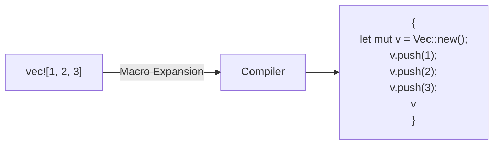
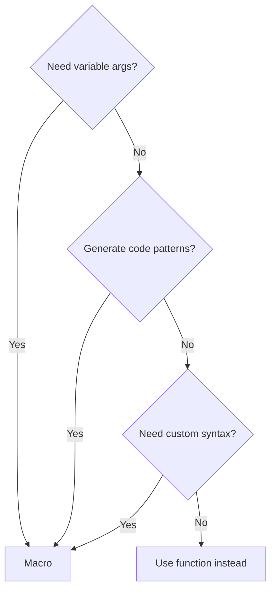
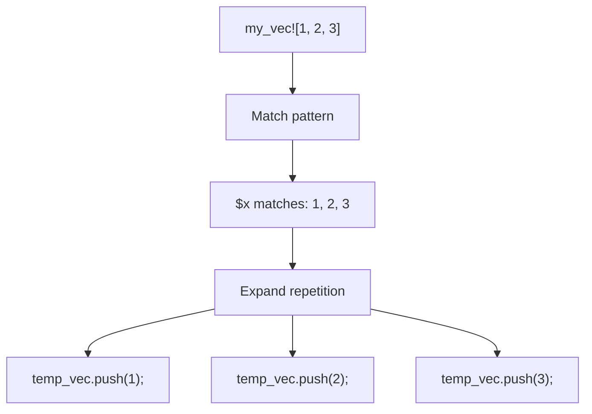
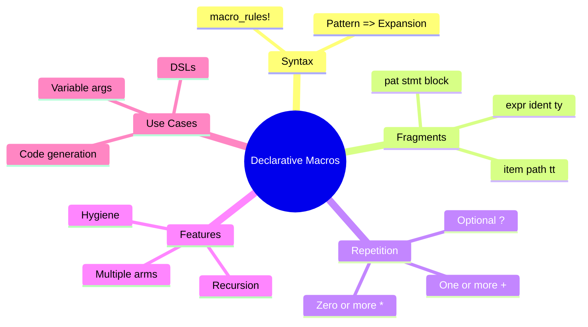

# Declarative Macros

## Overview

**Declarative macros** (also called "macros by example" or `macro_rules!` macros) let you write code that writes code. They match patterns in the input and expand to Rust code at compile time.



**Key insight**: Macros operate on tokens (syntax), not values. They're expanded before type checking, allowing patterns impossible with functions.

## When to Use Macros

| Use Case | Macro | Function |
|----------|-------|----------|
| Variable number of arguments | Yes | No (use slice) |
| Generate repetitive code | Yes | No |
| DSL (domain-specific language) | Yes | No |
| Compile-time computation | Yes | const fn |
| Type-safe operations | No | Yes (preferred) |



## Basic Macro Syntax

```rust
macro_rules! macro_name {
    // Pattern => Expansion
    (pattern) => {
        // Generated code
    };
}
```

### Simple Example

```rust
macro_rules! say_hello {
    () => {
        println!("Hello!");
    };
}

fn main() {
    say_hello!();  // Expands to: println!("Hello!");
}
```

## Fragment Specifiers

Macros capture different kinds of syntax using **fragment specifiers**:

| Specifier | Matches | Example |
|-----------|---------|---------|
| `$x:expr` | Expression | `1 + 2`, `foo()` |
| `$x:ident` | Identifier | `foo`, `MyStruct` |
| `$x:ty` | Type | `i32`, `Vec<String>` |
| `$x:pat` | Pattern | `Some(x)`, `_` |
| `$x:stmt` | Statement | `let x = 1;` |
| `$x:block` | Block | `{ ... }` |
| `$x:item` | Item | `fn foo() {}` |
| `$x:path` | Path | `std::io::Read` |
| `$x:tt` | Token tree | Any single token |
| `$x:literal` | Literal | `42`, `"hello"` |

### Using Fragment Specifiers

```rust
macro_rules! create_function {
    ($func_name:ident) => {
        fn $func_name() {
            println!("Called {:?}()", stringify!($func_name));
        }
    };
}

create_function!(foo);  // Creates fn foo()
create_function!(bar);  // Creates fn bar()

fn main() {
    foo();  // Prints: Called "foo"()
    bar();  // Prints: Called "bar"()
}
```

### Multiple Parameters

```rust
macro_rules! make_pair {
    ($t:ty, $first:expr, $second:expr) => {
        {
            let pair: ($t, $t) = ($first, $second);
            pair
        }
    };
}

fn main() {
    let p = make_pair!(i32, 1, 2);
    println!("{:?}", p);  // (1, 2)
}
```

## Repetition

The real power of macros: handling variable numbers of arguments.

### Syntax

```
$( ... )sep*   // Zero or more
$( ... )sep+   // One or more
$( ... )sep?   // Zero or one
```

Where `sep` is an optional separator (like `,`).

### Example: vec! Implementation

```rust
macro_rules! my_vec {
    // Empty case
    () => {
        Vec::new()
    };
    // One or more elements
    ( $( $x:expr ),+ $(,)? ) => {
        {
            let mut temp_vec = Vec::new();
            $(
                temp_vec.push($x);
            )+
            temp_vec
        }
    };
}

fn main() {
    let v = my_vec![1, 2, 3];
    println!("{:?}", v);  // [1, 2, 3]
}
```



### HashMap Literal

```rust
macro_rules! hashmap {
    ( $( $key:expr => $value:expr ),* $(,)? ) => {
        {
            let mut map = std::collections::HashMap::new();
            $(
                map.insert($key, $value);
            )*
            map
        }
    };
}

fn main() {
    let scores = hashmap! {
        "Alice" => 100,
        "Bob" => 85,
        "Carol" => 92,
    };
    println!("{:?}", scores);
}
```

## Multiple Match Arms

Macros can have multiple patterns, tried in order:

```rust
macro_rules! calculate {
    // Single value
    ($x:expr) => {
        $x
    };
    // Addition
    ($x:expr, + , $y:expr) => {
        $x + $y
    };
    // Subtraction
    ($x:expr, - , $y:expr) => {
        $x - $y
    };
}

fn main() {
    println!("{}", calculate!(5));           // 5
    println!("{}", calculate!(5, +, 3));     // 8
    println!("{}", calculate!(10, -, 4));    // 6
}
```

## Recursive Macros

Macros can call themselves:

```rust
macro_rules! count {
    () => { 0usize };
    ($head:tt $($tail:tt)*) => { 1usize + count!($($tail)*) };
}

fn main() {
    println!("{}", count!(a b c d e));  // 5
}
```

### Recursive vec with Capacity

```rust
macro_rules! counted_vec {
    ($($x:expr),* $(,)?) => {
        {
            const COUNT: usize = count!($($x)*);
            let mut v = Vec::with_capacity(COUNT);
            $(v.push($x);)*
            v
        }
    };
}

macro_rules! count {
    () => { 0usize };
    ($head:expr $(, $tail:expr)*) => { 1usize + count!($($tail),*) };
}
```

## Useful Built-in Macros

| Macro | Purpose |
|-------|---------|
| `stringify!($x)` | Convert tokens to string literal |
| `concat!($a, $b)` | Concatenate literals |
| `file!()` | Current file name |
| `line!()` | Current line number |
| `column!()` | Current column number |
| `module_path!()` | Current module path |
| `env!("VAR")` | Environment variable at compile time |
| `include_str!("file")` | Include file as string |
| `include_bytes!("file")` | Include file as bytes |

```rust
macro_rules! log_location {
    ($msg:expr) => {
        println!("[{}:{}] {}", file!(), line!(), $msg);
    };
}

fn main() {
    log_location!("Starting");  // [src/main.rs:10] Starting
}
```

## Macro Export and Visibility

### Within a Crate

```rust
// In lib.rs or a module
#[macro_use]
mod macros {
    macro_rules! my_macro {
        () => { println!("Hello!"); };
    }
}

// Now available throughout the crate
```

### Exporting from a Crate

```rust
// Modern way (Rust 2018+)
#[macro_export]
macro_rules! public_macro {
    () => { /* ... */ };
}

// Users import with:
// use your_crate::public_macro;
```

## Common Patterns

### Builder-Style DSL

```rust
macro_rules! html {
    ($tag:ident { $($inner:tt)* }) => {
        format!("<{}>{}</{}>",
            stringify!($tag),
            html!($($inner)*),
            stringify!($tag))
    };
    ($text:literal) => {
        $text.to_string()
    };
    () => {
        String::new()
    };
}

fn main() {
    let page = html!(div { "Hello, World!" });
    println!("{}", page);  // <div>Hello, World!</div>
}
```

### Test Generation

```rust
macro_rules! test_cases {
    ($($name:ident: $input:expr => $expected:expr),* $(,)?) => {
        $(
            #[test]
            fn $name() {
                assert_eq!(process($input), $expected);
            }
        )*
    };
}

fn process(x: i32) -> i32 { x * 2 }

test_cases! {
    test_zero: 0 => 0,
    test_positive: 5 => 10,
    test_negative: -3 => -6,
}
```

### Enum Dispatch

```rust
macro_rules! dispatch {
    ($val:expr, $enum:ident, $method:ident $(, $arg:expr)*) => {
        match $val {
            $enum::A(inner) => inner.$method($($arg),*),
            $enum::B(inner) => inner.$method($($arg),*),
            $enum::C(inner) => inner.$method($($arg),*),
        }
    };
}
```

## Debugging Macros

### trace_macros

```rust
#![feature(trace_macros)]

trace_macros!(true);
my_macro!(arg1, arg2);
trace_macros!(false);
```

### cargo expand

```bash
# Install
cargo install cargo-expand

# Use
cargo expand  # Shows expanded code
```

## Hygiene

Macros are **hygienic**—they don't accidentally capture variables:

```rust
macro_rules! using_x {
    ($body:expr) => {
        {
            let x = 42;  // This x is in macro's scope
            $body        // This sees caller's x, not macro's
        }
    };
}

fn main() {
    let x = 10;
    let result = using_x!(x * 2);  // Uses caller's x (10)
    println!("{}", result);  // 20, not 84
}
```

## Summary



| Concept | Syntax | Purpose |
|---------|--------|---------|
| Define macro | `macro_rules! name { }` | Create macro |
| Fragment | `$x:expr` | Capture syntax |
| Repetition | `$($x:expr),*` | Variable args |
| Multiple arms | `(pat1) => {}; (pat2) => {}` | Pattern matching |
| Export | `#[macro_export]` | Make public |

## See Also

- [Procedural Macros]() - derive and attribute macros

## Next Steps

Learn about [Procedural Macros]() for more powerful code generation.
