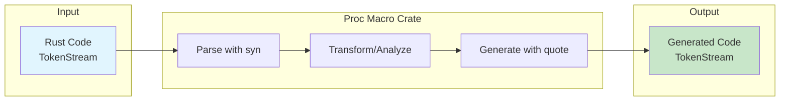
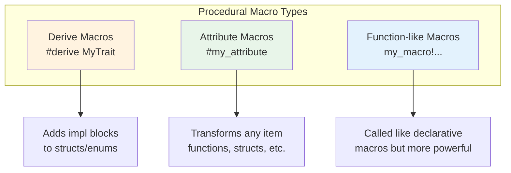
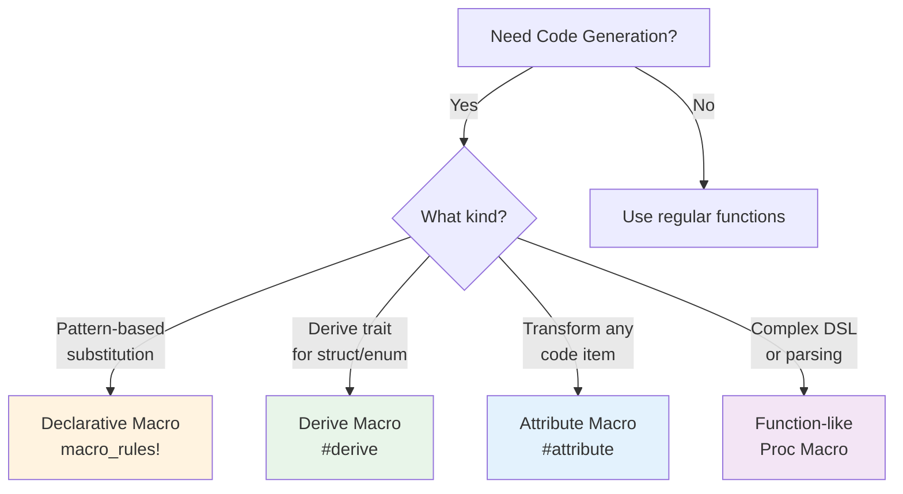
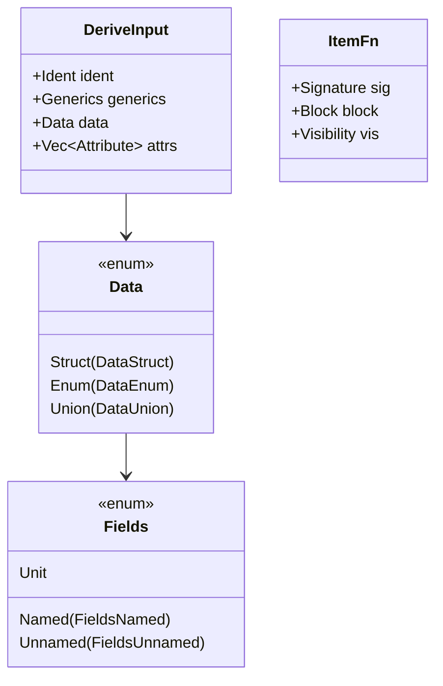
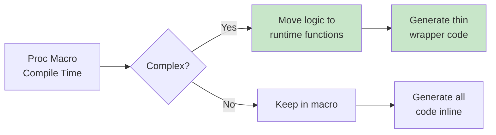

# Procedural Macros

Custom derive, attribute, and function-like macros that operate on Rust syntax.

## Overview

Procedural macros are a powerful metaprogramming feature that allows you to generate Rust code at compile time. Unlike declarative macros that use pattern matching, procedural macros are Rust functions that receive a token stream and produce a token stream.



## Three Types of Procedural Macros



| Type | Annotation | Use Case |
|------|------------|----------|
| **Derive** | `#[derive(MyMacro)]` | Auto-implement traits |
| **Attribute** | `#[my_attribute]` | Transform items, add behavior |
| **Function-like** | `my_macro!(...)` | DSLs, complex code generation |

## When to Use Procedural Macros

{: .best-practice }
> **Use procedural macros when you need to:**
> - Automatically derive trait implementations
> - Generate boilerplate code from struct definitions
> - Create domain-specific languages (DSLs)
> - Add compile-time validation or transformation

### Decision Guide



## Setting Up a Proc Macro Crate

Procedural macros must live in their own crate:

```
my_project/
├── Cargo.toml
├── src/
│   └── main.rs
└── my_macros/           # Proc macro crate
    ├── Cargo.toml
    └── src/
        └── lib.rs
```

### Proc Macro Crate Cargo.toml

```toml
[package]
name = "my_macros"
version = "0.1.0"
edition = "2021"

[lib]
proc-macro = true        # Required!

[dependencies]
syn = { version = "2", features = ["full"] }
quote = "1"
proc-macro2 = "1"
```

### Essential Crates

| Crate | Purpose |
|-------|---------|
| `proc-macro` | Standard library token types |
| `syn` | Parse Rust code into AST |
| `quote` | Generate Rust code from templates |
| `proc-macro2` | Enhanced token handling |

## Derive Macros

Derive macros automatically implement traits for structs and enums.

### Example: Custom Debug Implementation

```rust
// my_macros/src/lib.rs
use proc_macro::TokenStream;
use quote::quote;
use syn::{parse_macro_input, DeriveInput, Data, Fields};

#[proc_macro_derive(CustomDebug)]
pub fn custom_debug_derive(input: TokenStream) -> TokenStream {
    let input = parse_macro_input!(input as DeriveInput);
    let name = &input.ident;

    let fields_debug = match &input.data {
        Data::Struct(data) => {
            match &data.fields {
                Fields::Named(fields) => {
                    let field_prints: Vec<_> = fields.named.iter().map(|f| {
                        let field_name = &f.ident;
                        quote! {
                            .field(stringify!(#field_name), &self.#field_name)
                        }
                    }).collect();
                    quote! {
                        f.debug_struct(stringify!(#name))
                            #(#field_prints)*
                            .finish()
                    }
                }
                Fields::Unnamed(fields) => {
                    let field_indices: Vec<_> = (0..fields.unnamed.len())
                        .map(syn::Index::from)
                        .collect();
                    quote! {
                        f.debug_tuple(stringify!(#name))
                            #(.field(&self.#field_indices))*
                            .finish()
                    }
                }
                Fields::Unit => {
                    quote! { write!(f, stringify!(#name)) }
                }
            }
        }
        _ => panic!("CustomDebug only supports structs"),
    };

    let expanded = quote! {
        impl std::fmt::Debug for #name {
            fn fmt(&self, f: &mut std::fmt::Formatter<'_>) -> std::fmt::Result {
                #fields_debug
            }
        }
    };

    TokenStream::from(expanded)
}
```

### Using the Derive Macro

```rust
use my_macros::CustomDebug;

#[derive(CustomDebug)]
struct Point {
    x: i32,
    y: i32,
}

fn main() {
    let p = Point { x: 10, y: 20 };
    println!("{:?}", p);  // Point { x: 10, y: 20 }
}
```

### Derive with Attributes

```rust
// Support #[derive(Builder)] with #[builder(default)]
#[proc_macro_derive(Builder, attributes(builder))]
pub fn builder_derive(input: TokenStream) -> TokenStream {
    let input = parse_macro_input!(input as DeriveInput);

    // Parse helper attributes on fields
    // #[builder(default)] or #[builder(default = "value")]

    // ... implementation
    TokenStream::new()
}
```

## Attribute Macros

Attribute macros transform the item they're attached to.

### Example: Timing Function Execution

```rust
// my_macros/src/lib.rs
use proc_macro::TokenStream;
use quote::quote;
use syn::{parse_macro_input, ItemFn};

#[proc_macro_attribute]
pub fn timed(_attr: TokenStream, item: TokenStream) -> TokenStream {
    let input = parse_macro_input!(item as ItemFn);

    let fn_name = &input.sig.ident;
    let fn_block = &input.block;
    let fn_sig = &input.sig;
    let fn_vis = &input.vis;
    let fn_attrs = &input.attrs;

    let expanded = quote! {
        #(#fn_attrs)*
        #fn_vis #fn_sig {
            let __start = std::time::Instant::now();
            let __result = (|| #fn_block)();
            let __duration = __start.elapsed();
            println!("{} took {:?}", stringify!(#fn_name), __duration);
            __result
        }
    };

    TokenStream::from(expanded)
}
```

### Using Attribute Macros

```rust
use my_macros::timed;

#[timed]
fn compute_heavy() -> u64 {
    (0..1_000_000).sum()
}

fn main() {
    let result = compute_heavy();
    // Prints: compute_heavy took 1.234ms
}
```

### Attribute with Arguments

```rust
#[proc_macro_attribute]
pub fn route(attr: TokenStream, item: TokenStream) -> TokenStream {
    let args = parse_macro_input!(attr as AttributeArgs);
    let input = parse_macro_input!(item as ItemFn);

    // args contains: GET, "/users/:id"
    // Generate routing code...

    TokenStream::new()
}

// Usage:
// #[route(GET, "/users/:id")]
// fn get_user(id: u32) -> User { ... }
```

## Function-like Procedural Macros

Function-like macros are called like regular macros but can perform more complex parsing.

### Example: SQL Query Validation

```rust
// my_macros/src/lib.rs
use proc_macro::TokenStream;
use quote::quote;
use syn::{parse_macro_input, LitStr};

#[proc_macro]
pub fn sql(input: TokenStream) -> TokenStream {
    let query = parse_macro_input!(input as LitStr);
    let query_str = query.value();

    // Validate SQL at compile time
    if !query_str.to_uppercase().starts_with("SELECT") &&
       !query_str.to_uppercase().starts_with("INSERT") &&
       !query_str.to_uppercase().starts_with("UPDATE") &&
       !query_str.to_uppercase().starts_with("DELETE") {
        return syn::Error::new(
            query.span(),
            "Invalid SQL: must start with SELECT, INSERT, UPDATE, or DELETE"
        ).to_compile_error().into();
    }

    let expanded = quote! {
        {
            const QUERY: &str = #query_str;
            QUERY
        }
    };

    TokenStream::from(expanded)
}
```

### Using Function-like Macros

```rust
use my_macros::sql;

fn main() {
    let query = sql!("SELECT * FROM users WHERE id = ?");

    // This would fail at compile time:
    // let bad = sql!("DROP TABLE users");  // Error!
}
```

## Working with syn

The `syn` crate provides a complete Rust parser.

### Common syn Types



### Parsing Custom Syntax

```rust
use syn::parse::{Parse, ParseStream};
use syn::{Ident, Token, LitStr};

// Parse: key = "value"
struct KeyValue {
    key: Ident,
    value: LitStr,
}

impl Parse for KeyValue {
    fn parse(input: ParseStream) -> syn::Result<Self> {
        let key: Ident = input.parse()?;
        input.parse::<Token![=]>()?;
        let value: LitStr = input.parse()?;
        Ok(KeyValue { key, value })
    }
}
```

## Working with quote

The `quote` crate generates TokenStreams using quasi-quoting.

### Quote Syntax

```rust
use quote::quote;

let name = syn::Ident::new("MyStruct", proc_macro2::Span::call_site());
let field_name = syn::Ident::new("value", proc_macro2::Span::call_site());
let field_type = syn::Ident::new("i32", proc_macro2::Span::call_site());

let expanded = quote! {
    struct #name {
        #field_name: #field_type,
    }

    impl #name {
        fn new(#field_name: #field_type) -> Self {
            Self { #field_name }
        }
    }
};
```

### Repetition in quote

```rust
let field_names = vec!["x", "y", "z"];
let field_idents: Vec<_> = field_names.iter()
    .map(|n| syn::Ident::new(n, proc_macro2::Span::call_site()))
    .collect();

let expanded = quote! {
    impl Default for Point {
        fn default() -> Self {
            Self {
                #(#field_idents: Default::default()),*
            }
        }
    }
};
```

## Error Handling in Proc Macros

Good error messages are essential for usable macros.

### Compile-time Errors

```rust
use syn::spanned::Spanned;

#[proc_macro_derive(MyDerive)]
pub fn my_derive(input: TokenStream) -> TokenStream {
    let input = parse_macro_input!(input as DeriveInput);

    // Check preconditions
    match &input.data {
        Data::Struct(_) => {}
        _ => {
            return syn::Error::new(
                input.ident.span(),
                "MyDerive can only be used on structs"
            ).to_compile_error().into();
        }
    }

    // Multiple errors
    let mut errors = Vec::new();

    if let Data::Struct(data) = &input.data {
        for field in data.fields.iter() {
            if field.ident.is_none() {
                errors.push(syn::Error::new(
                    field.span(),
                    "MyDerive requires named fields"
                ));
            }
        }
    }

    if !errors.is_empty() {
        let combined = errors.into_iter()
            .reduce(|mut a, b| { a.combine(b); a })
            .unwrap();
        return combined.to_compile_error().into();
    }

    // ... generate code
    TokenStream::new()
}
```

## Real-World Example: Builder Pattern

```rust
// my_macros/src/lib.rs
use proc_macro::TokenStream;
use quote::quote;
use syn::{parse_macro_input, DeriveInput, Data, Fields};

#[proc_macro_derive(Builder)]
pub fn builder_derive(input: TokenStream) -> TokenStream {
    let input = parse_macro_input!(input as DeriveInput);
    let name = &input.ident;
    let builder_name = syn::Ident::new(
        &format!("{}Builder", name),
        name.span()
    );

    let fields = match &input.data {
        Data::Struct(data) => match &data.fields {
            Fields::Named(fields) => &fields.named,
            _ => panic!("Builder requires named fields"),
        },
        _ => panic!("Builder only works on structs"),
    };

    let field_names: Vec<_> = fields.iter()
        .map(|f| f.ident.as_ref().unwrap())
        .collect();
    let field_types: Vec<_> = fields.iter()
        .map(|f| &f.ty)
        .collect();

    let builder_fields = field_names.iter().zip(field_types.iter())
        .map(|(name, ty)| quote! { #name: Option<#ty> });

    let builder_methods = field_names.iter().zip(field_types.iter())
        .map(|(name, ty)| {
            quote! {
                pub fn #name(mut self, value: #ty) -> Self {
                    self.#name = Some(value);
                    self
                }
            }
        });

    let build_fields = field_names.iter()
        .map(|name| {
            quote! {
                #name: self.#name.ok_or(concat!(
                    stringify!(#name), " is not set"
                ))?
            }
        });

    let expanded = quote! {
        pub struct #builder_name {
            #(#builder_fields),*
        }

        impl #name {
            pub fn builder() -> #builder_name {
                #builder_name {
                    #(#field_names: None),*
                }
            }
        }

        impl #builder_name {
            #(#builder_methods)*

            pub fn build(self) -> Result<#name, &'static str> {
                Ok(#name {
                    #(#build_fields),*
                })
            }
        }
    };

    TokenStream::from(expanded)
}
```

### Using the Builder

```rust
use my_macros::Builder;

#[derive(Builder, Debug)]
struct Command {
    executable: String,
    args: Vec<String>,
    current_dir: String,
}

fn main() {
    let cmd = Command::builder()
        .executable("cargo".to_string())
        .args(vec!["build".to_string()])
        .current_dir(".".to_string())
        .build()
        .unwrap();

    println!("{:?}", cmd);
}
```

## Testing Procedural Macros

### Using trybuild for Compile Tests

```rust
// tests/ui.rs
#[test]
fn tests() {
    let t = trybuild::TestCases::new();
    t.pass("tests/01-parse.rs");
    t.compile_fail("tests/02-invalid-input.rs");
}
```

### Debugging with cargo-expand

```bash
# Install cargo-expand
cargo install cargo-expand

# See expanded macro output
cargo expand

# Expand specific item
cargo expand my_module::MyStruct
```

## Best Practices

{: .best-practice }
> **Procedural Macro Guidelines:**
> 1. **Provide clear error messages** with proper spans
> 2. **Document generated code** so users understand the API
> 3. **Keep macro logic simple** - delegate to runtime functions when possible
> 4. **Test both success and failure cases**
> 5. **Use `proc-macro2` for unit testing** macro internals

### Performance Considerations



## Common Patterns

### Forwarding Attributes

```rust
#[proc_macro_derive(MyDerive, attributes(my_attr))]
pub fn my_derive(input: TokenStream) -> TokenStream {
    // Fields with #[my_attr] are accessible
    // Other attributes are forwarded to output
}
```

### Conditional Code Generation

```rust
let has_debug = input.attrs.iter().any(|attr| {
    attr.path().is_ident("derive") &&
    attr.parse_args::<syn::Ident>()
        .map(|i| i == "Debug")
        .unwrap_or(false)
});

let debug_impl = if has_debug {
    quote! {}  // Already has Debug
} else {
    quote! { impl std::fmt::Debug for #name { /* ... */ } }
};
```

## See Also

- [Declarative Macros]() - Pattern-based macros
- [Example Code](https://github.com/MichaelTien8901/rust-guide-tutorial/tree/main/examples/part4/macros-procedural)

## Next Steps

Learn about [Advanced Traits]().
