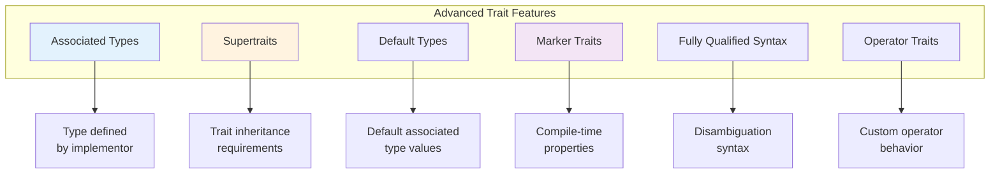
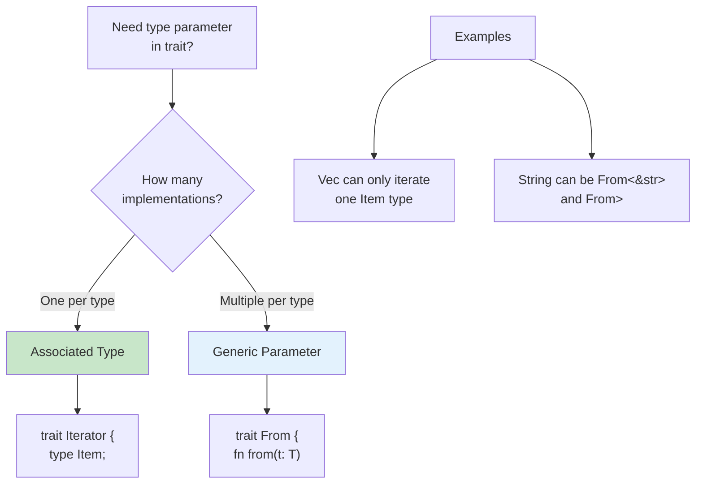
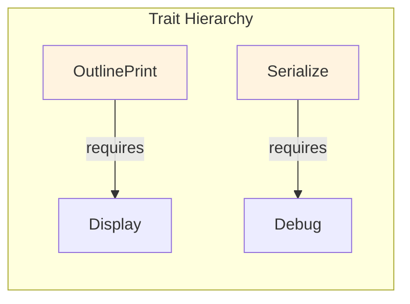
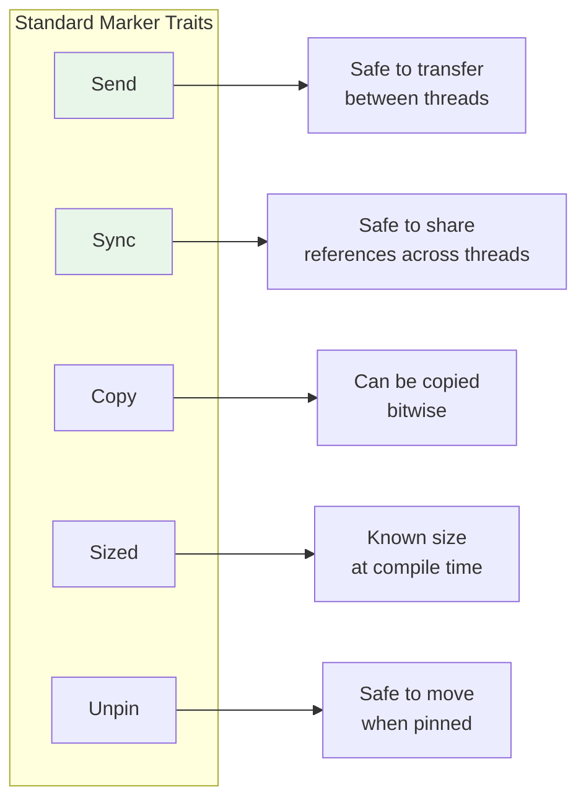
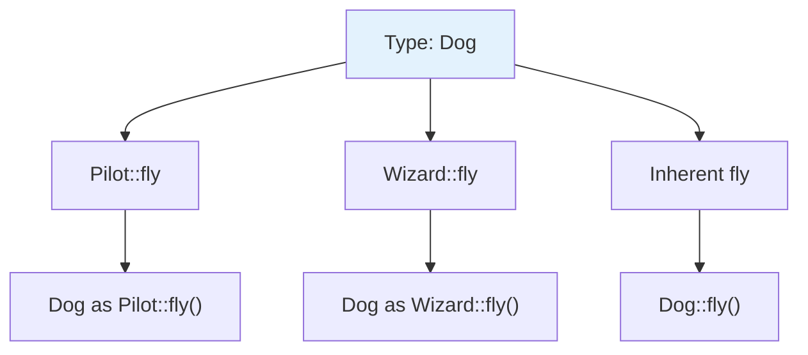
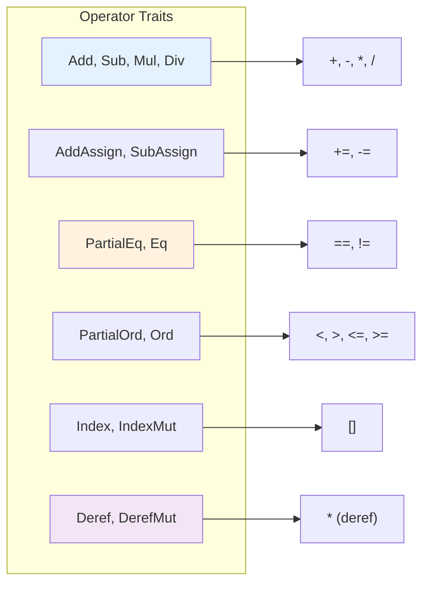
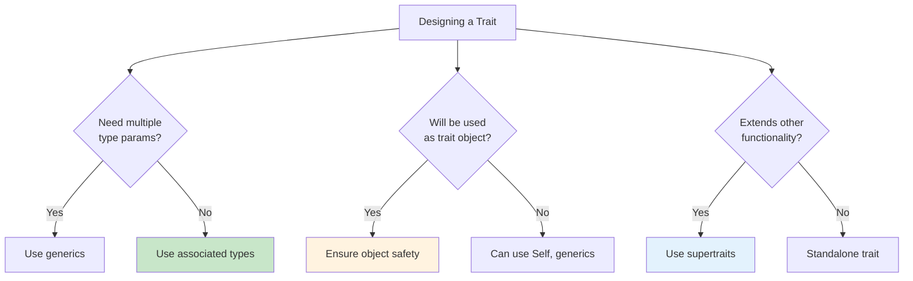

# Advanced Traits

Associated types, supertraits, marker traits, and advanced trait patterns.

## Overview

Rust's trait system goes far beyond basic interface definitions. Advanced trait features enable sophisticated abstractions, better ergonomics, and powerful compile-time guarantees.



## When to Use Advanced Traits

{: .best-practice }
> **Use advanced traits when you need:**
> - Types determined by the implementor (associated types)
> - Trait hierarchies with requirements (supertraits)
> - Zero-cost abstractions with marker traits
> - Custom operator overloading
> - Compile-time dispatch with full type information

## Associated Types vs Generics

Understanding when to use associated types instead of generic parameters is crucial.



### Associated Types

Use when there's exactly **one** implementation per type:

```rust
// Good: A container has ONE item type
trait Container {
    type Item;

    fn add(&mut self, item: Self::Item);
    fn get(&self) -> Option<&Self::Item>;
    fn is_empty(&self) -> bool;
}

impl Container for Vec<i32> {
    type Item = i32;

    fn add(&mut self, item: i32) {
        self.push(item);
    }

    fn get(&self) -> Option<&i32> {
        self.first()
    }

    fn is_empty(&self) -> bool {
        self.len() == 0
    }
}

// Usage is clean - no type parameters needed
fn process<C: Container>(container: &C) {
    // Container::Item is determined by C
}
```

### Generic Parameters

Use when there can be **multiple** implementations per type:

```rust
// Good: A type can convert FROM multiple types
trait Convertible<T> {
    fn convert(value: T) -> Self;
}

struct MyString(String);

impl Convertible<&str> for MyString {
    fn convert(value: &str) -> Self {
        MyString(value.to_string())
    }
}

impl Convertible<i32> for MyString {
    fn convert(value: i32) -> Self {
        MyString(value.to_string())
    }
}

// MyString implements Convertible for multiple source types
```

### Comparison Table

| Feature | Associated Type | Generic Parameter |
|---------|----------------|-------------------|
| Implementations per type | One | Many |
| Type specified by | Implementor | User at call site |
| Syntax | `type Item;` | `<T>` |
| Use case | Iterator::Item | From<T>, Into<T> |

## Default Associated Types

You can provide defaults for associated types:

```rust
trait Processor {
    type Input = String;    // Default type
    type Output = String;   // Default type
    type Error = std::io::Error;  // Default type

    fn process(&self, input: Self::Input) -> Result<Self::Output, Self::Error>;
}

// Use all defaults
struct PassThrough;
impl Processor for PassThrough {
    fn process(&self, input: String) -> Result<String, std::io::Error> {
        Ok(input)
    }
}

// Override some defaults
struct Parser;
impl Processor for Parser {
    type Output = Vec<String>;  // Override just Output

    fn process(&self, input: String) -> Result<Vec<String>, std::io::Error> {
        Ok(input.split_whitespace().map(String::from).collect())
    }
}
```

## Supertraits

Supertraits define trait hierarchies where implementing a trait requires implementing another.



### Defining Supertraits

```rust
use std::fmt::{Display, Debug};

// OutlinePrint requires Display
trait OutlinePrint: Display {
    fn outline_print(&self) {
        let output = self.to_string();  // Can use Display methods
        let len = output.len();
        println!("{}", "*".repeat(len + 4));
        println!("* {} *", output);
        println!("{}", "*".repeat(len + 4));
    }
}

// Must implement Display to implement OutlinePrint
struct Point { x: i32, y: i32 }

impl Display for Point {
    fn fmt(&self, f: &mut std::fmt::Formatter<'_>) -> std::fmt::Result {
        write!(f, "({}, {})", self.x, self.y)
    }
}

impl OutlinePrint for Point {}  // Now we can implement OutlinePrint

fn main() {
    let p = Point { x: 1, y: 2 };
    p.outline_print();
    // **********
    // * (1, 2) *
    // **********
}
```

### Multiple Supertraits

```rust
use std::fmt::{Display, Debug};
use std::hash::Hash;

// Requires ALL listed traits
trait Entity: Display + Debug + Clone + Hash + Eq {
    fn id(&self) -> u64;
}

// Or equivalently with where clause
trait Entity2 where Self: Display + Debug + Clone + Hash + Eq {
    fn id(&self) -> u64;
}
```

### Supertrait Bounds with Associated Types

```rust
trait Graph {
    type Node: Clone + Debug;
    type Edge: Clone + Debug;

    fn nodes(&self) -> Vec<Self::Node>;
    fn edges(&self) -> Vec<Self::Edge>;
    fn add_edge(&mut self, from: &Self::Node, to: &Self::Node) -> Self::Edge;
}
```

## Marker Traits

Marker traits have no methods but convey compile-time information.



### Custom Marker Traits

```rust
// Marker trait for types that are safe to serialize
trait SafeToSerialize {}

// Marker trait for types representing valid database IDs
trait ValidId {}

// Apply to types
struct UserId(u64);
impl ValidId for UserId {}

struct ProductId(u64);
impl ValidId for ProductId {}

// Use as bound
fn fetch_from_db<T: ValidId>(id: T) {
    // Compile-time guarantee: only valid IDs accepted
}
```

### Auto Traits

Some traits are automatically implemented:

```rust
// Send and Sync are auto traits
struct MyStruct {
    data: Vec<i32>,  // Vec<i32> is Send + Sync
}
// MyStruct automatically implements Send + Sync

// Opt out with negative impl (nightly only) or PhantomData
use std::marker::PhantomData;
use std::cell::UnsafeCell;

struct NotSend {
    _marker: PhantomData<*const ()>,  // Raw pointers are !Send
}
```

## Fully Qualified Syntax

When multiple traits have methods with the same name, use fully qualified syntax.



### Resolving Method Conflicts

```rust
trait Pilot {
    fn fly(&self);
}

trait Wizard {
    fn fly(&self);
}

struct Human;

impl Pilot for Human {
    fn fly(&self) {
        println!("This is your captain speaking.");
    }
}

impl Wizard for Human {
    fn fly(&self) {
        println!("Up!");
    }
}

impl Human {
    fn fly(&self) {
        println!("*waving arms furiously*");
    }
}

fn main() {
    let person = Human;

    // Inherent method
    person.fly();  // *waving arms furiously*

    // Trait methods - need disambiguation
    Pilot::fly(&person);   // This is your captain speaking.
    Wizard::fly(&person);  // Up!

    // Fully qualified syntax
    <Human as Pilot>::fly(&person);
    <Human as Wizard>::fly(&person);
}
```

### Associated Functions (No self)

```rust
trait Animal {
    fn baby_name() -> String;
}

struct Dog;

impl Dog {
    fn baby_name() -> String {
        String::from("Spot")
    }
}

impl Animal for Dog {
    fn baby_name() -> String {
        String::from("puppy")
    }
}

fn main() {
    println!("{}", Dog::baby_name());           // Spot (inherent)
    println!("{}", <Dog as Animal>::baby_name()); // puppy (trait)
}
```

## Operator Overloading

Implement standard library traits to customize operators.



### Implementing Add

```rust
use std::ops::Add;

#[derive(Debug, Clone, Copy, PartialEq)]
struct Point {
    x: i32,
    y: i32,
}

impl Add for Point {
    type Output = Point;  // Associated type for result

    fn add(self, other: Point) -> Point {
        Point {
            x: self.x + other.x,
            y: self.y + other.y,
        }
    }
}

// Can also implement for different RHS types
impl Add<i32> for Point {
    type Output = Point;

    fn add(self, scalar: i32) -> Point {
        Point {
            x: self.x + scalar,
            y: self.y + scalar,
        }
    }
}

fn main() {
    let p1 = Point { x: 1, y: 2 };
    let p2 = Point { x: 3, y: 4 };

    let p3 = p1 + p2;      // Point { x: 4, y: 6 }
    let p4 = p1 + 10;      // Point { x: 11, y: 12 }
}
```

### Implementing Index

```rust
use std::ops::Index;

struct Matrix {
    data: Vec<Vec<i32>>,
}

impl Index<(usize, usize)> for Matrix {
    type Output = i32;

    fn index(&self, (row, col): (usize, usize)) -> &i32 {
        &self.data[row][col]
    }
}

fn main() {
    let m = Matrix {
        data: vec![
            vec![1, 2, 3],
            vec![4, 5, 6],
        ],
    };

    println!("{}", m[(0, 1)]);  // 2
    println!("{}", m[(1, 2)]);  // 6
}
```

## Trait Objects vs Generics

```mermaid
flowchart TB
    subgraph "Static Dispatch (Generics)"
        G[fn process<T: Draw>(item: T)]
        G --> G1[Monomorphization]
        G1 --> G2[Separate code for<br/>each concrete type]
        G2 --> G3[Fast - no vtable lookup]
    end

    subgraph "Dynamic Dispatch (Trait Objects)"
        D["fn process(item: &dyn Draw)"]
        D --> D1[Single function]
        D1 --> D2[Virtual method table]
        D2 --> D3[Flexible - smaller binary]
    end

    style G3 fill:#c8e6c9
    style D3 fill:#e3f2fd
```

### Object Safety

Not all traits can be used as trait objects. A trait is object-safe if:

```rust
// Object-safe trait
trait Draw {
    fn draw(&self);
    fn bounding_box(&self) -> (i32, i32, i32, i32);
}

// NOT object-safe (returns Self)
trait Clone2 {
    fn clone(&self) -> Self;  // Size unknown at compile time
}

// NOT object-safe (generic method)
trait Serialize {
    fn serialize<W: std::io::Write>(&self, writer: W);
}

// Making it object-safe
trait SerializeSafe {
    fn serialize(&self, writer: &mut dyn std::io::Write);
}
```

### Object Safety Rules

| Requirement | Reason |
|------------|--------|
| Methods can't return `Self` | Size unknown |
| Methods can't have generic type parameters | Can't store in vtable |
| Trait can't require `Self: Sized` | Trait objects are unsized |
| No associated functions without `self` | Can't call without instance |

## The Newtype Pattern for Traits

Implement external traits on external types using a wrapper:

```rust
use std::fmt;

// Can't impl Display for Vec directly (orphan rule)
// Solution: Newtype wrapper
struct Wrapper(Vec<String>);

impl fmt::Display for Wrapper {
    fn fmt(&self, f: &mut fmt::Formatter) -> fmt::Result {
        write!(f, "[{}]", self.0.join(", "))
    }
}

fn main() {
    let w = Wrapper(vec!["hello".to_string(), "world".to_string()]);
    println!("{}", w);  // [hello, world]
}
```

## Extension Traits

Add methods to existing types:

```rust
// Extension trait pattern
trait StringExt {
    fn is_blank(&self) -> bool;
    fn truncate_words(&self, max_words: usize) -> String;
}

impl StringExt for str {
    fn is_blank(&self) -> bool {
        self.trim().is_empty()
    }

    fn truncate_words(&self, max_words: usize) -> String {
        self.split_whitespace()
            .take(max_words)
            .collect::<Vec<_>>()
            .join(" ")
    }
}

fn main() {
    let s = "  \t\n  ";
    println!("{}", s.is_blank());  // true

    let text = "The quick brown fox jumps over the lazy dog";
    println!("{}", text.truncate_words(4));  // The quick brown fox
}
```

## Best Practices

{: .best-practice }
> **Advanced Trait Guidelines:**
> 1. **Prefer associated types** when there's one logical type per implementation
> 2. **Use supertraits** to express "is-a" relationships between traits
> 3. **Keep traits focused** - prefer multiple small traits over one large trait
> 4. **Document bounds** - explain why specific trait bounds are needed
> 5. **Consider object safety** early when designing traits for dynamic dispatch

### Trait Design Checklist



## See Also

- [Traits]() - Basic trait concepts
- [Generics]() - Generic type parameters
- [Example Code](https://github.com/example/rust-guide/tree/main/examples/part4/advanced-traits)

## Next Steps

Learn about [Advanced Types]().
