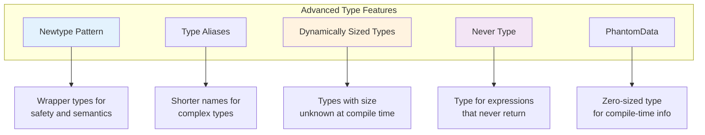
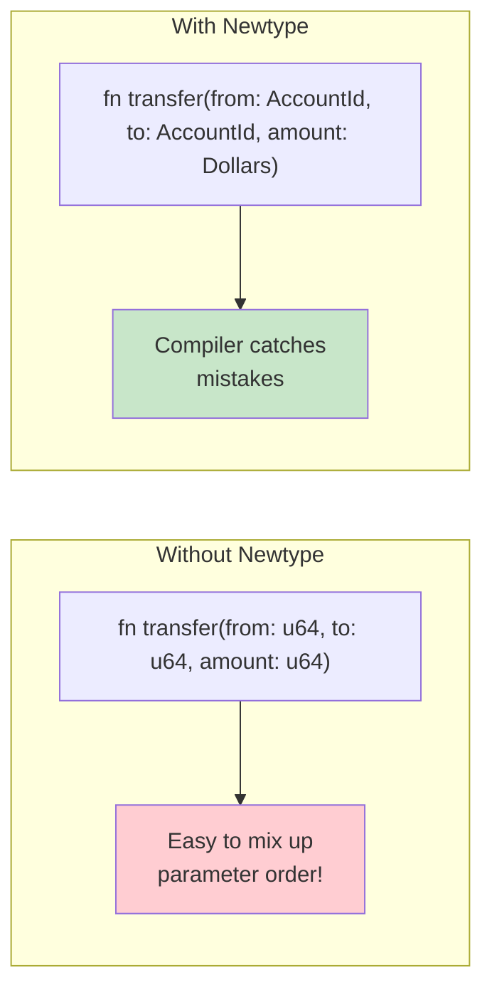
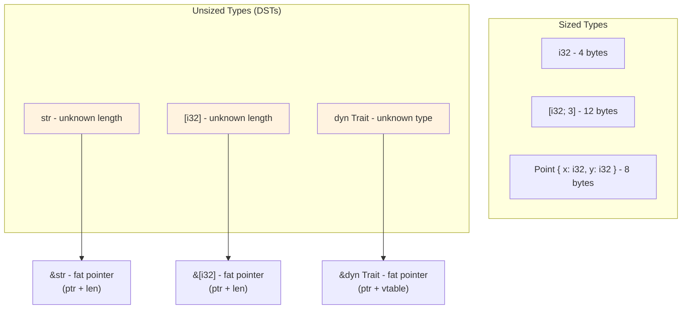
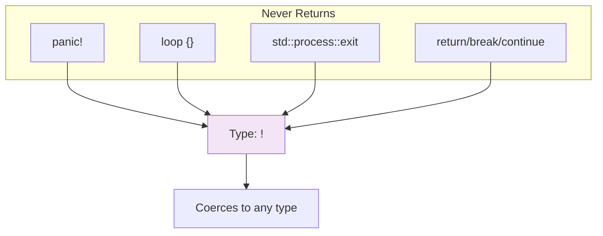
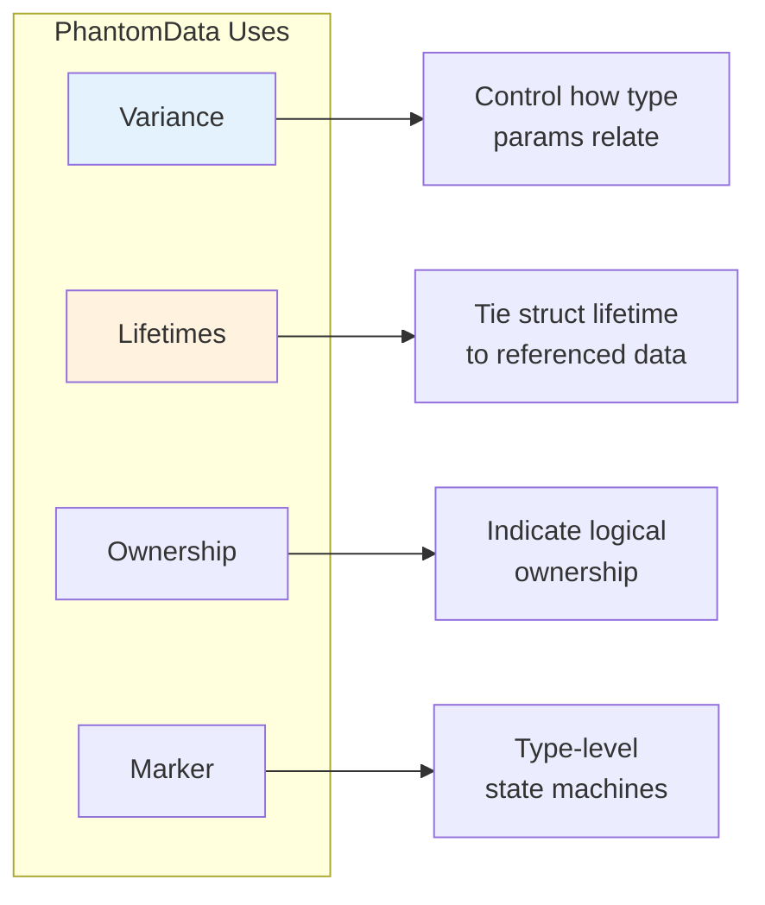
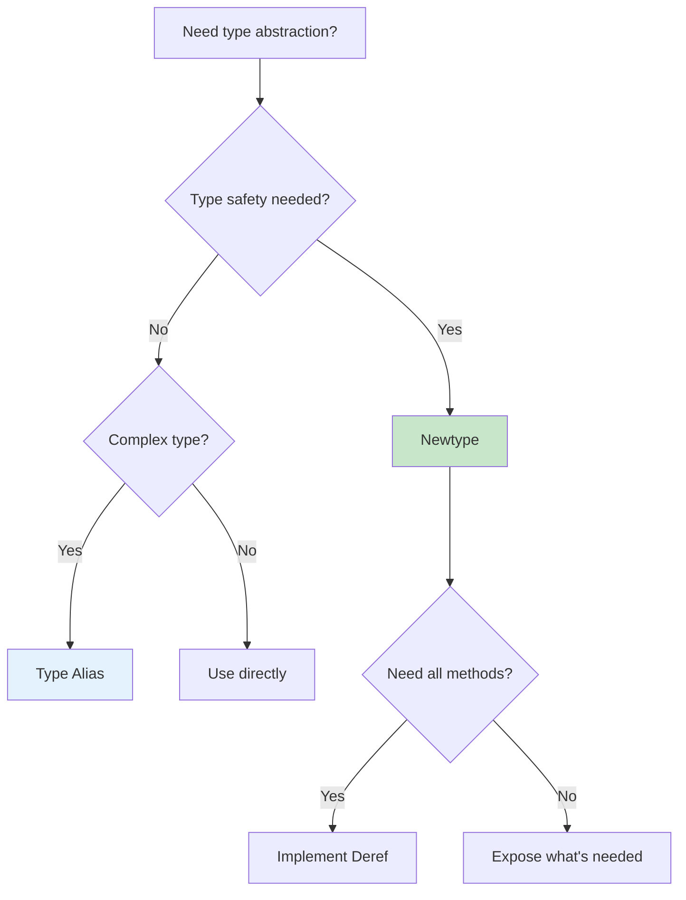

# Advanced Types

Newtype pattern, type aliases, dynamically sized types, and the never type.

## Overview

Rust's type system provides powerful abstractions beyond basic types. Advanced type features enable better type safety, API ergonomics, and zero-cost abstractions.



## When to Use Advanced Types

{: .best-practice }
> **Use advanced types when you need:**
> - Type safety for domain concepts (newtype)
> - Ergonomic APIs with complex types (type aliases)
> - Work with unsized data like trait objects or slices (DST)
> - Express impossible states (never type)
> - Carry compile-time information without runtime cost (PhantomData)

## The Newtype Pattern

Wrap existing types to create distinct types with enhanced semantics.



### Basic Newtype

```rust
// Distinct types that wrap primitives
struct Meters(f64);
struct Feet(f64);
struct Seconds(f64);

// Can't accidentally mix units!
fn calculate_speed(distance: Meters, time: Seconds) -> f64 {
    distance.0 / time.0  // meters per second
}

fn main() {
    let d = Meters(100.0);
    let t = Seconds(9.58);  // Usain Bolt!

    let speed = calculate_speed(d, t);
    println!("Speed: {:.2} m/s", speed);

    // This won't compile - type safety!
    // let wrong = calculate_speed(Feet(100.0), t);  // Error!
}
```

### Newtype with Full Functionality

```rust
use std::ops::{Add, Sub, Mul};
use std::fmt;

#[derive(Debug, Clone, Copy, PartialEq, PartialOrd)]
struct Meters(f64);

impl Meters {
    fn new(value: f64) -> Self {
        Meters(value)
    }

    fn to_feet(self) -> Feet {
        Feet(self.0 * 3.28084)
    }

    fn value(self) -> f64 {
        self.0
    }
}

impl Add for Meters {
    type Output = Meters;
    fn add(self, other: Meters) -> Meters {
        Meters(self.0 + other.0)
    }
}

impl Sub for Meters {
    type Output = Meters;
    fn sub(self, other: Meters) -> Meters {
        Meters(self.0 - other.0)
    }
}

impl Mul<f64> for Meters {
    type Output = Meters;
    fn mul(self, scalar: f64) -> Meters {
        Meters(self.0 * scalar)
    }
}

impl fmt::Display for Meters {
    fn fmt(&self, f: &mut fmt::Formatter<'_>) -> fmt::Result {
        write!(f, "{:.2}m", self.0)
    }
}

#[derive(Debug, Clone, Copy)]
struct Feet(f64);

fn main() {
    let a = Meters::new(10.0);
    let b = Meters::new(5.0);

    println!("{} + {} = {}", a, b, a + b);      // 10.00m + 5.00m = 15.00m
    println!("{} * 2 = {}", a, a * 2.0);        // 10.00m * 2 = 20.00m
    println!("{} in feet = {:?}", a, a.to_feet()); // 10.00m in feet = Feet(32.8084)
}
```

### Newtype for API Design

```rust
// Use newtypes to make invalid states unrepresentable
mod user_id {
    #[derive(Debug, Clone, Copy, PartialEq, Eq, Hash)]
    pub struct UserId(u64);

    impl UserId {
        /// Create a new UserId. Only this module can create UserIds.
        pub(crate) fn new(id: u64) -> Self {
            UserId(id)
        }

        pub fn value(&self) -> u64 {
            self.0
        }
    }
}

mod email {
    #[derive(Debug, Clone, PartialEq, Eq)]
    pub struct Email(String);

    #[derive(Debug)]
    pub struct InvalidEmail;

    impl Email {
        /// Validate and create an Email
        pub fn parse(s: &str) -> Result<Self, InvalidEmail> {
            if s.contains('@') && s.len() > 3 {
                Ok(Email(s.to_string()))
            } else {
                Err(InvalidEmail)
            }
        }

        pub fn as_str(&self) -> &str {
            &self.0
        }
    }
}

use user_id::UserId;
use email::Email;

fn send_email(user: UserId, email: &Email) {
    println!("Sending to user {:?} at {}", user, email.as_str());
}
```

### Newtype Use Cases

| Use Case | Example | Benefit |
|----------|---------|---------|
| Units | `Meters`, `Seconds`, `Dollars` | Prevent unit confusion |
| IDs | `UserId`, `OrderId` | Type-safe identifiers |
| Validation | `Email`, `PhoneNumber` | Guarantee validity |
| Semantics | `Username`, `Password` | Clear meaning |
| Encapsulation | `ConnectionPool(Arc<...>)` | Hide implementation |

## Type Aliases

Create shorter names for complex types.


### Basic Type Aliases

```rust
// Simplify complex types
type Thunk = Box<dyn Fn() + Send + 'static>;

// Common pattern: custom Result type
type Result<T> = std::result::Result<T, std::io::Error>;

// Complex nested types
type CallbackMap = std::collections::HashMap<
    String,
    Box<dyn Fn(i32) -> i32 + Send + Sync>
>;

fn register_callback(callbacks: &mut CallbackMap, name: &str, f: impl Fn(i32) -> i32 + Send + Sync + 'static) {
    callbacks.insert(name.to_string(), Box::new(f));
}
```

### Type Aliases in APIs

```rust
pub mod io {
    // Define a module-specific Result type
    pub type Result<T> = std::result::Result<T, Error>;

    #[derive(Debug)]
    pub struct Error {
        kind: ErrorKind,
        message: String,
    }

    #[derive(Debug)]
    pub enum ErrorKind {
        NotFound,
        PermissionDenied,
        InvalidData,
    }

    impl Error {
        pub fn new(kind: ErrorKind, message: impl Into<String>) -> Self {
            Error { kind, message: message.into() }
        }
    }

    // Functions use the simplified Result
    pub fn read_file(path: &str) -> Result<String> {
        // Simulated
        if path.is_empty() {
            Err(Error::new(ErrorKind::InvalidData, "Empty path"))
        } else {
            Ok(format!("Contents of {}", path))
        }
    }

    pub fn write_file(path: &str, _content: &str) -> Result<()> {
        if path.starts_with("/") {
            Ok(())
        } else {
            Err(Error::new(ErrorKind::PermissionDenied, "Relative path"))
        }
    }
}
```

### Type Aliases vs Newtypes

| Feature | Type Alias | Newtype |
|---------|------------|---------|
| New type? | No, just a name | Yes, distinct type |
| Interchangeable? | Yes | No |
| Methods? | No (same type) | Yes (own impl) |
| Use case | Readability | Type safety |

```rust
// Type alias - same type
type Kilometers = i32;
let k: Kilometers = 5;
let i: i32 = k;  // Works! Same type

// Newtype - different type
struct Miles(i32);
let m = Miles(5);
// let i: i32 = m;  // Error! Different type
let i: i32 = m.0;   // Must explicitly unwrap
```

## Dynamically Sized Types (DSTs)

Types whose size is not known at compile time.



### The `?Sized` Bound

```rust
// By default, generic types require Sized
fn sized_only<T>(t: T) {
    // T must be Sized (known size at compile time)
}

// Opt out with ?Sized to accept unsized types
fn accepts_unsized<T: ?Sized>(t: &T) {
    // T can be unsized (str, [i32], dyn Trait)
    // Must use reference since we can't have unsized on stack
}

fn main() {
    // Sized types work with both
    sized_only(42);
    accepts_unsized(&42);

    // Unsized types only work with ?Sized
    let s: &str = "hello";
    accepts_unsized(s);  // OK
    // sized_only(*s);   // Error: str is not Sized

    let slice: &[i32] = &[1, 2, 3];
    accepts_unsized(slice);  // OK
}
```

### Fat Pointers

```rust
use std::mem;

fn main() {
    // Regular pointer - just an address
    let x: i32 = 42;
    let ptr: &i32 = &x;
    println!("&i32 size: {} bytes", mem::size_of_val(&ptr));  // 8 bytes (on 64-bit)

    // Fat pointer for slice - address + length
    let arr = [1, 2, 3, 4, 5];
    let slice: &[i32] = &arr;
    println!("&[i32] size: {} bytes", mem::size_of_val(&slice));  // 16 bytes

    // Fat pointer for str - address + length
    let s: &str = "hello";
    println!("&str size: {} bytes", mem::size_of_val(&s));  // 16 bytes

    // Fat pointer for trait object - address + vtable pointer
    let trait_obj: &dyn std::fmt::Debug = &42;
    println!("&dyn Debug size: {} bytes", mem::size_of_val(&trait_obj));  // 16 bytes
}
```

### Custom DSTs

```rust
use std::mem;

// Struct with unsized field (must be last)
struct MySlice<T> {
    len_cached: usize,
    data: [T],  // Unsized! Must be last field
}

// Can only create through references
fn create_my_slice(data: &[i32]) -> &MySlice<i32> {
    // In practice, you'd use unsafe to construct this
    // This is just to show the concept
    unsafe {
        let ptr = data.as_ptr() as *const MySlice<i32>;
        &*ptr
    }
}
```

## The Never Type (`!`)

Represents computations that never complete.



### Using the Never Type

```rust
// Functions that never return
fn diverges() -> ! {
    panic!("This function never returns");
}

fn infinite_loop() -> ! {
    loop {
        // do work forever
    }
}

// The never type coerces to any type
fn get_value(opt: Option<i32>) -> i32 {
    match opt {
        Some(x) => x,      // Returns i32
        None => panic!(),  // Returns !, coerces to i32
    }
}

// Useful in match arms
fn process(result: Result<i32, &str>) -> i32 {
    match result {
        Ok(n) => n,
        Err(e) => {
            eprintln!("Error: {}", e);
            std::process::exit(1)  // ! coerces to i32
        }
    }
}

// continue and break are also !
fn find_first_even(numbers: &[i32]) -> Option<i32> {
    for &n in numbers {
        if n % 2 == 0 {
            return Some(n);
        }
        // continue has type ! here, matching Option<i32> in the implicit else
    }
    None
}
```

### Never Type in Traits

```rust
use std::str::FromStr;

// Infallible conversion
impl FromStr for String {
    type Err = std::convert::Infallible;  // Can never fail

    fn from_str(s: &str) -> Result<Self, Self::Err> {
        Ok(s.to_string())
    }
}

// Infallible is an enum with no variants - essentially !
fn infallible_parse(s: &str) -> String {
    // unwrap() is safe because Err is impossible
    s.parse().unwrap()
}
```

## PhantomData

Carry type information without runtime cost.



### PhantomData for Lifetimes

```rust
use std::marker::PhantomData;

// Without PhantomData, no connection between Iter and the slice
struct Iter<'a, T> {
    ptr: *const T,
    end: *const T,
    _marker: PhantomData<&'a T>,  // Indicates we logically borrow &'a T
}

impl<'a, T> Iter<'a, T> {
    fn new(slice: &'a [T]) -> Self {
        let ptr = slice.as_ptr();
        let end = unsafe { ptr.add(slice.len()) };
        Iter {
            ptr,
            end,
            _marker: PhantomData,
        }
    }
}

impl<'a, T> Iterator for Iter<'a, T> {
    type Item = &'a T;

    fn next(&mut self) -> Option<Self::Item> {
        if self.ptr == self.end {
            None
        } else {
            let current = self.ptr;
            self.ptr = unsafe { self.ptr.add(1) };
            Some(unsafe { &*current })
        }
    }
}
```

### PhantomData for Type State

```rust
use std::marker::PhantomData;

// Type-level states
struct Locked;
struct Unlocked;

// Door with compile-time state tracking
struct Door<State> {
    _state: PhantomData<State>,
}

impl Door<Locked> {
    fn new() -> Self {
        Door { _state: PhantomData }
    }

    fn unlock(self) -> Door<Unlocked> {
        println!("Unlocking door");
        Door { _state: PhantomData }
    }
}

impl Door<Unlocked> {
    fn lock(self) -> Door<Locked> {
        println!("Locking door");
        Door { _state: PhantomData }
    }

    fn open(&self) {
        println!("Opening door");
    }
}

fn main() {
    let door = Door::<Locked>::new();
    // door.open();  // Error! Can't open locked door

    let door = door.unlock();
    door.open();  // OK!

    let door = door.lock();
    // door.open();  // Error again!
}
```

### PhantomData for Ownership

```rust
use std::marker::PhantomData;
use std::ptr::NonNull;

// Custom smart pointer that owns T
struct MyBox<T> {
    ptr: NonNull<T>,
    _marker: PhantomData<T>,  // Indicates ownership of T
}

impl<T> MyBox<T> {
    fn new(value: T) -> Self {
        let ptr = Box::into_raw(Box::new(value));
        MyBox {
            ptr: unsafe { NonNull::new_unchecked(ptr) },
            _marker: PhantomData,
        }
    }
}

impl<T> Drop for MyBox<T> {
    fn drop(&mut self) {
        unsafe {
            drop(Box::from_raw(self.ptr.as_ptr()));
        }
    }
}

impl<T> std::ops::Deref for MyBox<T> {
    type Target = T;
    fn deref(&self) -> &T {
        unsafe { self.ptr.as_ref() }
    }
}
```

## Advanced Pattern: Type-Level Programming

```rust
use std::marker::PhantomData;

// Type-level booleans
struct True;
struct False;

// Type-level conditionals
trait If<Cond, Then, Else> {
    type Output;
}

impl<Then, Else> If<True, Then, Else> for () {
    type Output = Then;
}

impl<Then, Else> If<False, Then, Else> for () {
    type Output = Else;
}

// Type-level numbers (Peano)
struct Zero;
struct Succ<N>(PhantomData<N>);

type One = Succ<Zero>;
type Two = Succ<One>;
type Three = Succ<Two>;

trait ToUsize {
    fn to_usize() -> usize;
}

impl ToUsize for Zero {
    fn to_usize() -> usize { 0 }
}

impl<N: ToUsize> ToUsize for Succ<N> {
    fn to_usize() -> usize { 1 + N::to_usize() }
}

fn main() {
    println!("Three = {}", Three::to_usize());  // 3
}
```

## Best Practices

{: .best-practice }
> **Advanced Types Guidelines:**
> 1. **Use newtypes** for domain concepts, not just `String` or `i32`
> 2. **Type aliases** for readability, newtypes for safety
> 3. **Understand `?Sized`** when writing generic code
> 4. **Use PhantomData** to express ownership and lifetime relationships
> 5. **The never type** makes match exhaustive with diverging arms

### Choosing the Right Abstraction



## See Also

- [Structs]() - Basic struct definitions
- [Traits]() - Trait fundamentals
- [Example Code](https://github.com/MichaelTien8901/rust-guide-tutorial/tree/main/examples/part4/advanced-types)

## Next Steps

Learn about [Performance]().
