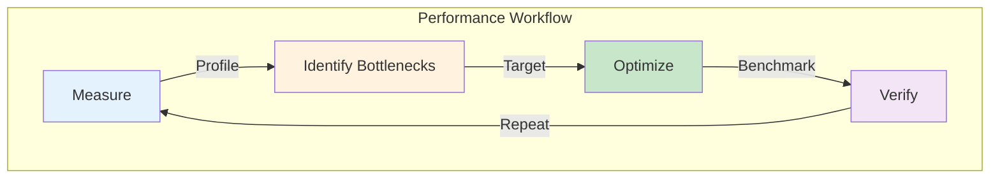
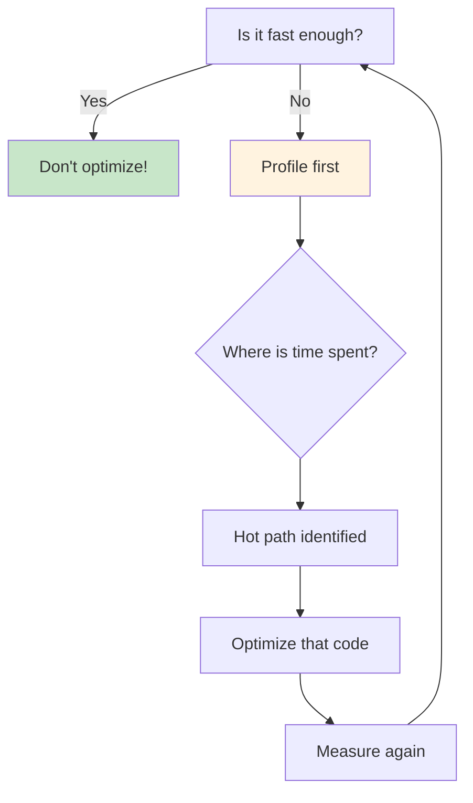
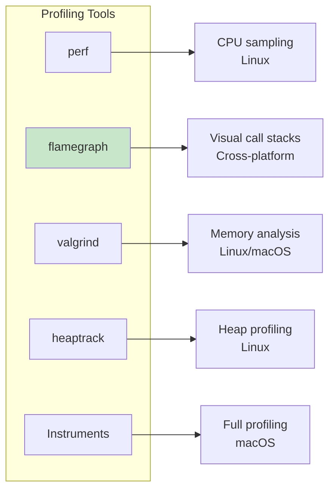
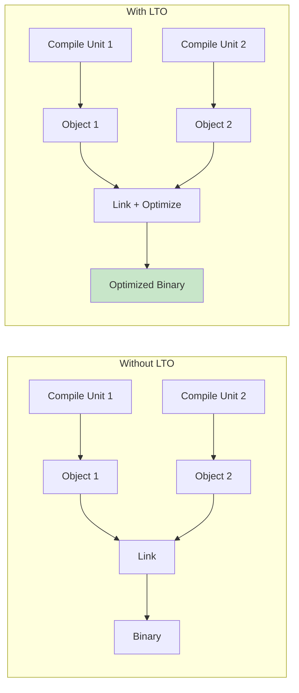
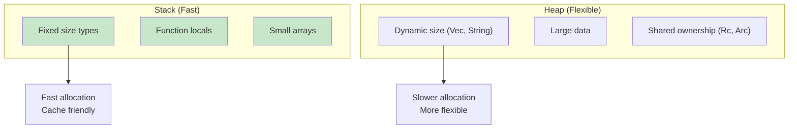
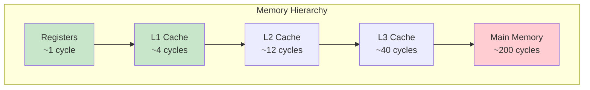

# Performance

Profiling, benchmarking, optimization techniques, and performance best practices.

## Overview

Rust's zero-cost abstractions and control over memory layout enable high-performance code. Understanding profiling, benchmarking, and optimization techniques helps you write fast, efficient programs.



## When to Optimize

{: .warning }
> **"Premature optimization is the root of all evil"** - Donald Knuth
>
> 1. **First**: Write clear, correct code
> 2. **Then**: Measure to find actual bottlenecks
> 3. **Finally**: Optimize the hot paths



## Benchmarking with Criterion

Criterion provides statistical benchmarking with confidence intervals.

### Setup

```toml
# Cargo.toml
[dev-dependencies]
criterion = { version = "0.5", features = ["html_reports"] }

[[bench]]
name = "my_benchmark"
harness = false
```

### Basic Benchmark

```rust
// benches/my_benchmark.rs
use criterion::{black_box, criterion_group, criterion_main, Criterion};

fn fibonacci_recursive(n: u64) -> u64 {
    match n {
        0 => 0,
        1 => 1,
        n => fibonacci_recursive(n - 1) + fibonacci_recursive(n - 2),
    }
}

fn fibonacci_iterative(n: u64) -> u64 {
    let mut a = 0;
    let mut b = 1;
    for _ in 0..n {
        let temp = a;
        a = b;
        b = temp + b;
    }
    a
}

fn benchmark_fibonacci(c: &mut Criterion) {
    let mut group = c.benchmark_group("Fibonacci");

    group.bench_function("recursive_20", |b| {
        b.iter(|| fibonacci_recursive(black_box(20)))
    });

    group.bench_function("iterative_20", |b| {
        b.iter(|| fibonacci_iterative(black_box(20)))
    });

    group.finish();
}

criterion_group!(benches, benchmark_fibonacci);
criterion_main!(benches);
```

### Running Benchmarks

```bash
# Run benchmarks
cargo bench

# Run specific benchmark
cargo bench -- fibonacci

# Generate HTML report
cargo bench -- --save-baseline main
```

### Comparing Implementations

```rust
use criterion::{criterion_group, criterion_main, BenchmarkId, Criterion};

fn bench_sorting(c: &mut Criterion) {
    let mut group = c.benchmark_group("Sorting");

    for size in [100, 1000, 10000].iter() {
        let data: Vec<i32> = (0..*size).rev().collect();

        group.bench_with_input(
            BenchmarkId::new("std_sort", size),
            &data,
            |b, data| {
                b.iter(|| {
                    let mut d = data.clone();
                    d.sort();
                    d
                })
            },
        );

        group.bench_with_input(
            BenchmarkId::new("std_sort_unstable", size),
            &data,
            |b, data| {
                b.iter(|| {
                    let mut d = data.clone();
                    d.sort_unstable();
                    d
                })
            },
        );
    }

    group.finish();
}

criterion_group!(benches, bench_sorting);
criterion_main!(benches);
```

## Profiling Tools



### Flamegraph

```bash
# Install
cargo install flamegraph

# Profile (needs debug info in release)
# Add to Cargo.toml:
# [profile.release]
# debug = true

cargo flamegraph --bin my_app

# Opens interactive SVG
```

### perf (Linux)

```bash
# Record
perf record -g --call-graph=dwarf cargo run --release

# Report
perf report

# Or use hotspot for GUI
hotspot perf.data
```

### Using DHAT for Heap Profiling

```rust
// Enable DHAT allocator
#[cfg(feature = "dhat-heap")]
#[global_allocator]
static ALLOC: dhat::Alloc = dhat::Alloc;

fn main() {
    #[cfg(feature = "dhat-heap")]
    let _profiler = dhat::Profiler::new_heap();

    // Your code here
}
```

## Compiler Optimizations

### Release Profile Configuration

```toml
# Cargo.toml

[profile.release]
opt-level = 3          # Maximum optimization
lto = true             # Link-time optimization
codegen-units = 1      # Better optimization (slower compile)
panic = "abort"        # Smaller binary, no unwinding
strip = true           # Remove symbols

[profile.release-with-debug]
inherits = "release"
debug = true           # Debug info for profiling

[profile.bench]
inherits = "release"
debug = true           # Debug info for benchmarks
```

### Optimization Levels

| Level | Flag | Description |
|-------|------|-------------|
| 0 | `-O0` | No optimization (debug) |
| 1 | `-O1` | Basic optimization |
| 2 | `-O2` | Most optimizations (default release) |
| 3 | `-O3` | Aggressive optimization |
| s | `-Os` | Optimize for size |
| z | `-Oz` | Optimize for size aggressively |

### Link-Time Optimization (LTO)



```toml
[profile.release]
lto = "fat"      # Full LTO (slowest compile, best optimization)
# lto = "thin"   # Thin LTO (faster compile, good optimization)
# lto = true     # Default (same as "fat")
```

## Memory Optimization

### Stack vs Heap



### Avoiding Allocations

```rust
// Bad: Allocates on every call
fn process_bad(items: &[i32]) -> Vec<i32> {
    items.iter().map(|x| x * 2).collect()
}

// Good: Reuse buffer
fn process_good(items: &[i32], output: &mut Vec<i32>) {
    output.clear();
    output.extend(items.iter().map(|x| x * 2));
}

// Good: Pre-allocate
fn process_preallocated(items: &[i32]) -> Vec<i32> {
    let mut result = Vec::with_capacity(items.len());
    result.extend(items.iter().map(|x| x * 2));
    result
}
```

### String Optimization

```rust
// Bad: Multiple allocations
fn build_string_bad(parts: &[&str]) -> String {
    let mut result = String::new();
    for part in parts {
        result.push_str(part);
        result.push(' ');
    }
    result
}

// Good: Pre-calculate size
fn build_string_good(parts: &[&str]) -> String {
    let total_len: usize = parts.iter().map(|s| s.len() + 1).sum();
    let mut result = String::with_capacity(total_len);
    for part in parts {
        result.push_str(part);
        result.push(' ');
    }
    result
}

// Best: Use join when applicable
fn build_string_best(parts: &[&str]) -> String {
    parts.join(" ")
}
```

### Small String Optimization with SmartString

```rust
use smartstring::alias::String as SmartString;

// SmartString stores small strings inline (no heap allocation)
let small: SmartString = "hello".into();  // Stored inline
let large: SmartString = "this is a much longer string".into();  // Heap allocated
```

## Iterator Optimization

### Lazy Evaluation

```rust
// Iterators are lazy - no work until consumed
let numbers = vec![1, 2, 3, 4, 5];

// This does nothing yet
let iter = numbers.iter()
    .map(|x| {
        println!("Processing {}", x);
        x * 2
    })
    .filter(|x| x > &4);

// Work happens here
let result: Vec<_> = iter.collect();
```

### Avoiding Intermediate Collections

```rust
// Bad: Creates intermediate Vec
fn sum_of_squares_bad(numbers: &[i32]) -> i32 {
    let squared: Vec<i32> = numbers.iter().map(|x| x * x).collect();
    squared.iter().sum()
}

// Good: Chain iterators
fn sum_of_squares_good(numbers: &[i32]) -> i32 {
    numbers.iter().map(|x| x * x).sum()
}
```

### Iterator vs Loop

```rust
// Both compile to the same assembly with optimizations!

// Iterator style
fn sum_iter(data: &[i32]) -> i32 {
    data.iter().sum()
}

// Loop style
fn sum_loop(data: &[i32]) -> i32 {
    let mut sum = 0;
    for &x in data {
        sum += x;
    }
    sum
}
```

## SIMD and Parallelism

### Auto-vectorization

```rust
// The compiler can auto-vectorize this
fn multiply_add(a: &[f32], b: &[f32], c: &mut [f32]) {
    for i in 0..a.len() {
        c[i] = a[i] * b[i] + c[i];
    }
}

// Help the compiler with exact bounds
fn multiply_add_optimized(a: &[f32], b: &[f32], c: &mut [f32]) {
    assert_eq!(a.len(), b.len());
    assert_eq!(b.len(), c.len());

    for i in 0..a.len() {
        c[i] = a[i] * b[i] + c[i];
    }
}
```

### Rayon for Parallelism

```rust
use rayon::prelude::*;

fn parallel_sum(data: &[i32]) -> i32 {
    data.par_iter().sum()
}

fn parallel_map(data: &[i32]) -> Vec<i32> {
    data.par_iter().map(|x| x * x).collect()
}

// Parallel sort
fn parallel_sort(data: &mut [i32]) {
    data.par_sort();
}
```

## Cache Optimization



### Data Layout

```rust
// Bad: Array of Structs (AoS) - poor cache utilization for partial access
struct ParticleAoS {
    x: f32,
    y: f32,
    z: f32,
    mass: f32,
    velocity_x: f32,
    velocity_y: f32,
    velocity_z: f32,
}

// Good: Struct of Arrays (SoA) - better cache utilization
struct ParticlesSoA {
    x: Vec<f32>,
    y: Vec<f32>,
    z: Vec<f32>,
    mass: Vec<f32>,
    velocity_x: Vec<f32>,
    velocity_y: Vec<f32>,
    velocity_z: Vec<f32>,
}

// When you need all fields together, AoS is better
// When you process fields separately, SoA is better
```

### Sequential Access

```rust
// Bad: Random access pattern
fn sum_random(data: &[i32], indices: &[usize]) -> i32 {
    indices.iter().map(|&i| data[i]).sum()
}

// Good: Sequential access pattern
fn sum_sequential(data: &[i32]) -> i32 {
    data.iter().sum()
}
```

## Common Optimizations

### Avoiding Bounds Checks

```rust
// With bounds checks (safe, slightly slower)
fn sum_checked(data: &[i32]) -> i32 {
    let mut sum = 0;
    for i in 0..data.len() {
        sum += data[i];  // Bounds check on each access
    }
    sum
}

// Iterator (no bounds checks, compiler knows bounds)
fn sum_iterator(data: &[i32]) -> i32 {
    data.iter().sum()
}

// Unsafe (no bounds checks, use carefully)
fn sum_unchecked(data: &[i32]) -> i32 {
    let mut sum = 0;
    for i in 0..data.len() {
        // SAFETY: i is always < data.len()
        sum += unsafe { *data.get_unchecked(i) };
    }
    sum
}
```

### Inline Hints

```rust
// Suggest inlining
#[inline]
fn small_function(x: i32) -> i32 {
    x + 1
}

// Force inlining
#[inline(always)]
fn critical_function(x: i32) -> i32 {
    x * 2
}

// Prevent inlining
#[inline(never)]
fn large_function(x: i32) -> i32 {
    // ... lots of code
    x
}
```

### Branch Prediction Hints

```rust
// Help the compiler with likely branches
#[cold]
fn handle_error() {
    // This is rarely called
}

fn process(value: Option<i32>) -> i32 {
    match value {
        Some(v) => v * 2,  // Common case
        None => {
            handle_error();
            0
        }
    }
}
```

## Performance Checklist

{: .best-practice }
> **Before Optimizing:**
> 1. ✅ Code is correct and tested
> 2. ✅ Profiled to identify hot spots
> 3. ✅ Measured baseline performance
>
> **Optimization Strategies:**
> 1. 🔄 Reduce allocations (reuse buffers, pre-allocate)
> 2. 🔄 Use iterators instead of intermediate collections
> 3. 🔄 Consider data layout (SoA vs AoS)
> 4. 🔄 Enable LTO for release builds
> 5. 🔄 Use `sort_unstable` when stability not needed
> 6. 🔄 Consider parallelism with Rayon
>
> **After Optimizing:**
> 1. ✅ Verify correctness (run tests)
> 2. ✅ Measure improvement
> 3. ✅ Document why optimization was needed

## Tools Summary

| Tool | Purpose | Platform |
|------|---------|----------|
| Criterion | Benchmarking | Cross-platform |
| flamegraph | CPU profiling | Cross-platform |
| perf | System profiling | Linux |
| Instruments | Full profiling | macOS |
| heaptrack | Heap analysis | Linux |
| cargo-bloat | Binary size | Cross-platform |

## See Also

- [Memory Layout]() - Understanding data layout
- [Example Code](https://github.com/MichaelTien8901/rust-guide-tutorial/tree/master/examples/part4/performance)

## Next Steps

Learn about [Memory Layout]().
