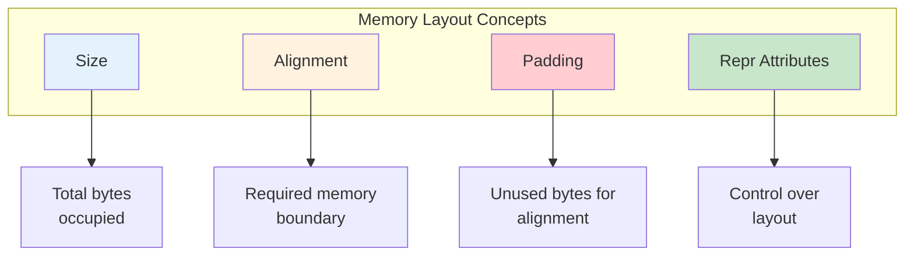
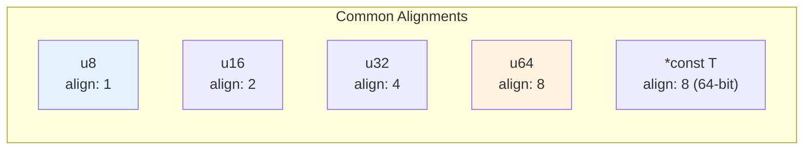
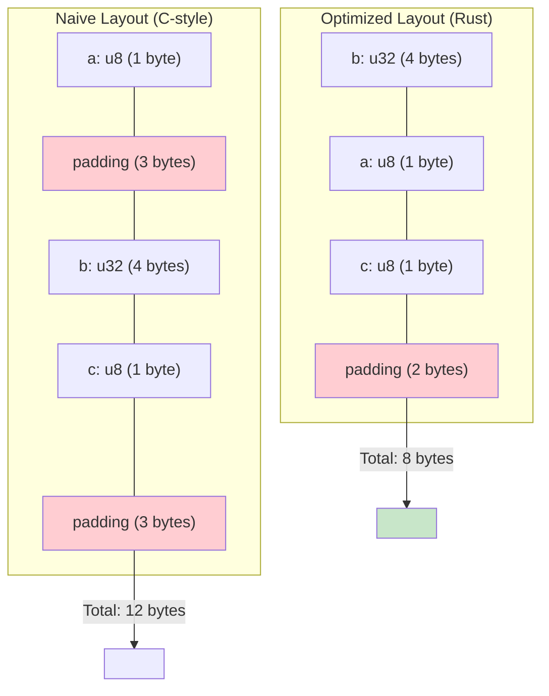
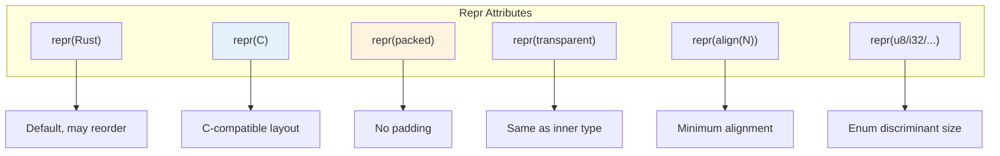
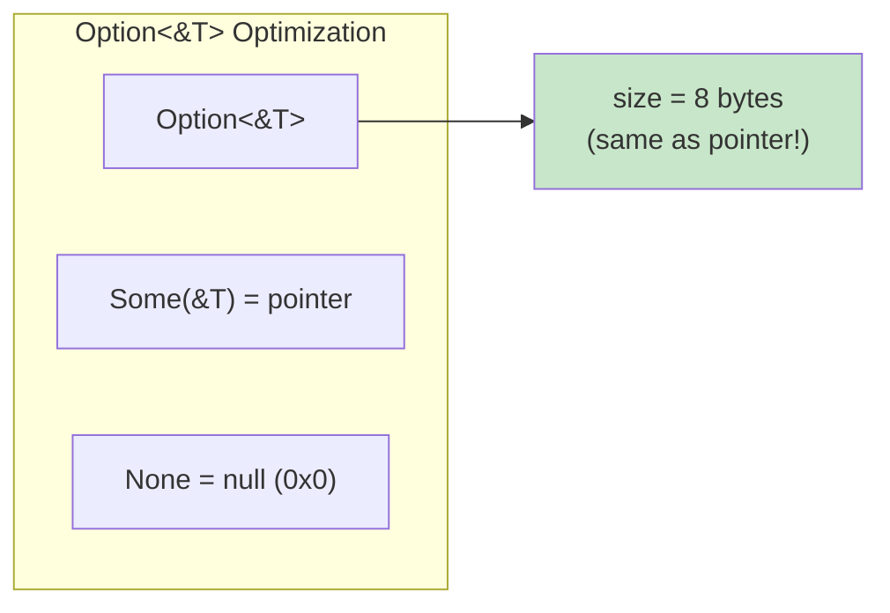
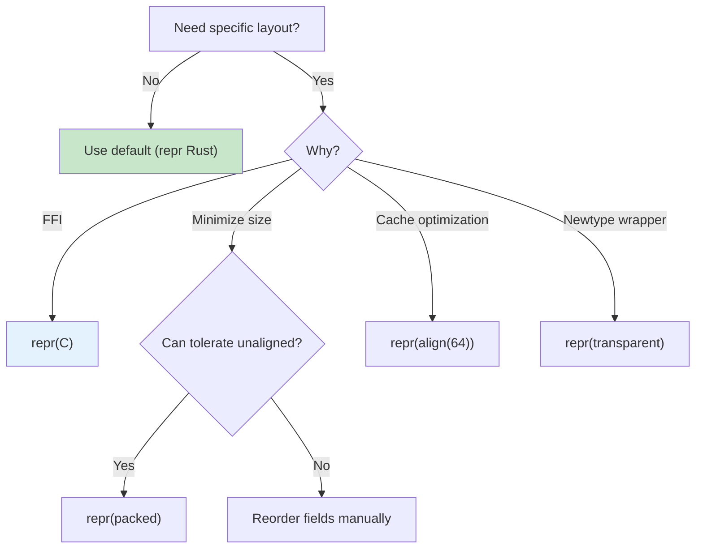

# Memory Layout

Struct layout, padding, alignment, repr attributes, and low-level data representation.

## Overview

Understanding how Rust lays out data in memory is crucial for FFI, performance optimization, and low-level programming. Rust provides control over memory layout through repr attributes while maintaining safety.



## When Memory Layout Matters

{: .best-practice }
> **Consider memory layout when:**
> - Interfacing with C code (FFI)
> - Optimizing for cache performance
> - Working with hardware/embedded systems
> - Minimizing memory usage
> - Implementing serialization formats

## Size and Alignment Basics

Every type has a **size** (bytes occupied) and **alignment** (memory boundary requirement).



### Checking Size and Alignment

```rust
use std::mem::{size_of, align_of};

fn main() {
    // Primitive types
    println!("u8:    size={}, align={}", size_of::<u8>(), align_of::<u8>());
    println!("u16:   size={}, align={}", size_of::<u16>(), align_of::<u16>());
    println!("u32:   size={}, align={}", size_of::<u32>(), align_of::<u32>());
    println!("u64:   size={}, align={}", size_of::<u64>(), align_of::<u64>());
    println!("u128:  size={}, align={}", size_of::<u128>(), align_of::<u128>());

    // Pointers (8 bytes on 64-bit)
    println!("*const u8: size={}, align={}",
             size_of::<*const u8>(), align_of::<*const u8>());

    // Arrays
    println!("[u32; 4]: size={}, align={}",
             size_of::<[u32; 4]>(), align_of::<[u32; 4]>());
}
```

Output (64-bit system):
```
u8:    size=1, align=1
u16:   size=2, align=2
u32:   size=4, align=4
u64:   size=8, align=8
u128:  size=16, align=8
*const u8: size=8, align=8
[u32; 4]: size=16, align=4
```

## Struct Layout and Padding

### Default (Rust) Layout

Rust may reorder fields and add padding for optimal layout.

```rust
use std::mem::{size_of, align_of};

struct Example {
    a: u8,   // 1 byte
    b: u32,  // 4 bytes
    c: u8,   // 1 byte
}

fn main() {
    println!("Example: size={}, align={}",
             size_of::<Example>(), align_of::<Example>());
    // Might be: size=8, align=4 (Rust may reorder to: b, a, c + padding)
}
```



### Why Padding Exists

Fields must be aligned to their alignment boundary:

```rust
#[repr(C)]  // Use C layout to demonstrate padding
struct Padded {
    a: u8,   // offset 0, size 1
    // 3 bytes padding to align b to 4-byte boundary
    b: u32,  // offset 4, size 4
    c: u8,   // offset 8, size 1
    // 3 bytes padding to make struct size multiple of alignment
}
// Total size: 12 bytes, alignment: 4

fn main() {
    use std::mem::{size_of, align_of};
    println!("Padded: size={}, align={}",
             size_of::<Padded>(), align_of::<Padded>());  // 12, 4
}
```

## Repr Attributes

Control memory layout with `#[repr(...)]` attributes.



### repr(C) - C Compatible Layout

```rust
#[repr(C)]
struct CCompatible {
    a: u8,
    b: u32,
    c: u8,
}

// Fields are NOT reordered
// Layout matches what C compiler would produce
// Size: 12, Align: 4

// Useful for FFI
extern "C" {
    fn process_data(data: *const CCompatible);
}
```

### repr(packed) - No Padding

```rust
#[repr(packed)]
struct Packed {
    a: u8,   // offset 0
    b: u32,  // offset 1 (unaligned!)
    c: u8,   // offset 5
}
// Size: 6, Align: 1

fn main() {
    use std::mem::size_of;
    println!("Packed size: {}", size_of::<Packed>());  // 6

    let p = Packed { a: 1, b: 2, c: 3 };

    // WARNING: Taking references to packed fields is unsafe!
    // let b_ref = &p.b;  // Error or undefined behavior!

    // Safe way to access:
    let b_value = { p.b };  // Copy the value
    println!("b = {}", b_value);
}
```

{: .warning }
> `repr(packed)` can cause undefined behavior if you take references to unaligned fields. Use with caution, primarily for memory-mapped hardware registers or compact serialization.

### repr(transparent) - Same Layout as Inner Type

```rust
#[repr(transparent)]
struct Wrapper(u32);

// Wrapper has EXACTLY the same layout as u32
// Useful for newtypes in FFI

fn main() {
    use std::mem::size_of;
    assert_eq!(size_of::<Wrapper>(), size_of::<u32>());

    // Safe to transmute between Wrapper and u32
    let w = Wrapper(42);
    let u: u32 = unsafe { std::mem::transmute(w) };
    assert_eq!(u, 42);
}
```

### repr(align(N)) - Minimum Alignment

```rust
#[repr(align(64))]  // Align to cache line (typically 64 bytes)
struct CacheAligned {
    data: [u8; 32],
}

fn main() {
    use std::mem::{size_of, align_of};
    println!("CacheAligned: size={}, align={}",
             size_of::<CacheAligned>(), align_of::<CacheAligned>());
    // size=64, align=64 (padded to meet alignment)

    // Useful for avoiding false sharing in concurrent code
}
```

### repr for Enums

```rust
// Control discriminant size
#[repr(u8)]
enum SmallEnum {
    A = 0,
    B = 1,
    C = 2,
}  // Discriminant uses exactly 1 byte

#[repr(i32)]
enum SignedEnum {
    Negative = -1,
    Zero = 0,
    Positive = 1,
}

// C-compatible enum
#[repr(C)]
enum CEnum {
    First,
    Second,
    Third,
}

fn main() {
    use std::mem::size_of;
    println!("SmallEnum: {} bytes", size_of::<SmallEnum>());   // 1
    println!("SignedEnum: {} bytes", size_of::<SignedEnum>()); // 4
}
```

## Enum Layout Optimization

Rust performs niche optimization for enums with unused bit patterns.



### Niche Optimization Examples

```rust
use std::mem::size_of;

fn main() {
    // Reference can never be null, so Option uses null for None
    println!("&u32: {} bytes", size_of::<&u32>());          // 8
    println!("Option<&u32>: {} bytes", size_of::<Option<&u32>>()); // 8 (same!)

    // NonNull pointer
    use std::ptr::NonNull;
    println!("NonNull<u32>: {} bytes", size_of::<NonNull<u32>>());       // 8
    println!("Option<NonNull<u32>>: {} bytes", size_of::<Option<NonNull<u32>>>()); // 8

    // NonZero integers
    use std::num::NonZeroU64;
    println!("NonZeroU64: {} bytes", size_of::<NonZeroU64>());           // 8
    println!("Option<NonZeroU64>: {} bytes", size_of::<Option<NonZeroU64>>()); // 8

    // Regular integers don't have this optimization
    println!("u64: {} bytes", size_of::<u64>());                    // 8
    println!("Option<u64>: {} bytes", size_of::<Option<u64>>());    // 16
}
```

## Union Types

Unions allow multiple interpretations of the same memory.

```rust
#[repr(C)]
union IntOrFloat {
    i: i32,
    f: f32,
}

fn main() {
    let mut u = IntOrFloat { i: 42 };

    // Reading from unions is unsafe
    unsafe {
        println!("As int: {}", u.i);
        println!("As float: {}", u.f);  // Reinterprets the same bytes
    }

    u.f = 3.14;
    unsafe {
        println!("As float: {}", u.f);
        println!("As int: {}", u.i);  // Same bits, different interpretation
    }
}
```

### Tagged Unions (Manual Enum)

```rust
#[repr(C)]
struct TaggedUnion {
    tag: u8,
    data: Data,
}

#[repr(C)]
union Data {
    integer: i64,
    floating: f64,
    pointer: *const u8,
}

impl TaggedUnion {
    fn new_int(i: i64) -> Self {
        TaggedUnion { tag: 0, data: Data { integer: i } }
    }

    fn new_float(f: f64) -> Self {
        TaggedUnion { tag: 1, data: Data { floating: f } }
    }

    fn get(&self) -> Value {
        unsafe {
            match self.tag {
                0 => Value::Int(self.data.integer),
                1 => Value::Float(self.data.floating),
                _ => panic!("Invalid tag"),
            }
        }
    }
}

enum Value {
    Int(i64),
    Float(f64),
}
```

## Memory Layout Visualization

### Viewing Layout with Tools

```rust
// Using offset_of! (stable in Rust 1.77+)
use std::mem::offset_of;

#[repr(C)]
struct Point {
    x: f32,
    y: f32,
    z: f32,
}

fn main() {
    println!("Point layout:");
    println!("  x at offset: {}", offset_of!(Point, x));  // 0
    println!("  y at offset: {}", offset_of!(Point, y));  // 4
    println!("  z at offset: {}", offset_of!(Point, z));  // 8
}
```

### Field Offset Calculation

```rust
use std::mem::{size_of, align_of};

fn calculate_layout<T>() {
    println!("Type: {}", std::any::type_name::<T>());
    println!("  Size: {} bytes", size_of::<T>());
    println!("  Alignment: {} bytes", align_of::<T>());
}

fn main() {
    calculate_layout::<u8>();
    calculate_layout::<(u8, u32)>();
    calculate_layout::<(u32, u8)>();
}
```

## FFI Layout Considerations

### Matching C Structures

```rust
// C code:
// struct Point {
//     double x;
//     double y;
// };

#[repr(C)]
struct Point {
    x: f64,
    y: f64,
}

// C code:
// struct Packet {
//     uint8_t  version;
//     uint16_t length;
//     uint32_t checksum;
// };

#[repr(C)]
struct Packet {
    version: u8,
    // 1 byte padding
    length: u16,
    checksum: u32,
}
```

### Platform-Specific Sizes

```rust
// C's int/long vary by platform
// Use explicit sizes for FFI

#[repr(C)]
struct Portable {
    // Use fixed-width types
    a: i32,    // int32_t
    b: i64,    // int64_t
    c: u32,    // uint32_t

    // Or c_* types for C compatibility
    d: std::ffi::c_int,
    e: std::ffi::c_long,
}
```

## Optimization Patterns

### Reducing Struct Size

```rust
use std::mem::size_of;

// Poor layout: 24 bytes
struct Large {
    a: u8,
    b: u64,
    c: u8,
    d: u32,
}

// Better layout: 16 bytes (reorder fields by size, largest first)
struct Compact {
    b: u64,  // 8 bytes
    d: u32,  // 4 bytes
    a: u8,   // 1 byte
    c: u8,   // 1 byte
    // 2 bytes padding
}

fn main() {
    println!("Large: {} bytes", size_of::<Large>());   // 24
    println!("Compact: {} bytes", size_of::<Compact>()); // 16
}
```

### Using Smaller Types

```rust
// Instead of:
struct BigFlags {
    is_active: bool,    // 1 byte, but often padded
    is_visible: bool,
    is_enabled: bool,
    is_selected: bool,
}

// Use bitflags:
use std::mem::size_of;

struct CompactFlags {
    flags: u8,  // All 4 flags in 1 byte
}

impl CompactFlags {
    const ACTIVE: u8 = 1 << 0;
    const VISIBLE: u8 = 1 << 1;
    const ENABLED: u8 = 1 << 2;
    const SELECTED: u8 = 1 << 3;

    fn is_active(&self) -> bool {
        self.flags & Self::ACTIVE != 0
    }

    fn set_active(&mut self, value: bool) {
        if value {
            self.flags |= Self::ACTIVE;
        } else {
            self.flags &= !Self::ACTIVE;
        }
    }
}

fn main() {
    println!("BigFlags: {} bytes", size_of::<BigFlags>());       // 4
    println!("CompactFlags: {} bytes", size_of::<CompactFlags>()); // 1
}
```

## Best Practices

{: .best-practice }
> **Memory Layout Guidelines:**
> 1. **Use `repr(C)`** for FFI, not for optimization
> 2. **Let Rust optimize** struct layout by default
> 3. **Use `repr(packed)` carefully** - unaligned access is slow/unsafe
> 4. **Prefer `repr(transparent)`** for newtype FFI wrappers
> 5. **Use `repr(align(N))`** for cache-line alignment in concurrent code
> 6. **Order fields by size** (largest first) to minimize padding

### Layout Decision Flowchart



## See Also

- [Unsafe Rust]() - Low-level memory operations
- [FFI]() - Interfacing with C
- [Performance]() - Optimization techniques
- [Example Code](https://github.com/example/rust-guide/tree/main/examples/part4/memory-layout)

## Next Steps

Continue to [Part 5: Patterns]().
