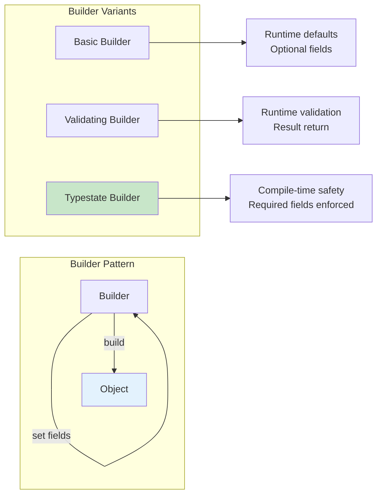
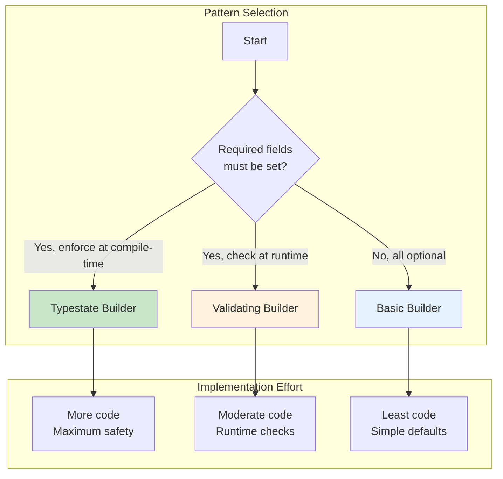

# Builder Pattern

The builder pattern provides a flexible way to construct complex objects step by step.

## Overview

The Builder pattern separates object construction from its representation, allowing the same construction process to create different representations. It's particularly valuable in Rust where we can leverage the type system for compile-time safety.



## When to Use Builders

```mermaid
flowchart TD
    A[Creating an Object?] --> B{How many<br/>parameters?}

    B -->|"1-3 required"| C[Use new() constructor]
    B -->|"Many optional"| D{Need validation?}

    D -->|No| E[Basic Builder]
    D -->|Yes| F{Validation type?}

    F -->|Runtime| G[Validating Builder]
    F -->|Compile-time| H[Typestate Builder]

    I{All have<br/>defaults?} -->|Yes| J[Use Default trait]
    I -->|No| D

    B -->|"Mix of both"| I

    style E fill:#e3f2fd
    style G fill:#fff3e0
    style H fill:#c8e6c9
```

{: .best-practice }
> **Use the Builder pattern when:**
> - Objects have many optional parameters (more than 3-4)
> - Construction requires validation or complex logic
> - You want a fluent, readable API
> - Different configurations of the same object are common
> - You need to separate construction from representation

## Why Use Builders?

- Handle many optional parameters
- Provide clear, readable construction code
- Validate at build time
- Support method chaining (fluent API)

## Basic Builder

```rust
#[derive(Debug)]
struct Server {
    host: String,
    port: u16,
    max_connections: u32,
    timeout_ms: u64,
}

#[derive(Default)]
struct ServerBuilder {
    host: String,
    port: u16,
    max_connections: Option<u32>,
    timeout_ms: Option<u64>,
}

impl ServerBuilder {
    fn new(host: impl Into<String>, port: u16) -> Self {
        ServerBuilder {
            host: host.into(),
            port,
            ..Default::default()
        }
    }

    fn max_connections(mut self, max: u32) -> Self {
        self.max_connections = Some(max);
        self
    }

    fn timeout(mut self, ms: u64) -> Self {
        self.timeout_ms = Some(ms);
        self
    }

    fn build(self) -> Server {
        Server {
            host: self.host,
            port: self.port,
            max_connections: self.max_connections.unwrap_or(100),
            timeout_ms: self.timeout_ms.unwrap_or(30000),
        }
    }
}

fn main() {
    let server = ServerBuilder::new("localhost", 8080)
        .max_connections(1000)
        .timeout(5000)
        .build();

    println!("{:?}", server);
}
```

## Builder with Validation

```rust
#[derive(Debug)]
struct Config {
    name: String,
    threads: usize,
}

struct ConfigBuilder {
    name: Option<String>,
    threads: Option<usize>,
}

#[derive(Debug)]
enum BuildError {
    MissingName,
    InvalidThreadCount,
}

impl ConfigBuilder {
    fn new() -> Self {
        ConfigBuilder {
            name: None,
            threads: None,
        }
    }

    fn name(mut self, name: impl Into<String>) -> Self {
        self.name = Some(name.into());
        self
    }

    fn threads(mut self, count: usize) -> Self {
        self.threads = Some(count);
        self
    }

    fn build(self) -> Result<Config, BuildError> {
        let name = self.name.ok_or(BuildError::MissingName)?;
        let threads = self.threads.unwrap_or(4);

        if threads == 0 || threads > 256 {
            return Err(BuildError::InvalidThreadCount);
        }

        Ok(Config { name, threads })
    }
}

fn main() {
    let config = ConfigBuilder::new()
        .name("MyApp")
        .threads(8)
        .build()
        .expect("Failed to build config");

    println!("{:?}", config);
}
```

## Typestate Builder

Use the type system to enforce required fields at compile time.

```rust
struct NoName;
struct WithName(String);

struct UserBuilder<NameState> {
    name: NameState,
    email: Option<String>,
}

impl UserBuilder<NoName> {
    fn new() -> Self {
        UserBuilder {
            name: NoName,
            email: None,
        }
    }

    fn name(self, name: impl Into<String>) -> UserBuilder<WithName> {
        UserBuilder {
            name: WithName(name.into()),
            email: self.email,
        }
    }
}

impl UserBuilder<WithName> {
    fn email(mut self, email: impl Into<String>) -> Self {
        self.email = Some(email.into());
        self
    }

    fn build(self) -> User {
        User {
            name: self.name.0,
            email: self.email,
        }
    }
}

#[derive(Debug)]
struct User {
    name: String,
    email: Option<String>,
}

fn main() {
    // This compiles - name is provided
    let user = UserBuilder::new()
        .name("Alice")
        .email("alice@example.com")
        .build();

    // This won't compile - name is required
    // let user = UserBuilder::new().build();
}
```

## derive_builder Crate

For complex structs, use the `derive_builder` crate.

```rust
use derive_builder::Builder;

#[derive(Builder, Debug)]
#[builder(setter(into))]
struct Request {
    url: String,
    #[builder(default = "\"GET\".to_string()")]
    method: String,
    #[builder(default)]
    headers: Vec<(String, String)>,
    #[builder(setter(strip_option), default)]
    body: Option<String>,
}

fn main() {
    let request = RequestBuilder::default()
        .url("https://api.example.com")
        .method("POST")
        .body("hello")
        .build()
        .unwrap();

    println!("{:?}", request);
}
```

Add to Cargo.toml:
```toml
[dependencies]
derive_builder = "0.12"
```

## Builder vs Default

| Approach | Use When |
|----------|----------|
| `Default` | All fields have sensible defaults |
| Builder | Many optional fields, validation needed |
| `new()` with args | Few required fields, no optionals |

## Builder Pattern Decision Tree



## Best Practices

{: .best-practice }
> **Builder Pattern Guidelines:**
> 1. **Consume `self`** in setter methods (not `&mut self`) for better ergonomics
> 2. **Return `Self`** for method chaining
> 3. **Use `impl Into<T>`** for flexible string/type conversion
> 4. **Validate early** - return `Result` from `build()` if validation can fail
> 5. **Consider `#[must_use]`** on the builder to catch forgotten `.build()` calls
> 6. **Use typestate** for critical invariants that must be enforced

## Common Mistakes

{: .warning }
> **Avoid these Builder anti-patterns:**
> - Forgetting to call `.build()` (use `#[must_use]`)
> - Using `&mut self` instead of `self` (breaks chaining ergonomics)
> - Not handling required fields (use typestate or validation)
> - Over-engineering simple structs that only need `Default`

## Summary

- Builders provide flexible, readable object construction
- Return `Self` from setter methods for chaining
- Validate in `build()` and return `Result` if needed
- Use typestate pattern for compile-time required field checking
- Consider `derive_builder` for complex structs

## See Also

- [Structs]() - Basic struct definitions
- [Generics]() - Generic type parameters for typestate
- [Example Code](https://github.com/MichaelTien8901/rust-guide-tutorial/tree/main/examples/part5/builder-pattern)

## Next Steps

Learn about [Error Patterns]() for handling errors idiomatically.
