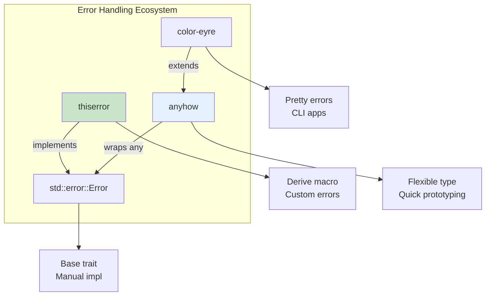
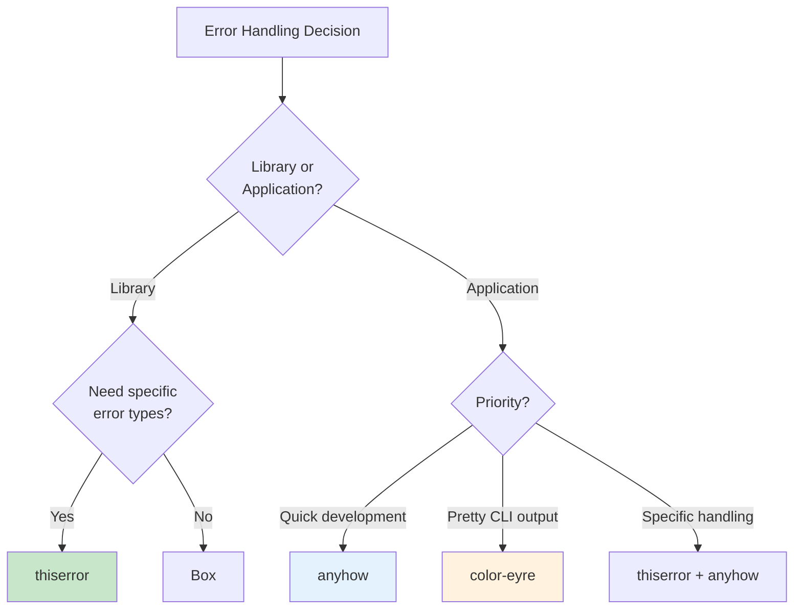
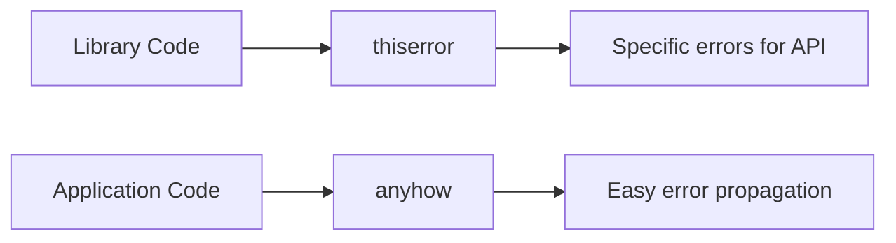
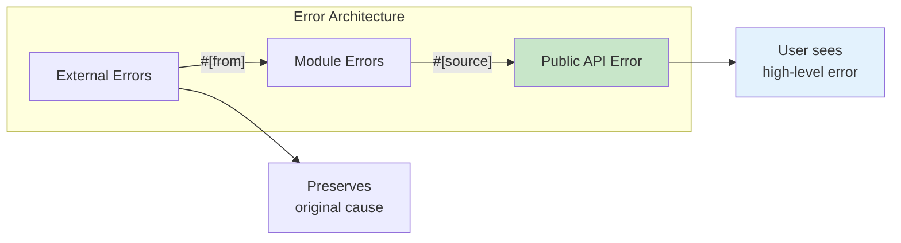

# Error Patterns

Idiomatic error handling with thiserror and anyhow.

## Overview

Rust's error handling is explicit and type-safe. The ecosystem provides powerful crates that make error handling ergonomic while maintaining these guarantees. Understanding when to use which approach is key to writing maintainable Rust code.



## When to Use Each Approach



{: .best-practice }
> **Error Handling Strategy:**
> - **Libraries**: Use `thiserror` for specific, documented error types
> - **Applications**: Use `anyhow` for flexible error propagation
> - **Both**: Always add context when propagating errors
> - **CLI apps**: Consider `color-eyre` for user-friendly output

## Custom Error Types with thiserror

The `thiserror` crate derives `std::error::Error` implementations.

```rust
use thiserror::Error;

#[derive(Error, Debug)]
enum DataError {
    #[error("file not found: {0}")]
    NotFound(String),

    #[error("parse error at line {line}: {message}")]
    Parse { line: usize, message: String },

    #[error("io error")]
    Io(#[from] std::io::Error),

    #[error("invalid input: {0}")]
    Invalid(#[source] Box<dyn std::error::Error + Send + Sync>),
}

fn load_data(path: &str) -> Result<String, DataError> {
    if path.is_empty() {
        return Err(DataError::NotFound("empty path".into()));
    }

    let content = std::fs::read_to_string(path)?; // Auto-converts io::Error
    Ok(content)
}
```

Add to Cargo.toml:
```toml
[dependencies]
thiserror = "1"
```

## Quick Prototyping with anyhow

The `anyhow` crate provides a flexible error type for applications.

```rust
use anyhow::{Context, Result, bail, ensure};

fn read_config(path: &str) -> Result<Config> {
    let content = std::fs::read_to_string(path)
        .context("failed to read config file")?;

    let config: Config = serde_json::from_str(&content)
        .context("failed to parse config")?;

    ensure!(config.port > 0, "port must be positive");

    if config.name.is_empty() {
        bail!("name cannot be empty");
    }

    Ok(config)
}

fn main() -> Result<()> {
    let config = read_config("config.json")?;
    println!("Loaded: {:?}", config);
    Ok(())
}
```

Add to Cargo.toml:
```toml
[dependencies]
anyhow = "1"
```

## thiserror vs anyhow

| Crate | Use For |
|-------|---------|
| `thiserror` | Libraries, specific error types |
| `anyhow` | Applications, quick prototyping |



## Error Context Chains

```rust
use anyhow::{Context, Result};

fn process_file(path: &str) -> Result<()> {
    let content = std::fs::read_to_string(path)
        .with_context(|| format!("failed to read {}", path))?;

    let data = parse(&content)
        .context("failed to parse content")?;

    save(&data)
        .context("failed to save processed data")?;

    Ok(())
}

fn main() {
    if let Err(e) = process_file("data.txt") {
        // Prints full error chain
        eprintln!("Error: {:#}", e);

        // Iterate through causes
        for cause in e.chain() {
            eprintln!("  Caused by: {}", cause);
        }
    }
}
```

## Downcasting Errors

```rust
use anyhow::Result;
use std::io;

fn handle_error(result: Result<()>) {
    if let Err(e) = result {
        // Try to downcast to specific error type
        if let Some(io_err) = e.downcast_ref::<io::Error>() {
            match io_err.kind() {
                io::ErrorKind::NotFound => println!("File not found"),
                io::ErrorKind::PermissionDenied => println!("Access denied"),
                _ => println!("IO error: {}", io_err),
            }
        } else {
            println!("Other error: {}", e);
        }
    }
}
```

## Error Wrapping Pattern

```rust
use thiserror::Error;

#[derive(Error, Debug)]
pub enum AppError {
    #[error("configuration error")]
    Config(#[source] ConfigError),

    #[error("database error")]
    Database(#[source] DatabaseError),

    #[error("network error")]
    Network(#[source] NetworkError),
}

// Specific error types for each subsystem
#[derive(Error, Debug)]
pub enum ConfigError {
    #[error("missing field: {0}")]
    MissingField(String),
    #[error("invalid value: {0}")]
    InvalidValue(String),
}

impl From<ConfigError> for AppError {
    fn from(e: ConfigError) -> Self {
        AppError::Config(e)
    }
}
```

## Result Type Aliases

```rust
// In your library's error module
pub type Result<T> = std::result::Result<T, Error>;

// Usage in library code
pub fn connect() -> Result<Connection> {
    // ...
}
```

## Error Reporting

For CLI applications, use color-eyre for pretty error reports.

```rust
use color_eyre::eyre::Result;

fn main() -> Result<()> {
    color_eyre::install()?;

    // Your application code
    process_data()?;

    Ok(())
}
```

## Error Design Patterns



## Best Practices

{: .best-practice }
> **Error Handling Guidelines:**
> 1. **Libraries**: Use `thiserror` with specific error enums
> 2. **Applications**: Use `anyhow` for flexible error handling
> 3. **Always add context** when propagating errors
> 4. **Don't lose information** - use `#[from]` and `#[source]`
> 5. **Use `bail!` and `ensure!`** for cleaner error creation
> 6. **Document error conditions** in public API functions

## Common Mistakes

{: .warning }
> **Avoid these error handling anti-patterns:**
> - Using `.unwrap()` in library code (panic on error)
> - Losing error context by converting to strings early
> - Creating too many error variants (keep it simple)
> - Forgetting to implement `Send + Sync` for thread-safe errors

## Summary

| Pattern | Code |
|---------|------|
| Custom error | `#[derive(Error)]` |
| Wrap io::Error | `#[error("...")]` `Io(#[from] io::Error)` |
| Add context | `.context("message")?` |
| Early return | `bail!("error message")` |
| Assert condition | `ensure!(cond, "message")` |

## See Also

- [Error Handling]() - Fundamental error handling with Result
- [Error Handling Libraries]() - Library reference
- [Example Code](https://github.com/MichaelTien8901/rust-guide-tutorial/tree/main/examples/part5/error-patterns)

## Next Steps

Learn about [State Machine]() patterns with enums.
