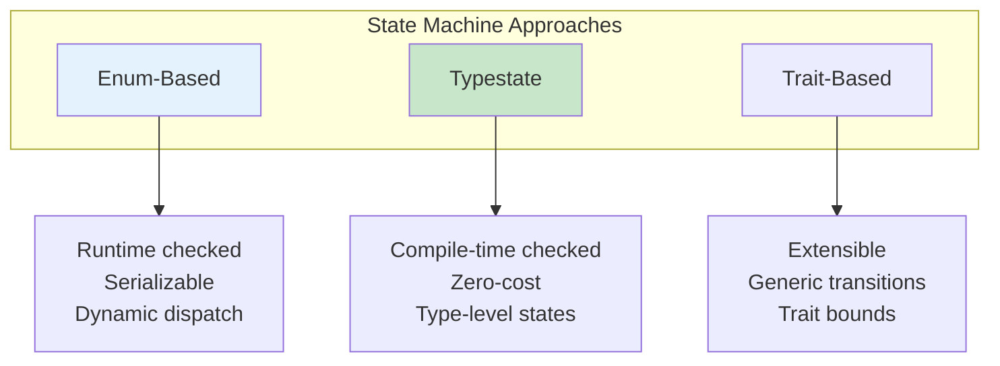
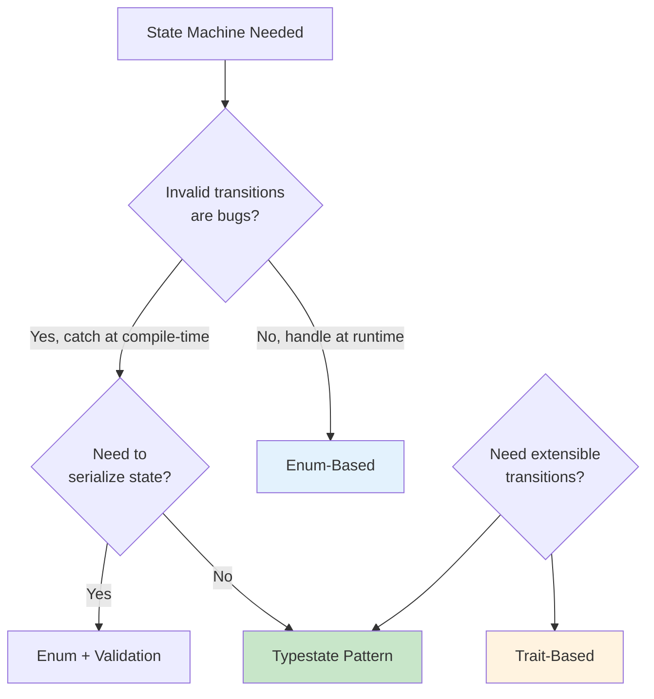
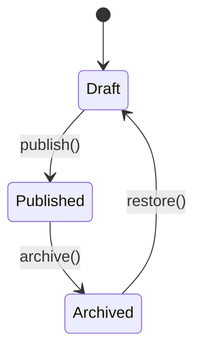
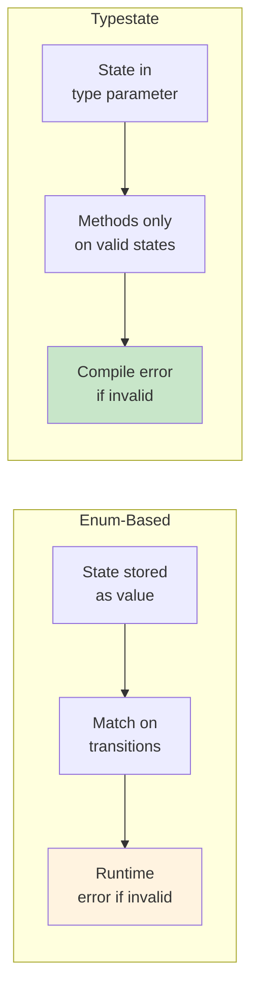

# State Machine Patterns

Model state transitions safely with Rust's type system.

## Overview

State machines are fundamental patterns for modeling systems with discrete states and transitions. Rust's powerful type system enables encoding state machines with varying levels of compile-time safety.



## When to Use Each Pattern



{: .best-practice }
> **Choose Your State Machine Pattern:**
> - **Enum-based**: When you need serialization or runtime flexibility
> - **Typestate**: When invalid transitions should be compile errors
> - **Trait-based**: When you need extensible or generic transitions

## Enum-Based State Machine

```rust
#[derive(Debug)]
enum OrderState {
    Pending,
    Confirmed { confirmation_id: String },
    Shipped { tracking_number: String },
    Delivered,
    Cancelled { reason: String },
}

struct Order {
    id: u64,
    state: OrderState,
}

impl Order {
    fn new(id: u64) -> Self {
        Order {
            id,
            state: OrderState::Pending,
        }
    }

    fn confirm(&mut self, confirmation_id: String) -> Result<(), &'static str> {
        match &self.state {
            OrderState::Pending => {
                self.state = OrderState::Confirmed { confirmation_id };
                Ok(())
            }
            _ => Err("Can only confirm pending orders"),
        }
    }

    fn ship(&mut self, tracking: String) -> Result<(), &'static str> {
        match &self.state {
            OrderState::Confirmed { .. } => {
                self.state = OrderState::Shipped { tracking_number: tracking };
                Ok(())
            }
            _ => Err("Can only ship confirmed orders"),
        }
    }

    fn deliver(&mut self) -> Result<(), &'static str> {
        match &self.state {
            OrderState::Shipped { .. } => {
                self.state = OrderState::Delivered;
                Ok(())
            }
            _ => Err("Can only deliver shipped orders"),
        }
    }
}

fn main() {
    let mut order = Order::new(1);
    order.confirm("CONF-123".into()).unwrap();
    order.ship("TRACK-456".into()).unwrap();
    order.deliver().unwrap();
    println!("Order state: {:?}", order.state);
}
```

## Typestate Pattern

Encode states in the type system for compile-time safety.

```rust
// State marker types
struct Draft;
struct Published;
struct Archived;

struct Post<State> {
    content: String,
    _state: std::marker::PhantomData<State>,
}

impl Post<Draft> {
    fn new(content: String) -> Self {
        Post {
            content,
            _state: std::marker::PhantomData,
        }
    }

    fn edit(&mut self, content: String) {
        self.content = content;
    }

    fn publish(self) -> Post<Published> {
        Post {
            content: self.content,
            _state: std::marker::PhantomData,
        }
    }
}

impl Post<Published> {
    fn archive(self) -> Post<Archived> {
        Post {
            content: self.content,
            _state: std::marker::PhantomData,
        }
    }

    fn view(&self) -> &str {
        &self.content
    }
}

impl Post<Archived> {
    fn restore(self) -> Post<Draft> {
        Post {
            content: self.content,
            _state: std::marker::PhantomData,
        }
    }
}

fn main() {
    let mut post = Post::<Draft>::new("Hello".into());
    post.edit("Hello, World!".into());

    let published = post.publish();
    println!("Content: {}", published.view());

    let archived = published.archive();
    let restored = archived.restore();
    // restored is back to Draft state
}
```



## State Transitions with Data

```rust
struct Unverified;
struct Verified { verified_at: std::time::SystemTime };
struct Active { started_at: std::time::SystemTime };

struct Account<State> {
    email: String,
    state: State,
}

impl Account<Unverified> {
    fn new(email: String) -> Self {
        Account {
            email,
            state: Unverified,
        }
    }

    fn verify(self) -> Account<Verified> {
        Account {
            email: self.email,
            state: Verified {
                verified_at: std::time::SystemTime::now(),
            },
        }
    }
}

impl Account<Verified> {
    fn activate(self) -> Account<Active> {
        Account {
            email: self.email,
            state: Active {
                started_at: std::time::SystemTime::now(),
            },
        }
    }

    fn verified_at(&self) -> std::time::SystemTime {
        self.state.verified_at
    }
}

impl Account<Active> {
    fn is_active(&self) -> bool {
        true
    }
}
```

## Finite State Machine with Traits

```rust
trait State {
    fn name(&self) -> &'static str;
}

trait Transition<To: State>: State {
    fn transition(self) -> To;
}

#[derive(Debug)]
struct Idle;
#[derive(Debug)]
struct Running;
#[derive(Debug)]
struct Stopped;

impl State for Idle {
    fn name(&self) -> &'static str { "Idle" }
}
impl State for Running {
    fn name(&self) -> &'static str { "Running" }
}
impl State for Stopped {
    fn name(&self) -> &'static str { "Stopped" }
}

impl Transition<Running> for Idle {
    fn transition(self) -> Running { Running }
}

impl Transition<Stopped> for Running {
    fn transition(self) -> Stopped { Stopped }
}

impl Transition<Idle> for Stopped {
    fn transition(self) -> Idle { Idle }
}

struct Machine<S: State> {
    state: S,
}

impl<S: State> Machine<S> {
    fn state_name(&self) -> &'static str {
        self.state.name()
    }
}

impl<S: State, T: State> Machine<S>
where
    S: Transition<T>,
{
    fn transition(self) -> Machine<T> {
        Machine {
            state: self.state.transition(),
        }
    }
}

fn main() {
    let machine = Machine { state: Idle };
    println!("State: {}", machine.state_name());

    let machine = machine.transition(); // Idle -> Running
    println!("State: {}", machine.state_name());

    let machine = machine.transition(); // Running -> Stopped
    println!("State: {}", machine.state_name());
}
```

## Pattern Comparison



## When to Use Each Pattern

| Pattern | Compile-time Safe | Runtime Flexible | Use Case |
|---------|-------------------|------------------|----------|
| Enum-based | No | Yes | Dynamic state, serialization needed |
| Typestate | Yes | No | Critical state invariants |
| Trait-based | Yes | Partially | Complex transition rules |

## Best Practices

{: .best-practice }
> **State Machine Guidelines:**
> 1. **Use typestate** when invalid transitions should be compile errors
> 2. **Use enums** when states need to be stored or serialized
> 3. **Document state diagrams** with Mermaid
> 4. **Keep states focused** - each state should have clear responsibilities
> 5. **Consider hybrid approaches** - typestate for creation, enum for storage

## Common Mistakes

{: .warning }
> **Avoid these state machine anti-patterns:**
> - Making states too granular (explosion of types)
> - Forgetting to handle all transitions in enum-based machines
> - Using typestate when serialization is needed
> - Not documenting the state diagram

## Summary

- Enum state machines provide runtime flexibility
- Typestate pattern catches invalid transitions at compile time
- PhantomData allows zero-cost state markers
- Traits can define transition capabilities

## See Also

- [Enums]() - Enum fundamentals
- [Advanced Types]() - PhantomData and type-level programming
- [Example Code](https://github.com/example/rust-guide/tree/main/examples/part5/state-machine)

## Next Steps

Learn about [CLI Apps]() to build command-line tools.
