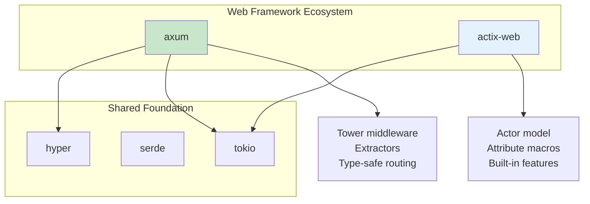
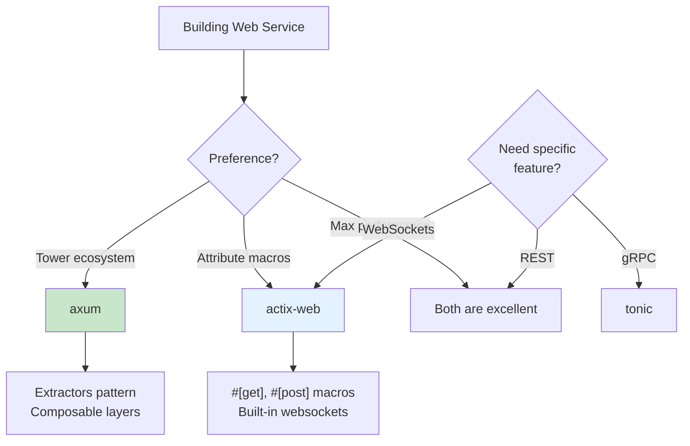
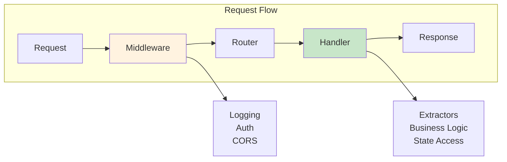

# Web Services

Build HTTP APIs with axum and actix-web.

## Overview

Rust's async ecosystem enables building high-performance web services. The two leading frameworks, axum and actix-web, offer different approaches while both delivering excellent performance and type safety.



## When to Use Each Framework



{: .best-practice }
> **Web Service Design Principles:**
> - Use extractors for clean parameter handling
> - Implement `IntoResponse` for custom error types
> - Share state safely with `Arc`
> - Add middleware for cross-cutting concerns (logging, CORS, auth)
> - Structure routes in modules for maintainability

## axum - Modern Web Framework

axum is built on tokio and tower for maximum performance.

### Basic Server

```rust
use axum::{routing::get, Router};

#[tokio::main]
async fn main() {
    let app = Router::new()
        .route("/", get(|| async { "Hello, World!" }))
        .route("/health", get(health_check));

    let listener = tokio::net::TcpListener::bind("0.0.0.0:3000").await.unwrap();
    axum::serve(listener, app).await.unwrap();
}

async fn health_check() -> &'static str {
    "OK"
}
```

Add to Cargo.toml:
```toml
[dependencies]
axum = "0.7"
tokio = { version = "1", features = ["full"] }
```

### Path and Query Parameters

```rust
use axum::{
    extract::{Path, Query},
    routing::get,
    Router,
};
use serde::Deserialize;

#[derive(Deserialize)]
struct Pagination {
    page: Option<u32>,
    limit: Option<u32>,
}

async fn get_user(Path(id): Path<u64>) -> String {
    format!("User: {}", id)
}

async fn list_users(Query(pagination): Query<Pagination>) -> String {
    let page = pagination.page.unwrap_or(1);
    let limit = pagination.limit.unwrap_or(10);
    format!("Page {} with {} items", page, limit)
}

fn main() {
    let app = Router::new()
        .route("/users/:id", get(get_user))
        .route("/users", get(list_users));
}
```

### JSON Request/Response

```rust
use axum::{extract::Json, http::StatusCode, routing::post, Router};
use serde::{Deserialize, Serialize};

#[derive(Deserialize)]
struct CreateUser {
    name: String,
    email: String,
}

#[derive(Serialize)]
struct User {
    id: u64,
    name: String,
    email: String,
}

async fn create_user(Json(payload): Json<CreateUser>) -> (StatusCode, Json<User>) {
    let user = User {
        id: 1,
        name: payload.name,
        email: payload.email,
    };
    (StatusCode::CREATED, Json(user))
}

fn main() {
    let app = Router::new().route("/users", post(create_user));
}
```

### Application State

```rust
use axum::{extract::State, routing::get, Router};
use std::sync::Arc;

struct AppState {
    db_pool: DatabasePool,
}

async fn handler(State(state): State<Arc<AppState>>) -> String {
    // Access state.db_pool
    "Hello".to_string()
}

#[tokio::main]
async fn main() {
    let state = Arc::new(AppState {
        db_pool: create_pool().await,
    });

    let app = Router::new()
        .route("/", get(handler))
        .with_state(state);
}
```

### Error Handling

```rust
use axum::{
    http::StatusCode,
    response::{IntoResponse, Response},
    Json,
};
use serde_json::json;

enum AppError {
    NotFound,
    InternalError(anyhow::Error),
}

impl IntoResponse for AppError {
    fn into_response(self) -> Response {
        let (status, message) = match self {
            AppError::NotFound => (StatusCode::NOT_FOUND, "Not found"),
            AppError::InternalError(_) => (StatusCode::INTERNAL_SERVER_ERROR, "Internal error"),
        };

        let body = Json(json!({ "error": message }));
        (status, body).into_response()
    }
}

async fn get_user(Path(id): Path<u64>) -> Result<Json<User>, AppError> {
    find_user(id)
        .await
        .ok_or(AppError::NotFound)
        .map(Json)
}
```

### Middleware

```rust
use axum::{middleware, routing::get, Router};
use tower_http::{cors::CorsLayer, trace::TraceLayer};

fn app() -> Router {
    Router::new()
        .route("/", get(handler))
        .layer(TraceLayer::new_for_http())
        .layer(CorsLayer::permissive())
}
```

## actix-web Alternative

```rust
use actix_web::{get, post, web, App, HttpResponse, HttpServer};
use serde::{Deserialize, Serialize};

#[derive(Deserialize)]
struct CreateUser {
    name: String,
}

#[derive(Serialize)]
struct User {
    id: u64,
    name: String,
}

#[get("/users/{id}")]
async fn get_user(path: web::Path<u64>) -> HttpResponse {
    let id = path.into_inner();
    HttpResponse::Ok().json(User { id, name: "John".into() })
}

#[post("/users")]
async fn create_user(body: web::Json<CreateUser>) -> HttpResponse {
    let user = User {
        id: 1,
        name: body.name.clone(),
    };
    HttpResponse::Created().json(user)
}

#[actix_web::main]
async fn main() -> std::io::Result<()> {
    HttpServer::new(|| {
        App::new()
            .service(get_user)
            .service(create_user)
    })
    .bind("127.0.0.1:8080")?
    .run()
    .await
}
```

Add to Cargo.toml:
```toml
[dependencies]
actix-web = "4"
```

## Framework Comparison

| Feature | axum | actix-web |
|---------|------|-----------|
| Async runtime | tokio | actix-rt (tokio) |
| Macro style | Extractors | Attributes |
| Performance | Excellent | Excellent |
| Ecosystem | tower | actix |

## Web Service Architecture



## Best Practices

{: .best-practice }
> **Web Service Guidelines:**
> 1. **Use extractors** for clean parameter handling
> 2. **Implement IntoResponse** for custom error types
> 3. **Share state with Arc** for thread safety
> 4. **Add middleware** for logging, CORS, auth
> 5. **Structure routes** in modules for large apps
> 6. **Use connection pools** for database access
> 7. **Handle errors gracefully** with proper HTTP status codes

## Common Mistakes

{: .warning }
> **Avoid these web service anti-patterns:**
> - Creating database connections per request (use pools)
> - Blocking the async runtime with sync code
> - Exposing internal errors to clients
> - Not validating input data
> - Forgetting CORS configuration for frontends

## Summary

- axum provides type-safe extractors
- actix-web uses attribute macros
- Both integrate well with serde for JSON
- Use tower-http or actix middleware for cross-cutting concerns

## See Also

- [Async Basics]() - Async/await fundamentals
- [Web Frameworks]() - Framework comparison
- [Serialization]() - JSON and serde patterns
- [Example Code](https://github.com/example/rust-guide/tree/main/examples/part5/web-services)

## Next Steps

Learn about [Database]() access with sqlx.
