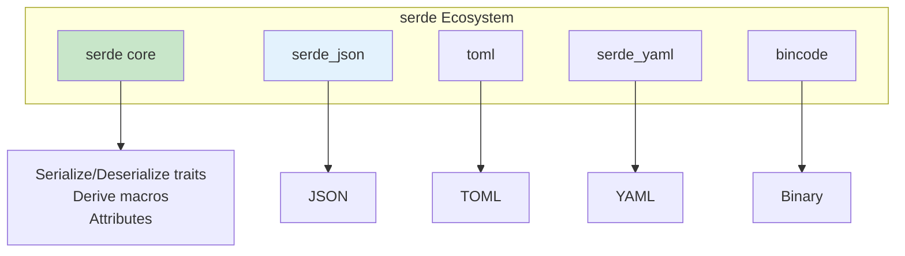
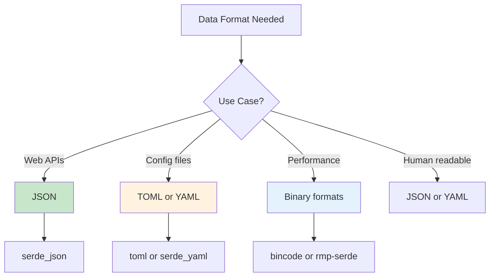

# Serialization with serde

Convert Rust data structures to and from various formats.

## Overview

serde (Serialize/Deserialize) is Rust's foundational serialization framework. It provides a powerful derive macro system and supports numerous data formats through separate crates.



## When to Use Each Format



{: .best-practice }
> **Format Selection Guide:**
> - **JSON**: Web APIs, JavaScript interop, debugging
> - **TOML**: Configuration files, Cargo.toml style
> - **YAML**: Configuration with comments, Kubernetes
> - **Bincode**: Fast binary, same-architecture only
> - **MessagePack**: Compact binary, cross-platform

## Basic Usage

```rust
use serde::{Deserialize, Serialize};

#[derive(Serialize, Deserialize, Debug)]
struct User {
    name: String,
    age: u32,
    email: String,
}

fn main() {
    let user = User {
        name: "Alice".into(),
        age: 30,
        email: "alice@example.com".into(),
    };

    // Serialize to JSON
    let json = serde_json::to_string(&user).unwrap();
    println!("{}", json);

    // Deserialize from JSON
    let parsed: User = serde_json::from_str(&json).unwrap();
    println!("{:?}", parsed);
}
```

Add to Cargo.toml:
```toml
[dependencies]
serde = { version = "1", features = ["derive"] }
serde_json = "1"
```

## Field Attributes

### Rename Fields

```rust
#[derive(Serialize, Deserialize)]
struct Config {
    #[serde(rename = "serverHost")]
    server_host: String,

    #[serde(rename = "serverPort")]
    server_port: u16,
}
```

### Rename All Fields

```rust
#[derive(Serialize, Deserialize)]
#[serde(rename_all = "camelCase")]
struct Config {
    server_host: String,  // Becomes "serverHost"
    server_port: u16,     // Becomes "serverPort"
}
```

Rename options: `lowercase`, `UPPERCASE`, `camelCase`, `PascalCase`, `snake_case`, `SCREAMING_SNAKE_CASE`, `kebab-case`

### Default Values

```rust
#[derive(Serialize, Deserialize)]
struct Settings {
    name: String,

    #[serde(default)]
    enabled: bool,  // false if missing

    #[serde(default = "default_port")]
    port: u16,
}

fn default_port() -> u16 {
    8080
}
```

### Skip Fields

```rust
#[derive(Serialize, Deserialize)]
struct User {
    name: String,

    #[serde(skip)]
    internal_id: u64,  // Never serialized or deserialized

    #[serde(skip_serializing)]
    password_hash: String,  // Only deserialized

    #[serde(skip_serializing_if = "Option::is_none")]
    nickname: Option<String>,  // Skip if None
}
```

### Flatten Nested Structures

```rust
#[derive(Serialize, Deserialize)]
struct Address {
    street: String,
    city: String,
}

#[derive(Serialize, Deserialize)]
struct User {
    name: String,

    #[serde(flatten)]
    address: Address,  // Fields merged into User's JSON
}

// Produces: {"name": "Alice", "street": "123 Main", "city": "Boston"}
```

## Enum Serialization

### Default (Externally Tagged)

```rust
#[derive(Serialize, Deserialize)]
enum Status {
    Active,
    Inactive,
    Pending { reason: String },
}

// Produces: {"Active": null} or {"Pending": {"reason": "..."}}
```

### Internally Tagged

```rust
#[derive(Serialize, Deserialize)]
#[serde(tag = "type")]
enum Message {
    Request { id: u64, method: String },
    Response { id: u64, result: String },
}

// Produces: {"type": "Request", "id": 1, "method": "get"}
```

### Adjacently Tagged

```rust
#[derive(Serialize, Deserialize)]
#[serde(tag = "type", content = "data")]
enum Event {
    Click { x: i32, y: i32 },
    KeyPress { key: char },
}

// Produces: {"type": "Click", "data": {"x": 10, "y": 20}}
```

### Untagged

```rust
#[derive(Serialize, Deserialize)]
#[serde(untagged)]
enum Value {
    Int(i64),
    Float(f64),
    String(String),
}

// Produces: just the value, e.g., 42 or "hello"
```

## Custom Serialization

```rust
use serde::{Deserialize, Deserializer, Serialize, Serializer};

#[derive(Debug)]
struct Timestamp(i64);

impl Serialize for Timestamp {
    fn serialize<S>(&self, serializer: S) -> Result<S::Ok, S::Error>
    where
        S: Serializer,
    {
        serializer.serialize_str(&self.0.to_string())
    }
}

impl<'de> Deserialize<'de> for Timestamp {
    fn deserialize<D>(deserializer: D) -> Result<Self, D::Error>
    where
        D: Deserializer<'de>,
    {
        let s = String::deserialize(deserializer)?;
        let ts = s.parse().map_err(serde::de::Error::custom)?;
        Ok(Timestamp(ts))
    }
}
```

### Using `#[serde(with)]`

```rust
mod unix_timestamp {
    use serde::{Deserialize, Deserializer, Serializer};
    use chrono::{DateTime, Utc};

    pub fn serialize<S>(dt: &DateTime<Utc>, serializer: S) -> Result<S::Ok, S::Error>
    where
        S: Serializer,
    {
        serializer.serialize_i64(dt.timestamp())
    }

    pub fn deserialize<'de, D>(deserializer: D) -> Result<DateTime<Utc>, D::Error>
    where
        D: Deserializer<'de>,
    {
        let ts = i64::deserialize(deserializer)?;
        DateTime::from_timestamp(ts, 0)
            .ok_or_else(|| serde::de::Error::custom("invalid timestamp"))
    }
}

#[derive(Serialize, Deserialize)]
struct Event {
    name: String,

    #[serde(with = "unix_timestamp")]
    created_at: DateTime<Utc>,
}
```

## Multiple Formats

### TOML

```rust
use serde::{Deserialize, Serialize};

#[derive(Serialize, Deserialize)]
struct Config {
    database_url: String,
    port: u16,
}

fn main() {
    let config: Config = toml::from_str(r#"
        database_url = "postgres://localhost/db"
        port = 8080
    "#).unwrap();

    let toml_string = toml::to_string(&config).unwrap();
}
```

### YAML

```rust
let config: Config = serde_yaml::from_str(r#"
    database_url: postgres://localhost/db
    port: 8080
"#).unwrap();
```

### Binary Formats

```rust
// MessagePack (compact binary)
let bytes = rmp_serde::to_vec(&user).unwrap();
let user: User = rmp_serde::from_slice(&bytes).unwrap();

// Bincode (fast binary)
let bytes = bincode::serialize(&user).unwrap();
let user: User = bincode::deserialize(&bytes).unwrap();
```

## Handling Unknown Fields

```rust
#[derive(Serialize, Deserialize)]
#[serde(deny_unknown_fields)]
struct Strict {
    name: String,
}

// Or capture them:
use std::collections::HashMap;
use serde_json::Value;

#[derive(Serialize, Deserialize)]
struct Flexible {
    name: String,

    #[serde(flatten)]
    extra: HashMap<String, Value>,
}
```

## Enum Tagging Comparison

```mermaid
flowchart LR
    subgraph "Enum Tagging Styles"
        ET[Externally Tagged]
        IT[Internally Tagged]
        AT[Adjacently Tagged]
        UT[Untagged]
    end

    ET --> ET1["{\"Variant\": data}"]
    IT --> IT1["{\"type\": \"Variant\", ...}"]
    AT --> AT1["{\"type\": \"Variant\", \"data\": ...}"]
    UT --> UT1["data only"]

    style IT fill:#c8e6c9
```

## Best Practices

{: .best-practice }
> **Serialization Guidelines:**
> 1. **Use `#[serde(rename_all)]`** for consistent naming
> 2. **Provide defaults** for optional fields
> 3. **Use `#[serde(skip_serializing_if)]`** to reduce payload size
> 4. **Choose appropriate enum tagging** for your API
> 5. **Test round-trips** (serialize then deserialize)
> 6. **Use internally tagged enums** for REST APIs
> 7. **Document the expected format** for public APIs

## Common Mistakes

{: .warning }
> **Avoid these serialization anti-patterns:**
> - Using untagged enums when types overlap (ambiguous parsing)
> - Forgetting `#[serde(default)]` for optional fields
> - Not handling missing fields gracefully
> - Leaking internal representation to external APIs
> - Not testing deserialization of external data

## Summary

| Attribute | Purpose |
|-----------|---------|
| `rename` | Change field name |
| `rename_all` | Change all field names |
| `default` | Provide default value |
| `skip` | Exclude from both |
| `flatten` | Merge nested struct |
| `tag` | Enum tagging style |
| `with` | Custom serialization |

## See Also

- [Serialization Libraries]() - Comprehensive serde ecosystem reference
- [Example Code](https://github.com/example/rust-guide/tree/main/examples/part5/serialization)

## Next Steps

Learn about [Testing Patterns]() for robust tests.
