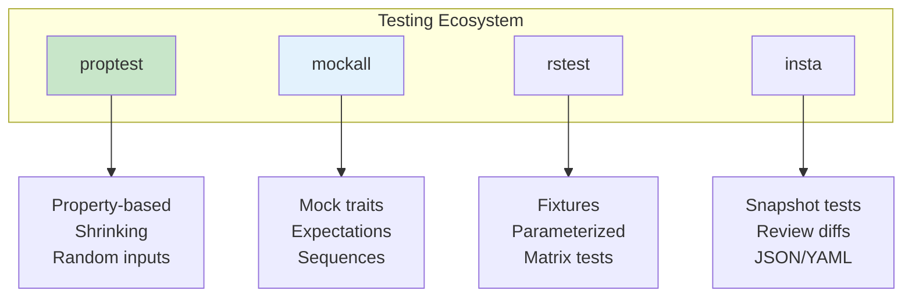
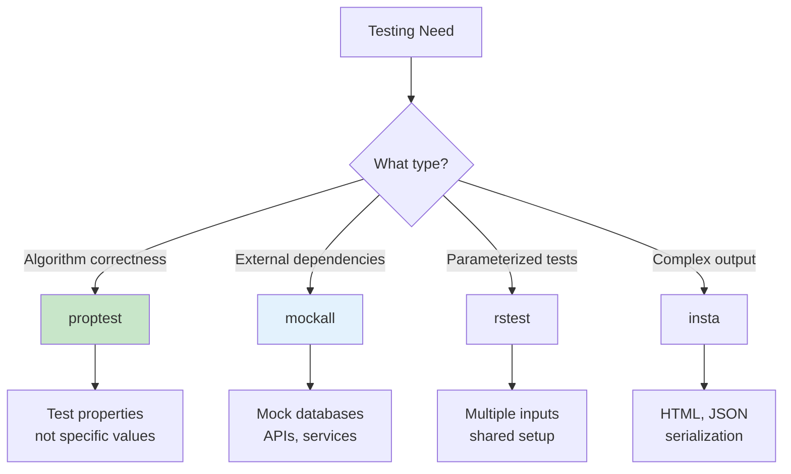
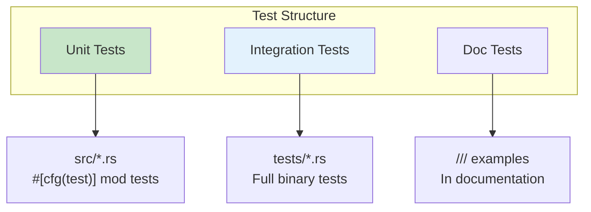

# Testing Patterns

Advanced testing techniques with proptest and mockall.

## Overview

Beyond basic unit tests, Rust's testing ecosystem provides powerful tools for property-based testing, mocking, fixtures, and snapshot testing. These patterns help ensure code correctness and maintainability.



## When to Use Each Approach



{: .best-practice }
> **Testing Strategy:**
> - **Unit tests**: Fast, focused, test one thing
> - **Property tests**: Algorithmic invariants
> - **Integration tests**: End-to-end workflows
> - **Mock tests**: External dependency isolation

## Property-Based Testing with proptest

Instead of testing specific values, test properties that should hold for all inputs.

```rust
use proptest::prelude::*;

fn reverse<T: Clone>(vec: &[T]) -> Vec<T> {
    vec.iter().rev().cloned().collect()
}

proptest! {
    #[test]
    fn test_reverse_twice_is_identity(vec: Vec<i32>) {
        let reversed_twice = reverse(&reverse(&vec));
        prop_assert_eq!(vec, reversed_twice);
    }

    #[test]
    fn test_reverse_preserves_length(vec: Vec<i32>) {
        prop_assert_eq!(vec.len(), reverse(&vec).len());
    }
}
```

Add to Cargo.toml:
```toml
[dev-dependencies]
proptest = "1"
```

### Custom Strategies

```rust
use proptest::prelude::*;

#[derive(Debug, Clone)]
struct User {
    name: String,
    age: u8,
}

fn user_strategy() -> impl Strategy<Value = User> {
    (
        "[a-zA-Z]{1,20}",  // name regex
        0u8..120u8,        // age range
    )
        .prop_map(|(name, age)| User { name, age })
}

proptest! {
    #[test]
    fn test_user_validation(user in user_strategy()) {
        prop_assert!(!user.name.is_empty());
        prop_assert!(user.age < 120);
    }
}
```

### Filtering Values

```rust
proptest! {
    #[test]
    fn test_division(
        a in any::<i32>(),
        b in any::<i32>().prop_filter("non-zero", |&x| x != 0)
    ) {
        let result = a / b;
        prop_assert!(result <= a.abs());
    }
}
```

## Mocking with mockall

Create mock implementations for traits.

```rust
use mockall::{automock, predicate::*};

#[automock]
trait Database {
    fn get_user(&self, id: u64) -> Option<String>;
    fn save_user(&self, id: u64, name: &str) -> Result<(), String>;
}

struct UserService<D: Database> {
    db: D,
}

impl<D: Database> UserService<D> {
    fn get_user_name(&self, id: u64) -> String {
        self.db.get_user(id).unwrap_or_else(|| "Unknown".to_string())
    }
}

#[cfg(test)]
mod tests {
    use super::*;

    #[test]
    fn test_get_user_found() {
        let mut mock = MockDatabase::new();
        mock.expect_get_user()
            .with(eq(1))
            .times(1)
            .returning(|_| Some("Alice".to_string()));

        let service = UserService { db: mock };
        assert_eq!(service.get_user_name(1), "Alice");
    }

    #[test]
    fn test_get_user_not_found() {
        let mut mock = MockDatabase::new();
        mock.expect_get_user()
            .with(eq(999))
            .times(1)
            .returning(|_| None);

        let service = UserService { db: mock };
        assert_eq!(service.get_user_name(999), "Unknown");
    }
}
```

Add to Cargo.toml:
```toml
[dev-dependencies]
mockall = "0.12"
```

### Expectation Sequences

```rust
#[test]
fn test_ordered_calls() {
    let mut mock = MockDatabase::new();
    let mut seq = mockall::Sequence::new();

    mock.expect_get_user()
        .times(1)
        .in_sequence(&mut seq)
        .returning(|_| None);

    mock.expect_save_user()
        .times(1)
        .in_sequence(&mut seq)
        .returning(|_, _| Ok(()));

    // Test code that should call get_user then save_user
}
```

## Test Organization

### Test Modules

```rust
// src/lib.rs
pub fn add(a: i32, b: i32) -> i32 {
    a + b
}

#[cfg(test)]
mod tests {
    use super::*;

    #[test]
    fn test_add_positive() {
        assert_eq!(add(2, 3), 5);
    }

    #[test]
    fn test_add_negative() {
        assert_eq!(add(-2, -3), -5);
    }
}
```

### Integration Tests

```
tests/
├── integration_test.rs
└── common/
    └── mod.rs
```

```rust
// tests/common/mod.rs
pub fn setup() -> TestContext {
    // Setup code
}

// tests/integration_test.rs
mod common;

#[test]
fn test_full_workflow() {
    let ctx = common::setup();
    // Test using ctx
}
```

## Test Fixtures

### Setup and Teardown

```rust
struct TestFixture {
    temp_dir: tempfile::TempDir,
    db: Database,
}

impl TestFixture {
    fn new() -> Self {
        let temp_dir = tempfile::tempdir().unwrap();
        let db = Database::new(temp_dir.path());
        TestFixture { temp_dir, db }
    }
}

impl Drop for TestFixture {
    fn drop(&mut self) {
        // Cleanup happens automatically via TempDir
    }
}

#[test]
fn test_with_fixture() {
    let fixture = TestFixture::new();
    // Use fixture.db
}
```

### rstest for Fixtures

```rust
use rstest::*;

#[fixture]
fn db() -> Database {
    Database::new_in_memory()
}

#[rstest]
fn test_insert(db: Database) {
    db.insert("key", "value");
    assert_eq!(db.get("key"), Some("value"));
}

// Parameterized tests
#[rstest]
#[case(2, 2, 4)]
#[case(0, 5, 5)]
#[case(-1, 1, 0)]
fn test_add(#[case] a: i32, #[case] b: i32, #[case] expected: i32) {
    assert_eq!(add(a, b), expected);
}
```

Add to Cargo.toml:
```toml
[dev-dependencies]
rstest = "0.18"
```

## Async Testing

```rust
#[tokio::test]
async fn test_async_operation() {
    let result = async_fetch_data().await;
    assert!(result.is_ok());
}

#[tokio::test(flavor = "multi_thread")]
async fn test_concurrent() {
    let (tx, rx) = tokio::sync::mpsc::channel(10);
    // Test concurrent operations
}
```

## Snapshot Testing

```rust
use insta::assert_snapshot;

#[test]
fn test_render_output() {
    let output = render_template("Hello, {{ name }}!", "World");
    assert_snapshot!(output);
}

#[test]
fn test_json_output() {
    let data = get_user_data();
    insta::assert_json_snapshot!(data);
}
```

Add to Cargo.toml:
```toml
[dev-dependencies]
insta = { version = "1", features = ["json"] }
```

## Test Organization



## Best Practices

{: .best-practice }
> **Testing Guidelines:**
> 1. **Use property tests** for algorithmic code
> 2. **Mock external dependencies** (databases, APIs)
> 3. **Keep unit tests fast** - milliseconds, not seconds
> 4. **Use fixtures** to reduce test setup duplication
> 5. **Test error cases** as thoroughly as success cases
> 6. **Use snapshot tests** for complex outputs
> 7. **Name tests descriptively** - `test_login_with_invalid_password_returns_error`

## Common Mistakes

{: .warning }
> **Avoid these testing anti-patterns:**
> - Testing implementation details instead of behavior
> - Slow unit tests (move to integration tests)
> - Not testing error paths
> - Excessive mocking (test real code when possible)
> - Ignoring flaky tests instead of fixing them

## Summary

| Tool | Purpose |
|------|---------|
| `proptest` | Property-based testing |
| `mockall` | Mock trait implementations |
| `rstest` | Fixtures and parameterized tests |
| `insta` | Snapshot testing |
| `tempfile` | Temporary test directories |

## See Also

- [Testing Libraries]() - Comprehensive testing library reference
- [Example Code](https://github.com/example/rust-guide/tree/main/examples/part5/testing-patterns)

## Next Steps

Learn about [Logging]() with tracing.
