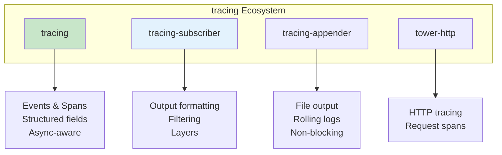
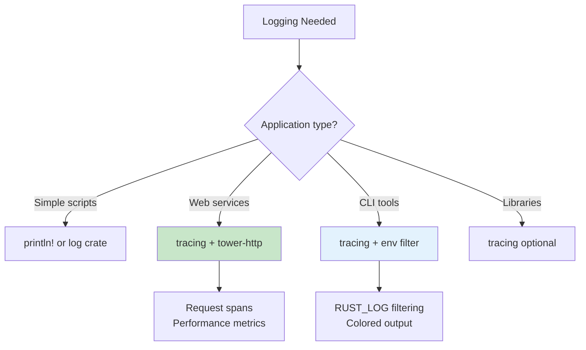
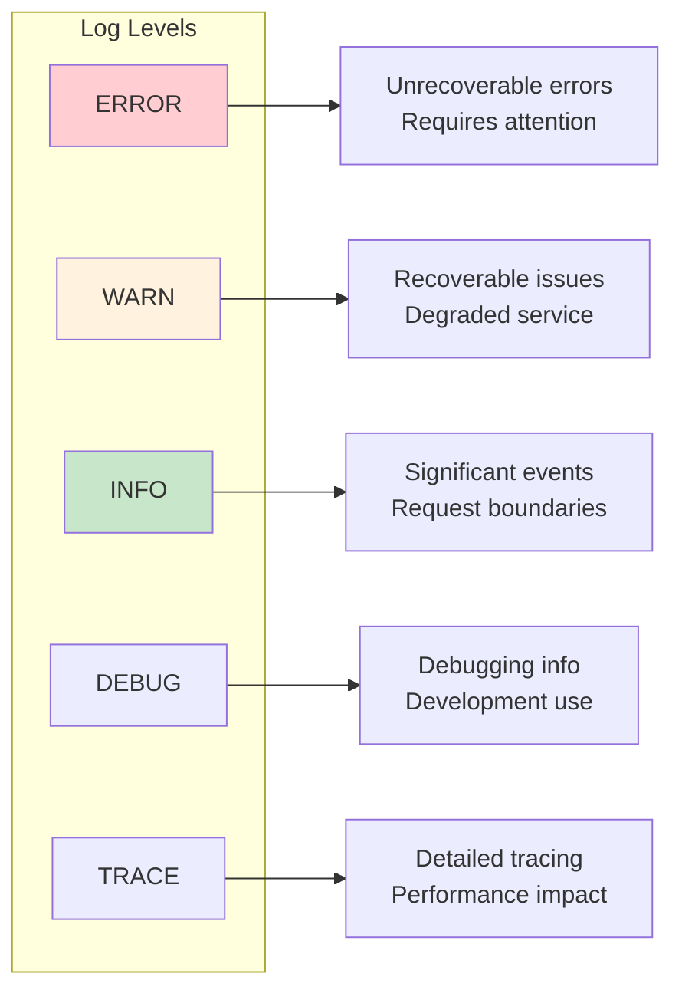

# Logging and Tracing

Structured logging with the tracing ecosystem.

## Overview

The `tracing` crate is Rust's modern approach to application-level telemetry. It goes beyond traditional logging by supporting structured data, spans for tracking execution flow, and async-aware instrumentation.



## When to Use tracing



{: .best-practice }
> **Observability Strategy:**
> - Use **spans** for request/transaction boundaries
> - Use **structured fields** over string interpolation
> - Include **request IDs** for correlation
> - Configure appropriate **log levels** per module
> - Use **JSON output** in production for log aggregation

## Why tracing?

- Structured logging with key-value pairs
- Spans for tracking request lifecycles
- Async-aware
- Composable subscribers

## Basic Setup

```rust
use tracing::{info, warn, error, debug, trace};
use tracing_subscriber;

fn main() {
    // Initialize the default subscriber
    tracing_subscriber::fmt::init();

    info!("Application starting");
    debug!("Debug information");
    warn!("Warning message");
    error!("Error occurred");
}
```

Add to Cargo.toml:
```toml
[dependencies]
tracing = "0.1"
tracing-subscriber = { version = "0.3", features = ["env-filter"] }
```

## Structured Logging

```rust
use tracing::info;

fn process_request(user_id: u64, action: &str) {
    info!(
        user_id = user_id,
        action = action,
        "Processing request"
    );
}

// Output: INFO process_request: Processing request user_id=123 action="login"
```

### Field Types

```rust
use tracing::{info, field};

fn example() {
    let user = User { id: 1, name: "Alice".into() };

    info!(
        user.id,                           // Same as user_id = user.id
        user.name = %user.name,            // Display formatting
        debug_info = ?user,                // Debug formatting
        computed = field::Empty,           // Placeholder for later
        "Event occurred"
    );
}
```

## Spans

Spans track a unit of work over time.

```rust
use tracing::{info, info_span, Instrument};

fn process_order(order_id: u64) {
    let span = info_span!("process_order", order_id);
    let _guard = span.enter();

    info!("Starting order processing");
    validate_order();
    charge_payment();
    info!("Order processed successfully");
}

// Or with closures
fn process_order_v2(order_id: u64) {
    info_span!("process_order", order_id).in_scope(|| {
        info!("Processing");
        // Work here
    });
}
```

### Async Spans

```rust
use tracing::Instrument;

async fn handle_request(req: Request) -> Response {
    async {
        // All logs here are within the span
        process(&req).await
    }
    .instrument(tracing::info_span!("handle_request"))
    .await
}
```

### Span Attributes

```rust
#[tracing::instrument]
fn calculate(x: i32, y: i32) -> i32 {
    x + y
}

#[tracing::instrument(
    name = "process_user",
    skip(password),           // Don't log password
    fields(user_id = %user.id)
)]
fn process_user(user: &User, password: &str) -> Result<(), Error> {
    // Function body
}
```

## Subscriber Configuration

### Environment Filter

```rust
use tracing_subscriber::{fmt, prelude::*, EnvFilter};

fn main() {
    tracing_subscriber::registry()
        .with(fmt::layer())
        .with(EnvFilter::from_default_env())
        .init();
}
```

Set log level via environment:
```bash
RUST_LOG=info cargo run
RUST_LOG=myapp=debug,tower=warn cargo run
```

### JSON Output

```rust
use tracing_subscriber::fmt;

fn main() {
    tracing_subscriber::fmt()
        .json()
        .init();
}
```

### Multiple Subscribers

```rust
use tracing_subscriber::{fmt, prelude::*, EnvFilter};
use tracing_appender::rolling;

fn main() {
    let file_appender = rolling::daily("logs", "app.log");
    let (non_blocking, _guard) = tracing_appender::non_blocking(file_appender);

    tracing_subscriber::registry()
        .with(
            fmt::layer()
                .with_writer(std::io::stdout)
                .with_filter(EnvFilter::new("info"))
        )
        .with(
            fmt::layer()
                .json()
                .with_writer(non_blocking)
                .with_filter(EnvFilter::new("debug"))
        )
        .init();
}
```

## Integration with Web Frameworks

### axum with tower-http

```rust
use axum::{routing::get, Router};
use tower_http::trace::TraceLayer;
use tracing_subscriber::{fmt, prelude::*, EnvFilter};

#[tokio::main]
async fn main() {
    tracing_subscriber::registry()
        .with(fmt::layer())
        .with(EnvFilter::from_default_env())
        .init();

    let app = Router::new()
        .route("/", get(handler))
        .layer(TraceLayer::new_for_http());

    // Start server
}

#[tracing::instrument]
async fn handler() -> &'static str {
    tracing::info!("Handling request");
    "Hello"
}
```

## Error Logging

```rust
use tracing::error;
use anyhow::Result;

fn process() -> Result<()> {
    match do_something() {
        Ok(result) => {
            tracing::info!(result = ?result, "Success");
            Ok(())
        }
        Err(e) => {
            error!(error = ?e, "Operation failed");
            Err(e)
        }
    }
}

// With error sources
fn log_error_chain(error: &anyhow::Error) {
    error!(%error, "Error occurred");
    for (i, cause) in error.chain().enumerate() {
        error!(cause = %cause, level = i, "Caused by");
    }
}
```

## Performance Considerations

### Compile-Time Filtering

```rust
// In Cargo.toml
[dependencies]
tracing = { version = "0.1", features = ["max_level_info"] }
```

This removes trace! and debug! at compile time in release builds.

### Sampling

```rust
use tracing_subscriber::filter::filter_fn;

let filter = filter_fn(|metadata| {
    // Only log 10% of debug events
    if *metadata.level() == tracing::Level::DEBUG {
        rand::random::<f32>() < 0.1
    } else {
        true
    }
});
```

## Common Patterns

### Request ID Propagation

```rust
use uuid::Uuid;

async fn handle_request(req: Request) -> Response {
    let request_id = Uuid::new_v4();

    async {
        tracing::info!("Starting request");
        process(req).await
    }
    .instrument(tracing::info_span!(
        "request",
        request_id = %request_id
    ))
    .await
}
```

### Timing Operations

```rust
use std::time::Instant;

fn timed_operation() {
    let start = Instant::now();

    // Do work

    tracing::info!(
        duration_ms = start.elapsed().as_millis(),
        "Operation completed"
    );
}
```

## Log Level Guidelines



## Summary

| Component | Purpose |
|-----------|---------|
| `tracing` | Core logging macros |
| `tracing-subscriber` | Configure output |
| `tracing-appender` | File output |
| `tower-http` | HTTP request tracing |
| `EnvFilter` | Runtime log level control |

## Best Practices

{: .best-practice }
> **Logging Guidelines:**
> 1. **Use spans** for request/transaction boundaries
> 2. **Include request IDs** for correlation
> 3. **Use structured fields** over string interpolation
> 4. **Filter appropriately** in production
> 5. **Log errors with context** (include error chain)
> 6. **Use `#[instrument]`** for automatic function tracing
> 7. **Consider sampling** for high-volume debug logs

## Common Mistakes

{: .warning }
> **Avoid these logging anti-patterns:**
> - Logging sensitive data (passwords, tokens, PII)
> - Using DEBUG/TRACE in production without filtering
> - Not including correlation IDs
> - String formatting instead of structured fields
> - Blocking I/O in log subscribers

## See Also

- [Logging Libraries]() - Comprehensive logging library reference
- [Example Code](https://github.com/MichaelTien8901/rust-guide-tutorial/tree/main/examples/part5/logging)

## Next Steps

Continue to [Part 6: Systems Programming]() for low-level Rust.
