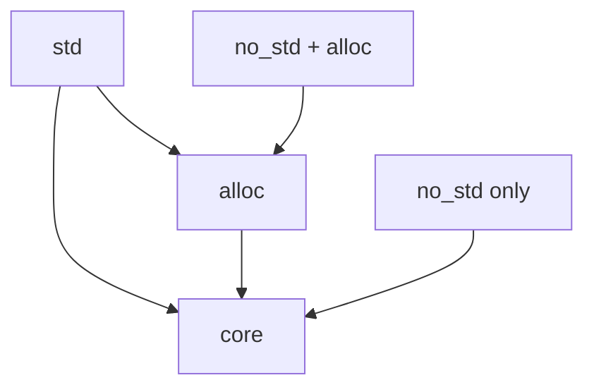

# no_std Basics

Programming without the standard library for embedded and systems development.

## What is no_std?

The `#![no_std]` attribute tells the compiler not to link the standard library (`std`). Instead, you only have access to:

- **core** - Language primitives (Option, Result, iterators, etc.)
- **alloc** - Heap allocation (optional, requires a global allocator)



## Why Use no_std?

| Use Case | Reason |
|----------|--------|
| Embedded systems | No OS, limited memory |
| Bootloaders | Run before OS exists |
| Kernels | You ARE the OS |
| WebAssembly | Smaller binary size |
| UEFI applications | Firmware environment |

## Basic no_std Program

```rust
#![no_std]
#![no_main]

use core::panic::PanicInfo;

#[panic_handler]
fn panic(_info: &PanicInfo) -> ! {
    loop {}
}

#[no_mangle]
pub extern "C" fn _start() -> ! {
    // Entry point
    loop {}
}
```

## What's Available in core

```rust
#![no_std]

use core::{
    // Primitives
    option::Option,
    result::Result,

    // Iterators
    iter::Iterator,

    // Memory
    mem,
    ptr,
    slice,

    // Sync primitives
    sync::atomic::{AtomicBool, AtomicUsize, Ordering},
    cell::{Cell, RefCell, UnsafeCell},

    // Formatting (but no heap allocation)
    fmt::{self, Write},

    // Math
    cmp,
    ops,
};
```

## What's NOT Available Without std

| Feature | Requires |
|---------|----------|
| `Vec`, `String`, `HashMap` | alloc |
| `println!`, `format!` | std |
| File I/O | std |
| Networking | std |
| Threads | std |
| `Box`, `Rc`, `Arc` | alloc |

## Using alloc

To use heap-allocated types, add the `alloc` crate and provide a global allocator:

```rust
#![no_std]
#![no_main]

extern crate alloc;

use alloc::{vec::Vec, string::String, boxed::Box};
use core::panic::PanicInfo;

// You must provide a global allocator
use linked_list_allocator::LockedHeap;

#[global_allocator]
static ALLOCATOR: LockedHeap = LockedHeap::empty();

#[panic_handler]
fn panic(_info: &PanicInfo) -> ! {
    loop {}
}

fn example() {
    // Now you can use Vec, String, Box, etc.
    let mut v = Vec::new();
    v.push(1);
    v.push(2);

    let s = String::from("hello");
    let b = Box::new(42);
}
```

## Conditional Compilation

Support both std and no_std:

```rust
#![cfg_attr(not(feature = "std"), no_std)]

#[cfg(feature = "std")]
use std::vec::Vec;

#[cfg(not(feature = "std"))]
extern crate alloc;
#[cfg(not(feature = "std"))]
use alloc::vec::Vec;

pub fn example() -> Vec<i32> {
    vec![1, 2, 3]
}
```

In Cargo.toml:
```toml
[features]
default = ["std"]
std = []
```

## Writing to Output Without std

Implement the `core::fmt::Write` trait:

```rust
#![no_std]

use core::fmt::{self, Write};

struct Uart {
    // Hardware UART registers
}

impl Write for Uart {
    fn write_str(&mut self, s: &str) -> fmt::Result {
        for byte in s.bytes() {
            // Write byte to UART hardware
            unsafe {
                // write_volatile(UART_TX, byte);
            }
        }
        Ok(())
    }
}

fn print_number(uart: &mut Uart, n: u32) {
    write!(uart, "Number: {}\n", n).unwrap();
}
```

## Common no_std Crates

| Crate | Purpose |
|-------|---------|
| `heapless` | Fixed-capacity collections |
| `embedded-hal` | Hardware abstraction |
| `defmt` | Efficient logging |
| `spin` | Spinlock mutex |
| `linked_list_allocator` | Simple heap allocator |
| `bitflags` | Bit flag enums |

## Heapless Collections

When you can't use heap allocation:

```rust
use heapless::Vec;

fn example() {
    // Fixed capacity of 8 elements, stack allocated
    let mut v: Vec<i32, 8> = Vec::new();
    v.push(1).unwrap();
    v.push(2).unwrap();

    // String with fixed capacity
    use heapless::String;
    let mut s: String<32> = String::new();
    s.push_str("hello").unwrap();
}
```

## Error Handling Without Panic

In embedded systems, you often can't panic:

```rust
#![no_std]

use core::panic::PanicInfo;

#[panic_handler]
fn panic(info: &PanicInfo) -> ! {
    // Log error if possible
    // Reset system or halt
    loop {
        // Could trigger watchdog reset here
    }
}

// Use Result instead of panic
fn safe_divide(a: i32, b: i32) -> Option<i32> {
    if b == 0 {
        None
    } else {
        Some(a / b)
    }
}
```

## Summary

| Attribute | Purpose |
|-----------|---------|
| `#![no_std]` | Don't link std library |
| `#![no_main]` | No standard main function |
| `#[panic_handler]` | Custom panic behavior |
| `#[global_allocator]` | Custom heap allocator |

## Best Practices

1. **Start with no_std** if targeting embedded
2. **Use heapless** when possible
3. **Provide feature flags** for std/no_std compatibility
4. **Handle errors** without panicking
5. **Test on host** with std feature enabled

## See Also

- [Unsafe Rust]() - Low-level memory operations
- [Memory Layout]() - Data representation
- [Example Code](https://github.com/MichaelTien8901/rust-guide-tutorial/tree/master/examples/part6/no-std)

## Next Steps

Learn about [Bare Metal]() programming without an OS.
