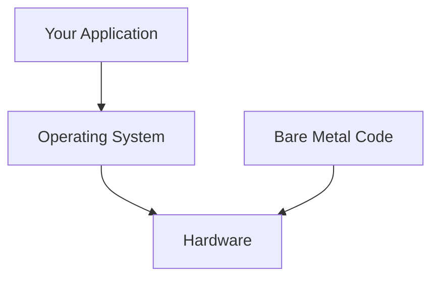

# Bare Metal Programming

Running Rust directly on hardware without an operating system.

## What is Bare Metal?

Bare metal means your code runs directly on the CPU without an OS layer. You control:
- Memory layout
- Interrupts
- Hardware initialization
- Everything



## Minimal Bare Metal Program

```rust
#![no_std]
#![no_main]

use core::panic::PanicInfo;

#[panic_handler]
fn panic(_info: &PanicInfo) -> ! {
    loop {}
}

#[no_mangle]
pub extern "C" fn _start() -> ! {
    // Your code here
    loop {}
}
```

## Required Attributes

| Attribute | Purpose |
|-----------|---------|
| `#![no_std]` | No standard library |
| `#![no_main]` | No standard entry point |
| `#[panic_handler]` | Define panic behavior |
| `#[no_mangle]` | Preserve function name for linker |

## Entry Point

The entry point depends on your target:

### x86_64 (BIOS/UEFI)
```rust
#[no_mangle]
pub extern "C" fn _start() -> ! {
    loop {}
}
```

### ARM Cortex-M
```rust
use cortex_m_rt::entry;

#[entry]
fn main() -> ! {
    loop {}
}
```

### RISC-V
```rust
#[no_mangle]
pub extern "C" fn _start() -> ! {
    loop {}
}
```

## Linker Script

You need a linker script to define memory layout:

```ld
/* linker.ld */
ENTRY(_start)

SECTIONS {
    . = 0x80000;  /* Load address */

    .text : {
        *(.text._start)
        *(.text*)
    }

    .rodata : {
        *(.rodata*)
    }

    .data : {
        *(.data*)
    }

    .bss : {
        __bss_start = .;
        *(.bss*)
        __bss_end = .;
    }
}
```

## Cargo Configuration

Create `.cargo/config.toml`:

```toml
[build]
target = "x86_64-unknown-none"

[target.x86_64-unknown-none]
rustflags = ["-C", "link-arg=-Tlinker.ld"]

[unstable]
build-std = ["core", "compiler_builtins"]
build-std-features = ["compiler-builtins-mem"]
```

## Memory Operations

Without std, you need to handle raw memory:

```rust
use core::ptr;

// Zero BSS section
unsafe fn zero_bss(start: *mut u8, end: *mut u8) {
    let len = end as usize - start as usize;
    ptr::write_bytes(start, 0, len);
}

// Copy data section from ROM to RAM
unsafe fn copy_data(src: *const u8, dst: *mut u8, len: usize) {
    ptr::copy_nonoverlapping(src, dst, len);
}
```

## Volatile Access

Hardware registers require volatile operations:

```rust
use core::ptr::{read_volatile, write_volatile};

const UART_BASE: usize = 0x1000_0000;

fn uart_write(byte: u8) {
    unsafe {
        write_volatile(UART_BASE as *mut u8, byte);
    }
}

fn uart_read() -> u8 {
    unsafe {
        read_volatile(UART_BASE as *const u8)
    }
}
```

## Memory-Mapped I/O Struct

Better abstraction for hardware registers:

```rust
#[repr(C)]
struct UartRegs {
    data: u8,
    _padding1: [u8; 3],
    status: u32,
    control: u32,
}

struct Uart {
    regs: *mut UartRegs,
}

impl Uart {
    const fn new(base: usize) -> Self {
        Uart { regs: base as *mut UartRegs }
    }

    fn write(&self, byte: u8) {
        unsafe {
            write_volatile(&mut (*self.regs).data, byte);
        }
    }

    fn is_tx_ready(&self) -> bool {
        unsafe {
            read_volatile(&(*self.regs).status) & 0x01 != 0
        }
    }
}

static UART: Uart = Uart::new(0x1000_0000);
```

## Stack Setup

For bare metal, you often need to set up the stack:

```rust
#[link_section = ".stack"]
static mut STACK: [u8; 4096] = [0; 4096];

#[no_mangle]
pub unsafe extern "C" fn _start() -> ! {
    // Set stack pointer (architecture specific)
    // asm!("mov sp, {}", in(reg) STACK.as_ptr().add(4096));

    main();
}

fn main() -> ! {
    loop {}
}
```

## Interrupts

Basic interrupt handling:

```rust
#[no_mangle]
pub extern "C" fn interrupt_handler() {
    // Handle interrupt
    // Clear interrupt flag
    // Return
}

// ARM Cortex-M style
#[repr(C)]
pub struct VectorTable {
    pub stack_pointer: unsafe extern "C" fn(),
    pub reset: unsafe extern "C" fn(),
    pub nmi: unsafe extern "C" fn(),
    pub hard_fault: unsafe extern "C" fn(),
    // ... more vectors
}

#[link_section = ".vector_table"]
#[no_mangle]
pub static VECTORS: VectorTable = VectorTable {
    stack_pointer: _stack_top,
    reset: _start,
    nmi: default_handler,
    hard_fault: hard_fault_handler,
};
```

## Debugging with QEMU

Test your bare metal code in QEMU:

```bash
# Build
cargo build --release

# Run in QEMU (example for x86_64)
qemu-system-x86_64 -drive format=raw,file=target/x86_64-unknown-none/release/mykernel
```

## Debugging with GDB

```bash
# Start QEMU with GDB server
qemu-system-x86_64 -s -S -drive format=raw,file=kernel.bin

# In another terminal
gdb target/x86_64-unknown-none/release/mykernel
(gdb) target remote :1234
(gdb) break _start
(gdb) continue
```

## Common Pitfalls

1. **Forgetting volatile** - Hardware registers need volatile access
2. **Stack overflow** - Limited stack in bare metal
3. **Uninitialized BSS** - Must zero BSS section
4. **Wrong endianness** - Check target byte order
5. **Alignment** - Hardware often requires aligned access

## Summary

| Component | Purpose |
|-----------|---------|
| Linker script | Memory layout |
| `_start` | Entry point |
| Panic handler | Handle panics |
| Volatile ops | Hardware access |
| Vector table | Interrupt handlers |

## Next Steps

Learn about [Embedded HAL]() for portable hardware abstraction.
